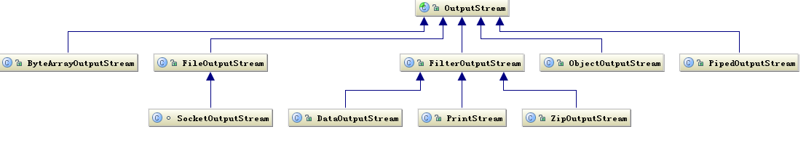
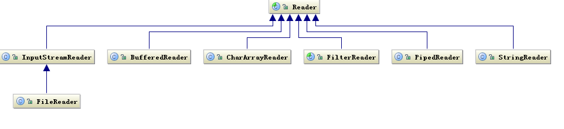
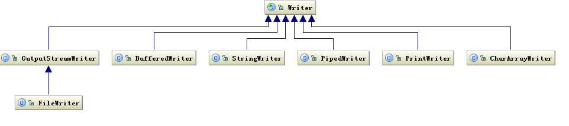

<!--将该代码放入博客模板的head中即可-->
<script type="text/x-mathjax-config">
MathJax.Hub.Config({
tex2jax: {
  inlineMath: [['$','$'], ['\\(','\\)']],
  processEscapes: true
  }
});
</script>
<!--latex数学显示公式-->
<script type="text/javascript" src="https://cdn.mathjax.org/mathjax/latest/MathJax.js?config=TeX-AMS-MML_HTMLorMML"></script>


> 来源文献

>[Java输入、输入、IO流 类层次关系梳理](https://www.cnblogs.com/LittleHann/p/3678685.html)

>[原文作者：墨染草简书著作权归作者所有。商业转载请联系作者获得授权，非商业转载请注明出处。](https://www.jianshu.com/p/ac8d51a50aa7)

> 《java变成的逻辑》


### 1. 按照用途进行分类

1.1 按照数据的来源（去向）分类
- 是文件：FileInputStream, FileOutputStream, FileReader, FileWriter
- 是byte[]：ByteArrayInputStream, ByteArrayOutputStream
- 是char[]：CharArrayReader, CharArrayWriter
- 是String：StringBufferInputStream(已过时，因为其只能用于String的每个字符都是8位的字符串), StringReader, StringWriter
- 是网络数据流：InputStream, OutputStream, Reader, Writer

1.2 按照格式化输出
- 需要格式化输出：PrintStream（输出字节），PrintWriter（输出字符）

1.3 按缓冲功能分
- 要缓冲：BufferedInputStream, BufferedOuputStream, BuffereaReader, BufferedWriter

1.4 按照数据格式分
- 二进制格式（只要确定不是纯文本格式的），InputStream, OutputStream, 及其所有带Stream子类
- 纯文本格式（比如英文/汉字/或其他编码文字）：Reader, Writer, 及其相关子类

1.5 按照输入输出分
- 输入：Reader， InputStream，及其相关子类
- 输出：Writer，OutputStream，及其相关子类

1.6 特殊需求
- 从Stream转化为Reader，Writer：InputStreamReader，OutputStreamWriter
- 对象输入输出流：ObjectInputStream，ObjectOutputStream
- 进程间通信：PipeInputStream，PipeOutputStream，PipeReader，PipeWriter
- 合并输入：SequenceInputStream
- 更特殊的需要：PushbackInputStream, PushbackReader, LineNumberInputStream, LineNumberReader

### 2 确定选用流对象的步骤

•确定原始数据的格式
- 确定是输入还是输出
- 是否需要转换流
- 数据的来源（去向）
- 是否需要缓冲
- 是否需要格式化输出

### 3 Java中Inputstream/OutputStream与Reader/Writer的区别

•Reader/Writer和InputStream/OutputStream分别是I/O库提供的两套平行独立的等级机构，
- InputStream、OutputStream是用来处理8位元(***字节\***)的流，也就是用于读写ASCII字符和二进制数据；
- Reader、Writer是用来处理16位元的流，也就是用于读写Unicode编码的字符。
- 在JAVA语言中，byte类型是8位的，char类型是16位的，所以在处理中文的时候需要用Reader和Writer。
- 两种等级机构下，有一道桥梁InputStreamReader、OutputStreamWriter负责进行InputStream到Reader的适配和由OutputStream到Writer的适配。

•在Java中，有不同类型的Reader/InputStream输入流对应于不同的数据源：
- FileReader/FileInputStream 用于从文件输入；
- CharArrayReader/ByteArrayInputStream 用于从程序中的字符数组输入；
- StringReader/StringBufferInputStream 用于从程序中的字符串输入；
- PipedReader/PipeInputStream 用于读取从另一个线程中的数据PipedWriter/PipeOutputStream 写入管道的数据。
- 相应的也有不同类型的Writer/OutputStream输出流对应于不同的数据源：FileWriter/FileOutputStream，CharArrayWriter/ByteArrayOutputStream，StringWriter，PipeWriter/PipedOutputStream。

•有两种没有对应Reader类型的InputStream输入流，用getInputStream()来读取数据。
- Socket 用于套接字；
- URLConnection 用于 URL 连接。

### 4  流类的继承关系图








4.1 .继承自InputStream/OutputStream的流都是用于向程序中输入/输出数据，且数据的单位都是字节(byte=8bit)

4.2 .继承自Reader/Writer的流都是用于向程序中输入/输出数据，且数据的单位都是字符(2byte=16bit)

4.3 节点流类型
- 对文件操作的字符流有FileReader/FileWriter，
- 字节流有FileInputStream/FileOutputStream。

4.4 处理流类型
- 缓冲流：缓冲流要“套接”在相应的节点流之上，对读写的数据提供了缓冲的功能，提高了读写效率，同事增加了一些新的方法。
- 字节缓冲流有BufferedInputStream/BufferedOutputStream，字符缓冲流有BufferedReader/BufferedWriter，字符缓冲流分别提供了读取和写入一行的方法ReadLine和NewLine方法。
- 对于输出地缓冲流，写出的数据，会先写入到内存中，再使用flush方法将内存中的数据刷到硬盘。所以，在使用字符缓冲流的时候，一定要先flush，然后再close，避免数据丢失。

**•转换流：用于字节数据到字符数据之间的转换。**
- 字符流InputStreamReader/OutputStreamWriter。其中，InputStreamReader需要与InputStream“套接”，OutputStreamWriter需要与OutputStream“套接”。

**•数据流：提供了读写Java中的基本数据类型的功能。**
- DataInputStream和DataOutputStream分别继承自InputStream和OutputStream，需要“套接”在InputStream和OutputStream类型的节点流之上。

**•对象流：用于直接将对象写入写出。**
- 流类有ObjectInputStream和ObjectOutputStream，本身这两个方法没什么，但是其要写出的对象有要求，该对象必须实现Serializable接口，来声明其是可以序列化的。否则，不能用对象流读写。


Java IO的基本类大多位于java.io包中。类InputStream表示输入流，OutputStream表示输出流，而FileInputStream表示文件输入流，FileOutputStream表示文件输出流。

### InputStream和OutputStream
一些实际上不是IO数据源也转换成了流，以方便参与流的协作，比如字节数组，也包装了流ByteArrayInputStream和ArrayOutputStream

基本的流按字节读写没有缓冲区，这不方便使用。java解决这个问题的方法是使用装饰器设计模式，引入很多装饰类，对基本的流增加功能，以方便使用。

java中有很多装饰器类，有两个积累，过滤器输入流FilterInputStream和过滤器输出流FilterOutputStream。

其相关的一些子类有（枚举其中一部分）：
1. 对流其缓冲装饰的子类是BufferedInputStream和BufferedOutputStream
2. 可以按8种基本类型和字符串进行读写的子类是DataInputStream和DataOutputStream
3. 可以对流进行压缩和解压缩的子类有GZIPInputStream、ZipInputStream、GZIPOutputStream和ZipOutputStream
4. 可以将基本类型、对象输出为其字符串表示的子类有PrintStream
   
### Reader和Writer

**以InputStram/OutputStream为基类的流基本都是以二进制形式处理数据的，不能够方便地处理文本文件，没有编码地概念，能够方便地按字符处理文本数据的类是Reader和Writer**，它的子类：

1. 读写文件的子类是FileReader和FileWriter
2. 其缓冲装饰地子类是BufferedReader和BufferedWriter
3. 将字符串数组包装为Reader/Writer的子类是CharArrayReader和CharArrayWriter
4. 将字符串包装为Reader/Writer的子类是StringReader和StringWriter
5. 将InputStream/OutputStream转换为Reader/Writer的子类是InputStreamReader和OutputStreamWriter
6. 将基本类型、对象输出为其字符串表示的子类是PrintWriter


### 序列化和反序列化

**Java主要通过接口Serializable和类ObjectInputStream/ObjectOutputStream提供对序列化的支持**，基本的使用是比较简单的，但也有一些复杂的地方。不过，Java的默认序列化有一些缺点，比如，序列化后的形式比较大、浪费空间，序列化/反序列化的性能也比较低，更重要的问题是，它是Java特有的技术，不能与其他语言交互。

XML是前几年最为流行的描述结构性数据的语言和格式，Java对象也可以序列化为XML格式。XML容易阅读和编辑，且可以方便地与其他语言进行交互。XML强调格式化但比较“笨重”，JSON是近几年来逐渐流行的轻量级的数据交换格式，在很多场合替代了XML，也非常容易阅读和编辑。Java对象也可以序列化为JSON格式，且与其他语言进行交互。

XML和JSON都是文本格式，人容易阅读，但占用的空间相对大一些，在只用于网络远程调用的情况下，有很多流行的、跨语言的、精简且高效的对象序列化机制，如ProtoBuf、Thrift、MessagePack等。其中，MessagePack是二进制形式的JSON，更小更快。

## 二进制文件与字节流

本节介绍在Java中如何以二进制字节的方式来处理文件，前面我们提到Java中有流的概念，以二进制方式读写的主要流有:

- InputStream/OutputStream:这是基类，它们是抽象类。

- FileInputStream/FileOutputStream:输入源和输出目标是文件的流。

- ByteArrayInputStream/ByteArrayOutputStream:输入源和输出目标是字节数组的流。

- DataInputStream/DataOutputStream:装饰类，按基本类型和字符串而非只是字节读写流。

- BufferedInputStream/BufferedOutputStream:装饰类，对输入输出流提供缓冲功能。


### InputStream字节输入流（抽象类）


InputStream是抽象类，主要方法是:

```java
public abstract int read() throws IOException;
```
read方法从流中读取下一个字节，返回类型为int，但取值为0~255，当读到流结尾的时候，返回值 为-1，如果流中没有数据，read方法会阻塞直到数据到来、流关闭或异常出现。异常出现时，read方法抛出异常，类型为IOException，这是一个受检异常，调用者必须进行处理。read是一个抽象方法，具体子类必须实现，FileInputStream会调用本地方法。所谓本地方法，一般不是用Java写的，大多使用C语言实现，具体实现往往与虚拟机和操作系统有关。

InputStream中一次读入多个字节的方法
```java
public int read(byte b[]) throws IOException
```

读入的字节放入参数数组b中，第一个字节存入b[0]，第二个存入b[1]，以此类推，一次最多读入的字节个数为数组b的长度，但实际读入的个数可能小于数组长度，返回值为实际读入的字节个数。如果刚开始读取时已到流结尾，则返回-1;否则，只要数组长度大于0，该方法都会尽力至少读取一个字节，如果流中一个字节都没有，它会阻塞，异常出现时也是抛出IOException。该方法不是抽象方法，InputStream有一个默认实现，主要就是循环调用读一个字节的read方法，但子类如FileInputStream往往会提供更为高效的实现。

批量读取还有一个更为通用的重载方法：

```java
public int read(byte b[], int off, int len) throws IOException
```

读入的第一个字节放入b[off]，最多读取len个字节，read(byte b[])就是调用了该方法：
```java
public int read(byte b[]) throws IOException { return read(b, 0, b.length);
}
```

流读取结束后，应该关闭，以释放相关资源，关闭方法为：
```java
public void readFile() throws IOException {
    InputStream input = null;
    try {
        input = new FileInputStream("src/readme.txt");
        int n;
        while ((n = input.read()) != -1) { // 利用while同时读取并判断
            System.out.println(n);
        }
    } finally {
        if (input != null) { input.close(); }
    }
}
```

不管read方法是否抛出了异常，都应该调用close方法，所以close方法通常应该放在finally语旬内。**close方法自己可能也会抛出IOException，但通常可以捕获并忽略。**

InputStream的相关高级方法
```java
public long skip(long n) throws IOException 
// skip跳过输入流中n个字节，因为输入流中剩余的字节个数可能不到n，
// 所以返回值为实际略过的字节个数。InputStream的默认实现就是尽力读取n个字节并扔掉，子类往往会提供更为高效的实现， 
// FileInputStream会调用本地方法。在处理数据时，对于不感兴趣的部分，skip往往比读取然后扔掉的效率要高。

public int available() throws IOException 
// available返回下一次不需要阻塞就能读取到的大概字节个数。
// InputStream的默认实现是返回0，子类会根据具体情况返回适当的值，FileInputStream会调用本地方法。
// 在文件读写中，这个方法一般没什么用，但在从网络读取数据时，可以根据该方法的返回值在网络有足够数据时才读，以避免阻塞。

public synchronized void mark(int readlimit) 

public boolean markSupported()

public synchronized void reset() throws IOException
```

InputStream定义了三个方法：mark、reset、markSupported，用于支持从读过的流中重复读取。怎么重复读取呢？先使用mark()方法将当前位置标记下来，在读取了一些字节，希望重新从标记位置读时，调用reset方法。能够重复读取不代表能够同到任意的标记位置，mark方法有一个参数readLimit，表示在设置了标记后，能够继续往后读的最多字节数，如果超过了，标记会无效。为什么会这样呢？因为之所以能够重读，是因为流能够将从标记位置开始的字节保存起来，而保存消耗的内存不能无限大，流只保证不会小于readLimit。

不是所有流都支持mark、reset方法，是否支持可以通过markSupported的返同值进行判断。InpuStream的默认实现是不支持，FileInputStream也不直接支持，但BufferedInput-Stream和ByteArrayInputStream可以支持。


### OutputStream字节输出流（抽象类）

OutputStream的基本方法是：
```java
public abstract void write(int b) throws IOException;
```

向流中写入一个字节，参数类型虽然是int，但其实只会用到最低的8位。这个方法是抽象方法，具体子类必须实现，FileInputStream会调用本地方法。

OutputStream还有两个批量写入的方法：
```java
public void write(byte b[]) throws IOException

public void write(byte b[], int off, int len) throws IOException
````


在第二个方法中，第一个写入的字节是`b[off]`，写入个数为`len`，最后一个是`b[off+len-1]`，第一个方法等同于调用`write(b，0，b.length);`。OutputStream的默认实现是循环调用单字节的`write()`方法，子类往往有更为高效的实现，FileOutpuStream会调用对应的批量写本地方法。

OutputStream还有两个方法：

```java
public void flush() throws IOException public void close() throws IOException
```

flush方法将缓冲而未实际写的数据进行实际写入，比如，在BufferedOutputStream中，调用flush方法会将其缓冲区的内容写到其装饰的流中，并调用该流的flush方法。基类OutputStream没有缓冲，flush方法代码为空。

需要说明的是文件输出流FileOutputStream，你可能会认为，调用flush方法会强制确保数据保存到硬盘上，但实际上不是这样，FileOutputStream没有缓冲，没有重写flush方法，调用flush方法没有任何效果，数据只是传递给了操作系统，但操作系统什么时候保存到硬盘上，这是不一定的。要确保数据保存到了硬盘上，可以调用FileOutputStream中的特有方法，具体待会介绍。

close方法一般会首先调用flush方法，然后再释放流占用的系统资源。同InputStream一样，close方法一般应该放在finally语旬内。


### FileInputStream 和 FileOutputStream

FileInputStream和FileOutputStream的输入源和输出目标是文件

FileOutputStream的构造方法
```java
public FileOutputStream(File file, boolean append) throws FileNotFoundException // 是否允许追加

public FileOutputStream(String name) throws FileNotFoundException // 路径可以是绝对路径，也可以是相对路径
 
// 如果文件已存在，append参数指定是追加还是覆盖，
// true表示追加，false表示覆盖，第二个构造方法没有append参数，表示覆盖。
```

new一个FileOutputStream对象会实际打开文件，操作系统会分配相关资源。如果当前用户没有写权限，会抛出异常SecurityException，它是一种RuntimeException。如果指定的文件是一个已存在的目录，或者由于其他原因不能打开文件，会抛出异常FileNotFoundException，它是 IOException的一个子类。


```java
OutputStream output = new FileOutputStream("hello.txt"); 
try{
    String data = "hello, 123";
    byte[] bytes = data.getBytes(Charset.forName("UTF-8")); output.write(bytes);
}finally{
    output.close();
}
```
OutputStream只能以byte或byte数组写文件，为了写字符串，我们调用String的get-Bytes方法得到它的 UTF-8编码的字节数组，再调用write()方法，写的过程放在try语旬内，在finally语旬中调用close方法。


两个额外方法
```java
public FileChannel getChannel() 
public final FileDescriptor getFD()
```
FileChannel定义在java.nio中，表示文件通道概念。FileChannel中有一个sync()方法
```java
public native void sync() throws SyncFailedException;
```
这是一个本地方法，它会确保将操作系统缓冲的数据写到硬盘上。注意与Output-Stream的flush方法相区别，flush方法只能将应用程序缓冲的数据写到操作系统，sync方法则确保数据写到硬盘，不过一般情况下，我们并不需要手工调用它，只要操作系统和硬件设备没问题，数据迟早会写入。在一定特定情况下，一定需要确保数据写入硬盘，则可以调用该方法。


FileInputStream的构造函数

```java
public FileInputStream(String name) throws FileNotFoundException 

public FileInputStream(File file) throws FileNotFoundException
```

参数与FileOutputStream类似，可以是文件路径或File对象，但必须是一个已存在的文件，不能是目录。new一个FileInputStream对象也会实际打开文件，操作系统会分配相关资源，如果文件不存在，会抛出异常FileNotFoundException，如果当前用户没有读的权限，会抛出异常SecurityException。


使用FileInputStream读取文件并输出内容
```java
InputStream input = new FileInputStream("hello.txt"); 
try{
    byte[] buf = new byte[1024];
    int bytesRead = input.read(buf);
    String data = new String(buf, 0, bytesRead, "UTF-8"); System.out.println(data);
}finally{
    input.close();
}
```
读入到的是byte数组，我们使用String的带编码参数的构造方法将其转换为了String。这段代码假定一次read调用就读到了所有内容，且假定字节长度不超过1024。为了确保读到所有内容，可以逐个字节读取直到文件结束：
```java
int b = -1;
int bytesRead = 0; 
while((b=input.read())!=-1){
    buf[bytesRead++] = (byte)b;
}
```
在没有缓冲的情况下逐个字节读取性能很低，可以使用批量读入且确保读到结尾
```java
byte[] buf = new byte[1024];
int off = 0;
int bytesRead = 0;

while((bytesRead=input.read(buf, off, 1024-off))!=-1){ 
    off += bytesRead;
}
String data = new String(buf, 0, off, "UTF-8");
```


**如果不确定文件内容的长度，但不希望一次性分配过大的byte数组，又希望将文件内容全部读入，怎么做呢？可以借助 ByteArrayOutputStream**

### ByteArrayInputStream/ByteArrayOutputStream（类）

它们的输入源和输出目标是字节数组

**ByteArrayOutputStream**

ByteArrayOutputStream的输出目标是一个byte数组，**这个数组的长度是根据数据内容动态扩展的**，它有两个构造方法：

```java
public ByteArrayOutputStream()

public ByteArrayOutputStream(int size)// 如果没有指定，则长度为32
```


第二个构造方法中的size指定的就是初始的数组大小，如果没有指定，则长度为32。在调用write方法的过程中，如果数组大小不够，会进行扩展，扩展策略同样是指数扩展，每次至少增加一倍。

ByteArrayOutputStream有如下方法，可以方便地将数据转换为字节数组或字符串：
```java
public synchronized byte[] toByteArray() public synchronized String toString()

public synchronized String toString(String charsetName)
```

toString()方法使用系统默认编码。

ByteArrayOutputStream中的数据也可以方便地写到另一个OutputStream：

```java
public synchronized void writeTo(OutputStream out) throws IOException
```
ByteArrayOutputStream还有如下额外方法：


```java
// size方法返同当前写入的字节个数。
public synchronized int size() 

public synchronized void reset()
```

reset方法重置字节个数为0，reset后，可以重用已分配的数组。使用ByteArrayOutputStream，我们可以改进前面的读文件代码，确保将所有文件内容读入：

```java
InputStream input = new FileInputStream("hello.txt"); 
try{
    ByteArrayOutputStream output = new ByteArrayOutputStream(); 
    byte[] buf = new byte[1024];
    int bytesRead = 0; 
    while((bytesRead=input.read(buf))!=-1){
        output.write(buf, 0, bytesRead);
    }
    String data = output.toString("UTF-8"); 
    System.out.println(data);
}finally{
    input.close();
}
```
读入的数据先写入ByteArrayOutputStream中，读完后，再调用其toString方法获取完整数据。

**ByteArrayInputStream**

ByteArrayInputStream将byte数组包装为一个输入流，**是一种适配器模式**，它的构造方法有：
```java
public ByteArrayInputStream(byte buf[])

public ByteArrayInputStream(byte buf[], int offset, int length)
// 第二个构造方法以buf中offset开始的length个字节为背后的数据。
```
ByteArrayInput-Stream的所有数据都在内存，支持mark/reset重复读取。
为什么要将byte数组转换为InputStream呢？这与容器类中要将数组、单个元素转换为容器接口的原因是类似的，有很多代码是以InputStream/OutputSteam为参数构建的，它们构成了一个协作体系，将byte数组转换为InputStream可以方便地参与这种体系，复用代码。


### DataInputStream/DataOutputStream

上面介绍的类都只能以字节为单位读写，如何以其他类型读写呢？比如int、double。可以使用

DataInputStream/DataOutputStream，它们都是装饰类。 

1.DataOutputStream

DataOutputStream是装饰类基类FilterOutputStream的子类，FilterOutputStream是Output-Stream的子类，它的构造方法是：
```java
public DataOutputStream(OutputStream out) 
```
它接受一个已有的OutputStream，基本上将所有操作都代理给了它。DataOutputStream实现了DataOutput接口，可以以各种基本类型和字符串写入数据，部分方法如下：

```java
void writeBoolean(boolean v) throws IOException; 

void writeInt(int v) throws IOException;

void writeUTF(String s) throws IOException;
```

在写入时，DataOutputStream会将这些类型的数据转换为其对应的二进制字节，比如： 

1)writeBoolean：写入一个字节，如果值为true，则写入1，否则0。 

2)writeInt：写入4个字节，最高位字节先写入，最低位最后写入。

3)writeUTF：将字符串的UTF-8编码字节写入，这个编码格式与标准的UTF-8编码略有不同，不过，我们不用关心这个细节。


我们来看一个例子，保存一个学生列表到文件中，学生类的定义为：

```java
class Student { 
    String name; 
    int age; 
    double score;

//省略构造方法和getter/setter方法
}
```


学生列表内容为：

```java
List<Student> students = Arrays.asList(new Student[]{
    new Student("张三", 18, 80.9d), 
    new Student("李四",17,67.5d)
});

```
将该列表内容写到文件students.dat中的代码可以为：
```java

public static void writeStudents(List<Student> students) throws IOException{ 
    DataOutputStream output = new DataOutputStream(new FileOutputStream("students.dat"));
    try{
        output.writeInt(students.size()); 
        for(Student s : students){
            output.writeUTF(s.getName()); 
            output.writeInt(s.getAge()); 
            output.writeDouble(s.getScore());
        }
    }catch(IOException e){
        e.printStackTrace();
    }finally{
        output.close();
    }
}
```
我们先写了列表的长度，然后针对每个学生、每个字段，根据其类型调用了相应的write方法。

2.DataInputStream

DataInputStream是装饰类基类FilterInputStream的子类，FilterInputStream是Input-Stream的子类。 DataInputStream实现了DataInput接门，可以以各种基本类型和字符串读取数据，部分方法有：

```java
boolean readBoolean() throws IOException; 

int readInt() throws IOException;

String readUTF() throws IOException;
```
在读取时，DataInputStream会先按字节读进来，然后转换为对应的类型。

DataInputStream的构造方法接受一个InputStream：

```java
public DataInputStream(InputStream in)
```

还是以上面的学生列表为例，我们来看怎么从文件中读进来：

```java
public static List<Student> readStudents() throws IOException{ 
    DataInputStream input = new DataInputStream(new FileInputStream("students.dat"));

    try{
        int size = input.readInt();
        List<Student> students = new ArrayList<Student>(size); 
        for(int i=0; i<size; i++){

            Student s = new Student();
            s.setName(input.readUTF()); 
            s.setAge(input.readInt()); 
            s.setScore(input.readDouble()); 
            students.add(s);
        }
        return students;
    }finally{
        input.close();
    }
}
```
读基本是写的逆过程，代码比较简单，就不赘述了。使用DataInputStream/DataOutput-Stream读写对象，非常灵活，但比较麻烦，所以Java提供了序列化机制，我们在下章介绍。

### BufferedInputStream/BufferedOutputStream

FileInputStream/FileOutputStream是没有缓冲的，按单个字节读写时性能比较低，虽然可以按字节数组读取以提高性能，但有时必须要按字节读写，怎么解决这个问题呢？方法是将文件流包装到缓冲流中。 BufferedInputStream内部有个字节数组作为缓冲区，读取时，先从这个缓冲区读，缓冲区读完了再调用包装的流读，它的构造方法有两个：

```java

public BufferedInputStream(InputStream in)

public BufferedInputStream(InputStream in, int size)

```
size表示缓冲区大小，如果没有，默认值为8192。除了提高性能，BufferedInputStream也支持 mark/reset，可以重复读取。与BufferedInputStream类似，BufferedOutputStream的构造方法也有两个，默认的缓冲区大小也是8192，它的flush方法会将缓冲区的内容写到包装的流中。

在使用FileInputStream/FileOutputStream时，应该几乎总是在它的外面包上对应的缓冲类，如下所示：

```java

InputStream input = new BufferedInputStream( new FileInputStream("hello.txt"));

OutputStream output = new BufferedOutputStream( new FileOutputStream("hello.txt"));
```

再比如：

```java
DataOutputStream output = new DataOutputStream(new BufferedOutputStream(new FileOutputStream("students.dat"))); 
DataInputStream input = new DataInputStream(new BufferedInputStream(new FileInputStream("students.dat")));
```
实用方法

可以看出，即使只是按二进制字节读写流，Java也包括了很多的类，虽然很灵活，但对于一些简单的需求，却需要写很多代码。实际开发中，经常需要将一些常用功能进行封装，提供更为简单的接口。下面我们提供一些实用方法，以供参考，这些代码都比较简单易懂，我们就不解释了。

复制输入流的内容到输出流，代码为：

```java

public static void copy(InputStream input, OutputStream output) throws IOException{
    byte[] buf = new byte[4096]; 
    int bytesRead = 0;
    while((bytesRead = input.read(buf))!=-1){ 
        output.write(buf, 0, bytesRead);
    }
}
```
实际上，在Java 9中，InputStream类增加了一个方法transferTo，可以实现相同功能，实现是类似的，具体代码为：

```java
public long transferTo(OutputStream out) throws IOException { 
    Objects.requireNonNull(out, "out");
    long transferred = 0;

    byte[] buffer = new byte[DEFAULT_BUFFER_SIZE]; //buf的size大小是8192 
    int read;
    while((read = this.read(buffer, 0, DEFAULT_BUFFER_SIZE)) >= 0) {
        out.write(buffer, 0, read);
        transferred += read;
    }
    return transferred;
}
```

将文件读入字节数组，这个方法调用了上面的复制方法，具体代码为:
```java

public static byte[] readFileToByteArray(String fileName) throws IOException{ 
    InputStream input = new FileInputStream(fileName);
    ByteArrayOutputStream output = new ByteArrayOutputStream();
    try{
        copy(input, output);
        return output.toByteArray();
    }finally{
        input.close();
    }
}
```
将字节数组写到文件，代码为:

```java

public static void writeByteArrayToFile(String fileName, byte[] data) throws IOException{
    OutputStream output = new FileOutputStream(fileName); 
    try{
        output.write(data);
    }finally{
        output.close();
    }

}
```

Apache有一个类库Commons IO，里面提供了很多简单易用的方法，实际开发中，可以考虑使用。

### 总结
本节介绍了如何在Java中以二进制字节的方式读写文件，介绍了主要的流。

- InputStream/OutputStream:是抽象基类，有很多面向流的代码，以它们为参数，比如本节介绍的 copy方法。
- FileInputStream/FileOutputStream:流的源和目的地是文件。 
- ByteArrayInputStream/ByteArrayOutputStream:源和目的地是字节数组，作为输入相当于适配器，作为输出封装了动态数组，便于使用。
- DataInputStream/DataOutputStream:装饰类，按基本类型和字符串读写流。 
- BufferedInputStream/BufferedOutputStream:装饰类，提供缓冲，FileInputStream/FileOutputStream一般总是应该用该类装饰。