<!--将该代码放入博客模板的head中即可-->
<script type="text/x-mathjax-config">
MathJax.Hub.Config({
tex2jax: {
  inlineMath: [['$','$'], ['\\(','\\)']],
  processEscapes: true
  }
});
</script>
<!--latex数学显示公式-->
<script type="text/javascript" src="https://cdn.mathjax.org/mathjax/latest/MathJax.js?config=TeX-AMS-MML_HTMLorMML"></script>

## 问题记录：

**1. 详细描述ThreadPoolExecutor的各个参数的含义，介绍一个任务提交到线程池后的执行流程。**
```
  - corePoolSize 核心线程池大小
  - maximumPoolSize 线程池最大容量大小
  - keepAliveTime 线程池空闲时，线程存活的时间
  - TimeUnit 时间单位
  - ThreadFactory 线程工厂
  - BlockingQueue任务队列
  - RejectedExecutionHandler 线程拒绝策略

  ThreadPoolExecutor提交任务的执行流程

  - 调用ThreadPoolExecutor的execute提交线程，首先检查CorePool，如果CorePool内的线程小于CorePoolSize，新建线程执行任务。
  - 如果当前CorePool内的线程大于等于CorePoolSize，那么将线程加入到BlockingQueue。
  - 如果不能加入BlockingQueue，在小于MaxPooolSize的情况下创建线程执行任务。
  - 如果线程数大于等于MaxPoolSize，那么执行拒绝策略。
 ```


**2. 请简要说明Servlet中的生命周期**
```
Servlet体系结构是建立在 Java 多线程机制上的，它的生命周期由 Web 容器负责。当客户端第一次请求某个 Servlet 时，Servlet 容器将会根据 web.xml 的配置文件实例化这个 Servlet 类。当有新的客户端请求该 Servlet 时，一般不会再实例化该 Servlet 类。当有多个请求时，Servlet 容器会起多个线程来访问同一个 Servlet 实例的 service() 方法，如果该 Servlet 实例中有共享的实例变量，需要注意多线程安全问题。

Servlet 生命周期定义了 Servlet 从创建到毁灭的整个过程，总共分为四个步骤。

1. 调用 init() 方法初始化
2. 调用 service() 方法来处理客户端的请求
3. 调用 destroy() 方法释放资源，标记自身为可回收
4. 被垃圾回收器回收


**init() 方法**

init 方法被设计成只调用一次。它在第一次创建 Servlet 时被调用，用于 Servlet的初始化，初始化的数据，可以在整个生命周期中使用。

**service() 方法**

service() 方法是执行实际任务的主要方法。 Servlet 容器（Tomcat、Jetty等）调用 service() 方法来处理来自客户端（浏览器）的请求，并把相应结果返回给客户端。

每次 Servlet 容器接收到一个 Http 请求， Servlet 容器会产生一个新的线程并调用 Servlet实例的 service 方法。 service 方法会检查 HTTP 请求类型（GET、POST、PUT、DELETE 等），并在适当的时候调用 doGet、doPost、doPut、doDelete 方法。所以，在编码请求处理逻辑的时候，我们只需要关注 doGet()、或doPost()的具体实现即可。

**destroy() 方法**

destroy() 方法也只会被调用一次，在 Servlet 生命周期结束时调用。destroy() 方法主要用来清扫“战场”，执行如关闭数据库连接、释放资源等行为。

调用 destroy 方法之后，servlet 对象被标记为垃圾回收，等待 JVM 的垃圾回收器进行处理。
```
```
作者：飞翔的花狸猫
链接：https://www.jianshu.com/p/1d5089a635af
来源：简书
著作权归作者所有。商业转载请联系作者获得授权，非商业转载请注明出处。

```

**3. 开启两个线程A、B，打印1到10，线程A打印奇数（1、3、5、7、9），线程B打印偶数（2、4、6、8、10）。**


**LockSupport实现**
```java
import java.util.concurrent.locks.LockSupport;

public class Print {
    static Thread threadA;
    static Thread threadB;

    public static void main(String[] args) {

        threadA=new Thread(()->{
            for(int i=1;i<=10;i+=2){
                System.out.println(i);
                // 唤醒threadB
                LockSupport.unpark(threadB);
                // 阻塞当前进程
                LockSupport.park();
            }

        });

        threadB=new Thread(()->{
            for(int i=2;i<=10;i+=2){
                // 阻塞当前进程，等待被唤醒
                LockSupport.park();
                System.out.println(i);
                // 唤醒threadA
                LockSupport.unpark(threadA);
            }
        });

        threadA.start();
        threadB.start();
    }
}

```

**synchronized实现**

```java

public class Print {
    public static void main(String argv[]) {

        final Object object = new Object();

        new Thread(() -> {
            synchronized (object) {
                for (int i = 1; i <= 10; i += 2) {
                    System.out.println(i);
                    object.notifyAll();
                    try {
                        object.wait();
                    } catch (InterruptedException e) {
                        e.printStackTrace();
                    }
                }
            }
        }).start();

        new Thread(() -> {
            synchronized (object) {
                for (int i = 2; i <= 10; i += 2) {
                    System.out.println(i);
                    object.notifyAll();
                    try {
                        if(i<10) object.wait();// 这里要防止一直等待无法唤醒
                    } catch (InterruptedException e) {
                        e.printStackTrace();
                    }

                }
            }
        }).start();
    }
}
```
**ReentrantLock结合Condition实现**
```java
import java.util.concurrent.locks.Condition;
public class Print {
    //    使用 Lock 搭配 Condition 实现
    public static void main(String[] args) {
        ReentrantLock reentrantLock = new ReentrantLock();
        Condition conditionA = reentrantLock.newCondition();
        Condition conditionB = reentrantLock.newCondition();

        new Thread(() -> {
            try {
                reentrantLock.lock();
                for (int i = 1; i <= 10; i += 2) {
                    System.out.println(i);
                    // 唤醒B线程
                    conditionB.signal();
                    // 阻塞当前线程
                    conditionA.await();
                }
                conditionB.signal();//再次释放
            } catch (InterruptedException e) {
                e.printStackTrace();
            } finally {
                reentrantLock.unlock();
            }
        }).start();

        new Thread(() -> {
            try {
                reentrantLock.lock();
                for (int i = 2; i <= 10; i += 2) {
                    System.out.println(i);
                    // 唤醒A线程
                    conditionA.signal();
                    // 阻塞当前线程
                    conditionB.await();
                }
                conditionA.signal();
            } catch (InterruptedException e) {
                e.printStackTrace();
            } finally {
                reentrantLock.unlock();
            }
        }).start();
    }
}
```

**信号量Semaphor实现**

```java
import java.util.concurrent.Semaphore;
public class Print {
    // 使用信号量实现

    public static void main(String[] args) {
        Semaphore semaphorA = new Semaphore(1);
        Semaphore semaphorB = new Semaphore(0);

        new Thread(() -> {
            for (int i = 1; i <= 10; i += 2) {
                try {
                    semaphorA.acquire();
                    System.out.println(i);
                    semaphorB.release();
                } catch (InterruptedException e) {
                    e.printStackTrace();
                }
            }

        }).start();

        new Thread(() -> {
            for (int i = 2; i <= 10; i += 2) {
                try {
                    semaphorB.acquire();
                    System.out.println(i);
                    semaphorA.release();
                } catch (InterruptedException e) {
                    e.printStackTrace();
                }
            }
        }).start();
    }
}
```

**4. 请编写代码实现单例模式 ，类名为Singleton**

```java
public class Singleton {

    private static volatile Singleton instance;

    // 私有构造函数，防止其外部实例化
    private Singleton() {}

    // 获取实例
    public Singleton getInstance() {
        if (null == instance) {
            instance = new Singleton();
        }
        return instance;
    }
}

public class SingletonPatternDemo {
    public static void main(String[] args) {

        //不合法的构造函数
        //编译时错误：构造函数 SingleObject() 是不可见的
        //SingleObject object = new SingleObject();

        //获取唯一可用的对象
        Singleton object = Singleton.getInstance();
    }
}
```

**5. 写一个Map转换成JavaBean的工具类方法，实现如下mapToObject方法（使用Java反射，不允许使用第三方类库）**
```java
public static <T> T mapToObject(Map<String, Object> map, Class<T> beanClass){ 

}
```

```java
    public static <T> T mapToObject(Map<String, Object> map, Class<T> beanClass) throws Exception {
        T object = beanClass.newInstance();
        for (String field : map.keySet()) {
            Field classField = beanClass.getDeclaredField(field);
            classField.setAccessible(true);
            if (Modifier.isStatic(classField.getModifiers()) || 
            Modifier.isFinal(classField.getModifiers())) {
                continue;
            }
            if (null != classField) {
                classField.set(object, map.get(field));
            }
        }
        return object;
    }
```
```java
package com.dume.server.face;
 
import java.lang.reflect.Field;
import java.lang.reflect.Modifier;
import java.util.HashMap;
import java.util.Map;
 
/**
 * 写一个Map转换成JavaBean的工具类方法，实现如下mapToObject方法（使用Java反射，不允许使用第三方类库）
 *
 * public static <T> T mapToObject(Map<String, Object> map, Class<T> beanClass){
 *
 * }
 */
public class MapToObject {
    public static Object maptoobject(Map<String, Object> map, Class<?> beanClass){
 
        if(map == null){
            return null;
        }
 
        Object object = null;
        try{
            object = beanClass.newInstance();
            /**
             * 获取所有字段属性，不包括父类的
             */
            Field[] fields = object.getClass().getDeclaredFields();
            for(Field field : fields){
                //获取属性类型
                int mod = field.getModifiers();
                //判断不能是静态和Final属性
                if(Modifier.isStatic(mod) || Modifier.isFinal(mod)){
                    continue;
                }
                //作用就是让我们在用反射时访问私有变量
                field.setAccessible(true);
                //将指定对象变量上此 Field 对象表示的字段设置为指定的新值.
                field.set(object,map.get(field.getName()));
            }
        }catch (Exception e){
            e.printStackTrace();
        }
        return object;
 
    }
 
    static class Student{
        private String name ;
        private int age;
 
        public String getName() {
            return name;
        }
 
        public void setName(String name) {
            this.name = name;
        }
 
        public int getAge() {
            return age;
        }
 
        public void setAge(int age) {
            this.age = age;
        }
 
        @Override
        public String toString() {
            return "Student{" +
                    "name='" + name + '\'' +
                    ", age=" + age +
                    '}';
        }
    }
 
 
    public static void main(String[] args) {
        Map<String, Object>  map = new HashMap();
        map.put("age",20);
        map.put("name","xiaoming");
 
        Student student = (Student)maptoobject(map, Student.class);
 
        System.out.println(student.toString());
    }
}
```
数据库操作是我们经常使用的一个技能， 请你完成一个简单的用户密码验证过程 ，给定的条件如下：

数据库中存在个用户表:users ,表结构如下：
```sql
CREATE TABLE `users` (
  `uid` bigint(20) NOT NULL COMMENT '用户ID',
  `user_name` varchar(32) NOT NULL  COMMENT '用户账号',
  `password` varchar(64) NOT NULL  COMMENT '用户混淆密码',
  PRIMARY KEY (`uid`),
  UNIQUE KEY `u_user_name` (`user_name`)
) ENGINE=InnoDB DEFAULT CHARSET=utf8mb4 COMMENT='用户表'
```
    
完善以下方法
```java
public boolean verifyPassword(String username,String password) {
      Connection con = getConnection () ;// getConnection（） 方法是个已有的方法可以获取到数据库连接 ，

      // here is your code
}
```
> 可以不用写Import 语句，只需要补充关键步骤即可
```java
public boolean verifyPassword(String username,String password){
        Connection con=getConnection();
        String sql="SELECT password FROM users WHERE user_name=?";
        PreparedStatement pst=null;
        ResultSet rs=null;
        boolean flag=false;
        try{
            pst=con.prepareStatement(sql);
            pst.setObject(1,username);
            rs=pst.executeQuery();
            while(rs.next()){
                if(rs.getString("password").equals(password)){
                    flag=true;
                }
            }
        }catch(ClassNotFoundException e){
            e.printStackTrace();
        }catch (SQLException e){
            e.printStackTrace();
        }finally {
            try{
                if(rs!=null) rs.close();
                if(pst!=null) pst.close();
                if(con!=null) con.close();
            }catch(SQLException e){
                e.printStackTrace();
            }
        }
        return flag;
    }

```
7. 介绍HashMap的数据结构、扩容机制，HashMap与Hashtable的区别，是否是线程安全的，并介绍ConcurrentHashMap的实现机制。

```
HashMap 是一个数组链表加红黑树形式的数据结构,
当链表的长度大于8将会转为红黑树的结构存储（大于64个桶），
当红黑树中的节点的数量小于6时，重新转换成链表

HashMap默认初始容量为16,加载因子为0.75,当容量大于16*0.75时候扩容两倍,
将原本数据克隆到新数组上（重新hash，并且拆分链表和红黑树）

hashMap是线程不安全的 性能高 迭代器遍历索引从小到大 初始容量为16,扩容为size*2 ,
 
hashtable是线程安全的 性能低 迭代器遍历索引从大到小 初始容量为11,扩容为size*2 +1

ConcurrentHashMap是分段锁的形式, 如果线程A来查询可能分配a段形式查询,
线程B来查询分配b段查询,并且两端查询都为线程安全

```

8. 介绍数据库连接池的实现方式。如何从连接池中获取连接、将连接放回连接池？使用连接池的优势是什么？列举一下自己用过的连接池。
```
DBCP连接池
C3P0连接池(最常用的连接池技术！Spring框架默认支持C3P0连接池技术！)
DRUID连接池
```
9.  什么是死锁？JAVA程序中什么情况下会出现死锁？如何避免出现死锁？
```
死锁就是两个线程各自等待对方的锁释放,造成的一种僵局

根据造成死锁的条件去反向推就可以

1. 互斥条件: 一个资源每次只能被一个线程使用
2. 请求与保持条件: 一个线程因请求资源而阻塞时,对已获得的资源保持不放
3. 不可抢占条件: 线程已获得资源,在未使用完之前,不能强行剥夺
4. 循环等待条件: 若干线程之间形成一种头尾相接的循环等待资源关系 
```
10. 分布式锁有几种实现方式，并介绍每种方式的优缺点。
[参考](https://juejin.cn/post/6844903863363829767)
```
数据库
Redis
memcached
zookeeper
```
11. 什么是TCP粘包拆包？为什么会出现粘包拆包？如何在应用层面解决此问题？[TCP粘包/拆包的产生原因和解决办法](https://www.cnblogs.com/yaochunhui/p/14175396.html)
```
如果客户端连续不断的向服务端发送数据包时，服务端接收的数据会出现两个数据包粘在一起的情况，这就是TCP协议中经常会遇到的粘包以及拆包的问题。

==粘包/拆包发生的原因==

发生TCP粘包或拆包有很多原因，现列出常见的几点：
1、要发送的数据大于TCP发送缓冲区剩余空间大小，将会发生拆包。
2、待发送数据大于MSS（最大报文长度），TCP在传输前将进行拆包。
3、要发送的数据小于TCP发送缓冲区的大小，TCP将多次写入缓冲区的数据一次发送出去，将会发生粘包。
4、接收数据端的应用层没有及时读取接收缓冲区中的数据，将发生粘包。

==粘包/拆包的解决办法==

通过以上分析，我们清楚了粘包或拆包发生的原因，那么如何解决这个问题呢？解决问题的关键在于如何给每个数据包添加边界信息，常用的方法有如下几个：

1、发送端给每个数据包添加包首部，首部中应该至少包含数据包的长度，这样接收端在接收到数据后，通过读取包首部的长度字段，便知道每一个数据包的实际长度了。
2、发送端将每个数据包封装为固定长度（不够的可以通过补0填充），这样接收端每次从接收缓冲区中读取固定长度的数据就自然而然的把每个数据包拆分开来。
3、可以在数据包之间设置边界，如添加特殊符号，这样，接收端通过这个边界就可以将不同的数据包拆分开。
```
12. 请大致描述一下BIO，AIO和NIO的区别？ 
```
BIO 同步阻塞式IO,服务器实现模式为1个连接一个线程,
即客户端有连接请求时,服务器端就会启动一个线程进行处理,
如果这个线程不做任何事情会造成不必要的线程开销,当然可以通过线程池机制改善

NIO 同步非阻塞式IO,服务器实现模式为一个请求一个线程,
即客户端发送的连接请求都会注册到多路复用器上,
多路复用器轮询到连接有I/O请求时才启动一个线程进行处理.

AIO 异步非阻塞式IO,服务器实现模式为一个有效请求一个线程,
客户端的IO请求都是由OS先完成了,再去通知服务器去启动线程进行处理
```
13. 在JAVA语法中加载类的的方式有哪些？
```java
1、由 new 关键字创建一个类的实例
   在由运行时刻用 new 方法载入
   如：Dog dog ＝ new Dog()；
2、调用 Class.forName() 方法
   通过反射加载类型，并创建对象实例
   如：Class clazz ＝ Class.forName("Dog");
       Object dog ＝clazz.newInstance();
3、调用某个 ClassLoader 实例的 loadClass() 方法
   通过该 ClassLoader 实例的 loadClass() 方法载入。应用程序可以通过继承 ClassLoader 实现自己的类装载器。
   如：Class clazz ＝ classLoader.loadClass("Dog")；
       Object dog ＝clazz.newInstance();
```
14. 建立三个线程A、B、C，A线程打印10次字母A，B线程打印10次字母B,C线程打印10次字母C，但是要求三个线程同时运行，并且实现交替打印，即按照ABCABCABC的顺序打印。

```java
    @Test
    public void test() {

        for (int x = 1; x <= 10; x++) {
            CompletableFuture.runAsync(() -> {
                System.out.println("线程A");
            }).thenRunAsync(() -> {
                System.out.println("线程B");
            }).thenRunAsync(() -> {
                System.out.println("线程C");
            });
            try {
                TimeUnit.SECONDS.sleep(1);
            } catch (Exception e) {
                e.printStackTrace();
            }
        }
    }
```

```java

public class PrintABC {
  
    static Thread threadA, threadB, threadC;
  
      public static void main(String[] args) {
        threadA = new Thread(() -> {
            for (int i = 0; i < 10; i++) {
                // 打印当前线程名称
                System.out.print(Thread.currentThread().getName());
                // 唤醒下一个线程
                LockSupport.unpark(threadB);
                // 当前线程阻塞
                LockSupport.park();
            }
        }, "A");
        threadB = new Thread(() -> {
            for (int i = 0; i < 10; i++) {
                // 先阻塞等待被唤醒
                LockSupport.park();
                System.out.print(Thread.currentThread().getName());
                // 唤醒下一个线程
                LockSupport.unpark(threadC);
            }
        }, "B");
        threadC = new Thread(() -> {
            for (int i = 0; i < 10; i++) {
                // 先阻塞等待被唤醒
                LockSupport.park();
                System.out.print(Thread.currentThread().getName());
                // 唤醒下一个线程
                LockSupport.unpark(threadA);
            }
        }, "C");
        threadA.start();
        threadB.start();
        threadC.start();
    }
}
```
```java
public class PrintABC {
      // 使用布尔变量对打印顺序进行控制，true表示轮到当前线程打印
    private static boolean startA = true;
    private static boolean startB = false;
    private static boolean startC = false;

    public static void main(String[] args) {
        // 作为锁对象
        final Object o = new Object();
        // A线程
        new Thread(() -> {
            synchronized (o) {
                for (int i = 0; i < 10; ) {
                    if (startA) {
                        // 代表轮到当前线程打印
                        System.out.print(Thread.currentThread().getName());
                        // 下一个轮到B打印，所以把startB置为true，其它为false
                        startA = false;
                        startB = true;
                        startC = false;
                        // 唤醒其他线程
                        o.notifyAll();
                        // 在这里对i进行增加操作
                        i++;
                    } else {
                        // 说明没有轮到当前线程打印，继续wait
                        try {
                            o.wait();
                        } catch (InterruptedException e) {
                            e.printStackTrace();
                        }
                    }
                }
            }
        }, "A").start();
        // B线程
        new Thread(() -> {
            synchronized (o) {
                for (int i = 0; i < 10; ) {
                    if (startB) {
                        System.out.print(Thread.currentThread().getName());
                        startA = false;
                        startB = false;
                        startC = true;
                        o.notifyAll();
                        i++;
                    } else {
                        try {
                            o.wait();
                        } catch (InterruptedException e) {
                            e.printStackTrace();
                        }
                    }
                }
            }
        }, "B").start();
        // C线程
        new Thread(() -> {
            synchronized (o) {
                for (int i = 0; i < 10; ) {
                    if (startC) {
                        System.out.print(Thread.currentThread().getName());
                        startA = true;
                        startB = false;
                        startC = false;
                        o.notifyAll();
                        i++;
                    } else {
                        try {
                            o.wait();
                        } catch (InterruptedException e) {
                            e.printStackTrace();
                        }
                    }
                }
            }
        }, "C").start();
    }
}
```

```java
public class PrintABC {
  public static void main(String[] args) {
        ReentrantLock lock = new ReentrantLock();
        // 使用ReentrantLock的newCondition()方法创建三个Condition
        // 分别对应A、B、C三个线程
        Condition conditionA = lock.newCondition();
        Condition conditionB = lock.newCondition();
        Condition conditionC = lock.newCondition();

        // A线程
        new Thread(() -> {
            try {
                lock.lock();
                for (int i = 0; i < 10; i++) {
                    System.out.print(Thread.currentThread().getName());
                    // 叫醒B线程
                    conditionB.signal();
                    // 本线程阻塞
                    conditionA.await();
                }
                // 这里有个坑，要记得在循环之后调用signal()，否则线程可能会一直处于
                // wait状态，导致程序无法结束
                conditionB.signal();
            } catch (InterruptedException e) {
                e.printStackTrace();
            } finally {
                // 在finally代码块调用unlock方法
                lock.unlock();
            }
        }, "A").start();
        // B线程
        new Thread(() -> {
            try {
                lock.lock();
                for (int i = 0; i < 10; i++) {
                    System.out.print(Thread.currentThread().getName());
                    conditionC.signal();
                    conditionB.await();
                }
                conditionC.signal();
            } catch (InterruptedException e) {
                e.printStackTrace();
            } finally {
                lock.unlock();
            }
        }, "B").start();
        // C线程
        new Thread(() -> {
            try {
                lock.lock();
                for (int i = 0; i < 10; i++) {
                    System.out.print(Thread.currentThread().getName());
                    conditionA.signal();
                    conditionC.await();
                }
                conditionA.signal();
            } catch (InterruptedException e) {
                e.printStackTrace();
            } finally {
                lock.unlock();
            }
        }, "C").start();
    }
}
```
```java
public class PrintABC {
  
      public static void main(String[] args) {
        // 初始化许可数为1，A线程可以先执行
        Semaphore semaphoreA  = new Semaphore(1);
        // 初始化许可数为0，B线程阻塞
        Semaphore semaphoreB  = new Semaphore(0);
        // 初始化许可数为0，C线程阻塞
        Semaphore semaphoreC  = new Semaphore(0);

        new Thread(() -> {
            for (int i = 0; i < 10; i++) {
                try {
                    // A线程获得许可，同时semaphoreA的许可数减为0,进入下一次循环时
                    // A线程会阻塞，知道其他线程执行semaphoreA.release();
                    semaphoreA.acquire();
                    // 打印当前线程名称
                    System.out.print(Thread.currentThread().getName());
                    // semaphoreB许可数加1
                    semaphoreB.release();
                } catch (InterruptedException e) {
                    e.printStackTrace();
                }
            }
        }, "A").start();
        new Thread(() -> {
            for (int i = 0; i < 10; i++) {
                try {
                    semaphoreB.acquire();
                    System.out.print(Thread.currentThread().getName());
                    semaphoreC.release();
                } catch (InterruptedException e) {
                    e.printStackTrace();
                }
            }
        }, "B").start();
        new Thread(() -> {
            for (int i = 0; i < 10; i++) {
                try {
                    semaphoreC.acquire();
                    System.out.print(Thread.currentThread().getName());
                    semaphoreA.release();
                } catch (InterruptedException e) {
                    e.printStackTrace();
                }
            }
        }, "C").start();
    }
}
```

15. 请列举5个spring框架中的注解，并说明注解的用法以及使用场景
```
注解	解释
@Controller	组合注解（组合了@Component注解），应用在MVC层（控制层）,DispatcherServlet会自动扫描注解了此注解的类，然后将web请求映射到注解了@RequestMapping的方法上。
@Service	组合注解（组合了@Component注解），应用在service层（业务逻辑层）
@Reponsitory	组合注解（组合了@Component注解），应用在dao层（数据访问层）
@Component	表示一个带注释的类是一个“组件”，成为Spring管理的Bean。当使用基于注解的配置和类路径扫描时，这些类被视为自动检测的候选对象。同时@Component还是一个元注解。
@Autowired	Spring提供的工具（由Spring的依赖注入工具（BeanPostProcessor、BeanFactoryPostProcessor）自动注入。）
@Resource	JSR-250提供的注解
@Inject	JSR-330提供的注解
@Configuration	声明当前类是一个配置类（相当于一个Spring配置的xml文件）
@ComponentScan	自动扫描指定包下所有使用@Service,@Component,@Controller,@Repository的类并注册
@Bean	注解在方法上，声明当前方法的返回值为一个Bean。返回的Bean对应的类中可以定义init()方法和destroy()方法，然后在@Bean(initMethod=“init”,destroyMethod=“destroy”)定义，在构造之后执行init，在销毁之前执行destroy。
@Aspect	声明一个切面（就是说这是一个额外功能）
@After	后置建言（advice），在原方法前执行。
@Before	前置建言（advice），在原方法后执行。
@Around	环绕建言（advice），在原方法执行前执行，在原方法执行后再执行（@Around可以实现其他两种advice）
@PointCut	声明切点，即定义拦截规则，确定有哪些方法会被切入
@Transactional	声明事务（一般默认配置即可满足要求，当然也可以自定义）
@Cacheable	声明数据缓存
@EnableAspectJAutoProxy	开启Spring对AspectJ的支持
@Value	值得注入。经常与Sping EL表达式语言一起使用，注入普通字符，系统属性，表达式运算结果，其他Bean的属性，文件内容，网址请求内容，配置文件属性值等等
@PropertySource	指定文件地址。提供了一种方便的、声明性的机制，用于向Spring的环境添加PropertySource。与@configuration类一起使用。
@PostConstruct	标注在方法上，该方法在构造函数执行完成之后执行。
@PreDestroy	标注在方法上，该方法在对象销毁之前执行。
@Profile	表示当一个或多个指定的文件是活动的时，一个组件是有资格注册的。使用@Profile注解类或者方法，达到在不同情况下选择实例化不同的Bean。@Profile(“dev”)表示为dev时实例化。
@EnableAsync	开启异步任务支持。注解在配置类上。
@Async	注解在方法上标示这是一个异步方法，在类上标示这个类所有的方法都是异步方法。
@EnableScheduling	注解在配置类上，开启对计划任务的支持。
@Scheduled	注解在方法上，声明该方法是计划任务。支持多种类型的计划任务：cron,fixDelay,fixRate
@Conditional	根据满足某一特定条件创建特定的Bean
@Enable*	通过简单的@Enable来开启一项功能的支持。所有@Enable注解都有一个@Import注解，@Import是用来导入配置类的，这也就意味着这些自动开启的实现其实是导入了一些自动配置的Bean(1.直接导入配置类2.依据条件选择配置类3.动态注册配置类)
@RunWith	这个是Junit的注解，springboot集成了junit。一般在测试类里使用:@RunWith(SpringJUnit4ClassRunner.class) — SpringJUnit4ClassRunner在JUnit环境下提供Sprng TestContext Framework的功能
@ContextConfiguration	用来加载配置ApplicationContext，其中classes属性用来加载配置类:@ContextConfiguration(classes = {TestConfig.class(自定义的一个配置类)})
@ActiveProfiles	用来声明活动的profile–@ActiveProfiles(“prod”(这个prod定义在配置类中))
@EnableWebMvc	用在配置类上，开启SpringMvc的Mvc的一些默认配置：如ViewResolver，MessageConverter等。同时在自己定制SpringMvc的相关配置时需要做到两点：1.配置类继承WebMvcConfigurerAdapter类2.就是必须使用这个@EnableWebMvc注解。
@RequestMapping	用来映射web请求（访问路径和参数），处理类和方法的。可以注解在类和方法上，注解在方法上的@RequestMapping路径会继承注解在类上的路径。同时支持Serlvet的request和response作为参数，也支持对request和response的媒体类型进行配置。其中有value(路径)，produces(定义返回的媒体类型和字符集)，method(指定请求方式)等属性。
@GetMapping	GET方式的@RequestMapping
@PostMapping	POST方式的@RequestMapping
@ResponseBody	将返回值放在response体内。返回的是数据而不是页面
@RequestBody	允许request的参数在request体中，而不是在直接链接在地址的后面。此注解放置在参数前。
@PathVariable	放置在参数前，用来接受路径参数。
@RestController	组合注解，组合了@Controller和@ResponseBody,当我们只开发一个和页面交互数据的控制层的时候可以使用此注解。
@ControllerAdvice	用在类上，声明一个控制器建言，它也组合了@Component注解，会自动注册为Spring的Bean。
@ExceptionHandler	用在方法上定义全局处理，通过他的value属性可以过滤拦截的条件：@ExceptionHandler(value=Exception.class)–表示拦截所有的Exception。
@ModelAttribute	将键值对添加到全局，所有注解了@RequestMapping的方法可获得次键值对（就是在请求到达之前，往model里addAttribute一对name-value而已）。
@InitBinder	通过@InitBinder注解定制WebDataBinder（用在方法上，方法有一个WebDataBinder作为参数，用WebDataBinder在方法内定制数据绑定，例如可以忽略request传过来的参数Id等）。
@WebAppConfiguration	一般用在测试上，注解在类上，用来声明加载的ApplicationContext是一个WebApplicationContext。他的属性指定的是Web资源的位置，默认为src/main/webapp,我们可以修改为：@WebAppConfiguration(“src/main/resources”)。
@EnableAutoConfiguration	此注释自动载入应用程序所需的所有Bean——这依赖于Spring Boot在类路径中的查找。该注解组合了@Import注解，@Import注解导入了EnableAutoCofigurationImportSelector类，它使用SpringFactoriesLoader.loaderFactoryNames方法来扫描具有META-INF/spring.factories文件的jar包。而spring.factories里声明了有哪些自动配置。
@SpingBootApplication	SpringBoot的核心注解，主要目的是开启自动配置。它也是一个组合注解，主要组合了@Configurer，@EnableAutoConfiguration（核心）和@ComponentScan。可以通过@SpringBootApplication(exclude={想要关闭的自动配置的类名.class})来关闭特定的自动配置。
@ImportResource	虽然Spring提倡零配置，但是还是提供了对xml文件的支持，这个注解就是用来加载xml配置的。例：@ImportResource({"classpath
@ConfigurationProperties	将properties属性与一个Bean及其属性相关联，从而实现类型安全的配置。例：@ConfigurationProperties(prefix=“authot”，locations={"classpath
@ConditionalOnBean	条件注解。当容器里有指定Bean的条件下。
@ConditionalOnClass	条件注解。当类路径下有指定的类的条件下。
@ConditionalOnExpression	条件注解。基于SpEL表达式作为判断条件。
@ConditionalOnJava	条件注解。基于JVM版本作为判断条件。
@ConditionalOnJndi	条件注解。在JNDI存在的条件下查找指定的位置。
@ConditionalOnMissingBean	条件注解。当容器里没有指定Bean的情况下。
@ConditionalOnMissingClass	条件注解。当类路径下没有指定的类的情况下。
@ConditionalOnNotWebApplication	条件注解。当前项目不是web项目的条件下。
@ConditionalOnResource	条件注解。类路径是否有指定的值。
@ConditionalOnSingleCandidate	条件注解。当指定Bean在容器中只有一个，后者虽然有多个但是指定首选的Bean。
@ConditionalOnWebApplication	条件注解。当前项目是web项目的情况下。
@EnableConfigurationProperties	注解在类上，声明开启属性注入，使用@Autowired注入。例：@EnableConfigurationProperties(HttpEncodingProperties.class)。
@AutoConfigureAfter	在指定的自动配置类之后再配置。例：@AutoConfigureAfter(WebMvcAutoConfiguration.class)

————————————————
版权声明：本文为CSDN博主「枣面包」的原创文章，遵循CC 4.0 BY-SA版权协议，转载请附上原文出处链接及本声明。
原文链接：https://blog.csdn.net/weixin_37490221/article/details/78406810
```
16. 手写单链表数据结构
[原文](https://www.jianshu.com/p/bbc747fae8bf)
```java
package com.zimu.yuque;

import com.fasterxml.jackson.databind.util.LinkedNode;
import org.w3c.dom.Node;

/**
 * @PROJECT_NAME: 杭州品茗信息技术有限公司
 * @DESCRIPTION:
 * @author: 徐子木
 * @DATE: 2021/2/19 1:39 下午
 */
public class linkedNode<T> {

    @Override
    public String toString() {
        return "linkedNode{" +
                "head=" + head +
                '}';
    }

    //头结点
    private Node head;


    /**
     * 单链表结点类
     *
     * @param <T>
     */
    private class Node<T> {
        //数据域
        T value;
        //指针域
        Node next;

        public Node(T value) {
            this.value = value;
            next = null;
        }

        @Override
        public String toString() {
            return "Node{" +
                    "value=" + value +
                    ", next=" + next +
                    '}';
        }
    }


    /**
     * @param : 头部插入结点
     * @desc : 如果链表没有头结点,新节点直接成为头结点;反之新节点的next直接指向头结点,并让新节点成为新的头结点
     * @dete : 2021/2/19 1:48 下午
     * @Return:
     * @author: 徐子木
     */
    public void addHead(T value) {
        Node newNode = new Node(value);
        //头结点不存在,新节点成为头结点
        if (head == null) {
            head = newNode;
            return;
        }
        newNode.next = head;
        head = newNode;
    }

    /**
     * @param :
     * @desc : 如果链表没有头结点,新节点直接成为头肩点;反之需要找到链表当前的尾结点,并将新节点插入链表尾部
     * @dete : 2021/2/19 1:55 下午
     * @Return:
     * @author: 徐子木
     */
    public void addTail(T value) {
        Node newNode = new Node(value);
        if (head == null) {
            head = newNode;
            return;
        }

        Node last = head;
        while (last.next != null) {
            last = last.next;
        }
        last.next = newNode;
    }

    /**
     * @param :
     * @desc : 添加指定节点
     * @dete : 2021/2/19 5:12 下午
     * @Return:
     * @author: 徐子木
     */
    public void addAtIndex(T value, int index) {
        if (index < 0 || index > size()) {
            throw new IndexOutOfBoundsException("索引异常");
        }

        if (index == 0) {
            addHead(value);
        } else if (index == size()) {
            addTail(value);
        } else {
            Node newNode = new Node(value);
            int position = 0;
            Node cur = head; //当前节点
            Node pre = null; //记录前置节点

            while (cur != null) {
                if (position == index) {
                    newNode.next = cur;
                    pre.next = newNode;
                    return;
                }
                pre = cur;
                cur = cur.next;
                position++;
            }
        }
    }

    /**
     * 删除指定位置
     *
     * @param index
     */
    public void deleteAtIndex(int index) {
        if (index < 0 || index > size()) {
            throw new IndexOutOfBoundsException("索引异常");
        }

        if (index == 0) {
            head = head.next;
            return;
        }
        //记录当前位置
        int position = 0;
        //标记当前节点
        Node cur = head;
        // 记录前置节点
        Node pre = null;

        while (cur != null) {
            if (position == index) {
                pre.next = cur.next;
                cur.next = null;
                return;
            }
            pre = cur;
            cur = cur.next;
            position++;
        }
    }

    /**
     * 反转
     */
    public void reverse() {
        //标记当前
        Node cur = head;
        //当前前一个节点
        Node pre = null;
        Node temp;

        while (cur != null) {
            temp = cur.next;
            cur.next = pre;
            pre = cur;
            cur = temp;
        }
        head = pre;
    }

    public int size() {
        int size = 0;
        if (head == null) {
            return size;
        }
        if (head.next != null) {
            Node last = head.next;
            size = 2;
            while (last.next != null) {
                last = last.next;
                size++;
            }
        } else {
            size = 1;
        }
        return size;
    }

    public static void main(String[] args) {
        linkedNode<Integer> list = new linkedNode<>();
        list.addHead(1);
        list.addAtIndex(123, 1);
        list.addTail(456);
        System.out.println("toString:" + list);

        list.reverse();

        System.out.println("reverse:" + list);

        list.deleteAtIndex(2);

        System.out.println("delete:" + list);
    }

}
```

## 反射的步骤如下

1. 获取想要操作的类的Class对象，该Class对象是反射的核心，通过它可以调用类的任意方法。
2. 调用Class对象所对应的类中定义的方法，这是反射的使用阶段。
3. 使用反射API来获取并调用类的属性和方法等信息。

```java

// 1: 获取Person类的Class对象
Class clazz=Class.forName("hello.java.reflect.Oersion");

// 2: 获取Person类的所有方法的信息
Method[] method =clazz.getDeclaredMethods();
for(Method m : method){
  System.out.println(m.toString());
}

// 3: 获取Person类的所有成员的属性信息
Filed[] field = clazz.getDeclaredFields();
for(Field f : field){
  System.out.println(f.toString());
}

// 4： 获取Person类的所有构造方法的信息
Constructor[] constructor = clazz.getDeclaredConstructors();
for(Constructor c:constructor){
  System.out.println(c.toString());
}
```

# JVM的运行机制

## JVM的内容

包括一套字节码指令集、一组程序寄存器、一个虚拟机栈、一个虚拟机堆、一个方法区和一个垃圾回收器。

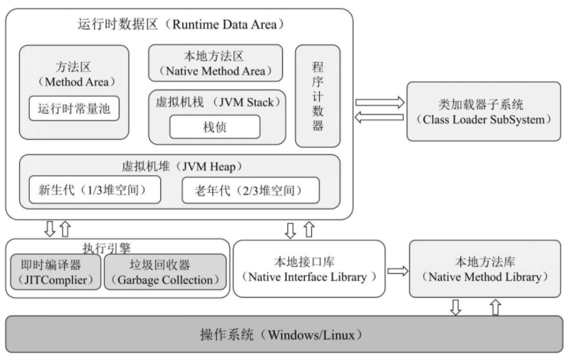

## 程序的运行过程

（1）Java源文件被编译器编译成字节码文件。

（2）JVM将字节码文件编译成相应操作系统的机器码。

（3）机器码调用相应操作系统的本地方法库执行相应的方法。

# 多线程

JVM中的线程与操作系统中的线程是相互对应的，在JVM线程的本地存储、缓冲区分配、同步对象、栈、程序计数器等准备工作都完成时，JVM会调用操作系统的接口创建一个与之对应的原生线程

## JVM的后台线程

- 虚拟机线程
- 周期性任务线程
- GC线程
- 编译器线程
- 信号分发线程

# JVM的内存区域

JVM的内存区域分为线程私有区域（程序计数器、虚拟机栈、本地方法区）、线程共享区域（堆、方法区）和直接内存


线程共享区域随虚拟机的启动而创建，随虚拟机的关闭而销毁。

Java进程可以通过堆外内存技术避免在Java堆和Native堆中来回复制数据带来的资源占用和性能消耗，因此堆外内存在高并发应用场景下被广泛使用（Netty、Flink、HBase、Hadoop都有用到堆外内存）。

**程序计数器**（是线程私有的）是一块很小的内存空间，用于存储当前运行的线程所执行的字节码的行号指示器

**虚拟机栈**(是线程私有的)是描述Java方法的执行过程的内存模型，它在当前栈帧（Stack Frame）中存储了局部变量表、操作数栈、动态链接、方法出口等信息。

栈帧用来记录方法的执行过程，在方法被执行时虚拟机会为其创建一个与之对应的栈帧，方法的执行和返回对应栈帧在虚拟机栈中的入栈和出栈。

在线程内部，每个方法的执行和返回都对应一个栈帧的入栈和出栈，每个运行中的线程当前只有一个栈帧处于活动状态。

**本地方法区**（是线程私有的）本地方法栈为Native方法服务。

**堆**：现代JVM采用分代收集算法，因此Java堆从GC（Garbage Collection，垃圾回收）的角度还可以细分为：新生代、老年代和永久代。

**方法区**也被称为永久代，用于存储常量、静态变量、类信息、即时编译器编译后的机器码、运行时常量池等数据。

**永久代的内存回收主要针对常量池的回收和类的卸载**，因此可回收的对象很少。

常量被存储在运行时常量池（Runtime ConstantPool）中，是方法区的一部分。静态变量也属于方法区的一部分。

# JVM的运行时内存

JVM的运行时内存也叫作JVM堆，从GC的角度可以将JVM堆分为新生代、老年代和永久代。

- 其中新生代默认占1/3堆空间；
- 老年代默认占2/3堆空间；
- 永久代占非常少的堆空间。

新生代又分为Eden区、ServivorFrom区和ServivorTo区，

- Eden区默认占8/10新生代空间，
- ServivorFrom区默认占1/10新生代空间
- ServivorTo区默认1/10新生代空间
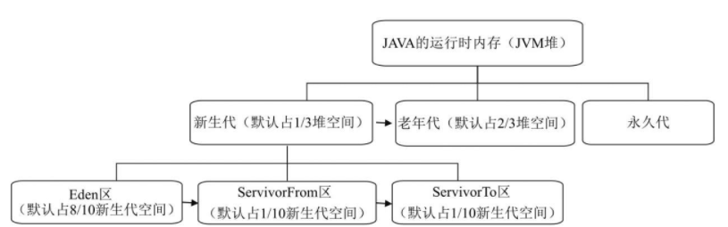

## 新生代

（1）Eden区：Java新创建的对象首先会被存放在Eden区，如果新创建的对象属于大对象，则直接将其分配到老年代。大对象的定义和具体的JVM版本、堆大小和垃圾回收策略有关，一般为2KB～128KB，可通过XX:PretenureSizeThreshold设置其大小。在Eden区的内存空间不足时会触发MinorGC，对新生代进行一次垃圾回收。

（2）ServivorTo区：保留上一次MinorGC时的幸存者。

（3）ServivorFrom区：将上一次MinorGC时的幸存者作为这一次MinorGC的被扫描者。

### 新生代GC算法MinorGC

**新生代的GC过程叫作MinorGC，采用复制算法实现：**

（1）把在Eden区和ServivorFrom区中存活的对象复制到ServivorTo区。

如果某对象的年龄达到老年代的标准（对象晋升老年代的标准由XX:MaxTenuringThreshold设置，默认为15），则将其复制到老年代，同时把这些对象的年龄加1；如果ServivorTo区的内存空间不够，则也直接将其复制到老年代；如果对象属于大对象（大小为2KB～128KB的对象属于大对象，例如通过XX:PretenureSizeThreshold=2097152设置大对象为2MB,1024×1024×2Byte=2097152Byte=2MB），则也直接将其复制到老年代。

（2）清空Eden区和ServivorFrom区中的对象。

（3）将ServivorTo区和ServivorFrom区互换，原来的ServivorTo区成为下一次GC时的ServivorFrom区。

## 老年代

老年代主要存放有长生命周期的对象和大对象。老年代的GC过程叫作MajorGC

在老年代，对象比较稳定，MajorGC不会被频繁触发。在进行MajorGC前，JVM会进行一次MinorGC，在MinorGC过后仍然出现老年代空间不足或无法找到足够大的连续空间分配给新创建的大对象时，会触发MajorGC进行垃圾回收，释放JVM的内存空间。

### 老年代GC算法MajorGC

**MajorGC采用标记清除算法**，该算法首先会扫描所有对象并标记存活的对象，然后回收未被标记的对象，并释放内存空间。

老年代主要存放有长生命周期的对象和大对象。老年代的GC过程叫作MajorGC。在老年代，对象比较稳定，MajorGC不会被频繁触发。在进行MajorGC前，JVM会进行一次MinorGC，在MinorGC过后仍然出现老年代空间不足或无法找到足够大的连续空间分配给新创建的大对象时，会触发MajorGC进行垃圾回收，释放JVM的内存空间。

**MajorGC采用标记清除算法**，该算法首先会扫描所有对象并标记存活的对象，然后回收未被标记的对象，并释放内存空间。

因为要先扫描老年代的所有对象再回收，所以MajorGC的耗时较长。MajorGC的标记清除算法容易产生内存碎片。在老年代没有内存空间可分配时，会抛出Out Of Memory异常。

## 永久代

永久代指内存的永久保存区域，主要存放Class和Meta（元数据）的信息。Class在类加载时被放入永久代。GC不会在程序运行期间对永久代的内存进行清理

在Java 8中永久代已经被元数据区（也叫作元空间）取代。元数据区的作用和永久代类似，二者最大的区别在于：元数据区并没有使用虚拟机的内存，而是直接使用操作系统的本地内存。因此，元空间的大小不受JVM内存的限制，只和操作系统的内存有关。

# 垃圾回收与算法

Java采用引用计数法和可达性分析来确定对象是否应该被回收

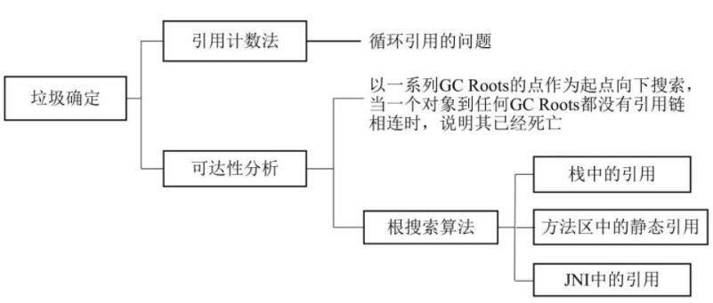

## 引用计数法

引用计数法容易产生循环引用问题。循环引用指两个对象相互引用，导致它们的引用一直存在，而不能被回收

## 可达性分析

为了解决引用计数法的循环引用问题，Java还采用了可达性分析来判断对象是否可以被回收。

不可达对象要经过至少两次标记才能判定其是否可以被回收，如果在两次标记后该对象仍然是不可达的，则将被垃圾收集器回收。

## Java中常用的垃圾回收算法

Java中常用的垃圾回收算法有标记清除（Mark-Sweep）、复制（Copying）、标记整理（Mark-Compact）和分代收集（Generational Collecting）这4种垃圾回收算法

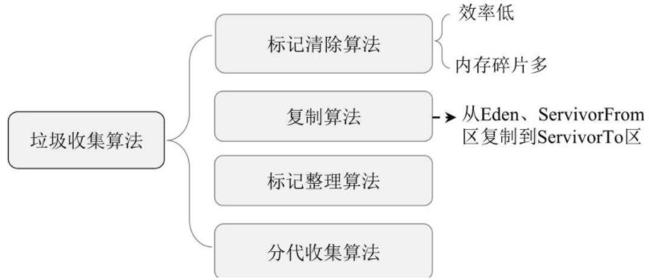

### 标记清除算法

在标记阶段标记所有需要回收的对象，在清除阶段清除可回收的对象并释放其所占用的内存空间
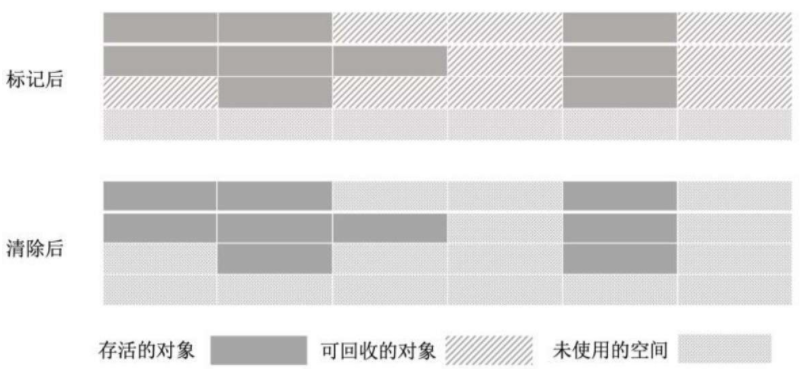

由于标记清除算法在清理对象所占用的内存空间后并没有重新整理可用的内存空间，因此如果内存中可被回收的小对象居多，则会引起内存碎片化的问题，继而引起大对象无法获得连续可用空间的问题。

### 复制算法

复制算法是为了解决标记清除算法内存碎片化的问题而设计的。复制算法首先将内存划分为两块大小相等的内存区域，即区域1和区域2，新生成的对象都被存放在区域1中，在区域1内的对象存储满后会对区域1进行一次标记，并将标记后仍然存活的对象全部复制到区域2中，这时区域1将不存在任何存活的对象，直接清理整个区域1的内存即可

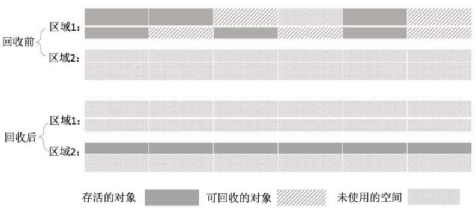

复制算法的内存清理效率高且易于实现，但由于同一时刻只有一个内存区域可用，即可用的内存空间被压缩到原来的一半，因此存在大量的内存浪费。同时，在系统中有大量长时间存活的对象时，这些对象将在内存区域1和内存区域2之间来回复制而影响系统的运行效率。因此，该算法只在对象为“朝生夕死”状态时运行效率较高。

### 标记整理算法

标记整理算法结合了标记清除算法和复制算法的优点，其标记阶段和标记清除算法的标记阶段相同，在标记完成后将存活的对象移到内存的另一端，然后清除该端的对象并释放内存

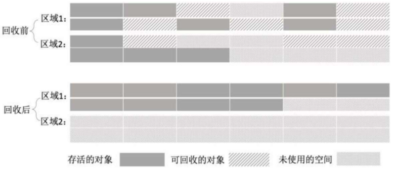

### 分代收集算法

针对不同的对象类型，JVM采用了不同的垃圾回收算法，该算法被称为分代收集算法。

新生代主要存放新生成的对象，其特点是对象数量多但是生命周期短，在每次进行垃圾回收时都有大量的对象被回收；老年代主要存放大对象和生命周期长的对象，因此可回收的对象相对较少。

大部分JVM在新生代都采用了复制算法

JVM将新生代进一步划分为一块较大的Eden区和两块较小的Servivor区，Servivor区又分为ServivorFrom区和ServivorTo区。JVM在运行过程中主要使用Eden区和ServivorFrom区，进行垃圾回收时会将在Eden区和ServivorFrom区中存活的对象复制到ServivorTo区，然后清理Eden区和ServivorFrom区的内存空间

老年代主要存放生命周期较长的对象和大对象，因而每次只有少量非存活的对象被回收，因而在老年代采用标记清除算法。

若Servivor区的对象经过一次GC后仍然存活，则其年龄加1。在默认情况下，对象在年龄达到15时，将被移到老年代。

# Java中的四种引用类型

Java中的引用类型有4种，分别为强引用、软引用、弱引用和虚引用

## 强引用

在把一个对象赋给一个引用变量时，这个引用变量就是一个强引用。有强引用的对象一定为可达性状态，所以不会被垃圾回收机制回收。因此，强引用是造成Java内存泄漏（Memory Link）的主要原因。

## 软引用

软引用通过SoftReference类实现。如果一个对象只有软引用，则在系统内存空间不足时该对象将被回收。

## 弱引用

弱引用通过WeakReference类实现，如果一个对象只有弱引用，则在垃圾回收过程中一定会被回收。
## 虚引用

虚引用通过PhantomReference类实现，虚引用和引用队列联合使用，主要用于跟踪对象的垃圾回收状态。


# 分代收集算法与分区收集算法

## 分代收集算法

### 新生代 复制算法
新生代主要存储短生命周期的对象，因此在垃圾回收的标记阶段会标记大量已死亡的对象及少量存活的对象，因此只需选用复制算法将少量存活的对象复制到内存的另一端并清理原区域的内存即可。

### 老年代 标记清除算法

老年代主要存放长生命周期的对象和大对象，可回收的对象一般较少，因此JVM采用标记清除算法进行垃圾回收，直接释放死亡状态的对象所占用的内存空间即可。

## 分区收集算法

分区收集算法可以根据系统可接受的停顿时间，每次都快速回收若干个小区域的内存，以缩短垃圾回收时系统停顿的时间，最后以多次并行累加的方式逐步完成整个内存区域的垃圾回收。

# 垃圾收集器

针对新生代提供的垃圾收集器有Serial、ParNew、Parallel Scavenge，针对老年代提供的垃圾收集器有Serial Old、Parallel Old、CMS，还有针对不同区域的G1分区收集算法
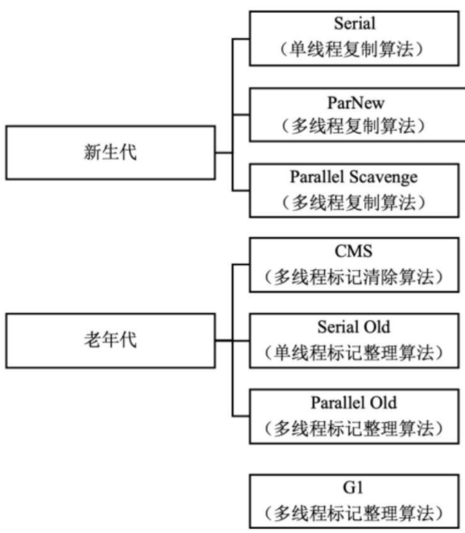

# 垃圾收集器

## Serial垃圾收集器：单线程，复制算法（新生代）

Serial 垃圾收集器计数复制算法实现，他是一个单线程收集器，在它正在进行垃圾收集时，必须暂停其他所有工作线程，直到垃圾收集结束。

Serial垃圾收集器是Java虚拟机运行在Client模式下的新生代的默认垃圾收集器。

## ParNew垃圾收集器：多线程，复制算法（新生代）

ParNew垃圾收集器在垃圾收集过程中会暂停所有其他工作线程，是Java虚拟机运行在Server模式下的新生代的默认垃圾收集器。

ParNew垃圾收集器默认开启与CPU同等数量的线程进行垃圾回收，在Java应用启动时可通过-XX:ParallelGCThreads参数调节ParNew垃圾收集器的工作线程数。

## Parallel Scavenge垃圾收集器：多线程，复制算法（新生代）

Parallel Scavenge收集器是为提高新生代垃圾收集效率而设计的垃圾收集器，基于多线程复制算法实现，**在系统吞吐量上有很大的优化**，可以更高效地利用CPU尽快完成垃圾回收任务


提供了三个参数用于调节、控制垃圾回收的停顿时间及吞吐量，分别是控制最大垃圾收集停顿时间的-XX:MaxGCPauseMillis参数，控制吞吐量大小的-XX:GCTimeRatio参数和控制自适应调节策略开启与否的UseAdaptiveSizePolicy参数。


## Serial Old 垃圾收集器：单线程，标记整理算法


Serial Old垃圾收集器是JVM运行在Client模式下的老年代的默认垃圾收集器。


新生代的Serial垃圾收集器和老年代的Serial Old垃圾收集器可搭配使用


## Parallel Old垃圾收集器：多线程，标记整理算法

Parallel Old 垃圾收集器在设计张优先考虑系统吞吐量，其次考虑停顿时间等因素，如果系统对吞吐量的要求较高，则可以优先考虑新生代的Parallel Scavenge垃圾收集器和老年代的Parallel Old垃圾收集器的配合使用。

## CMS垃圾收集器

CMS的主要目标是达到最短的垃圾回收停顿时间，基于线程的标记清除算法实现，以便在多线程并发环境下以最短的垃圾收集停顿时间提高系统的稳定性。

CMS工作步骤：
1. 初始标记：只标记和GC Roots直接关联的对象，速度很快，需要暂停所有工作线程。
2. 并发标记:和用户线程一起工作，执行GC Roots跟踪标记过程，不需要暂停工作线程
3. 重新标记：在并发标记过程中用户线程继续运行，导致在垃圾回收过程中部分对象的状态发生变化，为了确保这部分对象的状态正确性，需要对其重新标记并暂停工作线程。
4. 并发清除：和用户线程一起工作，执行清除GC Roots不可达对象的任务不需要暂停工作线程。

CMS垃圾收集器在和其他用户线程一起工作时（并发标记和并发清除）不需要暂停用户线程，有效缩短了垃圾回收时系统的停顿时间，同时由于CMS垃圾收集器和用户线程一起工作，因此其并行度和效率也有很大提升


## G1垃圾收集器

G1(Gabage First)垃圾收集器为了避免全区域垃圾收集引起的系统停顿，将堆内存划分为大小固定的几个独立区域，独立使用这些区域的内存资源并且跟踪这些区域的垃圾收集进度，同时在后台维护一个优先级列表，在垃圾回收过程中根据系统允许的最长垃圾收集时间，优先回收垃圾最多的区域。

相对于CMS收集器，G1垃圾收集器两个突出的改进：
- 基于标记整理算法，不产生内存碎片。
- 可以精确的控制停顿时间，在不牺牲吞吐量的前提下实现短停顿垃圾回收。

# 网络编程模型

## 阻塞I/O模型

阻塞I/O的工作流程为：在用户线程发出I/O请求之后，内核会检查数据是否就绪，此时用户线程一直组设等待内存数据 就绪；在内存数据就绪后，内核将数组复制到用夯实线程中，并返回I/O执行结果到用户线程，此时用户线程将解除阻塞状态并开始处理数据。

## 非阻塞I/O模型
非阻塞I/O模型指用户线程在发器一个I/O操作后，无需阻塞便可以马上得到内核返回的一个结果。

在非阻塞I/O模型中，用户线程需要不断询问内核数据是否就绪，在内存数据还未就绪时，用户线程可以处理其他任务，在内核数据就绪后可立即获取数据并进行相应的操作。

## 多路复用I/O模型

时多线程并发编程用的比较多的模型，Java NIO就是基于多路复用I/O模型实现的。

在多路复用I/O模型中回右一个被称为Selector的线程不断轮询多个Socket的状态，只有在Socket的有读写事件时，才会通知用户线程进行I/O读写操作。

多路复用I/O模型在连接数众多且消息体不大的情况下有很大的优势。

非阻塞I/O模型在每个用户线程中都进行Socket状态检查，而在多路复用I/O模型中是在系统内核中进行Socket状态检查的，这也是多路复用I/O模型比非阻塞I/O模型效率高的原因。

对于多路复用I/O模型来说，在事件响应体（消息体）很大时，Selector线程就会成为性能瓶颈，导致后续的事件迟迟得不到处理，影响下一轮的事件轮询。

## 信号驱动I/O模型
在信号驱动I/O模型中，在用户线程发起一个I/O请求操作时，系统会为该请求对应的Socket注册一个信号函数，然后用户线程可以继续执行其他业务逻辑；在内核数据就绪时，系统会发送一个信号到用户线程，用户线程在接受到该信号后，会在信号函数中调用对应的I/O读写操作完成时机的I/O请求操作。

## 异步I/O模型

在异步I/O模型中，用户线程会发起一个asynchronous read 操作到内核，内核在接收到Synchronous read请求后会立即返回一个状态，来说明请求是否成功发起，在此过程中用户线程不会发生任何阻塞。接着，内核会等待数据准备完成并将数据复制到用户线程，通知用户线程Asynchronous读操作已完成。在异步I/O模型中，用户线程不需要关心整个I/O操作时如何进行的，只需发起一个请求，在接收到内核返回的成功或失败信号时说明I/O操作已经完成，直接使用数据即可。

一步I/Oc操作需要操作系统的底层支持，在Java 7 中提供了Asynchronous I/O操作。

## Java I/O

在整个Java.io包中最重要的5个类和一个接口。5个类指的是File、OutPutStream、InputStream、Writer、Reader,一个接口指的是Serializable。

## Java NIO
Java NIO的实现主要涉及三大核心内容：Selector（选择器）、Channel（通道）和Buffer(缓冲区)。

传统I/O基于数据流进行I/O读写操作；而Java NIO基于channel 和BUffer 进行I/O读写操作，并且数据总是被从Channel读取到Buffer中，或者从Buffer写入Channel中

Java NIO和传统I/O的最大区别如下:

- I/O是面向流的，NIO是面向缓冲区的。
- 传统I/O的流操作时阻塞模式的，NIO的流操作是非阻塞模式的。


### channel

Channel和I/O中的Stream（流）类似，只不过Stream是单向的（例如InputStream、OutputStream），而Channel是双向的，既可以用来进行读操作，也可以用来进行写操作。

NIO中Channel的主要实现有：FileChannel、DatagramChannel、SocketChannel、ServerSocketChannel，分别对应文件的I/O、UDP、TCP I/O、Socket Client和Socker Server操作。


### Buffer

Buffer实际上是一个容器，其内部通过一个连续的字节数组存储I/O上的数据。

常用的Buffer实现类有：ByteBuffer、IntBuffer、CharBuffer、LongBuffer、DoubleBuffer、FloatBuffer、ShortBuffer

### Selector

Selector用于检测多个注册的Channel上是否有I/O事件发生，并对检测到的I/O事件进行相应的相应和处理。

# JVM的类加载机制

## JVM的类加载阶段

加载->验证->准备->解析->初始化
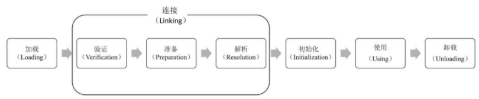

## 1、加载

指JVM读取Class文件，并且根据Class文件描述创建java.lang.Class对象的过程。

类加载过程主要包含将Class文件读取到运行时区域的方法区内，在堆中创建java.lang.Class对象，并封装类在方法区的数据结构的过程。

## 2、验证

主要用于确保Class文件符合当前虚拟机的要求，保障虚拟机自身的安全，只有通过验证的Class文件才能被JVM加载。

## 3、准备

主要工作是在方法区中为类变量分配内存空间并设置类中变量的初始值。

静态变量在准备阶段的初始值是0，赋值的动作是在对象初始化时完成的。

JVM在编译阶段后会为final类型的变量生成其对应的ConstantValue属性，虚拟机在准备阶段会根据ConstanValue属性给变量赋值。

## 4、解析

JVM会将常量池中的符号引用替换为直接引用

## 5、初始化

主要通过执行类构造器的<client>方法为类进行初始化

<client>方法是在编译阶段由编译器自动收集类中静态语句块和变量的赋值操作组成的。JVM规定，只有在父类的<client>方法都执行成功后，子类中的<client>方法才可以被执行。在一个类中既没有静态变量赋值操作也没有静态语句块时，编译器不会为该类生成<client>方法。

发生以下几种情况时，JVM不会执行类的初始化流程：

- 常量在编译时会将其常量值存入使用该常量的类的常量池中，该过程不需要调用常量所在的类，因此不会出发该常量类的初始化。
- 在子类引用父类的静态字段时，不会触发子类的初始化，只会触发父类的初始化。
- 定义对象数组，不会触发该类的初始化。
- 在使用类名获取Class对象时不会触发类的初始化。
- 在使用Ckass.ForName加载指定的类时，可以通过initialize参数设置是否需要对类进行初始化。
- 在使用ClassLoader默认的loadClass方法加载类时不会触发该类的初始化

## 类加载器

JVM提供了3种类加载器，分别是启动类加载器、扩展类加载器和应用程序类加载器

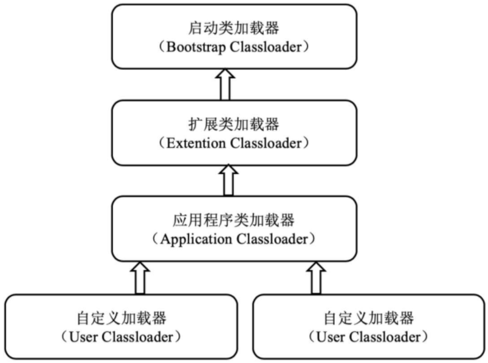

1、启动类加载器：负责加载Java_HOME/lib目录中的类库，或通过-Xbootclasspath参数指定路径中被虚拟机认可的类库。

2、扩展类加载器：负责加载Java_HOME/lib/ext目录中的类库，或通过java.ext.dirs系统变量加载指定路径中的类库。

3、应用程序类加载器：负责加载用户路径（classpath）上的类库、

## 双亲委派机制（重要）

JVM通过双亲委派机制对类进行加载。双亲委派机制指一个类在收到类加载请求后不会尝试自己加载这个类，而是把该类加载请求向上委派给其父类去完成，其父类在接收到该类加载请求后又会将其委派给自己的父类，以此类推，这样所有的类加载请求都被向上委派到启动类加载器中。

若父类加载器在接收到类加载请求后发现自己也无法加载该类（通常原因时该类的Class文件在父类的类加载路径中不存在），则父类会将该信息反馈给子类并向下委派子类加载器加载该类，直到该类被成功加载，若找不到该类，则JVM会抛出ClassNotFound异常。
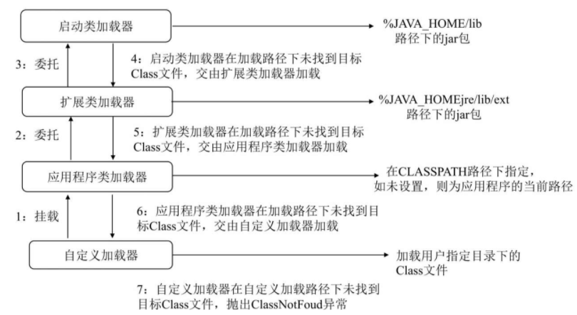

1. 将自定义加载器挂载到应用程序类加载器。
2. 应用程序类加载器将类加载请求委托给扩展类加载器。
3. 扩展类加载器将类加载请求委托给七大类加载器。
4. 启动类加载器在加载路径下查找并加载Class文件，如果未找到目标Class文件，则交由扩展类加载器加-载。
5. 扩展类加载器在加载路径下查找并加载Class文件，如果未找到目标Class文件，则交由自定义加载器加载。
6. 应用程序类加载器在加载路径下查找并加载Class文件，如果未找到目标Class文件，则交由自定义加载器加载。
7. 在自定义加载器下查找并加载用户指定目录下的Class文件，如果在自定义加载路径下未找到目标Class文件，则抛出ClassNotFound异常。

**双亲委派机制的核心时保障类的唯一性和安全性。**


OSGI(Open Service Gateway Initiative)是 Java动态化模块系统的一系列规范，旨在为实现Java程序员的模块化编程提供基础条件。

# 集合

### ArrayList：不适合随机插入和删除的操作，更适合随机查找和遍历的操作。

### Vector：基于数组实现，增删慢，查询快，线程安全

Vector的数据结构和ArrayList一样，都是基于数组实现的，不同的是Vector支持线程同步，即同一时刻只允许一个线程对Vector进行写操作（新增、删除、修改），以保证多线程环境下数据的一致性，但需要频繁地对Vector实例进行加锁和释放锁操作，因此，Vector的读写效率在整体上比ArrayList低。


### LinkedList：基于双向链表实现，增删快，查询慢，线程不安全

LinkedList还提供了在List接口中未定义的方法，用于操作链表头部和尾部的元素，因此有时可以被当作堆栈、队列或双向队列使用。

- ArrayBlockingQueue：基于数组数据结构实现的有界阻塞队列。
- LinkedBlockingQueue：基于链表数据结构实现的有界阻塞队列。
- PriorityBlockingQueue：支持优先级排序的无界阻塞队列。 
- DelayQueue：支持延迟操作的无界阻塞队列。
- SynchronousQueue：用于线程同步的阻塞队列。
- LinkedTransferQueue：基于链表数据结构实现的无界阻塞队列。
- LinkedBlockingDeque：基于链表数据结构实现的双向阻塞队列。


对象的相等性在本质上是对象的HashCode值相同，Java依据对象的内存地址计算出对象的HashCode值。如果想要比较两个对象是否相等，则必须同时覆盖对象的hashCode方法和equals方法，并且hashCode方法和equals方法的返回值必须相同。


### HashSet:HashTable实现，无序

HashSet存放的是散列值，它是按照元素的散列值来存取元素的。元素的散列值是通过元素的hashCode方法计算得到的，HashSet首先判断两个元素的散列值是否相等，如果散列值相等，则接着通过equals方法比较，如果equls方法返回的结果也为true, HashSet就将其视为同一个元素；如果equals方法返回的结果为false, HashSet就不将其视为同一个元素。

### TreeSet：二叉树实现

TreeSet基于二叉树的原理对新添加的对象按照指定的顺序排序（升序、降序），每添加一个对象都会进行排序，并将对象插入二叉树指定的位置。

### LinkHashSet:HashTable实现数据存储，双向链表记录顺序


### HashMap:数组+链表+红黑树存储数据（Java8，之前是数组+链表），线程不安全

HashMap的key和value允许为null

HashMap是非线程安全的，即在同一时刻有多个线程同时写HashMap时将可能导致数据的不一致。

如果需要满足线程安全的条件，则可以用Collections的synchornizedMap方法使HashMap具有线程安全的能力，或者使用ConcurrentHashMap。

HashMap的常用参数：
- capacity：当前数组的容量，默认为16，可以扩容，扩容后数组的大小为当前的两倍，因此该值始终为$2^n$
- loadFactor:负载因子，默认为0.75
- threshold: 扩容的阈值，其值等于caoacity*loadFactor
- 链表元素超过8个以后（并且桶的数量大于64个）HashMap会将链表结构转化为红黑树以提高查询效率（红黑树中的元素数量小于6个时转换为链表）

### ConcurrentHashMap：分段锁实现，线程安全。

ConcurrnetHashMap采用分段锁的思想实现并发操作，因此是线程安全的。ConcurrentHashMap由多个Segment组成（Segment的数量也是锁的并发度），每个Segment均继承自ReentantLock并单独枷锁，所以每次进行枷锁操作时锁住的都是一个Segment，这样只要保证每个Segment都是线程安全的，也就实现了全局的线程安全。

ConcurrentHashMap中有个concurrencyLevel参数表示并行级别，默认是16，也就是说ConcurrnetHashMap默认由16个Segments组成，在这种情况下做多同时支持16个线程并发执行写操作，只要他们的操作分布在不同的Segment上即可。并行级别concurrnecyLevel可以在初始化时设置，一旦初始化就不可更改。

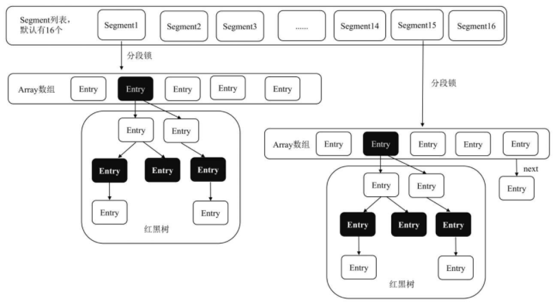

###  HashTable
HashTable是遗留类，很多映射的常用功能都与HashMap类似，不同的是它继承自Dicitionary类，并且使线程安全的，每一时刻只能由一个线程写HashTable，并发性不如ConcurrentHashMap

### TreeMap
TreeMap基于二叉树数据结构存储数据，同时实现了SortedMap接口以保障元素的顺序存取，默认按照键值的升序排序，也可以自定义排序比较器。

在使用TreeMap时其key必须实现Comparable接口或采用自定义的比较器，否则会抛出java.lang.ClassCastException异常。

### LinkedHashMap：基于hashTable数据结构，使用链表保存插入顺序

在通过Iterator遍历LinkedhashMap时，会按照元素的插入顺序访问元素。


# 异常

java中Throwable是所有错误或异常的父类，Throwable又可分为Error和Exception。

常见的Error有：AWTError、ThreadDeath。

Exception又可分为RuntimeException和CheckedException


## Error

指Java程序运行错误，如果程序在启动时出现Error，则启动失败；如果程序在运行过程中出现Error，则系统将退出进程。

出现Error通常是因为系统的内部错误或资源耗尽，Error不能被在运行过程中被动态处理。如果程序出现Error，则系统能做的工作也只能有记录错误的成因和安全终止。

# Exception

Exception指Java程序运行异常，即运行中的程序发生了人们不期望发生的事件，可以被Java异常处理机制处理。Exception也是程序开发中异常处理的核心，可分为RuntimeException（运行时异常）和CheckedException（检查异常）

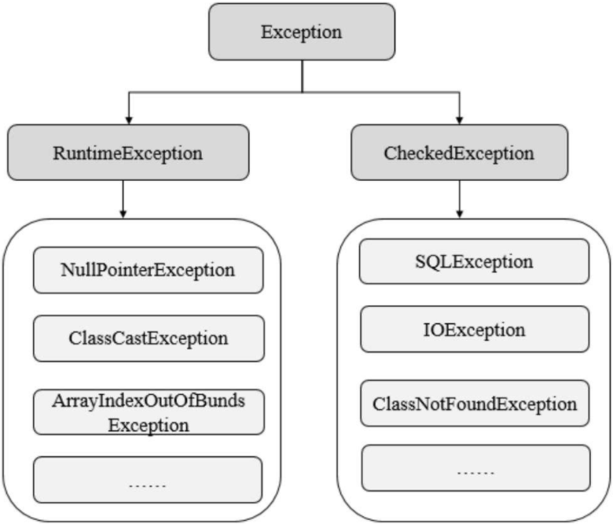


- RuntimeException：指在Java虚拟机正常运行期间抛出的异常，RuntimeException可以被捕获并处理，如果出现RuntimeException，那么一定是程序发生错误导致的。我们通常需要抛出该异常或者捕获并处理该异常。常见的RuntimeException有NullPointerException、ClassCastException、ArrayIndexOutOfBundsException等。


- CheckedException：指在编译阶段Java编译器会检查CheckedException异常并强制程序捕获和处理此类异常，即要求程序在可能出现异常的地方通过try catch语句块捕获并处理异常。常见的CheckedException有由于I/O错误导致的IOException、SQLException、ClassNotFoundException等。该类异常一般由于打开错误的文件、SQL语法错误、类不存在等引起。

## 异常处理方式：抛出异常、使用try catch 捕获并处理异常

（1）抛出异常：遇到异常时不进行具体处理，而是将异常抛给调用者，由调用者根据情况处理。有可能是直接捕获并处理，也有可能是继续向上层抛出异常。抛出异常有三种形式：throws、throw、系统自动抛出异常。

（2）使用try catch捕获并处理异常：使用trycatch捕获异常能够有针对性地处理每种可能出现的异常，并在捕获到异常后根据不同的情况做不同的处理。其使用过程比较简单：用try catch语句块将可能出现异常的代码包起来即可。

## throw 和 throws的区别

throw和throws的区别如下。
- 位置不同：throws作用在方法上，后面跟着的是异常的类；而throw作用在方法内，后面跟着的是异常的对象。
- 功能不同：throws用来声明方法在运行过程中可能出现的异常，以便调用者根据不同的异常类型预先定义不同的处理方式；throw用来抛出封装了异常信息的对象，程序在执行到throw时后续的代码将不再执行，而是跳转到调用者，并将异常信息抛给调用者。也就是说，throw后面的语句块将无法被执行（finally语句块除外）。


# 反射

## 概念

反射机制指在程序运行过程中，对任意一个类都能获取其所有属性和方法，并且对任意一个对象都能调用其任意一个方法。这种动态获取类和对象的信息，以及动态调用对象的方法的功能被称为Java语言的反射机制。

从反射的角度来说，Java属于半动态语言。

## Java反射的API
Java的反射API主要用于在运行过程中动态生成类、接口或对象等信息，其常用API如下。
- Class类：用于获取类的属性、方法等信息。
- Field类：表示类的成员变量，用于获取和设置类中的属性值。
- Method类：表示类的方法，用于获取方法的描述信息或者执行某个方法。
- Constructor类：表示类的构造方法。

## 反射的步骤

（1）获取想要操作的类的Class对象，该Class对象是反射的核心，通过它可以调用类的任意方法。

（2）调用Class对象所对应的类中定义的方法，这是反射的使用阶段。

（3）使用反射API来获取并调用类的属性和方法等信息。


# 内部类

Java中的内部类根据定义方式的不同可分为：
静态内部类、成员内部类、局部内部类和匿名内部类

## 静态内部类
定义在类内部的静态类被称为静态内部类

静态内部类可以访问外部类的静态变量和方法；在静态内部类中可以定义静态变量、方法、构造函数等；静态内部类通过“外部类．静态内部类”的方式来调用

和外部类关系密切且不依赖外部类实例的类，可以使用静态内部类实现。

## 成员内部类
定义在类内部的非静态类叫作成员内部类，成员内部类不能定义静态方法和变量（final修饰的除外），因为成员内部类是非静态的，而在Java的非静态代码块中不能定义静态方法和变量。

## 局部内部类

定义在方法中的类叫作局部内部类

## 匿名内部类

匿名内部类指通过继承一个父类或者实现一个接口的方式直接定义并使用的类。匿名内部类没有class关键字，这是因为匿名内部类直接使用new生成一个对象的引用

# 泛型

**在使用泛型时，泛型的引用和创建两端，给出的泛型变量必须相同**

```java
// 正确的写法
List<Integer> list=new ArrayList<Integer>();

// 错误的写法
List<Number> list=new ArrayList<Integer>();
```


泛型的本质是参数化类型，泛型提供了编译时类型的安全检测机制，该机制允许程序在编译时检测非法的类型。

而使用泛型的好处是在编译期就能够检查类型是否安全，同时所有强制性类型转换都是自动和隐式进行的，提高了代码的安全性和重用性。

## 泛型标记和泛型限定：E、T、K、V、N、?
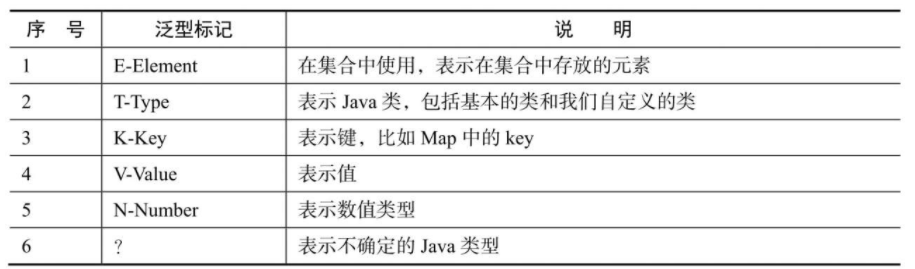

在使用泛型的时候，若希望将类的继承关系加入泛型应用中，就需要对泛型做限定，具体的泛型限定有对泛型上线的限定和对泛型下线的限定。


## 对泛型上限的限定：<? extendsT>

在Java中使用通配符“? ”和“extends”关键字指定泛型的上限，具体用法为<? extends T>，它表示该通配符所**代表的类型是T类的子类或者接口T的子接口。**

## 对泛型下限的限定：<? super T>

在Java中使用通配符“? ”和“super”关键字指定泛型的下限，具体用法为<? super T>，它表示该通配符所**代表的类型是T类型的父类或者父接口。**


## 泛型类、泛型接口、泛型方法

## 类型擦除

在编码阶段采用泛型时加上的类型参数，会被编译器在编译时去掉，这个过程就被称为类型擦除。因此，泛型主要用于编译阶段。在编译后生成的Java字节代码文件中不包含泛型中的类型信息

Java类型的擦除过程为：首先，查找用来替换类型参数的具体类（该具体类一般为Object），如果指定了类型参数的上界，则以该上界作为替换时的具体类；然后，把代码中的类型参数都替换为具体的类。


# 序列化

在使用Java序列化技术保存对象及其状态信息时，对象及其状态信息会被保存在一组字节数组中，在需要时再将这些字节数组反序列化为对象。注意，对象序列化保存的是对象的状态，即它的成员变量，因此类中的静态变量不会被序列化。

## Java序列化的注意事项

- 类要实现序列化功能，只需实现java.io.Serializable接口即可。
- 序列化和反序列化必须保持序列化的ID一致，一般使用private static final longserialVersionUID定义序列化ID。
- 序列化并不保存静态变量。
-  使用Transient关键字可以阻止该变量被序列化，在被反序列化后，transient变量的值被设为对应类型的初始值

**transient修饰的属性和static修饰的静态属性不会被序列化。**


可以基于JDK原生的ObjectOutputStream和ObjectInputStream类实现对象进行序列化及反序列化，并调用其writeObject和readObject方法实现自定义序列化策略。


# Java线程创建的方式

常见的Java线程的4种创建方式分别为：
- 继承Thread类
- 实现Runnable接口
- 通过ExecutorService实现有返回值的线程、基于线程池
- Callable<Class>实现有返回值的线程、基于线程池

## 继承Thread类

Thread类实现了Runnable接口并定义了操作线程的一些方法，我们可以通过继承Thread类的方式创建一个线程。

start方法是一个native方法，通过在操作系统上启动一个新线程，并最终执行run方法来启动一个线程。

## 实现Runnable接口

基于Java编程语言的规范，如果子类已经继承（extends）了一个类，就无法再直接继承Thread类，此时可以通过实现Runnable接口创建线程。


事实上，在传入一个实现了Runnable的线程实例target给Thread后，Thread的run方法在执行时就会调用target.run方法并执行该线程具体的实现逻辑。

## 通过ExecutorService和Callable<Class>实现有返回值的线程

有时，我们需要在主线程中开启多个线程并发执行一个任务，然后收集各个线程执行返回的结果并将最终结果汇总起来，这时就要用到Callable接口。

实现方式：创建一个类并实现Callable接口，在call方法中实现具体的运算逻辑并返回计算结果。具体的调用过程为：创建一个线程池、一个用于接收返回结果的Future List及Callable线程实例，使用线程池提交任务并将线程执行之后的结果保存在Future中，在线程执行结束后遍历FutureList中的Future对象，在该对象上调用get方法就可以获取Callable线程任务返回的数据并汇总结果

## 基于线程池

线程是非常宝贵的计算资源，在每次需要时创建并在运行结束后销毁是非常浪费资源的。我们可以使用缓存策略并使用线程池来创建线程

# 线程池的工作原理

**JVM先根据用户的参数创建一定数量的可运行的线程任务，并将其放入队列中，在线程创建后启动这些任务，如果线程数量超过了最大线程数量（用户设置的线程池大小），则超出数量的线程排队等候，在有任务执行完毕后，线程池调度器会发现有可用的线程，进而再次从队列中取出任务并执行。**

线程池的主要作用是线程复用、线程资源管理、控制操作系统的最大并发数，以保证系统高效（通过线程资源复用实现）且安全（通过控制最大线程并发数实现）地运行。


## 线程复用

在start方法中不断循环调用传递进来的Runnable对象，程序就会不断执行run方法中的代码，可以将在循环方法中不断获取的Runnable对象存放在Queue中，当前线程在获取下一个Runnable对象之前可以是阻塞的，这样既能有效控制正在执行的线程个数，也能保证系统中正在等待执行的其他线程有序执行。这样就简单实现了一个线程池，达到了线程复用的效果。

## 线程池的核心组件和核心类

- 线程池管理器：用于创建并管理线程池。
- 工作线程：线程池中执行具体任务的线程
- 任务接口：用于定义工作线程的调度和执行策略，只有线程实现了该接口，线程中的任务才能够被线程池调度。
- 任务队列：存放待处理的任务，新的任务将会不断被加入队列中，执行完成的任务将被从队列中移除。


Java中的线程池是通过Executor框架实现的，在该框架中用到了Executor、Executors、ExecutorService、ThreadPoolExecutor、Callable、Future、FutureTask这几个核心类

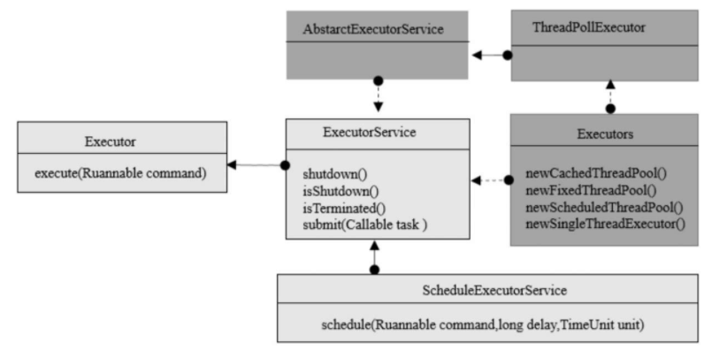

## Java线程池的工作流程

Java线程池的工作流程为：线程池刚被创建时，只是向系统申请一个用于执行线程队列和管理线程池的线程资源。在调用execute()添加一个任务时，线程池会按照以下流程执行任务。

- 如果正在运行的线程数量少于corePoolSize（用户定义的核心线程数），线程池就会立刻创建线程并执行该线程任务。
- 如果正在运行的线程数量大于等于corePoolSize，该任务就将被放入阻塞队列中。
- 在阻塞队列已满且正在运行的线程数量少于maximumPoolSize时，线程池会创建非核心线程立刻执行该线程任务。
- 在阻塞队列已满且正在运行的线程数量大于等于maximumPoolSize时，线程池将拒绝执行该线程任务并抛出RejectExecutionException异常。
- 在线程任务执行完毕后，该任务将被从线程池队列中移除，线程池将从队列中取下一个线程任务继续执行。
- 在线程处于空闲状态的时间超过keepAliveTime时间时，正在运行的线程数量超过corePoolSize，该线程将会被认定为空闲线程并停止。因此在线程池中所有线程任务都执行完毕后，线程池会收缩到corePoolSize大小。

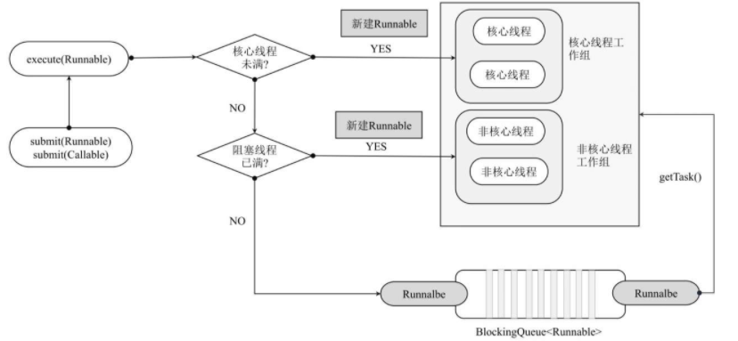

## 线程池的拒绝策略

为了保证操作系统的安全，线程池将通过拒绝策略处理新添加的线程任务。JDK内置的拒绝策略有AbortPolicy、CallerRunsPolicy、DiscardOldestPolicy、DiscardPolicy这4种，默认的拒绝策略在ThreadPoolExecutor中作为内部类提供。

1. AbortPolicyAbortPolicy直接抛出异常，阻止线程正常运行
2. CallerRunsPolicy如果被丢弃的线程任务未关闭，则执行该线程任务。注意，CallerRunsPolicy拒绝策略不会真的丢弃任务。
3. DiscardOldestPolicy的拒绝策略为：移除线程队列中最早的一个线程任务，并尝试提交当前任务。
4. DiscardPolicy的拒绝策略为：丢弃当前的线程任务而不做任何处理。如果系统允许在资源不足的情况下丢弃部分任务，则这将是保障系统安全、稳定的一种很好的方案。
5. 自定义拒绝策略：以上4种拒绝策略均实现了RejectedExecutionHandler接口，若无法满足实际需要，则用户可以自己扩展RejectedExecutionHandler接口来实现拒绝策略，并捕获异常来实现自定义拒绝策略


## 五种常用的线程池

### newCachedThreadPool
newCachedThreadPool用于创建一个缓存线程池。之所以叫缓存线程池，是因为它在创建新线程时如果有可重用的线程，则重用它们，否则重新创建一个新的线程并将其添加到线程池中。

对于执行时间很短的任务而言，newCachedThreadPool线程池能很大程度地重用线程进而提高系统的性能

### newFixedThreadPool

newFixedThreadPool用于创建一个固定线程数量的线程池，并将线程资源存放在队列中循环使用。在newFixedThreadPool线程池中，若处于活动状态的线程数量大于等于核心线程池的数量，则新提交的任务将在阻塞队列中排队，直到有可用的线程资源

### newScheduledThreadPool
newScheduledThreadPool创建了一个可定时调度的线程池，可设置在给定的延迟时间后执行或者定期执行某个线程任务：

### newSingleThreadExecutor

newSingleThreadExecutor线程池会保证永远有且只有一个可用的线程，在该线程停止或发生异常时，newSingleThreadExecutor线程池会启动一个新的线程来代替该线程继续执行任务：

### newWorkStealingPool

newWorkStealingPool创建持有足够线程的线程池来达到快速运算的目的，在内部通过使用多个队列来减少各个线程调度产生的竞争。

# 线程的生命周期

线程的生命周期分为新建（New）、就绪（Runnable）、运行（Running）、阻塞（Blocked）和死亡（Dead）这5种状态。
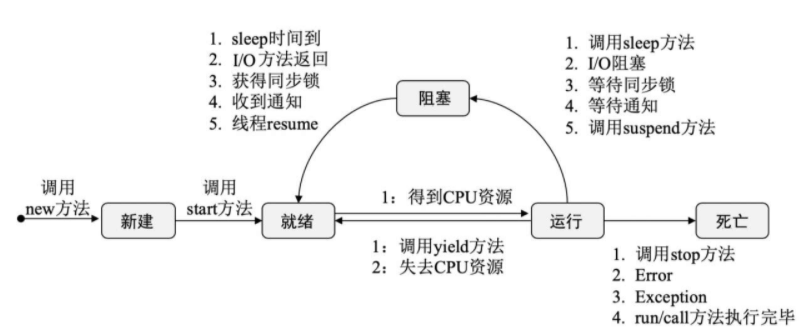


1. 调用new方法新建一个线程，这时线程处于新建状态。
2. 调用start方法启动一个线程，这时线程处于就绪状态。
3. 处于就绪状态的线程等待线程获取CPU资源，在等待其获取CPU资源后线程会执行run方法进入运行状态。
4. 正在运行的线程在调用了yield方法或失去处理器资源时，会再次进入就绪状态。
5. 正在执行的线程在执行了sleep方法、I/O阻塞、等待同步锁、等待通知、调用suspend方法等操作后，会挂起并进入阻塞状态，进入Blocked池。
6. 阻塞状态的线程由于出现sleep时间已到、I/O方法返回、获得同步锁、收到通知、调用resume方法等情况，会再次进入就绪状态，等待CPU时间片的轮询。该线程在获取CPU资源后，会再次进入运行状态。
7. 处于运行状态的线程，在调用run方法或call方法正常执行完成、调用stop方法停止线程或者程序执行错误导致异常退出时，会进入死亡状态。


## 新建状态：New
在Java中使用new关键字创建一个线程，新创建的线程将处于新建状态。在创建线程时主要是为线程分配内存并初始化其成员变量的值。

## 就绪状态：Runnable

新建的线程对象在调用start方法之后将转为就绪状态。此时JVM完成了方法调用栈和程序计数器的创建，等待该线程的调度和运行。

## 运行状态：Running

就绪状态的线程在竞争到CPU的使用权并开始执行run方法的线程执行体时，会转为运行状态，处于运行状态的线程的主要任务就是执行run方法中的逻辑代码。

## 阻塞状态：Blocked

运行中的线程会主动或被动地放弃CPU的使用权并暂停运行，此时该线程将转为阻塞状态，直到再次进入可运行状态，才有机会再次竞争到CPU使用权并转为运行状态。阻塞的状态分为以下三种。
1. 等待阻塞：在运行状态的线程调用o.wait方法时，JVM会把该线程放入等待队列（Waitting Queue）中，线程转为阻塞状态。
2. 同步阻塞：在运行状态的线程尝试获取正在被其他线程占用的对象同步锁时，JVM会把该线程放入锁池（Lock Pool）中，此时线程转为阻塞状态。
3. 其他阻塞：运行状态的线程在执行Thread.sleep(long ms)、Thread.join()或者发出I/O请求时，JVM会把该线程转为阻塞状态。直到sleep()状态超时、Thread.join()等待线程终止或超时，或者I/O处理完毕，线程才重新转为可运行状态。

## 线程死亡：Dead
线程在以下面三种方式结束后转为死亡状态。
- 线程正常结束：run方法或call方法执行完成。
- 线程异常退出：运行中的线程抛出一个Error或未捕获的Exception，线程异常退出。
- 手动结束：调用线程对象的stop方法手动结束运行中的线程（该方式会瞬间释放线程占用的同步对象锁，导致锁混乱和死锁，不推荐使用）。

# 线程的基本方法

线程相关的基本方法有wait、notify、notifyAll、sleep、join、yield等，这些方法控制线程的运行，并影响线程的状态变化。

## 线程等待：wait方法

调用wait方法的线程会进入WAITING状态，只有等到其他线程的通知或被中断后才会返回。需要注意的是，在调用wait方法后会释放对象的锁，因此wait方法一般被用于同步方法或同步代码块中。

## 线程睡眠：sleep方法

调用sleep方法会导致当前线程休眠。与wait方法不同的是，sleep方法不会释放当前占有的锁，会导致线程进入TIMED-WATING状态，而wait方法会导致当前线程进入WATING状态。

## 线程让步：yield方法

调用yield方法会使当前线程让出（释放）CPU执行时间片，与其他线程一起重新竞争CPU时间片。在一般情况下，优先级高的线程更有可能竞争到CPU时间片，但这不是绝对的，有的操作系统对线程的优先级并不敏感。

##  线程中断：interrupt方法

interrupt方法用于向线程发行一个终止通知信号，会影响该线程内部的一个中断标识位，这个线程本身并不会因为调用了interrupt方法而改变状态（阻塞、终止等）。状态的具体变化需要等待接收到中断标识的程序的最终处理结果来判定。对interrupt方法的理解需要注意以下4个核心点。

◎ 调用interrupt方法并不会中断一个正在运行的线程，也就是说处于Running状态的线程并不会因为被中断而终止，仅仅改变了内部维护的中断标识位而已。

◎ 若因为调用sleep方法而使线程处于TIMED-WATING状态，则这时调用interrupt方法会抛出InterruptedException，使线程提前结束TIMED-WATING状态。

◎ 许多声明抛出InterruptedException的方法如Thread.sleep(long mills)，在抛出异常前都会清除中断标识位，所以在抛出异常后调用isInterrupted方法将会返回false。

◎ 中断状态是线程固有的一个标识位，可以通过此标识位安全终止线程。比如，在想终止一个线程时，可以先调用该线程的interrupt方法，然后在线程的run方法中根据该线程isInterrupted方法的返回状态值安全终止线程。


## 线程加入：join方法

join方法用于等待其他线程终止，如果在当前线程中调用一个线程的join方法，则当前线程转为阻塞状态，等到另一个线程结束，当前线程再由阻塞状态转为就绪状态，等待获取CPU的使用权。在很多情况下，主线程生成并启动了子线程，需要等到子线程返回结果并收集和处理再退出，这时就要用到join方法

## 线程唤醒：notify方法

Object类有个notify方法，用于唤醒在此对象监视器上等待的一个线程，如果所有线程都在此对象上等待，则会选择唤醒其中一个线程，选择是任意的。

##  后台守护线程：setDaemon方法

setDaemon方法用于定义一个守护线程，也叫作“服务线程”，该线程是后台线程，有一个特性，即为用户线程提供公共服务，在没有用户线程可服务时会自动离开。守护线程的优先级较低，用于为系统中的其他对象和线程提供服务。将一个用户线程设置为守护线程的方法是在线程对象创建之前用线程对象的setDaemon(true)来设置。

垃圾回收线程就是一个经典的守护线程

## sleep方法与wait方法的区别

◎ sleep方法属于Thread类，wait方法则属于Object类。

◎ sleep方法暂停执行指定的时间，让出CPU给其他线程，但其监控状态依然保持，在指定的时间过后又会自动恢复运行状态。

◎ 在调用sleep方法的过程中，线程不会释放对象锁。

◎ 在调用wait方法时，线程会放弃对象锁，进入等待此对象的等待锁池，只有针对此对象调用notify方法后，该线程才能进入对象锁池准备获取对象锁，并进入运行状态。

## start方法与run方法的区别

start方法与run方法的区别如下。

◎ start方法用于启动线程，真正实现了多线程运行。在调用了线程的start方法后，线程会在后台执行，无须等待run方法体的代码执行完毕，就可以继续执行下面的代码。

◎ 在通过调用Thread类的start方法启动一个线程时，此线程处于就绪状态，并没有运行。

◎ run方法也叫作线程体，包含了要执行的线程的逻辑代码，在调用run方法后，线程就进入运行状态，开始运行run方法中的代码。在run方法运行结束后，该线程终止，CPU再调度其他线程。

## 终止线程的四种方式

1．正常运行结束指线程体执行完成，线程自动结束。


# 数据库的相关内容

## 数据库的三大范式

### 第一范式

如果每列都是不可再分的最小数据单元（也叫做最小的原子单元），满足第一范式，第一范式的目标是确保每列的原子性

### 第二范式

第二范式在第一范式的基础上，规定表中的非主键列不存在对主键的部分依赖，即第二范式要求每个表只描述一件事情。


### 第三范式

第三范式的定义为：满足第一范式和第二范式，并且表中的列不存在对非主键列的传递依赖


## 数据库事务

**事务必须具备以下4个属性，简称ACID属性。**

◎ 原子性（Atomicity）：事务是一个完整操作，参与事务的逻辑单元要么都执行，要么都不执行。

◎ 一致性（Consistency）：在事务执行完毕时（无论是正常执行完毕还是异常退出），数据都必须处于一致状态。

◎ 隔离性（Isolation）：对数据进行修改的所有并发事务都是彼此隔离的，它不应以任何方式依赖或影响其他事务。

◎ 永久性（Durability）：在事务操作完成后，对数据的修改将被持久化到永久性存储中。

## 数据库的并发操作和锁

数据库的并发控制一般采用三种方法实现，分别是乐观锁、悲观锁及时间戳。

### 乐观锁

乐观锁在读数据时，认为别人不会去写其所读的数据；悲观锁就刚好相反，觉得自己读数据时，别人可能刚好在写自己刚读的数据，态度比较保守；时间戳在操作数据时不加锁，而是通过时间戳来控制并发出现的问题。

### 悲观锁

悲观锁指在其修改某条数据时，不允许别人读取该数据，直到自己的整个事务都提交并释放锁，其他用户才能访问该数据。悲观锁又可分为排它锁（写锁）和共享锁（读锁）。

### 时间戳

时间戳指在数据库表中额外加一个时间戳列TimeStamp。每次读数据时，都把时间戳也读出来，在更新数据时把时间戳加1，在提交之前跟数据库的该字段比较一次，如果比数据库的值大，就允许保存，否则不允许保存。这种处理方法虽然不使用数据库系统提供的锁机制，但是可以大大提高数据库处理的并发量。

## 数据库的锁

### 1.行级锁

行级锁指对某行数据加锁，是一种排他锁，防止其他事务修改此行。在执行以下数据库操作时，数据库会自动应用行级锁。
◎ INSERT、UPDATE、DELETE、SELECT … FOR UPDATE [OFcolumns] [WAIT n| NOWAIT]。

◎ SELECT … FOR UPDATE语句允许用户一次针对多条记录执行更新。

◎ 使用COMMIT或ROLLBACK语句释放锁。

### 2.表级锁

表级锁指对当前操作的整张表加锁，它的实现简单，资源消耗较少，被大部分存储引擎支持。最常使用的MyISAM与InnoDB都支持表级锁定。表级锁定分为表共享读锁（共享锁）与表独占写锁（排他锁）。

### 3.页级锁

页级锁的锁定粒度介于行级锁和表级锁之间。表级锁的加锁速度快，但冲突多，行级冲突少，但加锁速度慢。页级锁在二者之间做了平衡，一次锁定相邻的一组记录。

### 4.基于Redis的分布式锁

数据库锁是基于单个数据库实现的，在我们的业务跨多个数据库时，就要使用分布式锁来保证数据的一致性。

Redis实现的分布式锁以Redissetnx命令为中心实现，setnx是Redis的写入操作命令，具体语法为setnx(key val)。在且仅在key不存在时，则插入一个key为val的字符串，返回1；若key存在，则什么都不做，返回0。通过setnx实现分布式锁的思路如下。

◎ 获取锁：在获取锁时调用setnx，如果返回0，则该锁正在被别人使用；如果返回1，则成功获取锁。

◎ 释放锁：在释放锁时，判断锁是否存在，如果存在，则执行Redis的delete操作释放锁。


## 数据库分表

数据库分表有垂直切分和水平切分两种：


◎ 垂直切分：将表按照功能模块、关系密切程度划分并部署到不同的库中。例如，我们会创建定义数据库workDB、商品数据库payDB、用户数据库userDB、日志数据库logDB等，分别用于存储项目数据定义表、商品定义表、用户数据表、日志数据表等

◎ 水平切分：在一个表中的数据量过大时，我们可以把该表的数据按照某种规则如userID散列进行划分，然后将其存储到多个结构相同的表和不同的库上

## 数据库分布式事务

### CAP

CAP原则又称CAP定理，指的是在一个分布式系统中，一致性（Consistency）、可用性（Availability）和分区容错性（Partitiontolerance）三者不可兼得。

◎ 一致性：在分布式系统的所有数据备份中，在同一时刻是否有同样的值（等同于所有节点都访问同一份最新的数据副本）。

◎ 可用性：在集群中一部分节点发生故障后，集群整体能否响应客户端的读写请求（对数据更新具备高可用性）。

◎ 分区容错性：系统如果不能在时限内达成数据的一致性，就意味着发生了分区，必须就当前操作在C和A之间做出选择。以实际效果而言，分区相当于对通信的时限要求。

### 两阶段提交协议

二阶段提交（Two-Phase Commit）指在计算机网络及数据库领域内，为了使分布式数据库的所有节点在进行事务提交时都保持一致性而设计的一种算法。在分布式系统中，每个节点虽然都可以知道自己的操作是否成功，却无法知道其他节点的操作是否成功。

在一个事务跨越多个节点时，为了保持事务的ACID特性，需要引入一个作为协调者的组件来统一掌控所有节点（称作参与者）的操作结果，并最终指示这些节点是否真正提交操作结果（比如将更新后的数据写入磁盘等）。因此，**二阶段提交的算法思路可以概括为：参与者将操作成败通知协调者，再由协调者根据所有参与者的反馈决定各参与者是提交操作还是中止操作。**

#### 1.prepare（整备阶段）

事务协调者（事务管理器）给每个参与者（源管理器）都发送Prepare消息，每个参与者要么直接返回失败（如权限验证失败），要么在本地执行事务，写本地的redo和undo日志但不提交，是一种“万事俱备，只欠东风”的状态。

#### 2.Commit（提交阶段）

如果协调者接收到了参与者的失败消息或者超时，则直接给每个参与者都发送回滚消息，否则发送提交消息，参与者根据协调者的指令执行提交或者回滚操作，释放在所有事务处理过程中使用的锁资源

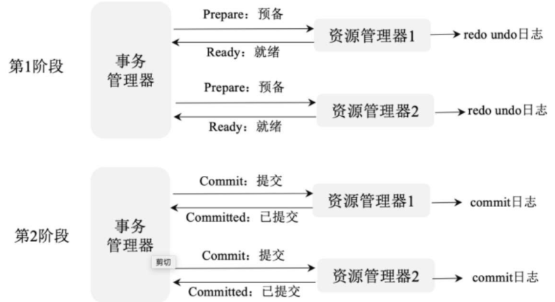

### 两阶段提交的缺点

两阶段提交的缺点如下。

◎ 同步阻塞问题：在执行过程中，所有参与者的任务都是阻塞执行的。

◎ 单点故障：所有请求都需要经过协调者，在协调者发生故障时，所有参与者都会被阻塞。

◎ 数据不一致：在二阶段提交的第2阶段，在协调者向参与者发送Commit（提交）请求后发生了局部网络异常，或者在发送Commit请求过程中协调者发生了故障，导致只有一部分参与者接收到Commit请求，于是整个分布式系统出现了数据不一致的现象，这也被称为脑裂。

◎ 协调者宕机后事务状态丢失：协调者在发出Commit消息之后宕机，唯一接收到这条消息的参与者也宕机，即使协调者通过选举协议产生了新的协调者，这条事务的状态也是不确定的，没有人知道事务是否已被提交。


### 三阶段提交协议

三阶段提交（Three-Phase Commit），也叫作三阶段提交协议（Three-PhaseCommit Protocol），是二阶段提交（2PC）的改进版本。具体改进如下。

◎ 引入超时机制：在协调者和参与者中引入超时机制，如果协调者长时间接收不到参与者的反馈，则认为参与者执行失败。

◎ 在第1阶段和第2阶段都加入一个预准备阶段，以保证在最后的任务提交之前各参与节点的状态是一致的。也就是说，除了引入超时机制，三阶段提交协议（3PC）把两阶段提交协议（2PC）的准备阶段再次一分为二，这样三阶段提交就有CanCommit、PreCommit、DoCommit三个阶段。

#### 1．CanCommit阶段

协调者向参与者发送Commit请求，参与者如果可以提交就返回Yes响应，否则返回No响应。

#### 2．PreCommit阶段

协调者根据参与者的反应来决定是否继续进行，有以下两种可能。

◎ 假如协调者从所有参与者那里获得的反馈都是Yes响应，就预执行事务。

◎ 假如有任意参与者向协调者发送了No响应，或者在等待超时之后协调者都没有接收到参与者的响应，则执行事务的中断。

#### 3．DoCommit阶段

该阶段进行真正的事务提交，主要包括：协调者发送提交请求，参与者提交事务，参与者响应反馈（在事务提交完之后向协调者发送Ack响应），协调者确定完成事务

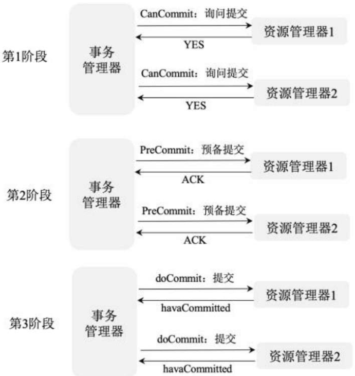

### 分布式数据库事务

#### 传统事务

传统事务遵循ACID原则，即原子性、一致性、隔离性和持久性。

◎ 原子性：事务是包含一系列操作的原子操作，事务的原子性确保这些操作全部完成或者全部失败。

◎ 一致性：事务执行的结果必须使数据库从不一致性状态转为一致性状态。保证数据库的一致性指在事务完成时，必须使所有数据都有一致的状态。

◎ 隔离性：因为可能在相同的数据集上同时有许多事务要处理，所以每个事务都应该与其他事务隔离，避免数据被破坏。

◎ 持久性：一旦事务完成，其结果就应该能够承受任何系统的错误，比如在事务提交过程中服务器的电源被切断等。在通常情况下，事务的结果被写入持续性存储中。

#### 柔性事务

BASE理论是CAP理论的延伸，包括基本可用（Basically Available）、柔性状态（Soft State）、最终一致性（Eventual Consistency）三个原则，并基于这三个原则设计出了柔性事务。

我们通常所说的柔性事务分为：两阶段型、补偿型、异步确保型、最大努力通知型。

两阶段型事务指分布式事务的两阶段提交，对应技术上的XA和JTA/JTS，是分布式环境下事务处理的典型模式。

两阶段型事务指分布式事务的两阶段提交，对应技术上的XA和JTA/JTS，是分布式环境下事务处理的典型模式。


# 分布式缓存

为了加快系统的访问速度，往往会选择把数据缓存在内存中，这样用户再次访问数据时直接从内存中获取数据即可，不用频繁查询数据库，这不但缩短了系统的访问时间，还有效降低了数据库的负载

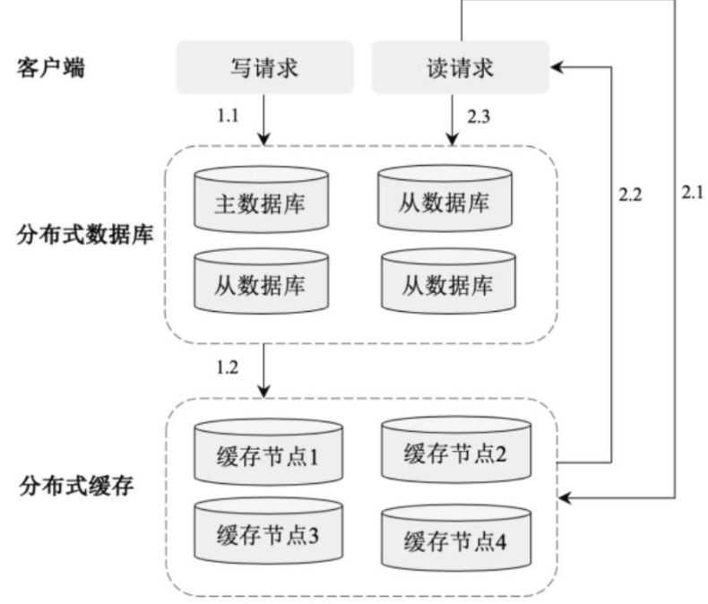


## Ehcache的原理及应用

Ehcache是基于Java实现的高效缓存框架，其内部采用多线程实现，采用LinkedHashMap存储元素，同时支持将数据持久化到物理磁盘上。

## Ehcache的特点

（1）快速：Ehcache内部采用多线程机制实现，数据存取性能高。

（2）轻量：Ehcache的安装包大小只有1.6MB，可以被快速、方便地继承到系统中。

（3）可伸缩：Ehcache缓存在内存和硬盘的存储可以伸缩到数几十GB，可轻松应对大数据场景。

（4）操作灵活：Ehcache提供了丰富的API接口，可实现基于主键、条件进行数据读取等。同时，Ehcache支持在运行时修改缓存配置（存活时间、空闲时间、内存的最大数据、磁盘的最大数量），提高了系统维护的灵活性。

（5）支持多种淘汰算法：Ehcache支持最近最少被使用、最少被使用和先进先出缓存策略。

（6）支持持久化：Ehcache支持将缓存数据持久化到磁盘上，在机器重启后从磁盘上重新加载缓存数据。

## Ehcache的架构

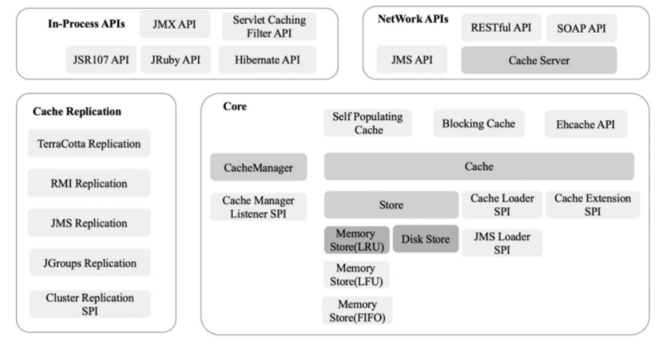

Ehcache在架构上由Cache Replication、In-Process API和Core组成。其中，Cache Replication存储缓存副本；In-Process API封装操作缓存数据的API，包括Hibernate API、JMX API、Servlet Cacheing Filter API等；Core是Ehcache的核心部分，包括用于管理缓存的CacheManger、用于存储缓存的Store和用于操作缓存的Cache API等；NetWork APIs提供RESTful API、SOAP API等Web API接口

## Ehcache的存储方式

Ehcache的存储方式包括堆存储、堆外存储和磁盘存储。

（1）堆存储：将缓存数据存储在Java堆内存中，其特点是存取速度快，但容量有限。

（2）堆外存储：基于NIO的DirectByteBuffers实现，将缓存数据存储在堆外内存上。其特点是比磁盘存取速度快，而且不受GC的影响，可以保证响应时间的稳定性，在内存分配上开销比堆内存大，而且要求必须以字节数组方式存储，因此对象必须在存储过程中进行序列化，对读取操作则进行反序列化，数据存取速度比堆内存慢一个数量级。

（3）磁盘存储：将数据存储在磁盘上，保障服务重启后内存数据能够重新从磁盘上加载，其读取效率最低，是内存数据持久化的一种方式。

# Redis的原理及应用

Redis是一个开源（BSD许可）的内存中的数据结构存储系统，可以用作数据库、缓存和消息中间件，支持多种类型的数据结构，例如String（字符串）、Hash（散列）、List（列表）、Set（集合）、ZSet（有序集合）、Bitmap（位图）、HyperLogLog（超级日志）和Geospatial（地理空间）。Redis内置了复制、Lua脚本、LRU驱动事件、事务和不同级别的磁盘持久化，并通过Redis哨兵（Sentinel）模式和集群模式（Cluster）提供高可用性（High Availability）。

## Redis的原理

#### Redis的数据类型

Redis支持String、Hash、List、Set、ZSet、Bitmap、HyperLogLog和Geospatial这8种数据类型。

String:String是Redis基本的数据类型，一个key对应一个value。String类型的值最大能存储512MB数据。

Hash:Redis Hash是一个键值（key->value）对集合。

List:Redis List是简单的字符串列表，按照插入顺序排序。我们可以添加一个元素到列表的头部（左边）或者尾部（右边）。列表最多可存储 $2^31-1$（4294967295≈4亿多）个元素。

Set:Set是String类型的无序集合。集合是通过散列表实现的，所以添加、删除、查找的复杂度都是O(1)。

ZSet:Redis ZSet和Set一样也是String类型元素的集合，且不允许有重复的成员，不同的是，每个元素都会关联一个double类型的分数。Redis正是通过分数来为集合中的成员进行从小到大的排序的。

Bitmap：通过操作二进制位记录数据。

HyperLogLog：被用于估计一个Set中元素数量的概率性的数据结构。

Geospatial：用于地理空间关系计算

## Redis 管道

Redis是基于请求/响应协议的TCP服务。在客户端向服务器发送一个查询请求后，需要监听Socket的返回，该监听过程一直阻塞，直到服务器有结果返回。由于Redis集群是部署在多个服务器上的，所以Redis的请求/响应模型在每次请求时都要跨网络在不同的服务器之间传输数据，这样每次查询都存在一定的网络延迟（服务器之间的网络延迟一般在20ms左右）。由于服务器一般采用多线程处理业务，并且内存操作效率很高，所以如果一次请求延迟20ms，则多次请求的网络延迟会不断累加。也就是说，在分布式环境下，Redis的性能瓶颈主要体现在网络延迟上。

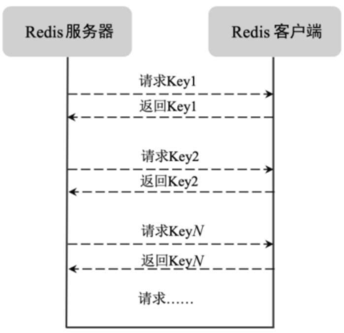

Redis的管道技术指在服务端未响应时，客户端可以继续向服务端发送请求，并最终一次性读取所有服务端的响应。管道技术能减少客户端和服务器交互的次数，将客户端的请求批量发送给服务器，服务器针对批量数据分别查询并统一回复，能显著提高Redis的性能。

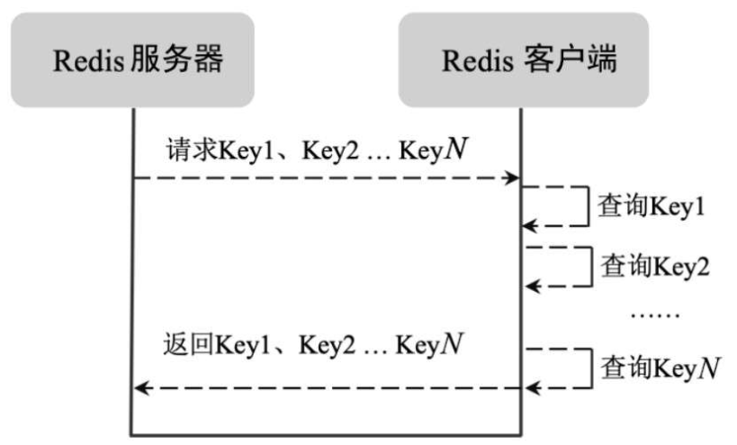


## Redis的事务

Redis支持分布式环境下的事务操作，其事务可以一次执行多个命令，事务中的所有命令都会序列化地顺序执行。事务在执行过程中，不会被其他客户端发送来的命令请求打断。服务器在执行完事务中的所有命令之后，才会继续处理其他客户端的其他命令。Redis的事务操作分为**开启事务**、**命令入队列**、**执行事务**三个阶段。

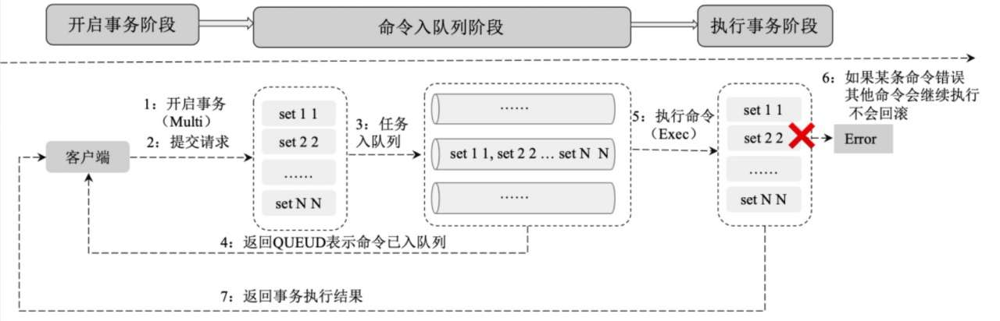

## Redis发布、订阅

Redis发布、订阅是一种消息通信模式：发送者（Pub）向频道（Channel）发送消息，订阅者（Sub）接收频道上的消息。Redis客户端可以订阅任意数量的频道，发送者也可以向任意频道发送数据。

## Redis集群数据复制的原理

Redis提供了复制功能，可以实现在主数据库（Master）中的数据更新后，自动将更新的数据同步到从数据库（Slave）。一个主数据库可以拥有多个从数据库，而一个从数据库只能拥有一个主数据库。

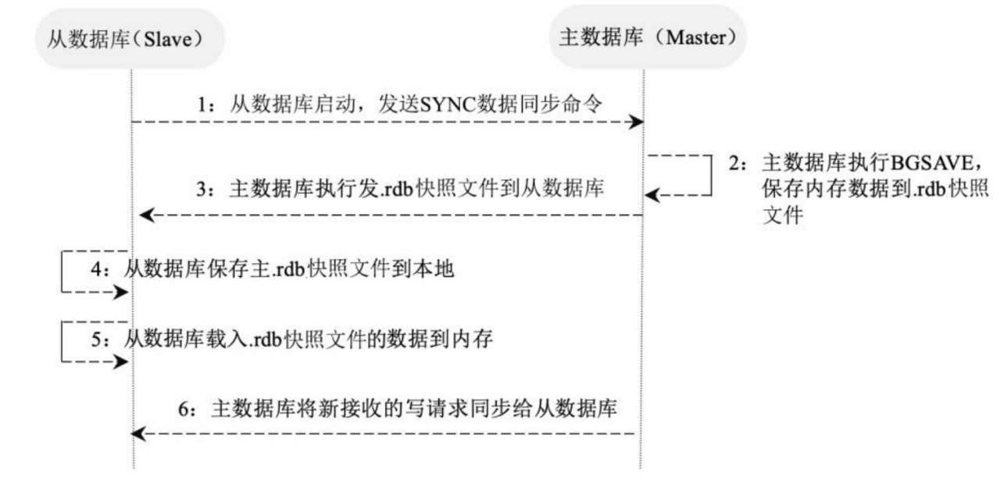

## Redis的持久化

Redis支持RDB和AOF两种持久化方式。

（1）RDB（Redis DataBase）:RDB在指定的时间间隔内对数据进行快照存储。RDB的特点在于：文件格式紧凑，方便进行数据传输和数据恢复；在保存．rdb快照文件时父进程会fork出一个子进程，由子进程完成具体的持久化工作，所以可以最大化Redis的性能；同时，与AOF相比，在恢复大的数据集时会更快一些。

（2）AOF（Append Of Flie）:AOF记录对服务器的每次写操作，在Redis重启时会重放这些命令来恢复原数据。AOF命令以Redis协议追加和保存每次写操作到文件末尾，Redis还能对AOF文件进行后台重写，使得AOF文件的体积不至于过大。AOF的特点有：可以使用不同的fsync策略（无fsync、每秒fsync、每次写的时候fsync），只有某些操作追加命令到文件中，操作效率高；同时，AOF文件是日志的格式，更容易被操作。

## Redis的集群模式及工作原理

Redis有三种集群模式：主从模式、哨兵模式和集群模式。

#### 主从模式

所有的写请求都被发送到主数据库上，再由主数据库将数据同步到从数据库上。主数据库主要用于执行写操作和数据同步，从数据库主要用于执行读操作缓解系统的读压力。

Redis的一个主库可以拥有多个从库，从库还可以作为其他数据库的主库。

#### 哨兵模式

在主从模式上添加了一个哨兵的角色来监控集群的运行状态。哨兵通过发送命令让Redis服务器返回其运行状态。哨兵是一个独立运行的进程，在监测到Master宕机时会自动将Slave切换成Master，然后通过发布与订阅模式通知其他从服务器修改配置文件，完成主备热切。

#### 集群模式

Redis集群实现了在多个Redis节点之间进行数据分片和数据复制。基于Redis集群的数据自动分片能力，我们能够方便地对Redis集群进行横向扩展，以提高Redis集群的吞吐量。基于Redis集群的数据复制能力，在集群中的一部分节点失效或者无法进行通信时，Redis仍然可以基于副本数据对外提供服务，这提高了集群的可用性。


Redis集群遵循如下原则。

◎ 所有Redis节点彼此都通过PING-PONG机制互联，内部使用二进制协议优化传输速度和带宽。

◎ 在集群中超过半数的节点检测到某个节点Fail后将该节点设置为Fail状态。

◎ 客户端与Redis节点直连，客户端连接集群中任何一个可用节点即可对集群进行操作。

◎ Redis-Cluster把所有的物理节点都映射到0～16383的slot（槽）上，Cluster负责维护每个节点上数据槽的分配。Redis的具体数据分配策略为：在Redis集群中内置了16384个散列槽；在需要在Redis集群中放置一个Key-Value时，Redis会先对Key使用CRC16算法算出一个结果，然后把结果对16384求余数，这样每个Key都会对应一个编号为0～16383的散列槽；Redis会根据节点的数量大致均等地将散列槽映射到不同的节点。

# 分布式缓存设计的核心问题

## 缓存预热

缓存预热指在用户请求数据前先将数据加载到缓存系统中，用户查询事先被预热的缓存数据，以提高系统查询效率。缓存预热一般有系统启动加载、定时加载等方式。

## 缓存更新

缓存更新指在数据发生变化后及时将变化后的数据更新到缓存中。常见的缓存更新策略有以下4种。

◎ 定时更新：定时将底层数据库内的数据更新到缓存中，该方法比较简单，适合需要缓存的数据量不是很大的应用场景。

◎ 过期更新：定时将缓存中过期的数据更新为最新数据并更新缓存的过期时间。

◎ 写请求更新：在用户有写请求时先写数据库同时更新缓存，这适用于用户对缓存数据和数据库的数据有实时强一致性要求的情况。

◎ 读请求更新：在用户有读请求时，先判断该请求数据的缓存是否存在或过期，如果不存在或已过期，则进行底层数据库查询并将查询结果更新到缓存中，同时将查询结果返回给用户。

## 缓存淘汰策略

在缓存数据过多时需要使用某种淘汰算法决定淘汰哪些数据。常用的淘汰算法有以下几种。

◎ FIFO（First In First Out，先进先出）：判断被存储的时间，离目前最远的数据优先被淘汰。

◎ LRU（Least Recently Used，最近最少使用）：判断缓存最近被使用的时间，距离当前时间最远的数据优先被淘汰。

◎ LFU（Least Frequently Used，最不经常使用）：在一段时间内，被使用次数最少的缓存优先被淘汰。

## 缓存雪崩

缓存雪崩指在同一时刻由于大量缓存失效，导致大量原本应该访问缓存的请求都去查询数据库，而对数据库的CPU和内存造成巨大压力，严重的话会导致数据库宕机，从而形成一系列连锁反应，使整个系统崩溃。一般有以下3种处理方法。

◎ 请求加锁：对于并发量不是很多的应用，使用请求加锁排队的方案防止过多请求数据库。

◎ 失效更新：为每一个缓存数据都增加过期标记来记录缓存数据是否失效，如果缓存标记失效，则更新数据缓存。

◎ 设置不同的失效时间：为不同的数据设置不同的缓存失效时间，防止在同一时刻有大量的数据失效。

## 缓存穿透

缓存穿透指由于缓存系统故障或者用户频繁查询系统中不存在（在系统中不存在，在自然数据库和缓存中都不存在）的数据，而这时请求穿过缓存不断被发送到数据库，导致数据库过载，进而引发一连串并发问题。

常用的解决缓存穿透问题的方法有布隆过滤器和cache null策略。

◎ 布隆过滤器：指将所有可能存在的数据都映射到一个足够大的Bitmap中，在用户发起请求时首先经过布隆过滤器的拦截，一个一定不存在的数据会被这个布隆过滤器拦截，从而避免对底层存储系统带来查询上的压力。

◎ cache null策略：指如果一个查询返回的结果为null（可能是数据不存在，也可能是系统故障），我们仍然缓存这个null结果，但它的过期时间会很短，通常不超过5分钟；在用户再次请求该数据时直接返回null，而不会继续访问数据库，从而有效保障数据库的安全。其实cache null策略的核心原理是：在缓存中记录一个短暂的（数据过期时间内）数据在系统中是否存在的状态，如果不存在，则直接返回null，不再查询数据库，从而避免缓存穿透到数据库上。

## 缓存降级

缓存降级指由于访问量剧增导致服务出现问题（如响应时间慢或不响应）时，优先保障核心业务的运行，减少或关闭非核心业务对资源的使用。常见的服务降级策略如下。

◎ 写降级：在写请求增大时，可以只进行Cache的更新，然后将数据异步更新到数据库中，保证最终一致性即可，即将写请求从数据库降级为Cache。

◎ 读降级：在数据库服务负载过高或数据库系统故障时，可以只对Cache进行读取并将结果返回给用户，在数据库服务正常后再去查询数据库，即将读请求从数据库降级为Cache。这种方式适用于对数据实时性要求不高的场景，保障了在系统发生故障的情况下用户依然能够访问到数据，只是访问到的数据相对有延迟。


# 设计模式

设计模式有7个原则：单一职责原则、开闭原则、里氏代换原则、依赖倒转原则、接口隔离原则、合成/聚合复用原则、迪米特法则


## 1.单一职责原则

单一职责原则又称单一功能原则，它规定一个类只有一个职责。如果有多个职责（功能）被设计在一个类中，这个类就违反了单一职责原则。

## 2.开闭原则

开闭原则规定软件中的对象（类、模块、函数等）对扩展开放，对修改封闭

## 3.里氏代换原则

里氏代换原则是对开闭原则的补充，规定了在任意父类可以出现的地方，子类都一定可以出现。实现开闭原则的关键就是抽象化，父类与子类的继承关系就是抽象化的具体表现，所以里氏代换原则是对实现抽象化的具体步骤的规范。

## 4.依赖倒转原则

依赖倒转原则指程序要依赖于抽象（Java中的抽象类和接口），而不依赖于具体的实现（Java中的实现类）。简单地说，就是要求对抽象进行编程，不要求对实现进行编程，这就降低了用户与实现模块之间的耦合度。

## 5.接口隔离原则

接口隔离原则指通过将不同的功能定义在不同的接口中来实现接口的隔离，这样就避免了其他类在依赖该接口（接口上定义的功能）时依赖其不需要的接口，可减少接口之间依赖的冗余性和复杂性。

## 6.合成/聚合复用原则

合成/聚合复用原则指通过在一个新的对象中引入（注入）已有的对象以达到类的功能复用和扩展的目的。它的设计原则是要尽量使用合成或聚合而不要使用继承来扩展类的功能。

## 迪米特法则

迪米特法则指一个对象尽可能少地与其他对象发生相互作用，即一个对象对其他对象应该有尽可能少的了解或依赖。其核心思想在于降低模块之间的耦合度，提高模块的内聚性。


设计模式按照其功能和使用场景可以分为三大类：创建型模式（CreationalPattern）、结构型模式（Structural Pattern）和行为型模式（BehavioralPattern）

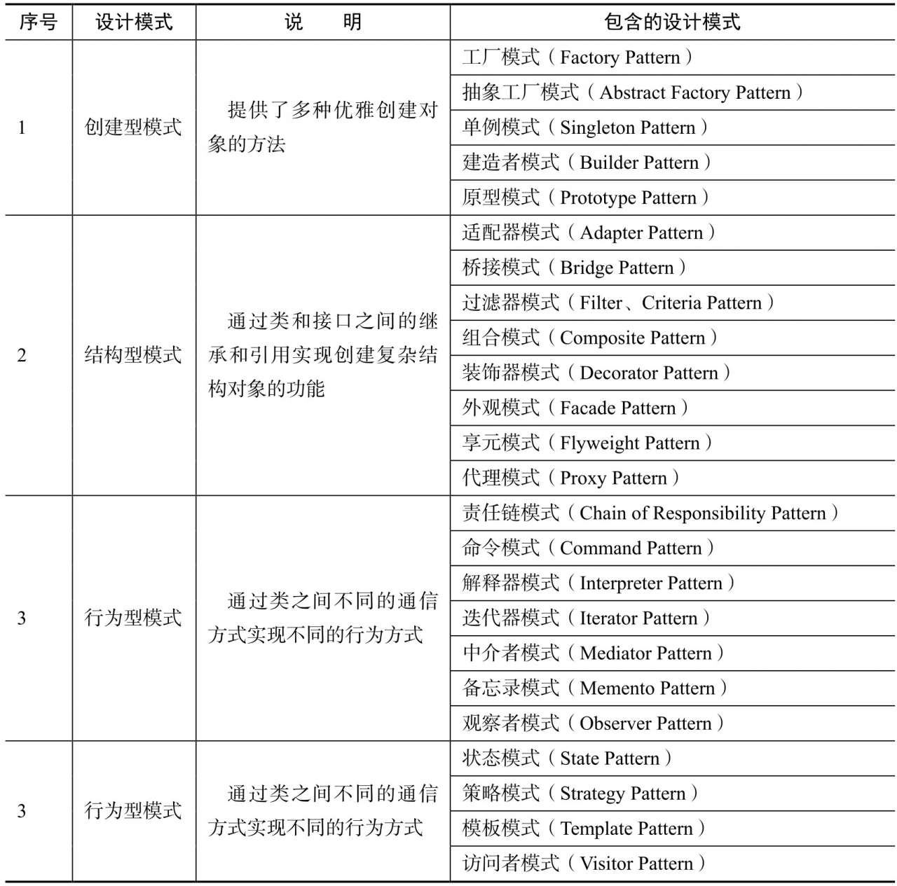

## 工厂模式

通俗地讲，工厂模式的本质就是用工厂方法代替new操作创建一种实例化对象的方式，以提供一种方便地创建有同种类型接口的产品的复杂对象。

## 抽象工厂模式

抽象工厂模式（Abstract Factory Pattern）在工厂模式上添加了一个创建不同工厂的抽象接口（抽象类或接口实现），该接口可叫作超级工厂。在使用过程中，我们首先通过抽象接口创建出不同的工厂对象，然后根据不同的工厂对象创建不同的对象。

## 单例模式

单例模式是保证系统实例唯一性的重要手段。单例模式首先通过将类的实例化方法私有化来防止程序通过其他方式创建该类的实例，然后通过提供一个全局唯一获取该类实例的方法帮助用户获取类的实例，用户只需也只能通过调用该方法获取类的实例。

单例模式的设计保证了一个类在整个系统中同一时刻只有一个实例存在，主要被用于一个全局类的对象在多个地方被使用并且对象的状态是全局变化的场景下。同时，单例模式为系统资源的优化提供了很好的思路，频繁创建和销毁对象都会增加系统的资源消耗，而单例模式保障了整个系统只有一个对象能被使用，很好地节约了资源。


单例模式的常见写法有懒汉模式（线程安全）、饿汉模式、静态内部类、双重校验锁

#### 懒汉模式（线程安全）

懒汉模式很简单：定义一个私有的静态对象instance，之所以定义instance为静态，是因为静态属性或方法是属于类的，能够很好地保障单例对象的唯一性；然后定义一个加锁的静态方法获取该对象，如果该对象为null，则定义一个对象实例并将其赋值给instance，这样下次再获取该对象时便能够直接获取了。

#### 饿汉模式

饿汉模式指在类中直接定义全局的静态对象的实例并初始化，然后提供一个方法获取该实例对象。懒汉模式和饿汉模式的最大不同在于，懒汉模式在类中定义了单例但是并未实例化，实例化的过程是在获取单例对象的方法中实现的，也就是说，在第一次调用懒汉模式时，该对象一定为空，然后去实例化对象并赋值，这样下次就能直接获取对象了；而饿汉模式是在定义单例对象的同时将其实例化的，直接使用便可。也就是说，在饿汉模式下，在Class Loader完成后该类的实例便已经存在于JVM中了

#### 静态内部类

静态内部类通过在类中定义一个静态内部类，将对象实例的定义和初始化放在内部类中完成，我们在获取对象时要通过静态内部类调用其单例对象。之所以这样设计，是因为**类的静态内部类在JVM中是唯一的**，这很好地保障了单例对象的唯一性

#### 双重校验锁

双锁模式指在懒汉模式的基础上做进一步优化，给静态对象的定义加上volatile锁来保障初始化时对象的唯一性，在获取对象时通过synchronized (Singleton.class)给单例类加锁来保障操作的唯一性。


## 建造者模式

建造者模式（Builder Pattern）使用多个简单的对象创建一个复杂的对象，用于将一个复杂的构建与其表示分离，使得同样的构建过程可以创建不同的表示，然后通过一个Builder类（该Builder类是独立于其他对象的）创建最终的对象。


建造者模式主要用于解决软件系统中复杂对象的创建问题，比如有些复杂对象的创建需要通过各部分的子对象用一定的算法构成，在需求变化时这些复杂对象将面临很大的改变，这十分不利于系统的稳定。但是，使用建造者模式能将它们各部分的算法包装起来，在需求变化后只需调整各个算法的组合方式和顺序，能极大提高系统的稳定性。建造者模式常被用于一些基本部件不会变而其组合经常变化的应用场景下。

注意，建造者模式与工厂模式的最大区别是，建造者模式更关注产品的组合方式和装配顺序，而工厂模式关注产品的生产本身。

建造者模式在设计时有以下几种角色。

◎ Builder：创建一个复杂产品对象的抽象接口。

◎ ConcreteBuilder:Builder接口的实现类，用于定义复杂产品各个部件的装配流程。

◎ Director：构造一个使用Builder接口的对象。

◎ Product：表示被构造的复杂对象。ConcreteBuilder定义了该复杂对象的装配流程，而Product定义了该复杂对象的结构和内部表示。

## 原型模式

原型模式指通过调用原型实例的Clone方法或其他手段来创建对象。原型模式属于创建型设计模式，它以当前对象为原型（蓝本）来创建另一个新的对象，而无须知道创建的细节。原型模式在Java中通常使用Clone技术实现，在JavaScript中通常使用对象的原型属性实现。

原型模式的Java实现很简单，只需原型类实现Cloneable接口并覆写clone方法即可。Java中的复制分为浅复制和深复制。

◎ 浅复制：Java中的浅复制是通过实现Cloneable接口并覆写其Clone方法实现的。在浅复制的过程中，对象的基本数据类型的变量值会重新被复制和创建，而引用数据类型仍指向原对象的引用。也就是说，浅复制不复制对象的引用类型数据。

◎ 深复制：在深复制的过程中，不论是基本数据类型还是引用数据类型，都会被重新复制和创建。简而言之，深复制彻底复制了对象的数据（包括基本数据类型和引用数据类型），浅复制的复制却并不彻底（忽略了引用数据类型）。

## 适配器模式

适配器模式（Adapter Pattern）通过定义一个适配器类作为两个不兼容的接口之间的桥梁，将一个类的接口转换成用户期望的另一个接口，使得两个或多个原本不兼容的接口可以基于适配器类一起工作。

适配器模式主要通过适配器类实现各个接口之间的兼容，该类通过依赖注入或者继承实现各个接口的功能并对外统一提供服务。

#### 类适配器模式

在需要不改变（或者由于项目原因无法改变）原有接口或类结构的情况下扩展类的功能以适配不同的接口时，可以使用类的适配器模式。适配器模式通过创建一个继承原有类（需要扩展的类）并实现新接口的适配器类来实现。

#### 对象适配器模式

对象适配器模式的思路和类适配器模式基本相同，只是修改了Adapter类。Adapter不再继承Source类，而是持有Source类的实例，以解决兼容性问题。

## 装饰者模式(在原先的类上加一个包装)

装饰者模式（Decorator Pattern）指在无须改变原有类及类的继承关系的情况下，动态扩展一个类的功能。它通过装饰者来包裹真实的对象，并动态地向对象添加或者撤销功能。装饰者模式包括Source和Decorator两种角色，Source是被装饰者，Decorator是装饰者。装饰者模式通过装饰者可以为被装饰者Source动态添加一些功能。

## 代理模式

代理模式指为对象提供一种通过代理的方式来访问并控制该对象行为的方法。在客户端不适合或者不能够直接引用一个对象时，可以通过该对象的代理对象来实现对该对象的访问，可以将该代理对象理解为客户端和目标对象之间的中介者。

在代理模式下有两种角色，一种是被代理者，一种是代理（Proxy），在被代理者需要做一项工作时，不用自己做，而是交给代理做。


## 外观模式

外观模式（Facade Pattern）也叫作门面模式，通过一个门面（Facade）向客户端提供一个访问系统的统一接口，客户端无须关心和知晓系统内部各子模块（系统）之间的复杂关系，其主要目的是降低访问拥有多个子系统的复杂系统的难度，简化客户端与其之间的接口。外观模式将子系统中的功能抽象成一个统一的接口，客户端通过这个接口访问系统，使得系统使用起来更加容易。


简单来说，外观模式就是将多个子系统及其之间的复杂关系和调用流程封装到一个统一的接口或类中以对外提供服务。这种模式涉及3种角色。

◎ 子系统角色：实现了子系统的功能。

◎ 门面角色：外观模式的核心，熟悉各子系统的功能和调用关系并根据客户端的需求封装统一的方法来对外提供服务。

◎ 客户角色：通过调用Facade来完成业务功能。

## 桥接模式

桥接模式（Bridge Pattern）通过将抽象及其实现解耦，使二者可以根据需求独立变化。这种类型的设计模式属于结构型模式，通过定义一个抽象和实现之间的桥接者来达到解耦的目的。

桥接模型主要用于解决在需求多变的情况下使用继承造成类爆炸的问题，扩展起来不够灵活。可以通过桥接模式将抽象部分与实现部分分离，使其能够独立变化而相互之间的功能不受影响。具体做法是通过定义一个桥接接口，使得实体类的功能独立于接口实现类，降低它们之间的耦合度。

## 组合模式（套娃？）

组合模式（Composite Pattern）又叫作部分整体模式，主要用于实现部分和整体操作的一致性。组合模式常根据树形结构来表示部分及整体之间的关系，使得用户对单个对象和组合对象的操作具有一致性。

组合模式通过特定的数据结构简化了部分和整体之间的关系，使得客户端可以像处理单个元素一样来处理整体的数据集，而无须关心单个元素和整体数据集之间的内部复杂结构。

## 享元模式（类似于池）

享元模式（Flyweight Pattern）主要通过对象的复用来减少对象创建的次数和数量，以减少系统内存的使用和降低系统的负载。享元模式属于结构型模式，在系统需要一个对象时享元模式首先在系统中查找并尝试重用现有的对象，如果未找到匹配的对象，则创建新对象并将其缓存在系统中以便下次使用。

享元模式主要用于避免在有大量对象时频繁创建和销毁对象造成系统资源的浪费，把其中共同的部分抽象出来，如果有相同的业务请求，则直接返回内存中已有的对象，避免重新创建。

## 策略模式（设置上下文？）

策略模式（Strategy Pattern）为同一个行为定义了不同的策略，并为每种策略都实现了不同的方法。在用户使用的时候，系统根据不同的策略自动切换不同的方法来实现策略的改变。同一个策略下的不同方法是对同一功能的不同实现，因此在使用时可以相互替换而不影响用户的使用。

策略模式的实现是在接口中定义不同的策略，在实现类中完成了对不同策略下具体行为的实现，并将用户的策略状态存储在上下文（Context）中来完成策略的存储和状态的改变。

## 模板方法模式（抽象类？）

模板方法（Template Method）模式定义了一个算法框架，并通过继承的方式将算法的实现延迟到子类中，使得子类可以在不改变算法框架及其流程的前提下重新定义该算法在某些特定环节的实现，是一种类行为型模式。

该模式在抽象类中定义了算法的结构并实现了公共部分算法，在子类中实现可变的部分并根据不同的业务需求实现不同的扩展。模板方法模式的优点在于其在父类（抽象类）中定义了算法的框架以保障算法的稳定性，同时在父类中实现了算法公共部分的方法来保障代码的复用；将部分算法部分延迟到子类中实现，因此子类可以通过继承的方式来扩展或重新定义算法的功能而不影响算法的稳定性，符合开闭原则。

模板方法模式需要注意抽象类与具体子类之间的协作，在具体使用时包含以下主要角色。

◎ 抽象类（Abstract Class）：定义了算法的框架，由基本方法和模板方法组成。基本方法定义了算法有哪些环节，模板方法定义了算法各个环节执行的流程。

◎ 具体子类（Concrete Class）：对在抽象类中定义的算法根据需求进行不同的实现。

## 观察者模式（发布-订阅）

观察者（Observer）模式指在被观察者的状态发生变化时，系统基于事件驱动理论将其状态通知到订阅其状态的观察者对象中，以完成状态的修改和事件传播。这种模式有时又叫作发布-订阅模式或者模型-视图模式。

观察者模式是一种对象行为型模式，观察者和被观察者之间的关系属于抽象耦合关系，主要优点是在观察者与被观察者之间建立了一套事件触发机制，以降低二者之间的耦合度。

观察者模式的主要角色如下。

◎ 抽象主题（Subject）：持有订阅了该主题的观察者对象的集合，同时提供了增加、删除观察者对象的方法和主题状态发生变化后的通知方法。

◎ 具体主题（Concrete Subject）：实现了抽象主题的通知方法，在主题的内部状态发生变化时，调用该方法通知订阅了主题状态的观察者对象。

◎ 抽象观察者（Observer）：观察者的抽象类或接口，定义了主题状态发生变化时需要调用的方法。

◎ 具体观察者（Concrete Observer）：抽象观察者的实现类，在收到主题状态变化的信息后执行具体的触发机制。


## 迭代器模式

迭代器（Iterator）模式提供了顺序访问集合对象中的各种元素，而不暴露该对象内部结构的方法。

Java中的集合就是典型的迭代器模式，比如HashMap，在我们需要遍历HashMap时，通过迭代器不停地获取Next元素就可以循环遍历集合中的所有元素。

迭代器模式将遍历集合中所有元素的操作封装成迭代器类，其目的是在不暴露集合对象内部结构的情况下，对外提供统一访问集合的内部数据的方法。迭代器的实现一般包括一个迭代器，用于执行具体的遍历操作；以及一个Collection，用于存储具体的数据。


## 责任链模式（多米诺一个接着一个）

责任链（Chain of Responsibility）模式也叫作职责链模式，用于避免请求发送者与多个请求处理者耦合在一起，让所有请求的处理者持有下一个对象的引用，从而将请求串联成一条链，在有请求发生时，可将请求沿着这条链传递，直到遇到该对象的处理器。

在责任链模式下，用户只需将请求发送到责任链上即可，无须关心请求的处理细节和传递过程，所以责任链模式优雅地将请求的发送和处理进行了解耦。

责任链模式在Web请求中很常见，比如我们要为客户端提供一个REST服务，服务端要针对客户端的请求实现用户鉴权、业务调用、结果反馈流程，就可以使用责任链模式实现。

责任链模式包含以下三种角色。

◎ Handler接口：用于规定在责任链上具体要执行的方法。

◎ AbstractHandler抽象类：持有Handler实例并通过setHandler()和getHandler()将各个具体的业务Handler串联成一个责任链，客户端上的请求在责任链上执行。

◎ 业务Handler：用户根据具体的业务需求实现的业务逻辑。

## 命令模式

命令（Command）模式指将请求封装为命令基于事件驱动异步地执行，以实现命令的发送者和命令的执行者之间的解耦，提高命令发送、执行的效率和灵活度。

命令模式将命令调用者与命令执行者解耦，有效降低系统的耦合度。同时，由于命令调用者和命令执行者进行了解耦，所以增加和删除（回滚）命令变得非常方便。

命令模式包含以下主要角色。

◎ 抽象命令类（Command）：执行命令的接口，定义执行命令的抽象方法execute()。

◎ 具体命令类（Concrete Command）：抽象命令类的实现类，持有接收者对象，并在接收到命令后调用命令执行者的方法action()实现命令的调用和执行。

◎ 命令执行者（Receiver）：命令的具体执行者，定义了命令执行的具体方法action()。

◎ 命令调用者（Invoker）：接收客户端的命令并异步执行。


## 备忘录模式（类似于系统还原，先搞一个快照，想回来的时候直接替换现在的）

备忘录（Memento）模式又叫作快照模式，该模式将当前对象的内部状态保存到备忘录中，以便在需要时能将该对象的状态恢复到原先保存的状态。

备忘录模式提供了一种保存和恢复状态的机制，常用于快照的记录和状态的存储，在系统发生故障或数据发生不一致时能够方便地将数据恢复到某个历史状态。

备忘录模式的核心是设计备忘录类及用于管理备忘录的管理者类，其主要角色如下。

◎ 发起人（Originator）：记录当前时刻对象的内部状态，定义创建备忘录和恢复备忘录数据的方法。

◎ 备忘录（Memento）：负责存储对象的内部状态。

◎ 状态管理者（Storage）：对备忘录的历史状态进行存储，定义了保存和获取备忘录状态的功能。注意，备忘录只能被保存或恢复，不能进行修改。

## 状态模式

状态模式指给对象定义不同的状态，并为不同的状态定义不同的行为，在对象的状态发生变换时自动切换状态的行为。

状态模式是一种对象行为型模式，它将对象的不同行为封装到不同的状态中，遵循了“单一职责”原则。同时，状态模式基于对象的状态将对象行为进行了明确的界定，减少了对象行为之间的相互依赖，方便系统的扩展和维护。

状态模式把受环境改变的对象行为包装在不同的状态对象里，用于让一个对象在其内部状态改变时，行为也随之改变。具体的角色如下。

◎ 环境（Context）：也叫作上下文，用于维护对象当前的状态，并在对象状态发生变化时触发对象行为的变化。

◎ 抽象状态（AbstractState）：定义了一个接口，用于定义对象中不同状态所对应的行为。

◎ 具体状态（Concrete State）：实现抽象状态所定义的行为。

## 访问者模式

访问者（Visitor）模式指将数据结构和对数据的操作分离开来，使其在不改变数据结构的前提下动态添加作用于这些元素上的操作。它将数据结构的定义和数据操作的定义分离开来，符合“单一职责”原则。访问者模式通过定义不同的访问者实现对数据的不同操作，因此在需要给数据添加新的操作时只需为其定义一个新的访问者即可。

访问者模式是一种对象行为型模式，主要特点是将数据结构和作用于结构上的操作解耦，使得集合的操作可自由地演化而不影响其数据结构。它适用于数据结构稳定但是数据操作方式多变的系统中。

访问者模式实现的关键是将作用于元素的操作分离出来封装成独立的类，包含以下主要角色。

◎ 抽象访问者（Visitor）：定义了一个访问元素的接口，为每类元素都定义了一个访问操作visit()，该操作中的参数类型对应被访问元素的数据类型。

◎ 具体访问者（ConcreteVisitor）：抽象访问者的实现类，实现了不同访问者访问到元素后具体的操作行为。

◎ 抽象元素（Element）：元素的抽象表示，定义了访问该元素的入口的accept()方法，不同的访问者类型代表不同的访问者。

◎ 具体元素（Concrete Element）：实现抽象元素定义的accept()操作，并根据访问者的不同类型实现不同的业务逻辑。

## 中介者模式

中介者（Mediator）模式指对象和对象之间不直接交互，而是通过一个名为中介者的角色来实现对象之间的交互，使原有对象之间的关系变得松散，且可以通过定义不同的中介者来改变它们之间的交互。中介者模式又叫作调停模式，是迪米特法则的典型应用。

中介者模式属于对象行为型模式，其主要特点是将对象与对象之间的关系变为对象和中介者之间的关系，降低了对象之间的耦合性，提高了对象功能的复用性和系统的灵活性，使得系统易于维护和扩展。

中介者模式包含以下主要角色。

◎ 抽象中介者（Mediator）：中介者接口，定义了注册同事对象方法和转发同事对象信息的方法。

◎ 具体中介者（Concrete Mediator）：中介者接口的实现类，定义了一个List来保存同事对象，协调各个同事角色之间的交互关系。

◎ 抽象同事类（Colleague）：定义同事类的接口，持有中介者对象，并定义同事对象交互的抽象方法，同时实现同事类的公共方法和功能。

◎ 具体同事类（Concrete Colleague）：抽象同事类的实现者，在需要与其他同事对象交互时，通过中介者对象来完成。

## 解释器模式

解释器（Interpreter）模式给定一种语言，并定义该语言的语法表示，然后设计一个解析器来解释语言中的语法，这种模式常被用于SQL解析、符号处理引擎等。解释器模式包含以下主要角色。

◎ 抽象表达式（Abstract Expression）：定义解释器的接口，约定解释器所包含的操作，比如interpret()方法。

◎ 终结符表达式（Terminal Expression）：抽象表达式的子类，用来定义语法中和终结符有关的操作，语法中的每一个终结符都应有一个与之对应的终结表达式。

◎ 非终结符表达式（Nonterminal Expression）：抽象表达式的子类，用来定义语法中和非终结符有关的操作，语法中的每条规则都有一个非终结符表达式与之对应。

◎ 环境（Context）：定义各个解释器需要的共享数据或者公共的功能。