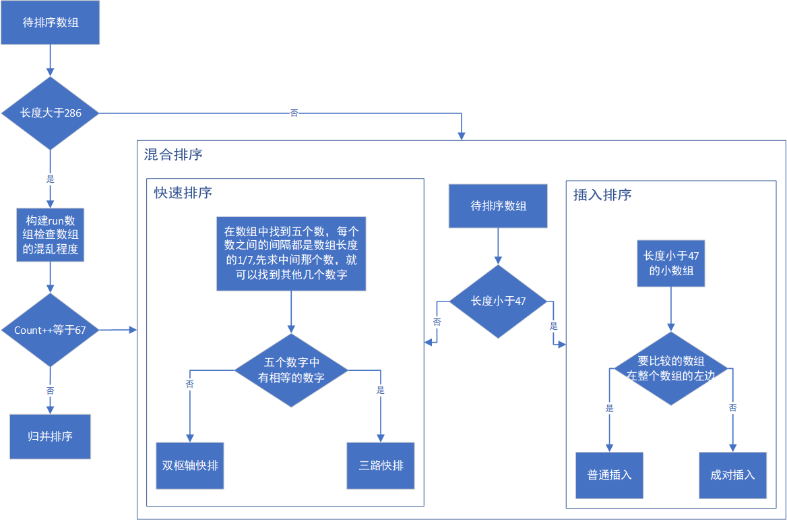

<!--将该代码放入博客模板的head中即可-->
<script type="text/x-mathjax-config">
MathJax.Hub.Config({
tex2jax: {
  inlineMath: [['$','$'], ['\\(','\\)']],
  processEscapes: true
  }
});
</script>
<!--latex数学显示公式-->
<script type="text/javascript" src="https://cdn.mathjax.org/mathjax/latest/MathJax.js?config=TeX-AMS-MML_HTMLorMML"></script>


## Arrays.sort源码阅读

Java数组和List对象的排序方法分别是Arrays.sort(T[] a)和Collections.sort(List<T> list)，分别位于java.util.Arrays和java.util.Collections类中. 由于List底层采用数组实现，因此Collections.sort方法也是通过调用Arrays.sort方法实现的。

Arrays.sort方法源码很简单，对于**基本数据类型的就是调用了DualPivotQuicksort.sort方法**,**对于对象类型的调用归并排序**。

## DualPivotQuicksort.sort（）方法的流程



- 如果长度小于`QUICKSORT_THRESHOLD(286)`，则采用非归并排序

  - 如果长度小于`INSERTION_SORT_THRESHOLD(47)`，则采用插入排序

    - 最左区间（以初始left开始的区间） `leftmost`：普通插入排序
    - 否则：`pair insertion sort`

  - 否则，快速排序

    - 将数组划分为`7`段（大约），然后找出第`2、3、4、5、6`段的右端点对应的位置

    - 对这`5`个位置上的数字进行插入排序，作为枢轴的候选

    - 如果`5`个数都不相等

      - 选取排序后的`2、4`作为枢轴，进行双枢轴排序`Dual-Pivot Quicksort`

      - 效果：

        ```
        left part         center part                  right part
        +----------------------------------------------------------+
        | == pivot1 |  pivot1 < && < pivot2  |    ?    | == pivot2 |
        +----------------------------------------------------------+
        ```

      - 排序后如果，中间部分元素过多，可能原因是等于pivort1和等于pivort2的元素过多，则将其调整为：

        ```
        left part         center part                  right part
        +----------------------------------------------------------+
        | == pivot1 |  pivot1 < && < pivot2  |    ?    | == pivot2 |
        +----------------------------------------------------------+
        ```

    - 否则，进行普通快速排序，枢轴排序后为第3个元素

- 否则，考虑`Timsort`(归并排序的优化版本，对一会升序、一会降序的混合情况处理比较好)

  - 创建`Timsort run`数组，大小为`MAX_RUN_COUNT(67) + 1`

    - `a[run[i]] ~ a[run[i + 1]]`之间为升序数组

    - 检查当前待排序数组是否适合使用`Timsort`,即`run`数组中升序数组个数，如果个数不小于`MAX_RUN_COUNT`

      则认为数组内元素排序比较混乱，适合非归并排序

      - 注：对于连续下降的元素会将其调整为连续上升

  - 如果通过上述检测，则进行归并排序

## DualPivotQuicksort源码阅读


```java

final class DualPivotQuicksort {
    // 防止初始化
    private DualPivotQuicksort() {}

    // 待合并序列的最大数量
    private static final int MAX_RUN_COUNT = 67;
    // 待合并序列的最大长度
    private static final int MAX_RUN_LENGTH = 33;
    // 如果要排序的数组长度大于这个长度优先使用归并排序，如果小于这个常数，使用快排
    private static final int QUICKSORT_THRESHOLD = 286;
    // 如果长度小于这个值优先使用插入排序
    private static final int INSERTION_SORT_THRESHOLD = 47;
    // 如果长度小于这个值优先使用计数排序byte
    private static final int COUNTING_SORT_THRESHOLD_FOR_BYTE = 29;
    private static final int COUNTING_SORT_THRESHOLD_FOR_SHORT_OR_CHAR = 3200;

    /*
     * Sorting methods for seven primitive types.
     */

    /**
     * Sorts the specified range of the array using the given
     * workspace array slice if possible for merging
     *
     * @param a the array to be sorted
     * @param left the index of the first element, inclusive, to be sorted
     * @param right the index of the last element, inclusive, to be sorted
     * @param work a workspace array (slice)
     * @param workBase origin of usable space in work array
     * @param workLen usable size of work array
     */
    static void sort(int[] a, int left, int right,
                     int[] work, int workBase, int workLen) {
        // Use Quicksort on small arrays
        // 对于小于快排阈值的小数组,优先使用双枢轴快排
        if (right - left < QUICKSORT_THRESHOLD) {
            sort(a, left, right, true);
            return;
        }

        // run[i] 意味着第i个有序数列开始的位置，（升序或者降序）
        int[] run = new int[MAX_RUN_COUNT + 1];
        // 此时count=0,run[0]=left;
        int count = 0; run[0] = left;
        // k=left,run[0]=left

        // Check if the array is nearly sorted
        // 检查数组是不是已经有序的了
        for (int k = left; k < right; run[count] = k) {
            // 如果当前的数字是升序的,一直移动左指针,直到不是升序或者是左指针到右边界为止.
            if (a[k] < a[k + 1]) { // ascending
                while (++k <= right && a[k - 1] <= a[k]);
            }// 如果当前的数字是降序的,一直移动左指针,直到不是降序或者是左指针到右边界为止.
            else if (a[k] > a[k + 1]) { // descending
                while (++k <= right && a[k - 1] >= a[k]);
                // 一开始count=0,run[0]=left,run[0]-1是当前排序序列的前一个index
                // 因为需要升序排序,把前面那一段的降序序列头尾交换,转换成升序序列
                for (int lo = run[count] - 1, hi = k; ++lo < --hi; ) {
                    int t = a[lo]; a[lo] = a[hi]; a[hi] = t;
                }
            } else { // equal
                // 如果当前序列中相同的数字的数量等于最大归并长度，直接使用快排？？？？看不懂，不明白为啥这样操作
                for (int m = MAX_RUN_LENGTH; ++k <= right && a[k - 1] == a[k]; ) {
                    if (--m == 0) {
                        sort(a, left, right, true);
                        return;
                    }
                }
            }

            // 这个++count在循环里面,所以循环每执行一次这里的count都会执行一次,如果count的值大于最大待合并的序列的数量,
            // 说明该数组是杂乱无章的,直接对数组进行快排
            if (++count == MAX_RUN_COUNT) {
                sort(a, left, right, true);
                // 该函数执行结束
                return;
            }
        }

        // Check special cases
        // Implementation note: variable "right" is increased by 1.
        if (run[count] == right++) { // The last run contains one element
            run[++count] = right;
        }
        // 如果上面的循环执行完毕后只执行了一次,说明数组是有序的
        // (因为上面的循环检查是否有序,如果有序,一次循环就执行完毕了),函数直接结束
        else if (count == 1) { // The array is already sorted
            return;
        }

        // Determine alternation base for merge
        byte odd = 0;
        for (int n = 1; (n <<= 1) < count; odd ^= 1);

        // Use or create temporary array b for merging
        int[] b;                 // temp array; alternates with a
        int ao, bo;              // array offsets from 'left'
        int blen = right - left; // space needed for b
        if (work == null || workLen < blen || workBase + blen > work.length) {
            work = new int[blen];
            workBase = 0;
        }
        if (odd == 0) {
            System.arraycopy(a, left, work, workBase, blen);
            b = a;
            bo = 0;
            a = work;
            ao = workBase - left;
        } else {
            b = work;
            ao = 0;
            bo = workBase - left;
        }

        // Merging
        // 归并
        // 最外层循环，直到count为1，也就是栈中待合并的序列只有一个的时候，标志归并成功
        // a 做原始数组，b 做临时数组
        for (int last; count > 1; count = last) {
            for (int k = (last = 0) + 2; k <= count; k += 2) {
                int hi = run[k], mi = run[k - 1];
                for (int i = run[k - 2], p = i, q = mi; i < hi; ++i) {
                    if (q >= hi || p < mi && a[p + ao] <= a[q + ao]) {
                        b[i + bo] = a[p++ + ao];
                    } else {
                        b[i + bo] = a[q++ + ao];
                    }
                }
                run[++last] = hi;
            }
            // 如果栈的长度为奇数，那么把最后落单的有序数列copy过对面
            if ((count & 1) != 0) {
                for (int i = right, lo = run[count - 1]; --i >= lo;
                    b[i + bo] = a[i + ao]
                );
                run[++last] = right;
            }
            int[] t = a; a = b; b = t;
            int o = ao; ao = bo; bo = o;
        }
    }

    // 快排实现(双枢轴快排和三路快排)
    private static void sort(int[] a, int left, int right, boolean leftmost) {
        int length = right - left + 1;

        // Use insertion sort on tiny arrays
        // 如果长度小于使用插入排序的阈值,使用插入排序
        // 对小数组使用插入排序
        if (length < INSERTION_SORT_THRESHOLD) {
            // 代表要比较的序列位于数组最左边
            if (leftmost) {
                /*
                 * Traditional (without sentinel) insertion sort,
                 * optimized for server VM, is used in case of
                 * the leftmost part.
                 */
                // 直接插入排序
                for (int i = left, j = i; i < right; j = ++i) {
                    int ai = a[i + 1];
                    while (ai < a[j]) {
                        a[j + 1] = a[j];
                        if (j-- == left) {
                            break;
                        }
                    }
                    a[j + 1] = ai;
                }
            } else {
                //  代表要比较的序列位于数组最左边
                /*
                 * Skip the longest ascending sequence.
                 */
                do {
                    if (left >= right) {
                        return;
                    }
                } while (a[++left] >= a[left - 1]);

                /*
                 * Every element from adjoining part plays the role
                 * of sentinel, therefore this allows us to avoid the
                 * left range check on each iteration. Moreover, we use
                 * the more optimized algorithm, so called pair insertion
                 * sort, which is faster (in the context of Quicksort)
                 * than traditional implementation of insertion sort.
                 */
                // 成对的插入排序 
                for (int k = left; ++left <= right; k = ++left) {
                    int a1 = a[k], a2 = a[left];

                    if (a1 < a2) {
                        a2 = a1; a1 = a[left];
                    }
                    while (a1 < a[--k]) {
                        a[k + 2] = a[k];
                    }
                    a[++k + 1] = a1;

                    while (a2 < a[--k]) {
                        a[k + 1] = a[k];
                    }
                    a[k + 1] = a2;
                }
                int last = a[right];

                while (last < a[--right]) {
                    a[right + 1] = a[right];
                }
                a[right + 1] = last;
            }
            return;
        }

        // 粗略的计算将数组分为7段,每段的长度
        // length/8+length/64+1
        int seventh = (length >> 3) + (length >> 6) + 1;

        /**
         *  下面的图示将数组划分为了7个部分,e3对应第四部分
         *  为什么要提取出这7个index呢?
         *  通过这7个index估计数组的混乱程度,如果这7个index对应的数字存在相等的值,说明混乱程度比较小
         *                      e1          e2          e3          e4          e5
         *                     |            |           |           |           |
         * ---------------------------------------------------------------------------------------
         * |            |           |           |           |           |           |           |
         * --------------------------------------------------------------------------------------
         *
         */
        /*
         * Sort five evenly spaced elements around (and including) the
         * center element in the range. These elements will be used for
         * pivot selection as described below. The choice for spacing
         * these elements was empirically determined to work well on
         * a wide variety of inputs.
         */
        int e3 = (left + right) >>> 1; // The midpoint
        int e2 = e3 - seventh;
        int e1 = e2 - seventh;
        int e4 = e3 + seventh;
        int e5 = e4 + seventh;

        // Sort these elements using insertion sort
        // 对这几个元素进行插入排序(因为就5个元素,不使用循环了,不适用循环估计是为了提升性能),从小到大的顺序
        //////////////////////////////////////////////////////////////////////////////
        if (a[e2] < a[e1]) { int t = a[e2]; a[e2] = a[e1]; a[e1] = t; }

        if (a[e3] < a[e2]) { int t = a[e3]; a[e3] = a[e2]; a[e2] = t;
            if (t < a[e1]) { a[e2] = a[e1]; a[e1] = t; }
        }
        if (a[e4] < a[e3]) { int t = a[e4]; a[e4] = a[e3]; a[e3] = t;
            if (t < a[e2]) { a[e3] = a[e2]; a[e2] = t;
                if (t < a[e1]) { a[e2] = a[e1]; a[e1] = t; }
            }
        }
        if (a[e5] < a[e4]) { int t = a[e5]; a[e5] = a[e4]; a[e4] = t;
            if (t < a[e3]) { a[e4] = a[e3]; a[e3] = t;
                if (t < a[e2]) { a[e3] = a[e2]; a[e2] = t;
                    if (t < a[e1]) { a[e2] = a[e1]; a[e1] = t; }
                }
            }
        }
        //////////////////////////////////////////////////////////////////////////////

        // Pointers
        int less  = left;  // The index of the first element of center part
        int great = right; // The index before the first element of right part
        // 如果这五个数字各不相同,那么使用两个枢轴的快排
        if (a[e1] != a[e2] && a[e2] != a[e3] && a[e3] != a[e4] && a[e4] != a[e5]) {
            /*
             * Use the second and fourth of the five sorted elements as pivots.
             * These values are inexpensive approximations of the first and
             * second terciles of the array. Note that pivot1 <= pivot2.
             */
            // 选则第二大和第四大的元素作为哨兵
            int pivot1 = a[e2];
            int pivot2 = a[e4];

            /*
             * The first and the last elements to be sorted are moved to the
             * locations formerly occupied by the pivots. When partitioning
             * is complete, the pivots are swapped back into their final
             * positions, and excluded from subsequent sorting.
             */
            a[e2] = a[left];
            a[e4] = a[right];

            /*
             * Skip elements, which are less or greater than pivot values.
             */
            // 跳过有序的元素,找到第一个左边的值大于左边的哨兵,右边的值小于右边的哨兵
            while (a[++less] < pivot1);
            while (a[--great] > pivot2);

            /*
             * Partitioning:
             *
             *   left part           center part                   right part
             * +--------------------------------------------------------------+
             * |  < pivot1  |  pivot1 <= && <= pivot2  |    ?    |  > pivot2  |
             * +--------------------------------------------------------------+
             *               ^                          ^       ^
             *               |                          |       |
             *              less                        k     great
             *
             * Invariants:
             *
             *              all in (left, less)   < pivot1
             *    pivot1 <= all in [less, k)     <= pivot2
             *              all in (great, right) > pivot2
             *
             * Pointer k is the first index of ?-part.
             */
            outer:
            for (int k = less - 1; ++k <= great; ) {
                // ak是当前序列中左边最后一个小于pivot1的元素
                int ak = a[k];
                if (ak < pivot1) { // Move a[k] to left part
                    // a[k]变成了左边第一个大于pivot1的元素
                    a[k] = a[less];
                    /*
                     * Here and below we use "a[i] = b; i++;" instead
                     * of "a[i++] = b;" due to performance issue.
                     */
                    // a[less]是小于pivot1的元素
                    a[less] = ak;
                    ++less;
                } else if (ak > pivot2) { // Move a[k] to right part
                    while (a[great] > pivot2) {
                        if (great-- == k) {
                            break outer;
                        }
                    }
                    if (a[great] < pivot1) { // a[great] <= pivot2
                        a[k] = a[less];
                        a[less] = a[great];
                        ++less;
                    } else { // pivot1 <= a[great] <= pivot2
                        a[k] = a[great];
                    }
                    /*
                     * Here and below we use "a[i] = b; i--;" instead
                     * of "a[i--] = b;" due to performance issue.
                     */
                    a[great] = ak;
                    --great;
                }
            }

            // Swap pivots into their final positions
            a[left]  = a[less  - 1]; a[less  - 1] = pivot1;
            a[right] = a[great + 1]; a[great + 1] = pivot2;

            // Sort left and right parts recursively, excluding known pivots
            // 对左边和pivot1之间的序列递归执行快排
            sort(a, left, less - 2, leftmost);
            // 对pivot2和right之间的序列递归执行快排
            sort(a, great + 2, right, false);
            // 对左右两边处理后处理两个pivot中间的部分

            /*
             * If center part is too large (comprises > 4/7 of the array),
             * swap internal pivot values to ends.
             */
            // 如果中心区域太大，超过数组长度的 4/7,就先进行预处理，再参与递归排序。
            // 预处理的方法是把等于pivot1的元素统一放到左边，
            // 等于pivot2的元素统一放到右边,
            // 最终产生一个不包含pivot1和pivot2的数列，再拿去参与快排中的递归。
            if (less < e1 && e5 < great) {
                /*
                 * Skip elements, which are equal to pivot values.
                 */
                while (a[less] == pivot1) {
                    ++less;
                }

                while (a[great] == pivot2) {
                    --great;
                }

                /*
                 * Partitioning:
                 *
                 *   left part         center part                  right part
                 * +----------------------------------------------------------+
                 * | == pivot1 |  pivot1 < && < pivot2  |    ?    | == pivot2 |
                 * +----------------------------------------------------------+
                 *              ^                        ^       ^
                 *              |                        |       |
                 *             less                      k     great
                 *
                 * Invariants:
                 *
                 *              all in (*,  less) == pivot1
                 *     pivot1 < all in [less,  k)  < pivot2
                 *              all in (great, *) == pivot2
                 *
                 * Pointer k is the first index of ?-part.
                 */
                outer:
                for (int k = less - 1; ++k <= great; ) {
                    int ak = a[k];
                    if (ak == pivot1) { // Move a[k] to left part
                        a[k] = a[less];
                        a[less] = ak;
                        ++less;
                    } else if (ak == pivot2) { // Move a[k] to right part
                        while (a[great] == pivot2) {
                            if (great-- == k) {
                                break outer;
                            }
                        }
                        if (a[great] == pivot1) { // a[great] < pivot2
                            a[k] = a[less];
                            /*
                             * Even though a[great] equals to pivot1, the
                             * assignment a[less] = pivot1 may be incorrect,
                             * if a[great] and pivot1 are floating-point zeros
                             * of different signs. Therefore in float and
                             * double sorting methods we have to use more
                             * accurate assignment a[less] = a[great].
                             */
                            a[less] = pivot1;
                            ++less;
                        } else { // pivot1 < a[great] < pivot2
                            a[k] = a[great];
                        }
                        a[great] = ak;
                        --great;
                    }
                }
            }
            // 执行中间部分的快排
            // Sort center part recursively
            sort(a, less, great, false);

        } else { // Partitioning with one pivot
            // 如果这五个值中有相等的值,使用三路快排
            /*
             * Use the third of the five sorted elements as pivot.
             * This value is inexpensive approximation of the median.
             */
            // 选取中间大小的那个值作为pivot,进行三路快排,也就是有一个pivot的快速排序(平常见到的)
            int pivot = a[e3];

            /*
             * Partitioning degenerates to the traditional 3-way
             * (or "Dutch National Flag") schema:
             *
             *   left part    center part              right part
             * +-------------------------------------------------+
             * |  < pivot  |   == pivot   |     ?    |  > pivot  |
             * +-------------------------------------------------+
             *              ^              ^        ^
             *              |              |        |
             *             less            k      great
             *
             * Invariants:
             *
             *   all in (left, less)   < pivot
             *   all in [less, k)     == pivot
             *   all in (great, right) > pivot
             *
             * Pointer k is the first index of ?-part.
             */
            for (int k = less; k <= great; ++k) {
                if (a[k] == pivot) {
                    continue;
                }
                int ak = a[k];
                if (ak < pivot) { // Move a[k] to left part
                    a[k] = a[less];
                    a[less] = ak;
                    ++less;
                } else { // a[k] > pivot - Move a[k] to right part
                    while (a[great] > pivot) {
                        --great;
                    }
                    if (a[great] < pivot) { // a[great] <= pivot
                        a[k] = a[less];
                        a[less] = a[great];
                        ++less;
                    } else { // a[great] == pivot
                        /*
                         * Even though a[great] equals to pivot, the
                         * assignment a[k] = pivot may be incorrect,
                         * if a[great] and pivot are floating-point
                         * zeros of different signs. Therefore in float
                         * and double sorting methods we have to use
                         * more accurate assignment a[k] = a[great].
                         */
                        a[k] = pivot;
                    }
                    a[great] = ak;
                    --great;
                }
            }

            /*
             * Sort left and right parts recursively.
             * All elements from center part are equal
             * and, therefore, already sorted.
             */
            // 对左右部分递归的调用快排
            sort(a, left, less - 1, leftmost);
            sort(a, great + 1, right, false);
        }
    }
```

## 那么Arrays.sort()是不是稳定的呢?

下面内容引用自 Java 官方文档。

**双轴快速排序(快排不是稳定的排序)**

`public static void sort(int[] a, int fromIndex, int toIndex)`

The sorting algorithm is a Dual-Pivot Quicksort by Vladimir Yaroslavskiy, Jon Bentley, and Joshua Bloch. This algorithm offers O(n log(n)) performance on all data sets, and is typically faster than traditional (one-pivot) Quicksort implementations.

之所以基本类型使用快速排序，因为对于基本类型来说，比较函数不支持自定义的比较器，因此在常规顺序下，是否稳定排序是结果上没差别的，就直接快速排序了。

**归并排序(稳定的排序)**

`public static void sort(Object[] a, int fromIndex, int toIndex)`

Implementation note: This implementation is **a stable, adaptive, iterative mergesort** that requires far fewer than n lg(n) comparisons when the input array is partially sorted, while offering the performance of a traditional mergesort when the input array is randomly ordered. If the input array is nearly sorted, the implementation requires approximately n comparisons. Temporary storage requirements vary from a small constant for nearly sorted input arrays to n/2 object references for randomly ordered input arrays.

**稳定的，自适应的，迭代的归并排序，而且在数组部分有序的时候，需要的比较次数远小于 $O\left(n\log n\right)$。**

**Java归并排序的算法实现:**

```java
    /** To be removed in a future release. */
    private static void legacyMergeSort(Object[] a,
                                        int fromIndex, int toIndex) {
        Object[] aux = copyOfRange(a, fromIndex, toIndex);
        mergeSort(aux, a, fromIndex, toIndex, -fromIndex);
    }

    /**
     * Tuning parameter: list size at or below which insertion sort will be
     * used in preference to mergesort.
     * To be removed in a future release.
     */
    private static final int INSERTIONSORT_THRESHOLD = 7;

    /**
     * Src is the source array that starts at index 0
     * Dest is the (possibly larger) array destination with a possible offset
     * low is the index in dest to start sorting
     * high is the end index in dest to end sorting
     * off is the offset to generate corresponding low, high in src
     * To be removed in a future release.
     */
    @SuppressWarnings({"unchecked", "rawtypes"})
    private static void mergeSort(Object[] src,
                                  Object[] dest,
                                  int low,
                                  int high,
                                  int off) {
        int length = high - low;

        // Insertion sort on smallest arrays
        if (length < INSERTIONSORT_THRESHOLD) {
            for (int i=low; i<high; i++)
                for (int j=i; j>low &&
                         ((Comparable) dest[j-1]).compareTo(dest[j])>0; j--)
                    swap(dest, j, j-1);
            return;
        }

        // Recursively sort halves of dest into src
        int destLow  = low;
        int destHigh = high;
        low  += off;
        high += off;
        int mid = (low + high) >>> 1;
        mergeSort(dest, src, low, mid, -off);
        mergeSort(dest, src, mid, high, -off);

        // If list is already sorted, just copy from src to dest.  This is an
        // optimization that results in faster sorts for nearly ordered lists.
        if (((Comparable)src[mid-1]).compareTo(src[mid]) <= 0) {
            System.arraycopy(src, low, dest, destLow, length);
            return;
        }

        // Merge sorted halves (now in src) into dest
        for(int i = destLow, p = low, q = mid; i < destHigh; i++) {
            if (q >= high || p < mid && ((Comparable)src[p]).compareTo(src[q])<=0)
                dest[i] = src[p++];
            else
                dest[i] = src[q++];
        }
    }

    /**
     * Swaps x[a] with x[b].
     */
    private static void swap(Object[] x, int a, int b) {
        Object t = x[a];
        x[a] = x[b];
        x[b] = t;
    }
```


`public static <T extends Comparable<? super T>> void sort(List<T> list)`

Sorts the specified list into ascending order, according to the natural ordering of its elements. All elements in the list must implement the Comparable interface. Furthermore, all elements in the list must be mutually comparable (that is, e1.compareTo(e2) must not throw a ClassCastException for any elements e1 and e2 in the list).
This sort is guaranteed to be stable: equal elements will not be reordered as a result of the sort.

The specified list must be modifiable, but need not be resizable.

这里没有明确说明排序算法，因为 List 有不同的 implementation，如果是 ArrayList，则是调用 Arrays.sort 来使用 TimSort 或者 LegacyMergeSort；如果是 LinkedList，则是将内部转为 Object[] 后再调用 Arrays.sort，总之都是稳定的。以下两个代码片段，前者是 LinkedList，后者是 ArrayList。

# Collections.sort()

```java
default void sort(Comparator<? super E> c) {
    Object[] a = this.toArray();
    Arrays.sort(a, (Comparator) c);
    ListIterator<E> i = this.listIterator();
    for (Object e : a) {
        i.next();
        i.set((E) e);
    }
}
```


>参考文献
>https://zongwenlong.github.io/2017/01/06/Java-SourceCode-Sort/
>
>https://blog.csdn.net/lyj1597374034/article/details/106720629
>
>https://www.sakuratears.top/blog/%E6%8E%92%E5%BA%8F%E7%AE%97%E6%B3%95%EF%BC%88%E4%B9%9D%EF%BC%89-Java%E6%BA%90%E7%A0%81%E4%B8%AD%E7%9A%84DualPivotQuicksort.html#%E5%A4%8D%E6%9D%82%E5%BA%A6%E6%83%85%E5%86%B5
>
>https://leetcode-cn.com/circle/discuss/YrzXxb/view/mSPXh5/