<!--将该代码放入博客模板的head中即可-->
<script type="text/x-mathjax-config">
MathJax.Hub.Config({
tex2jax: {
  inlineMath: [['$','$'], ['\\(','\\)']],
  processEscapes: true
  }
});
</script>
<!--latex数学显示公式-->
<script type="text/javascript" src="https://cdn.mathjax.org/mathjax/latest/MathJax.js?config=TeX-AMS-MML_HTMLorMML"></script>
[toc]

> 别人的操作系统知识整理
>
> https://wizardforcel.gitbooks.io/wangdaokaoyan-os/content/1.html

## 计算机组成

### 运算器、控制器、存储器、输入设备和输出设备

（1）运算器。运算器是计算机的数据加工处理部件，它的主要功能是进行算术运算和逻辑运算。运算器通常由算术逻辑运算部件（Arithmetic Logical Unit，ALU）、通用寄存器组或累加器以及数据传送逻辑电路等组成

（2）控制器。控制器是统一指挥和控制计算机各部件工作的中央机构，它的主要功能是按照人们预先确定的操作步骤，控制整个计算机的各部件协调地进行工作。控制器主要由指令部件、时序部件、控制信号形成部件组成

（3）存储器。存储器是计算机用来存放程序和数据的部件，具有“记忆”功能。它的基本功能是按照指定的存储位置“读出”或“写入”信息。

（4）输入设备。功能就是将它们转换成计算机能够识别的电信号，并将这些电信号存放到计算机的存储器中。

（5）输出设备。其功能是将计算机中用代码描述的处理结果转换成人类认识的符号进行输出。

### 总线

将计算机基本组成的5个部件，用一组导线按照某种方式连接起来，就构成了计算机的硬件系统，这一组导线称为**总线（Bus）**，其中包括**地址总线**、**数据总线**和**控制总线**。

#### 单总线结构

用单一的一组总线将计算机的5大部件连接起来，使每个部件都可以通过该总线与另一个部件通信，这就是单总线结构。这种结构的优点是结构简单，成本低，便于扩充。缺点是总线负载大，分时使用导致信息传输速率受到限制，因此只用在小型计算机或微型计算机中。

#### 双总线结构

单总线的数据传输速度受到限制，影响了整个计算机的工作效率。为了解决这一问题，可以采用双总线结构，这样在同一时刻，可以使用两条总线并行工作，提高了计算机的工作速度。

#### 多总线结构

为了计算机系统功能的扩大和工作效率的提高，我们采用了多总线结构。虽然多总线结构可以提高主机和外设的并行工作能力，但是在设计与实现上增加了难度和成本。


## 冯·诺依曼的基本思想

二进制数由两个不同的符号“1”、“0”组合表示。**数据和指令在代码的外形上没有区别，都是由“1”和“0”组成的代码序列，只是各自约定的含义不同而已。**

存储程序工作方式是冯·诺依曼思想的核心内容。

## 操作系统的主要功能及评价指标

操作系统是计算机系统的资源管理者，合理地组织计算机工作流程，并为用户提供一个良好的工作环境和友好的接口。

#### 功能

1.处理机管理

2.存储管理

3.设备管理

4.文件管理

5.用户接口

#### 评价指标

1.可靠性

2.方便性

3.效率

4.可维护性

5.可移植性

## 操作系统的类型

单用户操作系统、多道批处理系统、分时系统、实时系统、网络操作系统、分布式操作系统和嵌入式操作系统。

## CPU相关


### CPU的功能

1.指令控制

2.操作控制

3.时间控制

4.数据加工
### CPU的组成

#### 控制器
##### 控制器的功能
控制器最基本的功能有两个：一是控制指令执行的顺序；二是控制每条指令的具体执行。
（1）控制指令执行的顺序。为了控制指令的执行顺序，CPU中设置了指令地址寄存器PC（即程序计数器），用它来存放指令的地址。在执行一条指令的同时，必须形成后续指令的地址，以便程序能继续运行。
（2）控制指令的具体执行：①从存储器取出指令。②分析和执行指令。
#### 运算器
运算器由算术逻辑单元（ALU）、累加寄存器（AC）、数据缓冲寄存器（DR）和状态条件寄存器（PSW）组成
#### 运算器的功能
（1）执行所有的算术运算
（2）执行所有的逻辑运算

#### 寄存器
CPU中一般设置两类寄存器：通用寄存器和控制类寄存器。


## 进程管理

**进程是资源分配的基本单位。**

**线程是独立调度的基本单位。**

（1）进程是一个可拥有资源的独立单位。

（2）进程同时又是一个可以独立调度和分配的基本单位。

（1）创建进程。系统在创建进程时，必须为其分配其所必需的、除处理机以外的所有资源。例如，内存空间、I/O设备以及建立相应的PCB。

（2）撤销进程。系统在撤销进程时，又必须先对这些资源进行回收操作，然后再撤销PCB。

（3）进程切换。在对进程进行切换时，由于要保留当前进程的CPU环境和设置新选中进程的CPU环境，为此需要花费不少处理机时间。

### 进程的几个特征
动态性、并发性、独立性、异步性、结构特征（PCB）
### 进程的三种基本状态（重要）
（1）**就绪状态。**进程已获得了除处理机以外的所有资源，一旦获得处理机就可以立即执行，此时进程所处的状态为就绪状态。在系统中处于就绪状态的进程一般有多个，通常把这些进程排成一个队列组织起来，队列的排列次序一般按照进程优先级的大小来排序。
（2）**运行状态。**当一个进程获得必要的资源并正在处理机上执行时，该进程所处的状态即为运行状态。在单处理机的系统中，只有一个进程处于运行状态。在多处理机的系统中，则可能有多个进程处于运行状态，但处于运行状态的进程数一定小于或等于处理机的个数。
（3）**阻塞状态。**阻塞状态又称等待状态。正在执行的进程，由于发生某事件而无法往下继续执行（如等待输入/输出完成），此时进程所处的状态为阻塞状态。当进程处于阻塞状态时，即使把处理机分配给该进程，它也无法运行。所以阻塞进程不能参加竞争处理机。一般情况下，系统根据进程等待事件的原因不同，将进程排列成多个等待队列。

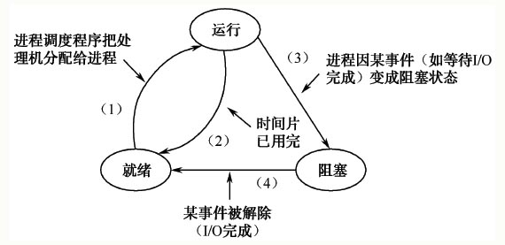


**（1）就绪状态→运行状态**。处于就绪状态的进程，它已具备了运行的条件，但由于未能获得处理机，故仍然不能运行。

**（2）运行状态→就绪状态。**这种状态变化通常出现在分时操作系统中，正在运行的进程由于规定的运行时间片用完而使系统发出超时中断请求，超时中断处理程序把该进程的状态修改为就绪状态，根据其自身的特征而插入到就绪队列的适当位置，保存进程现场信息，收回处理机并转入进程调度程序。于是，正在运行的进程就由运行状态变为就绪状态。

**（3）运行状态→阻塞状态。**处于运行状态的进程能否继续运行，除了受时间限制外，还受其他种种因素的影响。例如运行中的进程需要等待文件的输入（或其他进程同步操作的影响）时，控制便自动转入系统控制程序，通过信息管理程序及设备管理程序进行文件输入；在输入过程中这个进程并不恢复到运行状态，而是由运行状态变成阻塞状态（同时，标记阻塞原因，并保留当前进程现场信息），然后控制转入进程调度程序。

**（4）阻塞状态→就绪状态。**被阻塞的进程在其被阻塞的原因获得解除后，并不能立即投入运行，因为，也许还有其他进程在等待处理机，于是将其状态由阻塞变成就绪，以等待处理机，仅当进程调度程序把处理机再次分配给它时，才可恢复当时阻塞前的现场继续运行。

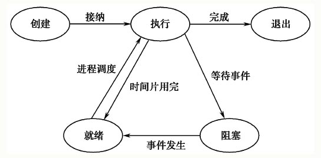

### 进程的创建状态和退出状态

（1）创建状态。进程正在创建之中，还不能运行，此时进程所处的状态为创建状态。操作系统在创建进程时，要为进程分配PCB结构，填写相关内容；为进程分配进程组，连接进程的父子关系；为进程分配所需的资源；为进程建立地址空间，填写有关管理内存的表格；加载程序等。

当就绪队列接纳新创建的进程时，操作系统把处于创建状态的进程移入就绪队列，此时，进程从创建状态转化为就绪状态。

（2）退出状态。进程已正常或异常结束，释放了除进程控制块之外的其他资源，此时进程所处状态为退出状态。处于退出状态的进程仍然暂时停留在系统中，以便让其他相关进程从该退出进程的PCB中收集有关信息。例如，记账进程要了解该进程占用了多少CPU时间，使用了哪些类型的资源，以便记账。另外还要将退出代码传递给其父进程等。

当进程已经完成了预期的任务，或者发生某事件，如出现地址越界、非法指令等错误而被异常终止时，进程将由运行状态转化为退出状态。

###  进程的挂起状态

进入挂起状态的原因：

（1）系统有时可能出现故障或某些功能受到破坏。这时就需要暂时将系统中的进程挂起，以便系统将故障消除后，再把这些进程恢复到原来状态。
（2）用户检查自己作业的中间执行情况和中间结果时，因与预期想法不符而产生怀疑，这时用户要求挂起他的进程，以便进行某些检查和改正。
（3）系统中有时负荷过重（进程数过多），资源数相对不足，从而造成系统效率下降。此时需要挂起一部分进程以调整系统负荷，等系统中负荷减轻后再将被挂起进程恢复运行。
（4）在操作系统中引入了虚拟存储管理技术后，需要区分进程是驻留在内存还是外存，此时可以用挂起表示驻留在外存。

### 进程控制块（PCB）

系统根据PCB而感知进程的存在，**PCB是进程存在的唯一标志。**

PCB包含一个进程的描述信息、控制信息及资源信息，有些系统中还有进程调度等待所使用的现场保护区。PCB集中反映一个进程的动态特征。

#### 1、描述信息

（1）进程名或进程标识号。
（2）用户名或用户标识号。
（3）家族关系。

#### 2、控制信息

（1）进程当前状态。
（2）进程优先级。
（3）程序开始地址。
（4）各种计时信息。
（5）通信信息。

#### 3、资源管理信息

（1）占用内存大小及其管理用数据结构指针。例如，内存管理中所用到的进程页表指针等。
（2）在某些复杂系统中，还有对换或覆盖用的有关信息。如对换程序段长度，对换外存地址等。这些信息在进程申请、释放内存时使用。
（3）共享程序段大小及起始地址。
（4）输入/输出设备的设备号、所要传送的数据长度、缓冲区地址、缓冲区长度及所用设备的有关数据结构指针等。这些信息在进程申请释放设备进行数据传输时使用。
（5）指向文件系统的指针及有关标识等。进程可使用这些信息对文件系统进行操作。

#### 4、CPU现场保护结构

## 进程控制（重要）

### 处理机状态(重要)

通常将处理机的执行状态分成两种：**核心态与用户态**。

（1）**核心态又称管态、系统态**，是操作系统管理程序执行时机器所处的状态。它具有较高的特权，能执行一切指令，访问所有的寄存器和存储区。

（2）**用户态又称目态**，是用户程序执行时机器所处的状态。这是具有较低特权的执行状态，只能执行规定的指令，访问指定的寄存器和存储区。

**I/O指令、置终端屏蔽指令、清内存、建存储保护、设置时钟指令（这几种记好，属于内核态）。**

#### 用户态切换到内核态的三种方式：

- **系统调用**
- **异常**
- **外围设备中断**

#### 内核的功能：

（1）进程（线程）管理（进程或者线程的调度）
（2）低级存储器管理（用户程序逻辑空间到内存空间的物理地址的变换）
（3）中断和陷入管理（中断和陷入）

**具体的：**

**（1）I/O指令、置终端屏蔽指令、清内存、建存储保护、设置时钟指令。**

**（2）中断、异常、陷入，比如缺页中断等**

**（3）进程（线程）管理**

**（4）系统调用，比如调用了设备驱动程序**

**（5）用户内存地址的转换（逻辑--->物理映射）**

一般情况下，把核心态下执行的某些具有特定功能的程序段称为原语。
原语可分为两类：一类是机器指令级的，其特点是执行期间不允许中断，正如在物理学中的原子一样。另一类是功能级的，其特点是作为原语的程序段不允许并发执行。

**原语和系统调用都能被进程所调用，两者的差别**：原语有不可中断性，原语是通过在其执行过程中关闭中断实现的，且一般由系统进程调用；而系统调用的功能可被用户态下运行的进程调用，


### 进程的创建与撤销

#### 进程创建

（1）由系统进程模块统一创建。
（2）由父进程创建。

由系统统一创建的进程之间的关系是平等的，它们之间一般不存在资源继承关系。而由父进程创建的进程之间则存在隶属关系，且互相构成树形结构的家族关系。属于某个家族的一个进程可以继承其父进程所拥有的资源。

#### 进程撤销

（1）该进程已完成所要求的功能而正常终止。
（2）由于某种错误导致非正常终止。
（3）祖先进程要求撤销某个子进程。

#### 进程的阻塞与唤醒

阻塞原语在一个进程期待某一事件（如键盘输入数据、写盘、等待其他进程发来数据等）发生，但发生条件尚不具备时，被该进程自己调用来阻塞自己。

唤醒一个进程有两种方法：一种是由系统进程唤醒；另一种是由事件发生进程唤醒。

#### 进程的挂起与激活

调用挂起原语的进程只能挂起它自己或它的子孙。

挂起的实现方式有多种：把发出挂起原语的进程自身挂起、挂起具有指定标识名的过程、把某进程及其全部或部分（如具有指定优先数的）子孙进程挂起。

激活原语使处于挂起状态的进程变成活动，即把挂起就绪状态变成活动就绪状态，把挂起阻塞状态变成活动阻塞状态。

激活方式：如激话一个具有指定标识名的进程，或者激活某进程及其所有的子孙进程。

## 线程
（1）线程是进程内的一个执行单元。
（2）线程是进程内的一个可调度实体。
（3）线程是程序（或进程）中相对独立的一个控制流序列。
（4）线程是执行的上下文，其含义是执行的现场数据和其他调度所需的信息（这种观点来自Linux系统）。

综上所述，将线程定义为：线程是进程内一个相对独立的、可调度的执行单元。线程自己基本上不拥有资源，只拥有一点在运行时必不可少的资源（如程序计数器、一组寄存器和栈），但它可以与同属一个进程的其他线程共享进程拥有的全部资源。

多线程是指一个进程中有多个线程，这些线程共享该进程资源。这些线程驻留在相同的地址空间中，共享数据和文件。如果一个线程修改了一个数据项，其他线程可以了解和使用此结果数据。一个线程打开并读一个文件时，同一进程中的其他线程也可以同时读此文件。

### 线程与进程的比较（重要）

#### 1、调度

在传统的操作系统中，拥有资源的基本单位和独立调度、分配的基本单位都是进程。而在引入线程的操作系统中，则把线程作为调度和分配的基本单位，而把进程作为资源拥有的基本单位，使传统进程的两个属性分开，线程便能轻装运行，从而可显著地提高系统的并发程度。在同一进程中，线程的切换不会引起进程的切换，在由一个进程中的线程切换到另一个进程中的线程时，将会引起进程的切换。

#### 2、并发性

在引入线程的操作系统中，不仅进程之间可以并发执行，而且在一个进程中的多个线程之间亦可并发执行，因而使操作系统具有更好的并发性，从而能更有效地使用系统资源和提高系统吞吐量。

#### 3、拥有资源

不论是传统的操作系统，还是设有线程的操作系统，进程都是拥有资源的一个独立单位，它可以拥有自己的资源。一般地说，线程自己不拥有资源（也有一点必不可少的资源），但它可以访问其隶属进程的资源。

#### 4、系统开销

由于在创建或撤销进程时，系统都要为之分配或回收资源，如内存空间、I/O设备等。因此，操作系统所付出的开销将显著地大于在创建或撤销线程时的开销。

类似地，在进行进程切换时，涉及整个当前进程CPU环境的保存以及新被调度运行进程的CPU环境设置。而线程切换只需保存和设置少量寄存器的内容，并不涉及存储器管理方面的操作。可见，进程切换的开销远大于线程切换的开销。此外，由于同一进程中的多个线程具有相同的地址空间，致使它们之间的同步和通信的实现也变得比较容易。在有的系统中，线程的切换、同步和通信都无须操作系统内核的干预。

## 进程同步与通信

进程之间的协作关系包括**互斥**、**同步**和**通信**。

**互斥**是指多个进程不能同时使用同一个资源。当某个进程使用某种资源时，其他进程必须等待。

**同步**是指多个进程中发生的事件存在着某种时序关系，某些进程的执行必须先于另一些进程。

**通信**是指多个进程之间要传递一定量的信息。

### 进程的交互

进程互斥是指由于共享资源所要求的排他性，进程之间要相互竞争，某个进程使用这种资源时，其他进程必须等待。

进程同步是指多个进程中发生的事件存在着某种时序关系，必须协同动作、相互配合，以共同完成一个任务。

进程通信是指多个进程之间要传递一定的信息。这种情况下，进程之间知道对方的程度最高，需要传递的信息量也最大。

### 临界资源与临界区

操作系统中将一次仅允许一个进程访问的资源称为临界资源（Critical Resource）。对临界资源，进程之间只能通过互斥的方式来共享这些资源。

操作系统中把并发进程中访问临界资源的那段代码称为临界区（Critical Section）。临界区也叫互斥区，是一个程序片段的集合，这些程序片段分散在不同的进程中，对某个共享的临界资源进行特定的操作。为实现对临界资源的互斥访问，应保证相关进程互斥地进入各自的临界区。

必须在临界区前面增加一段用于进行检查的代码，把这段代码称为**进入区（Enter Section）**。相应地，在临界区后面也要加上一段用于退出临界区的代码，称为**退出区（Exit Section）**，用于将临界区正被访问标识恢复为未被访问标识。进程中除去上述进入区、临界区和退出区之外的其他代码，称为**剩余区（Remainder Section）**。

### 临界区进入准则

为实现并发进程对临界资源的互斥访问，要求对临界区的使用，应遵循**“空进，忙等，让权等，不死等”**的原则。

**（1）空闲让进**。当没有进程处于临界区时，相应的临界资源处于空闲状态。这时，如果有一个进程申请使用该临界资源，则允许该进程进入自己的临界区访问临界资源。

**（2）忙则等待**。当已有进程处于临界区时，说明该进程正使用着相应的临界资源。此时，如果有其他进程试图进入自己的临界区，则它必须等待（阻塞状态），以保证对临界资源的互斥访问。

**（3）让权等待**。对于等待进入临界区的进程而言，既然它目前不能进入自己的临界区，它必须立即释放处理机，以避免降低处理机的利用率。

**（4）有限等待**。对要求进入临界区的进程，应能让它在有限时间内进入，以免陷入“死等”状态。

### 信号量和P/V操作

#### 信号量的定义

Dijkstra最初定义的信号量包含一个整型值s和一个等待队列s.queue，信号量只能通过两个原语P/V操作来访问它，信号量的定义为：

```c++
struct semaphore{
    int value;
    struct PCB *queue;
}
```

P原语所执行的操作可用下面的函数wait（s)来表示：

```c
void wait(semaphore s)
{
    s.value = s.value-1;
    if(s.value<0)
        block(s.queue);/*将进程阻塞，并将其投入等待队列s.queue*/
}
```

V原语所执行的操作可用下面的函数signal（s）来表示：

```c
void signal(semaphore s)
{
    s.value  = s.value+1;
    if(s.value<=0)
        wakeup(s.queue);
    /*唤醒阻塞进程，将其从等待队列s.queue取出，投入就绪队列*/
}
```

#### 信号量的物理意义

（1）在信号量机制中，信号量的初值s.value表示系统中某种资源的数目，因而又称为资源信号量。

（2）P操作意味着进程请求一个资源，因此描述为s.value=s.value-1；当s.value＜0时，表示资源已经分配完毕，因而进程中所申请的资源不能够满足，进程无法继续执行，所以进程执行block（s.queue）自我阻塞，放弃处理机，并插入等待该信号量的等待队列。

（3）V操作意味着进程释放一个资源，因此描述为s.value=s.value+1；当s.value＜=0时，表示在该信号量的等待队列中有等待该资源的进程被阻塞，故应调用wakeup（s.queue）原语将等待队列中的一个进程唤醒。

（4）当s.value＜0时，|s.value|表示等待队列的进程数。

#### 用信号量解决互斥问题

如果信号量的初值为1，表示仅允许一个进程访问临界区，此时的信号量转换为互斥信号量。P操作和V操作分别置于进入区和退出区

#### 用信号量解决同步问题

利用信号量可以实现进程之间的同步，即可以控制进程执行的先后次序。如果有两个进程P1和P2，要求P2必须在P1执行完毕之后才可以执行，则只需要设置一个信号量S，其初值为0，将V（S）操作放在进程P1的代码段C1后面，将P（S）操作放在进程P2的代码段C2前面

```
P1: C1;		P2:P(S)；
	V(S);		C2;
```

如果有4个并发执行的进程P1、P2、P3和P4，如图3.3所示。它们之间的关系是P1首先被执行；P1执行完毕P2、P3才能执行；而P4只有在P2执行完毕后才能执行。为了实现它们之间的同步关系，可以写出如下并发程序。

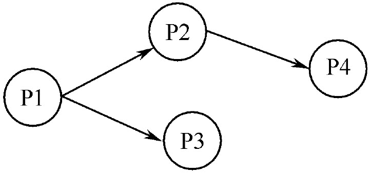

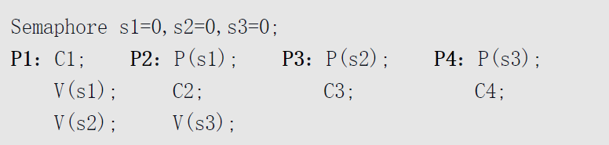

## 经典进程同步与互斥问题

### 生产者消费者问题

生产者—消费者问题是最著名的同步问题，它描述一组生产者（P1，…，Pm）向一组消费者（C1，…，Cq）提供产品。它们共享一个有界缓冲池，缓冲池是由若干个大小相等的缓冲区组成，每个缓冲区可以容纳一个产品。生产者向其中投放产品，消费者从中取得产品

假定缓冲池中有n个缓冲区（B0，B1，…，Bn－1）。由于缓冲池是临界资源，同一时刻它只允许一个生产者向其中投入产品，或者一个消费者从中取出产品。即生产者之间、生产者与消费者之间、消费者之间都必须互斥地使用缓冲池。所以必须设置互斥信号量mutex，它代表缓冲池资源数量，初值为l。在生产者—消费者问题中，除了对缓冲池访问的互斥问题，还存在同步问题，即生产者和消费者两进程P和C之间应满足下列两个同步条件：

（1）只有缓冲池中至少有一个缓冲区已投入产品后，消费者才能从中提取产品，否则消费者必须等待。

（2）只有缓冲池中至少有一个缓冲区是空时，生产者才能把产品放入缓冲区，否则生产者必须等待。

为了有规则地存放和取走产品，需要增设两个指针in和out（用缓冲区数组下标代替）分别表示存产品和取产品时缓冲数组的下标，它们分别为生产者和消费者进程共享，也是临界资源，与缓冲池一起共用一个互斥信号量mutex。下面是用信号量及P、V操作解决生产者—消费者问题的形式化描述。

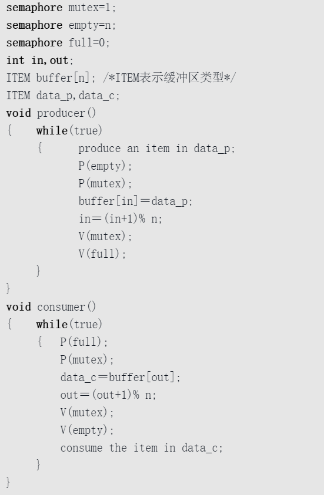

在生产者—消费者问题中需要注意以下几个问题：

（1）把共享缓冲池中的n个缓冲区视为临界资源，进程在使用时，首先要检查是否有其他进程在临界区，如果确认没有时再进入。在程序中，P（mutex）和V（mutex）用于对临界资源的互斥访问，必须成对出现。

（2）信号量full表示有数据的缓冲区的数量，初值为0。empty表示空闲缓冲区的数量，初值为n。它们表示的都是资源的数量，因此称为资源信号量。它们之间存在如下关系：full+empty=n。对资源信号量的P、V操作，同样需要成对出现，与互斥信号量不同的是，对同一个资源信号量的P操作和V操作分别处于不同的进程中。例如，P（empty）在生产者进程中，而V（empty）在消费者进程中。当生产者进程因执行P（empty）而阻塞时，由消费者进程用V（empty）将其唤醒；同理，当消费者进程因执行P（full）而阻塞时，由生产者进程用V（full）将其唤醒。

（3）多个P操作的次序不能颠倒。在程序中，应先对资源信号量执行P操作，再对互斥信号量执行P操作，否则可能会引起死锁。

### 读者—写者问题

一个数据对象若被多个并发进程所共享，且其中一些进程只要求读该数据对象的内容，而另一些进程则要求写操作，对此，把只要求读的进程称为“读者”，而把要求写的进程称为“写者”。在读者—写者问题中，要求任何时刻“写者”最多只允许有一个，而“读者”则允许有多个。因为多个“读者”的行为互不干扰，它们只是读数据，而不会改变数据对象的内容，而“写者”则不同，它们要改变数据对象的内容，如果它们同时操作，则数据对象的内容将会变得不可知。所以对共享资源的读/写操作的限制条件是：

（1）允许任意多的读进程同时读。

（2）一次只允许一个写进程进行写操作。

（3）如果有一个写进程正在进行写操作，禁止任何读进程进行读操作。

以上这些要求实际上就是要解决“写者和写者”和“写者和第一个读者”的互斥问题，因此我们可以用信号量解决读者—写者问题，引入一个互斥信号量Wmutex。为了记录谁是第一个读者，可以用一个全局整型变量Rcount做一个计数器。而在解决问题的过程中，由于全局变量Rcount属于临界资源，对于它的访问也需要互斥进行，所以需要引入另一个互斥信号量Rmutex。

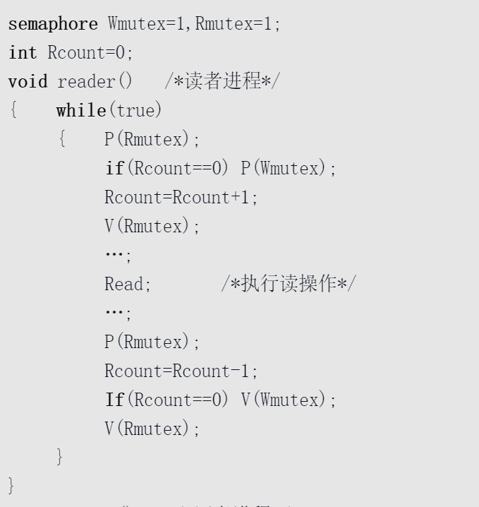

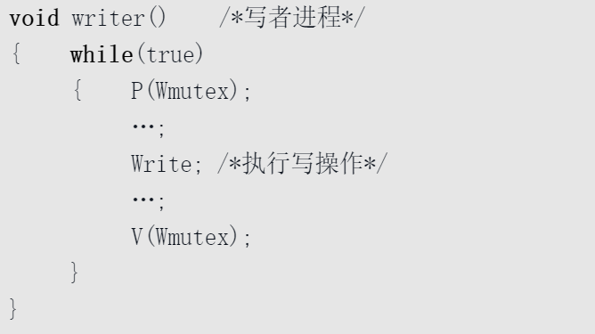

### 哲学家进餐问题

5个哲学家围着一个圆桌而坐，桌上摆着5个碗，每两个碗之间有一支筷子，共5支筷子。哲学家们的生活就是进餐和思考问题。平时哲学家思考，当需要进餐时，他只有拿到其左右两侧的筷子时才可以进餐。如果他成功地取得两支筷子，便可以进餐，之后，再放下筷子继续思考，如此反复。显然，由于每支筷子都是由相邻两位哲学家共享，就可能出现竞争状态，因此必须采取有效方法以保证每一位哲学家都能进餐。

由于每支筷子同时只能供一位哲学家使用，所以它是临界资源。因此可以用互斥信号量来实现。

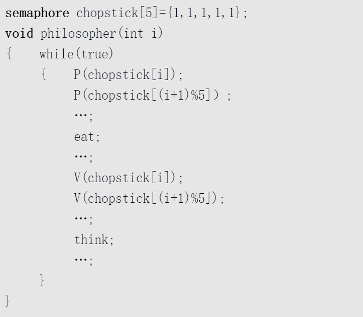

上述算法虽然保证了两个相邻哲学家不会同时进餐的问题，但是还有一个严重的问题：如果所有的哲学家总是先拿左边的筷子，再拿右边的筷子，那么就有可能出现这样的情况，5个哲学家都拿起了左边的筷子，而他们想拿右边的筷子时，却因为筷子已被其他哲学家拿去而无法拿到，此时所有的哲学家都不能进餐，这就出现了死锁现象。对于这样的死锁问题，可以采取以下几种解决方法：

（1）至多只允许有4位哲学家同时去拿左边的筷子，最终能保证至少有一位哲学家能够进餐，并在用餐结束后释放出他用过的两只筷子，从而使更多的哲学家能够进餐。

（2）仅当哲学家的左、右两只筷子都可用时，才允许他拿起筷子进餐。

（3）规定奇数号哲学家先拿他左边的筷子，然后再去拿他右边的筷子；而偶数号哲学家则相反。按此规定，将是1、2号哲学家竞争1号筷子；3、4号哲学家竞争3号筷子。即5位哲学家都先竞争奇数号筷子，获得后，再去竞争偶数号筷子，最后总会有一位哲学家能获得两支筷子而进餐。

## 管程机制（重要）

Dijkstra于1971年提出，把所有进程对某一临界资源的同步操作集中起来，构成一个所谓的“秘书”进程。**凡是要访问临界资源的进程，都必须先向“秘书”报告，并由“秘书”实现诸进程的同步。**1973年Hansan和Hoare又把“秘书”的思想发展为管程的概念，把并发进程之间的同步操作，分别集中于相应的管程中。

### 管程的概念

管程的定义：**一个共享资源的数据结构以及一组能为并发进程在其上执行的针对该资源的一组操作，这组操作能同步进程和改变管程中的数据。**

**管程的基本思想是把信号量及其操作原语封装在一个对象内部，即将共享资源以及针对共享资源的所有操作集中在一个模块中。**管程是一种**程序设计语言结构**，每一个管程是一个基本程序单位，可以被单独编译。

### 管程的特征
（1）管程内部的局部变量只能通过管程中的过程进行访问，其他任何外部过程都不能对其进行访问。
（2）进程只能通过调用管程的某一个过程才能进入管程，这样可以保证所有进入管程的进程有统一的入口。
（3）任何时刻，只能有一个进程在管程中执行，其他调用管程的任何进程都被挂起，以等待管程变为可用，即对管程实施互斥访问。

管程对共享资源进行了封装，进程可以调用管程中定义的操作过程，而这些操作过程的实现，在管程的外部是不可见的。管程相当于围墙，它把共享资源和对它操作的若干过程围了起来，所有进程要访问临界资源时，都必须经过管程（相当于通过围墙的门）才能进入，而管程每次只允许一个进程进入，从而实现了进程互斥。进入管程的互斥机制是由编译器负责的，通常使用信号量。由于实现互斥是由编译器完成的，不用程序员自己实现，所以出错的几率很小。

### 管程的结构

#### 1、条件变量

管程必须使用条件变量提供对同步的支持，这些条件变量包含在管程中，并且只有在管程中才能被访问。有以下两个函数可以操作条件变量。

**cwait（c）：**调用进程的执行在条件c上挂起，管程现在可被另一个进程使用。

**csignal（c）：**恢复在cwait上因为某些条件而被挂起的进程的执行。如果有多个这样的进程，选择其中一个。

注意管程中的条件变量不是计数器，不能像信号量那样积累信号，供以后使用。如果在管程中的一个进程执行csignal（c），而在条件变量c上没有等待的进程，则它发送的信号将丢失。也就是说，cwait（c）操作必须在csignal（c）操作之前，这条规则使得实现更加简单。

#### 2、管程的结构

管程控制机制要求进程必须互斥进入管程，所以尽管一个进程可以通过调用管程中的任何一个过程进入，仍可以将管程想象成只有一个入口点，并保证一次只有一个进程可以进入。其他试图进入管程的进程需加入到入口等待队列。如图所示给出了管程的结构，图中左侧虚线区域内是指管程的内部等待区，其中包含一系列对于不同条件变量的等待队列，这些队列称为紧急等待队列，只有当管程中紧急等待队列没有使用管程的需求时，才可能从入口队列中调入新的进程。一个在管程中的进程可以通过发送cwait（x）将自身挂起在条件x的等待队列上。当条件变量x发生变化时，管程会发送csignal（x），通知相应的条件队列，唤醒等待进程。

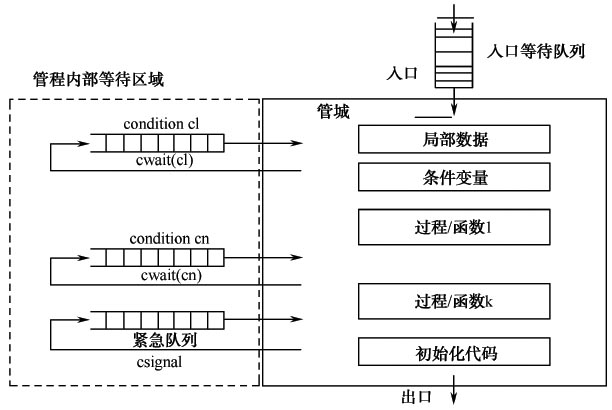

## 进程通信

### 进程通信的类型

#### 1.共享存储器系统

（1）基于共享数据结构的通信方式。

（2）基于共享存储区的通信方式。

#### 2.消息传递系统

（1）直接通信方式。发送进程直接将消息发送给接收进程，并将它挂在接收进程的消息缓冲队列上。接收进程从消息缓冲队列中取得消息。

（2）间接通信方式（灵活性大）。发送进程将消息发送到某种中间实体中，接收进程从中取得消息。这种中间实体一般称为信箱，故这种通信方式也称为信箱通信方式，被广泛应用于计算机网络中，相应的系统被称为电子邮件系统。

#### 3.管道通信系统

所谓管道，是指用于连接一个读进程和一个写进程，以实现它们之间通信的共享文件，又称为pipe文件。向管道（共享文件）提供输入的发送进程（即写过程），以字符流形式将大量的数据送入管道；而接受管道输出的接收进程（即读进程），可从管道中接收数据。由于发送进程和接收进程是利用管道进行通信的，故又称为管道通信。

##### 管道的协调能力

（1）互斥。当一个进程正在对pipe进行读/写操作时，另一个进程必须等待。
（2）同步。管道的大小是有限的。所以当管道满时，写（输入）进程必须等待，直到读（输出）进程取走数据后，再把它唤醒。当读进程读一空pipe时，也应睡眠等待，直至写进程将数据写入管道后，才将它唤醒。
（3）对方是否存在。只有确定对方已存在时，方能进行通信。

## 进程调度

### 调度级别

**1.高级调度**

高级调度又称为作业调度，用于决定把外存上处于后备队列中的哪些作业调入内存，并为它们创建进程、分配必要的资源，然后，再将新创建的进程排在就绪队列上，准备执行。

**2.中级调度**

中级调度程序又称对换调度。引入中级调度的主要目的是为了提高内存利用率和系统吞吐量。为此，应使那些暂时不能运行的进程不再占用宝贵的内存资源，而将它们暂时调到外存上去等待，此时的进程状态为挂起状态。当这些进程重新具备运行条件、且内存又稍有空闲时，由中级调度来决定把外存上的哪些又具备运行条件的就绪进程，重新调入内存，并修改其状态为就绪状态，挂在就绪队列上等待进程调度。中级调度实际上就是存储器管理中的对换功能

**3.低级调度**

低级调度又称为进程调度，用来决定就绪队列中的哪个进程应获得处理机，然后再由分派程序执行把处理机分配给该进程的具体操作。进程调度是最基本的一种调度，在批处理系统、分时系统和实时系统中都必须配置这一级调度。

（1）非抢占方式。非抢占方式也被称为不可剥夺方式。采用这种调度方式时，一旦把处理机分配给某进程，便让该进程一直执行，直至该进程完成或发生某事件而被阻塞时，才再把处理机分配给其他进程，决不允许其他进程抢占已经分配出去的处理机。

这种调度方式的优点是实现简单、系统开销小，适用于大多数的批处理系统环境。但它很难满足紧急任务的要求——立即执行，因而可能造成难以预料的后果。显然，在要求比较严格的实时系统中，不宜采用这种调度方式。

（2）抢占方式。抢占方式又被称为可剥夺方式。这种调度方式，允许调度程序根据某种原则暂停某个正在执行的进程，将已分配给该进程的处理机重新分配给另一个进程。抢占的原则比较多，例如优先权原则，允许优先权高的新到进程抢占优先权较低的进程的处理机；还有分时系统和大多数的实时系统中的时间片原则等。

### 进程调度的时机

（1）正在执行的进程执行完毕，或者因为某种原因而终止运行。（2）执行中进程自己调用阻塞原语将自己阻塞起来进入睡眠等待状态。（3）执行中的进程因提出I/O请求而暂停执行。（4）在进程通信或同步过程中执行了某种原语操作，如P操作、Block原语等。（5）在分时系统中时间片已经用完。（6）在允许抢占式的调度方式中，有一个优先级更高的进程进入就绪队列。（7）一个系统状态进程因为发生了中断等原因而返回到用户态时。

### 调度准则

衡量和比较调度算法优劣的因素通常有以下几个方面。

**1.响应时间：**从用户提交一个请求到首次产生系统响应之间的时间，称为响应时间。

**2.周转时间：**从作业提交直至完成所经历的时间叫周转时间，周转时间是从作业等待进入内存，在就绪队列中排队，在CPU上运行，以及等待I/O操作所花时间的总和。

**3.优先权：**优先权准则就是按照进程的紧急程度、进程的大小、进程的等待时间等多种因素给每个进程规定一个优先级，系统调度时按照优先级的高低选择进程。

**4.截止时间：**截止时间是衡量实时系统的主要指标，因而也是选择实时系统调度算法的重要准则。具体地说，截止时间又可以分为截止开始时间和截止完成时间。

**5.CPU利用率：**CPU的利用率高低体现了CPU实际运行用户进程时间的多少，即CPU处于忙状态的时间与开机运行的总时间之比。

**6.吞吐量：**系统吞吐量是指单位时间内处理机所完成的作业数目。它是用来评价批处理系统的重要指标。

**7.各类资源的平衡利用：**在一个系统中，不仅要使处理机的利用率高，而且还应能够有效地利用系统中的其他各种资源，如内存、外存、I/O设备等。一个好的调度算法应尽可能地使系统中的所有资源都处于忙碌状态。

## 进程调度算法

#### 批处理系统

**1、先来先服务first-come first-serverd（FCFS）**

它的基本思想是按照进程或作业进入等待队列的先后次序进行调度，先进入的进程或作业优先调度。

先来先服务采用的处理机调度方式是非抢占式，因此操作系统不会强行暂停当前正在运行的进程。该算法有利于长进程，不利于短进程；有利于CPU繁忙型进程，不利于I/O繁忙型进程。

**2、短作业优先shortest job first（SJF）**

算法的基本思想是对预期执行时间短的作业或进程优先调度。该算法是对FCFS的一种改进，其目的是减少进程调度中的平均周转时间。

该算法可以减少作业或进程的平均等待时间，提高系统的吞吐量，但它也存在以下一些缺点：（1）对长作业或进程不利。如果系统中持续有更短的作业或进程出现，可能导致长作业或进程被“饿死”。（2）该算法没有考虑作业或进程的紧迫程度，因而不能保证紧迫的作业或进程得到及时的处理或响应。（3）由于作业或进程的执行时间是用户估计的，因而不够准确，从而影响了调度性能。

**3、优先权调度算法（Priority）**

优先权调度算法适用于作业调度和进程调度。当该算法用于作业调度时，系统将从后备队列中选择若干个优先权较高的作业调入内存。当用于进程调度时，把处理机分配给就绪队列中优先权最高的进程。进程调度中使用优先权调度算法又可以分为两种方式：可抢占方式和不可抢占方式。

在使用可抢占方式时，系统把处理机分配给优先权最高的进程，使之运行。一旦系统中出现了一个优先权更高的进程，系统将停止正在运行的进程，调度程序把处理机分配给新出现的优先权更高的进程。

若系统采用不可抢占方式，当系统中出现比当前正在运行的进程优先权更高的进程时，不会剥夺正在运行进程对处理机的占有，该进程会一直运行下去，直到完成，或因发生某事件而放弃处理机。

对于优先权算法，其关键在于如何确定进程的优先权。优先权的确定方式有两种：静态和动态。

（1）静态优先权。静态优先权是在进程创建时确定该进程的优先权，且该进程的优先权在其整个运行期间保持不变。

（2）动态优先权。动态优先权是指进程的优先权可以根据进程的不断推进而改变，以期得到更好的性能。动态优先权的变化取决于进程的等待时间和占有处理机的时间。

**4、时间片轮转调度算法（Round Robin，RR）**

通常，系统将所有的就绪进程按FCFS原则，排成一个队列，每次系统调度时，把处理机分配给队首的进程，并令其执行一个时间片，时间片的大小一般是几毫秒到几百毫秒。当一个进程被分配的时间片用完时，由系统时钟发出一个中断，调度程序暂停当前进程的执行，并将其送到就绪队列的末尾，同时从就绪队列的队首选择另一个进程运行。

**5、多级反馈队列调度算法**

在这种算法中，设置多个就绪队列，每个队列的优先权不同，第一个队列的优先权最高，第二个队列次之，以此类推，队列的优先权逐个降低。

算法的实施过程为：

（1）设置多个就绪队列，并为各个队列赋予不同的优先级。第一个队列的优先级最高，第二个队列次之，其余各队列的优先级逐个降低。
（2）各级就绪队列进程具有不同的时间片。优先级最高的第1级队列中的进程时间片最短，随着队列的级别增加其进程的优先级降低，时间片的值增大。通常，优先级提高一级其时间片的值降低一半。
（3）各级队列按FCFS的原则排序。
（4）调度方法是当一个新建进程进入内存后，首先将它放入第一级队列的末尾，按FCFS原则排队等待调度。当轮到该进程执行时，如它能在该级队列的一个时间片内执行完，便可准备退出；如果它在一个时间片结束时尚未完成，调度程序便将该进程转入第二级队列的末尾，再同样地按FCFS的原则等待调度执行；如果它在第二级队列中运行一个时间片后仍未完成，再依次将它放入第三级队列，……，如此下去，当一个进程从第一级队列依次降到第n级队列（最后一个队列）后，在第n级队列中便采用按时间片轮转的方式运行。
（5）当第一级队列空闲时，调度程序才调度第二级队列中的进程运行；当第n～（i－1）级队列均空时，才会调度第i级队列中的进程运行。如果处理机正在第i级队列中为某进程服务时，又有新进程进入优先级高的队列（第n～（i－1）中的任何一个队列），则此时新进程将抢占正在运行进程的处理机，即由调度程序把正在运行的进程放回到第i队列的末尾，把处理机分配给新到的高优先级进程。

## 死锁（重要）

所谓死锁是指多个进程在运行过程中，由于争夺资源而造成的一种僵局，即系统中两个或多个进程无限期地等待永远不会发生的条件，在无外力干预的情况下，这些进程都不能向前推进。

双方各自占有对方需要的资源，也在请求对方拥有的资源，而都不放弃资源，相互等待

### 产生死锁的必要条件

**（1）互斥条件。**进程互斥使用资源，任意时刻一个资源只被一个进程独占。其他进程请求一个已被占用的资源，只能等占用者释放后才能使用。

**（2）不可剥夺条件。**进程所获得的资源在未使用完毕之前，不能被其他进程强行剥夺，而只能由获得该资源的进程自己释放。

**（3）请求和保持。**进程每次申请它所需要的一部分资源，在等待该资源的同时，继续占用已分配到的资源不释放。

**（4）循环等待。**产生死锁时，各进程所占有的资源必然构成一个闭合环路，环路中每一个进程已获得的资源同时被下一个进程所请求。

### 处理死锁的基本方法

**（1）预防死锁。**该方法是通过设置某些限制条件，去破坏产生死锁的4个必要条件中的一个或几个条件，来预防发生死锁。预防死锁是一种较简单的方法，通常因为所施加的限制条件太严格，可能导致系统资源利用率和系统吞吐量降低。

**（2）避免死锁。**在资源的动态分配过程中，用某种方法去防止系统进入不安全状态，从而避免发生死锁。这种方法只需要事先加以较弱的限制条件，便可获得较高的资源利用率及系统吞吐量，但在实现上有一定的难度。目前在较完善的系统中，常用此方法来避免发生死锁。

**（3）检测死锁。**通过系统所设置的检测机制，及时地检测出死锁的发生，并精确地确定与死锁有关的进程和资源；然后采取适当措施，将已发生的死锁清除掉。

**（4）解除死锁。**当检测到系统中已发生死锁时，需将进程从死锁状态中解脱出来。常用的实施方法是撤销或挂起一些进程，以便回收一些资源，再将这些资源分配给已处于阻塞状态的进程，使之转为就绪状态，以继续运行。死锁的检测和解除措施，有可能使系统获得较好的资源利用率和吞吐量，但在实现上难度也最大。

### 如何预防死锁

**1.破坏“请求和保持”条件**

我们摒弃资源的分步申请方式，采用资源的静态分配（动态分配是指进程临时使用时才提出申请，系统再进行分配）。就是说，在一个进程开始执行前就申请它所需的全部资源，并由系统在调度时为之分配所需全部资源。从而，它在执行过程中就不再需要申请另外的资源了。另一种办法是，每个进程仅在它不再占有资源时才可以提出申请资源，即在它们申请另外的资源之前，必须先释放它当前分到的全部资源。

**2.破坏“不可剥夺”条件**

该策略规定，一个已保持了某些资源的进程，若新的资源申请要求不能立即得到满足，便处于阻塞状态。而一个处于阻塞状态进程的全部资源可以被抢占。就是说，这些资源隐式地释放了，被剥夺的资源重新添加到资源表中。仅当该进程重新获得它原有资源以及得到新申请的资源，它才能重新启动。

**3.破坏“环路等待”条件**

按资源的类型进行线性排队，并赋予不同的序号。一般原则是，较为紧缺稀少的资源赋予较大的序号。对资源的申请，必须按序请求，先申请序号小的资源，后申请序号大的资源。这样，所有进程对资源的请求，严格地按序号递增的次序提出。这样，在资源分配图中不再可能出现环路。而且，事实上总有一个进程会占有较高序号的资源，此后它继续申请的资源必然是空闲的，因而不会受阻可以一直向前推进。

### 避免死锁

#### 1.安全与不安全状态

所谓安全状态，是指系统能按某种进程顺序，如＜p1，p2，…，pn＞（称＜p1，p2，…，pn＞序列为安全序列，来为每个进程分配其所需资源，直至最大需求，使每个进程都可顺利完成。若系统不存在这样一个序列，则称系统处于不安全状态。

并非所有的不安全状态都是死锁状态，但可能在系统进入不安全状态后，便有可能进而进入死锁状态；反之，只要系统处于安全状态，系统便可避免进入死锁状态。

避免死锁的实质在于：如何使系统避免进入不安全状态。

#### 2.银行家算法

其基本思想是：在分配资源前，先要进行一个序列检查，以判断这种分配是否可能导致死锁（安全状态与否）；如果系统是安全的，则予以分配。

> 具体例子见计算机组成与操作系统第4.5节

### 死锁的检测

#### 1.资源分配图

> 具体例子见计算机组成与操作系统第4.6节

#### 2.死锁定理

某系统状态为死锁状态的充分条件是：当且仅当该状态的资源分配图是不可完全简化的。该充分条件被称为死锁定理。

> 具体例子见计算机组成与操作系统第4.6节

### 死锁的解除

#### 1、解除死锁的方法

（1）撤销所有的死锁进程。这是操作系统中最常用的方法，也是最容易实现的方法。

（2）把每个死锁的进程恢复到前面定义的某个检查点，并重新运行这些进程。要实现这个方法需要操作系统有构造重新运行和重新启动机制。该方法的风险是有可能再次发生原来发生的死锁，但是操作系统的不确定性（随机性），使得不会总是发生同样的事情。

（3）有选择的撤销死锁进程，直到不存在死锁。选择撤销进程的顺序基于最小代价原则。在每次撤销一个进程后，要调用死锁检测算法，以检测是否仍然存在死锁。

（4）剥夺资源，直到不存在死锁。该方法和（3）一样也需要基于最小代价原则选择要剥夺的资源。同样也需要在每次剥夺一个资源后，调用死锁检测算法，检测系统是否仍然存在死锁。

#### 2.最小代价原则

（1）到目前为止消耗的处理机时间最少。（2）到目前为止产生的输出最少。（3）预计剩下的执行时间最长。（4）到目前为止分配的资源总量最少。（5）进程的优先级最低。（6）撤销某进程对其他进程的影响最小。

#### 鸵鸟算法

对于死锁最简单的方法就是鸵鸟算法：把头埋在沙子里，假装什么也没有发生。大多数操作系统，如UNIX、Linux和Windows，处理死锁的方法仅仅是忽略它


### 总结：死锁的处理方法

1. 鸵鸟策略（不管，假装没有，任由其存在）
2. 死锁检测与死锁恢复（每种类型一个资源使用深度优先搜索找环路，每种类型多个资源时找到一个序列，使用剩余资源使所有线程能继续运行）
3. 死锁恢复（利用抢占恢复、利用回滚恢复、杀死进程恢复）
4. 死锁预防（破坏互斥条件、破坏占有和等待条件、破坏不可抢占条件、破坏环路等待条件）
5. 死锁避免（银行家算法，如果一个状态是不安全的，就拒绝进入该状态）

## 存储管理

### 存储器的分类

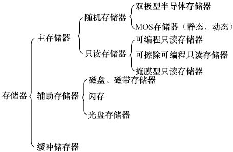


主存储器的工作原理：由CPU发来的地址送到存储器地址寄存器中，在读/写控制线路的作用下，经过地址译码后，选中存储体中某一存储单元，对该存储单元进行读/写操作，读出或写入的信息都暂存于存储器数据寄存器中（Memory DataRegister，MDR）。进行读操作时，存储单元内容不被破坏，仍为原值。而在写操作时，则旧的内容将被新的信息所取代。控制信号线中应有一根称为读/写（R/W）的命令线，高电平时表示读操作，低电平时为写操作。当片选信号为低电平该芯片被选中，CPU才可以对它进行读/写。不同类型的芯片，其片选信号的数量不一定相同，但要选中该芯片，必须所有的片选信号同时有效才行。

各级存储器中存放的信息必须满足以下两个原则：

（1）一致性原则：即同一个信息会同时存放在几个级别的存储器中，此时，这一信息在几个级别的存储器中必须保持相同的值。

（2）包含性原则：指处在内层（靠近CPU）的存储器中的信息一定包含在各外层的存储器中，即内层存储器中的全部信息一定是各外层存储器中所存信息中一小部分的副本，这是保证程序正常运行、实现信息共享、提高系统资源利用率所必需的，反之则不成立。


### 高速缓冲存储器cache

**cache的结构**

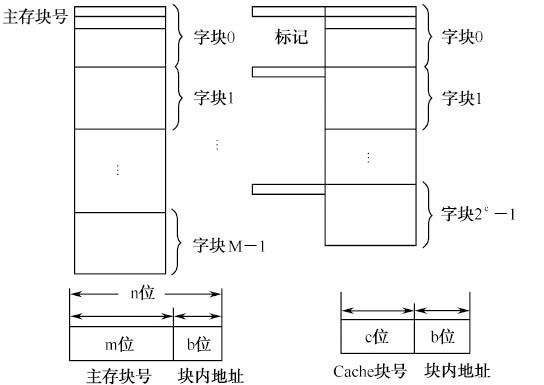


**cache的工作原理**

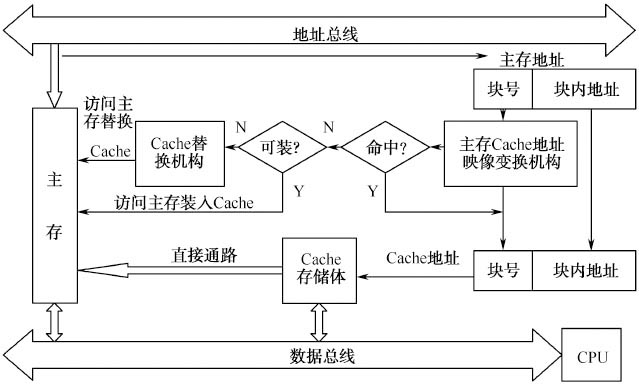

**1.直接映像（Direct Mapping）**

一个主存块只能映像到Cache中的唯一一个指定块的地址。因为主存容量总比Cache容量大，因此会有多个主存地址映像到同一个Cache地址。如果主存中两个存储块的数据都要调入Cache中的同一个位置，则将发生冲突。

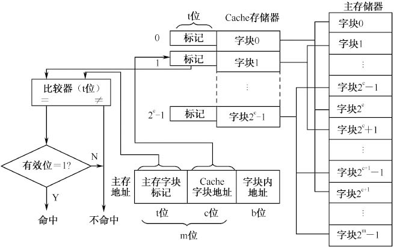

**2.全相联映像（Fully Associative Mapping）**

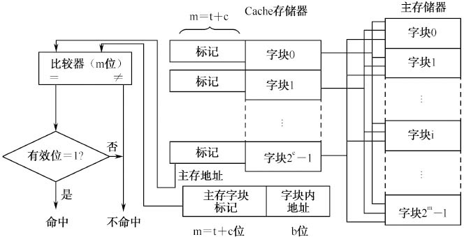

**3.组相联映像（Set Associative Mapping）**

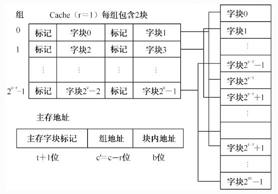


## 内存分配方式

内存分配方式分为连续分配和离散分配。连续分配是指为用户程序分配连续的内存空间，它包括单一连续分配和分区分配。

离散分配是指用户程序分散存储在许多不相邻的内存分区中，从而避免由紧凑“碎片”带来的额外的系统开销。根据离散分配时所用基本方式的不同，可以将其分为**页式存储管理**、段**式存储管理**和**段页式存储管理**三种方式。

可变分区存储管理中常用的分配算法有以下3种:

**（1）首次适应算法**：这种算法把空闲分区按其在存储空间中地址递增的顺序链接在一起。当用户申请一块内存空间时，从空闲区链表的头指针开始查找，选择第一个满足要求的空闲分区。如果它不等于作业大小，将其分成两部分，一部分给作业，另一部分仍留在空闲区链表中。当系统回收一个分区时，首先检查是否有前、后相邻的空闲区。如有，则进行合并，合并后的空闲区仍保留在链表的原位置上，但需修改相应链表指针和分区大小。

首次适应算法的优点是分配和回收算法都比较简单，查找速度快，因这个算法总是从低地址开始查找，因此留在高地址部分的大空闲区被划分机会少，在大作业到来时容易满足。

**（2）最佳适应算法**：此种算法把空闲分区链表按分区大小由小到大进行组织。当有作业申请内存时，总是首先找到满足要求的最接近于作业大小的空闲分区。因分区大小与作业相近，从而避免将较大的分区分成两部分，当有较大的作业要求分配内存时，容易得到满足。

最佳适应算法，从理论上看起来比较完美，但每次分配时总产生极小的空闲分区，经过一段时间运行，内存中可能有多个这样的小分区，因太小而无法分配给其他作业使用。这些无法使用的小分区，称为外部碎片，外部碎片的增多会降低空闲区链表的查找速度。采用最佳适应法的另一个问题是，回收一个分区时，为了把它插入到空闲区链表的合适位置，也是比较费时的。

**（3）最差适应算法**：这种算法要求把空闲区按从大到小递减的顺序组织成空闲区链表。当用户申请一个存储区时，总是检查空闲区链表的第一个空闲区是否满足要求，若不满足，分配失败；若满足，则将该空闲区分配给用户，然后修改和调整空闲区链表。

最差适应算法的优点是查询简单，而且每次分配的总是最大的空闲区，除用户使用的外，剩余的空闲区还可能相当大，还能装入较大的程序，但缺点也在于此，每次总从最大的空闲分区分配，当有大的作业到来时，其存储分配申请往往得不到满足。


**地址转换有两种方式**：一种方式是在作业装入时由作业装入程序（装配程序）实现地址转换，称为**静态重定位**，这种方式要求目标程序使用相对地址，地址变换在作业执行前一次完成；另一种方式是在程序执行过程中，CPU访问程序和数据之前实现地址转换，称为**动态重定位**。


静态重定位生成了绝对地址，无法移动程序（移动是为了内存整理）

动态重定位生成的相对地址，可以移动程序（移动是为了内存整理）

### 分页

### 分段

### 段页式

### 虚拟内存

作业在执行之前必须全部装入内存，并且作业的逻辑地址空间不能比内存空间大，否则该作业就无法装入内存运行，这就存在大作业与小内存的矛盾问题。为解决这一问题，人们提出了虚拟存储管理技术。

虚拟存储器的基本思想，就是把内存与外存统一起来形成一个存储器。作业运行时，只把必需的一部分信息调入内存，其余部分仍放在外存，当需要时，由系统自动将其从外存调入内存。

利用了程序的局部性原理，**程序的局部性原理**，就是指在一段时间内，程序执行过程中往往是集中地访问某一部分内存区域中的指令或数据，例如循环程序结构或者是访问一个数组等。所以一个作业，特别是大作业，只需要装入其中的一部分就可以正常运行

## 页面置换算法

**（1）最优算法（Optimal Replacement Algorithm，OPT）。**最理想的页面置换算法是从内存中移出以后不再使用的页面；如无这样的页面，则选择以后最长时间内不需要访问的页面。这就是最优算法的思想。

最优算法只具有理论上的意义。

**（2）先进先出算法（First Input First Output，FIFO）。**这种算法的基本思想总是先淘汰那些驻留在内存时间最长的页面，即先进入内存的页面先被置换掉

**（3）最近最久未使用算法（Least Recently Used，LRU）。**这种算法的基本思想是，如果某一页被访问了，那么它很可能马上又被访问；反之，如果某一页很长时间没有被访问，那么最近也不太可能会被访问。这种算法考虑了程序设计的局部性原理。其实质是，当需要置换一页时，选择最近一段时间最久未使用的页面予以淘汰。

**（4）LRU近似算法。**这种算法，只要在页表中设一个“引用位”，当存储分块表中的某一页被访问时，该位由硬件自动置1，并由页表管理软件周期性把所有引用位置0。这样，在一个时间周期T内，某些被访问过的页面其引用位为1，而未被访问过的页面其引用位为0。因此，可根据引用位的状态来判别各页面最近的使用情况。当需要置换一页面时，选择其引用位为0的页

## I/O硬件组成

### 总线的基本概念及分类

一个计算机系统中的总线，按其任务可以分为三类：**内部总线**、**系统总线**和**外部总线**。
（1）内部总线：同一部件，如CPU内部连接各寄存器及运算器之间的信息传送线。
（2）系统总线：同一台计算机各部件，如CPU、内存、通道和各类I/O接口等部件之间的信息传送线。
（3）外部总线：主要用于进行计算机系统之间或计算机与外部设备之间的信息传送。

### 系统总线的结构

（1）单总线结构。单总线结构是用一组总线连接整个计算机系统的各大功能部件，各大部件之间的所有信息都需要通过这组总线来传送

（2）双总线结构。由于单总线不允许多于两台的设备在同一时刻交换信息，这就使信息传送的效率受到限制，为此出现了双总线结构

（3）三总线结构。在双总线的基础上增加了I/O总线，这种结构称为三总线结构

### 总线的分类

根据总线所传输的信息内容不同，总线可以分为地址总线、数据总线和控制总线。

（1）地址总线。地址总线用来传送内存单元地址或者I/O设备的端口地址，以便CPU按地址对其进行读/写。

（2）数据总线。数据总线用来完成总线上各功能部件之间的数据传送，其数目称为数据总线的宽度，决定了每次传输数据的位数。

（3）控制总线。控制总线用来传送CPU的定时信息、命令信息和控制信息，控制所要执行操作的种类和顺序，以实现对设备的控制和监视。

### 总线的通信方式

（1）同步通信。同步通信又称为无应答通信，是指通信联络信号采用同步方式。同步方式就是数据传送由统一的系统时钟同步定时，它有严格的时钟周期划分，一次传送操作所需的一个总线周期可能包含若干个时钟周期。由于采用统一的时钟，每个部件发送信息或接收信息都在固定的总线传送周期中，一个总线传送周期结束，开始下一个总线传送周期。

同步通信的优点是，具有较高的传输效率，数据传输速度快，总线控制逻辑也比较简单。同步通信适用于总线长度较短，各部件存取时间比较接近的情况。在微型计算机系统中，多采用同步方式。

（2）异步通信。异步通信又称应答通信，是指通信联络控制信号采用异步式的一种通信方式。在异步通信方式中，允许总线上的各部件有各自的时钟，部件之间的通信不依靠公共的时间标准，而是利用应答方式的“握手”信号来实现。发送部件将数据放到总线上后，经过一定的时间延迟，便在控制线上发出“数据准备好”信号，而接收部件则应发“数据接收”信号来响应，把此信号送到源部件上，并接收数据。发送部件接收到响应信号后，去除原数据，本次传送结束。

异步通信方式的优点是，便于实现不同传输速率部件之间的数据传送，缺点是速度不如同步通信方式快，而且总线控制逻辑也相对复杂。

### 总线的信息传送方式

在计算机系统中，传输信息采用3种方式：串行传送、并行传送和串并行传送。

（1）串行传送：信息按顺序逐位传送，它们共享一条传输线，一次只能传送1比特位。

（2）并行传送：一个信息的每位同时传送，每位都有各自的传输线，互不干扰，一次传送整个信息。一个信息有多少位，就需要多少条传输线。

（3）串并行传送：将信息分组（一般每组1字节），组内并行传送，组间是串行传送。

### I/O通道的类型

（1）字节多路通道（Byte Multiplexor Channel）。类似于一个多路开关

（2）数组选择通道（Block Selector Channel）。数组选择通道用开关来控制对高速外设的选择，在一段时间内单独为一台外设服务。一旦选中某一台设备，通道就进入“忙”状态，直到该设备的数据传输工作全部结束。然后通道再选择另一台外设为其提供服务。

（3）数组多路通道（Block Multiplexor Channel）。它含有多个非分配型子通道，分时地为多台外设服务，每个时间片传送一个数据块。因而这种通道既具有很高的数据传输速率，又能获得令人满意的通道利用率。正是因为如此，该通道被广泛地用于连接多台高、中速的外设，其数据传送是按数组方式进行的。

## 中断控制方式

在计算机系统运行时，出现某种非预期的事件急待处理，CPU暂时停下现行程序，转而为该事件服务，等事件处理完毕，再恢复执行原程序，这个过程称为**中断**。

## 设备分配

### 设备分配算法

**（1）先来先服务算法**。当多个进程对同一设备提出分配请求时，该算法根据进程对设备提出请求的先后次序，将这些进程排成一个设备请求队列，设备分配程序总是把设备首先分配给队首进程。

**（2）优先级高者优先**。在进程调度策略中，优先级高的进程优先获得处理机。如果对这个高优先级进程所提出的设备请求也赋予高优先权，显然是有助于这种进程尽快完成的。在利用该算法形成设备请求队列时，请求设备的进程按优先权从高到低排列，在优先权相同的情况下，再按先来先服务的原则排队。

### SPOOLing技术

在联机情况下实现的输入/输出与CPU并行工作的操作称为SPOOLing（Simultaneous Peripheral Operating On Line）或称为假脱机操作，SPOOLing技术是将一台独占设备改造成共享设备的一种行之有效的技术。

#### SPOOLing系统的组成

（1）输入井和输出井。输入井和输出井是在磁盘上开辟两个大的存储空间。输入井是模拟脱机输入时的磁盘设备，用于暂存I/O设备输入的数据；输出井是模拟输出时的磁盘设备，用于暂存用户程序的输出数据。

（2）输入缓冲区和输出缓冲区。为了缓和CPU和磁盘之间速度不匹配的矛盾，在内存中要开辟两个缓冲区，输入缓冲区和输出缓冲区。输入缓冲区用于暂存由输入设备送来的数据，以后再传送到输入井；输出缓冲区用于暂存从输出井送来的数据，以后再传送给输出设备。

（3）输入进程SPi和输出进程SPo。这两个进程用来模拟脱机I/O时的外围控制机，其中，输入进程SPi模拟脱机输入时的外围控制机，将用户要求输入的数据从输入机通过输入缓冲区再送到输入井，当CPU需要输入数据时，直接从输入井读入内存；输出进程SPo用来模拟脱机输出时的外围控制机，把用户要求输出的数据，先从内存送到输出井，等输出设备空闲时，再将输出井中的数据经过输出缓冲区传送到输出设备上。

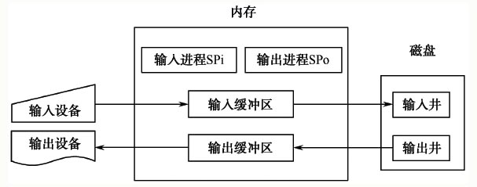


### SPOOLing系统的特点

（1）提高了I/O速度。对数据所进行的I/O操作，已从低速I/O设备进行的I/O操作，演变为对高速磁盘中输入井或输出井中数据的存取，如同脱机输入/输出一样，缓和了CPU与低速I/O设备之间速度不匹配的矛盾。

（2）独占设备改造为共享设备。在SPOOLing系统中，实际上没有为任何进程分配设备，而只是在高速磁盘中为进程分配一个存储区（即输入井和输出井）和建立一张I/O请求表。这样，便把独占设备改造为共享设备。

（3）实现了虚拟设备功能。SPOOLing系统实现了将一台独占设备变换为多台逻辑设备的功能。

## 设备处理

### 设备驱动程序

#### 1.设备驱动程序的功能

（1）接收由I/O进程发出的命令和参数，并将命令中的抽象要求转换为具体要求，例如，将磁盘块号转换为磁盘的盘面、磁道号和扇区号。

（2）检查用户I/O请求的合法性，了解I/O设备的状态，传递有关参数，设置设备的工作方式。

（3）发出I/O命令。如果设备空闲，便立即启动I/O设备去完成指定的I/O操作；如果设备处于忙碌状态，则将请求者的请求挂在设备请求队列上等待。

（4）及时响应由设备控制器或通道发来的中断请求，并根据其中断类型调用相应的中断处理程序进行中断处理。

（5）对于设置有通道的计算机系统，驱动程序还应能够根据用户的I/O请求，自动地构成通道程序。

### 中断处理程序

中断是指在计算机运行期间，发生非预期的急需处理的事件，CPU暂时中断当前程序的运行，转去执行相应的事件处理程序，处理完毕后再返回断点继续执行的过程。

引起中断发生的事件称为**中断源**。

中断源向CPU发出的请求中断处理信号称为**中断请求**。

CPU收到中断请求后，中断正在运行的程序并转去执行相应的事件处理程序称为**中断响应**。

相应的事件处理程序称为中断服务（处理）程序。执行中断处理程序的过程称为**中断处理**。

禁止中断也称为**关中断**，PSW的中断允许位被重新设置称为开中断。中断请求、关中断、开中断都是由硬件来实现的。

**中断屏蔽**是指在中断请求产生后，系统用软件方式有选择地屏蔽部分中断而允许其他中断仍能得到响应。

#### 中断的分类

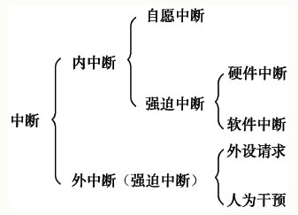

（1）内中断。在处理机和内存内部产生的中断称为内中断，也称为陷入或异常。它包括程序运算引起的各种错误，如算术操作溢出、数据格式非法、除数为零、地址越界错误、分时系统中的时间片中断等。

内中断又分为自愿中断和强迫中断。

**自愿中断**是出于计算机系统管理的需要，自愿地进入中断，如计算机系统为了方便用户调试软件、检查程序、调用外部设备，设置了中断指令，自愿中断是可以预料的。

**强迫中断**是在CPU没有事先预料的情况下发生的，此时CPU不得不停下现行的工作进行中断响应。强迫中断产生的原因有硬件故障和软件中断等。

（2）外中断。在处理机和内存外部产生的中断称为外中断，外中断都是强迫中断，包括I/O设备发出的I/O中断、外部信号中断（如用户按“Esc”键）、各种定时器引起的时钟中断等。外中断在狭义上一般被称为中断。


#### 中断的优先级

当CPU已经响应了一个中断源的请求时，即正在进行中断处理时，如果又有新的中断源发出中断请求，CPU是否响应该中断请求，则取决于中断源的优先级。当新中断源的优先级高于正在处理的中断源时，CPU将暂停当前的中断服务程序，转而响应高优先级的中断（称为中断嵌套）。

#### 中断的处理过程

**（1）保护被中断的CPU环境。**为了在中断处理结束后能使进程正确地返回到中断点，系统必须保存当前的程序状态字（PSW）和程序计数器（PC）。

**（2）分析中断原因，转入相应的中断处理程序。**

**（3）执行中断处理程序。**对不同的设备，有不同的中断处理程序。

**（4）恢复被中断进程的现场。**

## 磁盘管理

#### 磁盘的硬件结构

（1）磁头（Header）。

（2）柱面（Cylinder）。

（3）扇区（Sectors）。

当向磁盘寻址时，一般表示为柱面（磁道）号、磁头（盘面）号、扇区号。在进行数据读/写时，通过磁头从磁盘中取出/存入数据。磁头是固定不动的，磁盘在其下面旋转。


#### 磁盘的访问时间

（1）寻道时间Ts。磁头定位磁道所需要的时间称为寻道时间（Seek Time）。一般磁盘的平均寻道时间为5～10ms。

$T t=\frac{b}{r N}$

（2）旋转延迟时间Tτ。指定扇区移动到磁头下面所经历的时间。对于磁盘，典型的旋转速度为5400～10000rpm。如果旋转速度为5400rpm，每转需时间11.1ms，平均旋转延迟时间Tτ为5.55ms。

（3）传输时间Tt。把数据从磁盘读出或向磁盘写入数据所经历的时间。Tt的大小与每次读/写的字节数b和旋转速度有关：其中，r为每秒的转数；N为一条磁道上的字节数，当一次读/写的字节数相当于半条磁道上的字节数时，Tt和Tτ相同，因此，可将访问时间Ta表示为：

$T a=T s+\frac{1}{2 r}+\frac{b}{r N}$

在访问时间中，寻道时间和旋转延迟时间基本上都与所读/写数据的多少无关，而且它通常占据了访问时间中的大头。

### 磁盘调度算法（重要）

#### 1.先来先服务FCFS

它根据进程请求访问磁盘的先后次序进行调度。此算法的优点是公平、简单，且每个进程的请求都能依次得到处理，不会出现某一进程的请求长期得不到满足的情况。

但是此算法没有对寻道进行优化，致使平均寻道时间较长。

#### 2.最短寻道时间优先SSTF

该算法选择使磁头臂从当前位置开始移动最少的磁盘I/O请求，以使每次的寻道时间最短，但这种算法不能保证平均寻道时间最短。

可能导致某个进程发生“饥饿（Starvation）”现象。因为只要不断有新进程请求到达，且其所要访问的磁道与磁头当前所在磁道的距离较近，这种新进程的I/O请求必须优先满足，而那些老进程的I/O请求可能长时间得不到满足。

#### 3.扫描（SCAN）算法（电梯调度算法）

SCAN算法不仅考虑欲访问的磁道与当前磁道间的距离，更优先考虑的是磁头当前的移动方向。例如，当磁头正在自里向外移动时，SCAN算法所考虑的下一个访问对象，应是在当前磁道之外，又是距离最近的。这样自里向外的访问，直到没有更外的磁道需要访问时，才将磁臂换向自外向里移动。

可能会致使该进程的请求被严重地推迟。

#### 4.循环扫描CSCAN算法

为了减少延迟，循环扫描（Circular SCAN，CSCAN）算法规定磁头单向移动。例如，只是自里向外移动，当磁头移动到最外的磁道并访问后，磁头立即返回到最里面的欲访问磁道，即将最小磁道号紧接着最大磁道号构成循环，进行循环扫描。

#### 5.N-Step-SCAN与FSCAN算法

（1）N-Step-SCAN算法是将磁盘请求队列分成若干个长度为N的子队列，磁盘调度算法按FCFS算法依次处理这些子队列。而处理每个子队列时，又按SCAN算法进行调度处理。对一个队列处理完后，再处理其他队列。

有一个或几个进程对某一磁道有较高的访问频率，即某（些）个进程反复请求对某一磁道的I/O操作，从而垄断了整个磁盘设备。把这一现象称为“磁臂黏着（Armstickiness）”。

（2）FSCAN算法。FSCAN算法实质上是N-Step-SCAN算法的简化，即FSCAN只将磁盘请求队列分成两个子队列。一个是由当前所有请求磁盘I/O的进程形成的队列，由磁盘调度按SCAN算法进行处理。在扫描期间，将新出现的所有请求磁盘I/O的进程，放入另一个等待处理的请求队列。##

## 缓冲管理

#### 提高磁盘I/O速度的一些方法

##### 1、预先读

##### 2、延迟写

##### 3、虚拟盘


