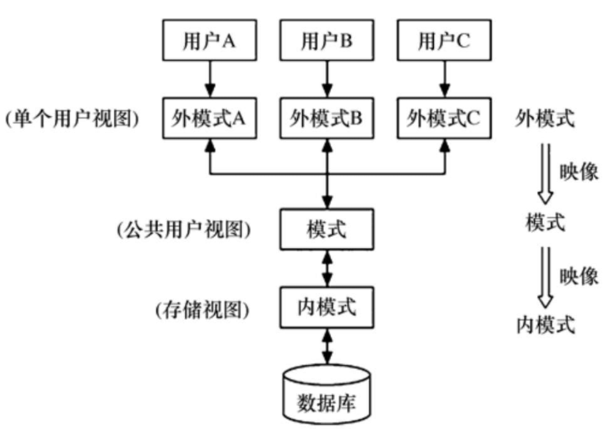
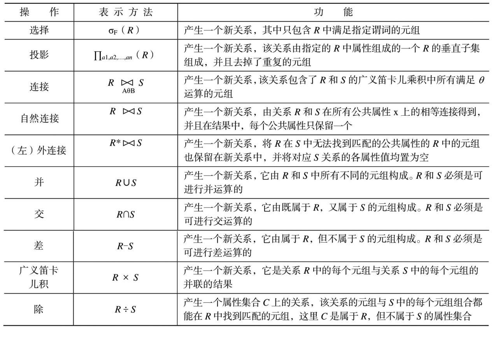
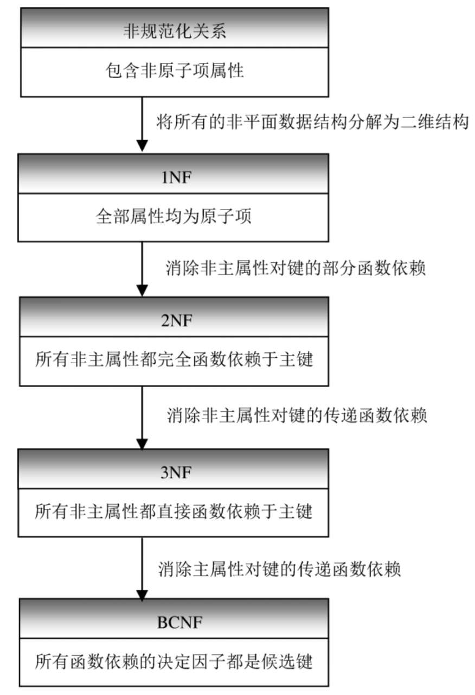
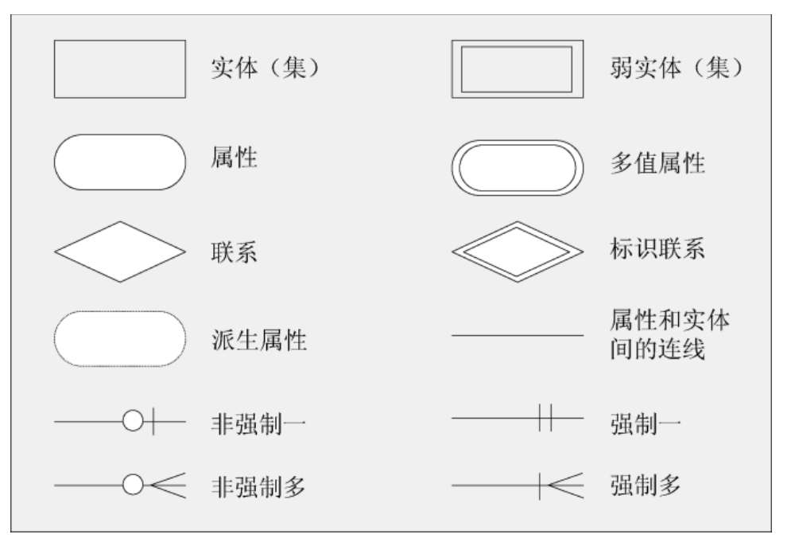
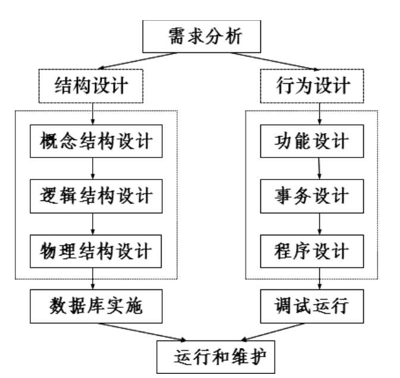
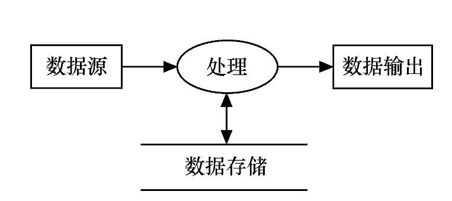
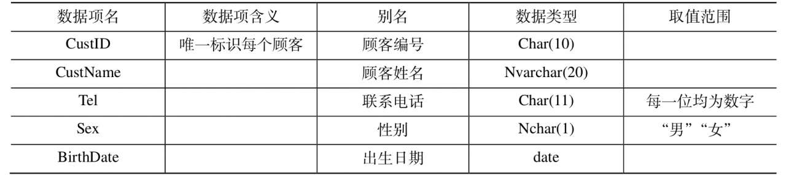
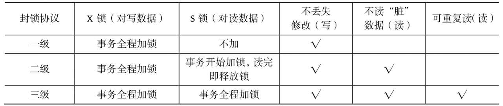

<!--将该代码放入博客模板的head中即可-->
<script type="text/x-mathjax-config">
MathJax.Hub.Config({
tex2jax: {
  inlineMath: [['$','$'], ['\\(','\\)']],
  processEscapes: true
  }
});
</script>
<!--latex数学显示公式-->
<script type="text/javascript" src="https://cdn.mathjax.org/mathjax/latest/MathJax.js?config=TeX-AMS-MML_HTMLorMML"></script>

# 数据库

[toc]


## 数据库的三级模式结构(重要)

**外模式->模式->内模式**

外模式和模式在关系数据库中分别对应视图和表，内模式对应索引等内容。



- 内模式是最接近物理存储的，也就是数据的物理存储方式，包括数据存储位置、数据存储方式等。

- 模式是介于内模式和外模式之间的中间层，是数据的逻辑组织方式。模式也称为逻辑模式或概念模式，是对数据库中全体数据的逻辑结构和特征的描述，是所有用户的公共数据视图。

- 外模式是最接近用户的，也就是用户所看到的数据视图。外模式是对现实系统中用户感兴趣的整体数据的局部描述，用于满足数据库不同用户对数据的需求。


## 模式的数量关系
- 外模式可以有许多，每一个都或多或少地抽象表示整个数据库的某一部分数据；
- 模式只有一个，它是对包含现实世界业务中的全体数据的抽象表示。
- 内模式也只有一个，它表示数据库的物理存储。

## 模式映像与数据独立性

- 外模式/模式映像。
- 模式/内模式映像。


正是这两级映像功能，保证了数据库中的数据能够具有较高的逻辑独立性和物理独立性，使数据库应用程序不随数据库数据的逻辑或存储结构的变动而变动。


模式描述的是数据的全局逻辑结构，外模式描述的是数据的局部逻辑结构。对应于同一个模式，可以有多个外模式。对于每个外模式，数据库管理系统都有一个外模式到模式的映像，它定义了该外模式与模式之间的对应关系，即如何从外模式找到其对应的模式。


当模式改变时（如增加新的关系、新的属性、改变属性的数据类型等），可由数据库管理员用外模式定义语句，调整外模式到模式的映像，从而保持外模式不变。

## 数据的完整性约束(重要)

在数据库中，数据的完整性是指保证数据正确性的特征。数据完整性是一种语义概念，它包括两个方面。
- 与现实世界中应用需求的数据的相容性和正确性。
- 数据库内数据之间的相容性和正确性。


在关系数据模型中，一般将数据完整性分为三类，即
- **实体完整性** ：实体完整性是保证关系中的每个元组都是可识别的和唯一的。实体完整性是指关系数据库中所有的表都必须有主键，而且表中不允许存在以下记录。① 无主键值的记录。② 主键值相同的记录。
- **参照完整性**：参照完整性也称为引用完整性。现实世界中的实体之间往往存在着某种联系，在关系模型中，实体以及实体之间的联系都是用关系来表示的，这样就自然存在着关系与关系之间的引用。参照完整性就是描述实体之间的联系的，这里的实体之间可以是不同的实体，也可以是同一个实体。参照完整性规则就是定义外键与被参照的主键之间的引用规则。对于外键，一般应符合以下要求。• 或者值为空。• 或者等于其所参照的关系中的某个元组的主键值。
- **用户定义的完整性**：用户定义的完整性也称为域完整性或语义完整性。任何关系数据库管理系统都应该支持实体完整性和参照完整性。除此之外，不同的数据库应用系统根据其应用环境的不同，往往还需要一些特殊的约束条件，用户定义的完整性就是针对某一具体应用领域定义的数据约束条件。它反映某一具体应用所涉及的数据必须满足应用语义的要求。

## 候选键

如果一个属性或属性集的值能够唯一标识一个关系的元组而又不包含多余的属性，则称该属性或属性集为候选键（candidate key）

候选键又称为候选关键字或候选码。在一个关系上可以有多个候选键。

候选键又称为候选关键字或候选码。在一个关系上可以有多个候选键。例如，假设为学生关系增加了“身份证号”列，则学生（学号，姓名，年龄，性别，所在系，身份证号）的候选键就有学号和身份证号两个。


## 主属性和非主属性

包含在任意候选键中的属性称为主属性（primary attribute）。不包含在任意候选键中的属性称为非主属性（nonprimary attribute）。


## 数据库的三大范式(重要)

1. **第一范式**

如果每列都是不可再分的最小数据单元（也叫作最小的原子单元），则满足第一范式，第一范式的目标是确保每列的原子性。

2. **第二范式**

第二范式在第一范式的基础上，规定表中的非主键列不存在对主键的部分依赖，即第二范式要求每个表只描述一件事情。

3. **第三范式**

第三范式的定义为：满足第一范式和第二范式，并且表中的列不存在对非主键列的传递依赖。


## 数据库的事务的四个属性(十分重要)

1. **原子性（Atomicity）**：事务是一个完整操作，参与事务的逻辑单元要么都执行，要么都不执行。
2. **一致性（Consistency）**：在事务执行完毕时（无论是正常执行完毕还是异常退出），数据都必须处于一致状态。
3. **隔离性（Isolation）**：对数据进行修改的所有并发事务都是彼此隔离的，它不应以任何方式依赖或影响其他事务。
4. **永久性（Durability）**：在事务操作完成后，对数据的修改将被持久化到永久性存储中。
## 数据库的传播行为参数(重要)

| 传播行为               | 意义                      |
| --------------------- | -----------------------  |
| PROPERGATION_MANDATORY | 表示方法必须运行在一个事务中，如果当前事务不存在，就抛出异常 |
|PROPAGATION_NESTED|表示如果当前事务存在，则方法应该运行在一个嵌套事务中。否则，它看起来和 PROPAGATION_REQUIRED 看起来没什么俩样|
|PROPAGATION_NEVER|表示方法不能运行在一个事务中，否则抛出异常|
|PROPAGATION_NOT_SUPPORTED|表示方法不能运行在一个事务中，如果当前存在一个事务，则该方法将被挂起|
|PROPAGATION_REQUIRED|表示当前方法必须运行在一个事务中，如果当前存在一个事务，那么该方法运行在这个事务中，否则，将创建一个新的事务|
|PROPAGATION_REQUIRES_NEW|表示当前方法必须运行在自己的事务中，如果当前存在一个事务，那么这个事务将在该方法运行期间被挂起|
|PROPAGATION_SUPPORTS|表示当前方法不需要运行在一个是事务中，但如果有一个事务已经存在，该方法也可以运行在这个事务中|
## 专门的关系运算

- 选择(取若干行)(一元操作)

- 投影(选若干列)(一元操作)

- 连接(二元操作)

- 除(二元操作)

- ....



## sql的主要功能

| sql-功能 | 动词                 |
| -------- | -------------------- |
| 数据定义 | create\drop\alter    |
| 数据查询 | select               |
| 数据更改 | insert\update\delete |
| 数据控制 | grant\revoke\deny    |

SQL的数据定义功能包括表定义、视图定义、索引定义等

## 索引的存储结构及分类

索引分为两大类:一类是聚集索引(CLustered Index,也成为聚簇索引),一类是非聚集索引(Non-Clustered Index,也称非聚簇索引).

- 聚集索引对数据按索引关键字值进行物理排序.
- 非聚集索引不对数据按索引关键字值进行物理排序,而只将索引关键字按值进行排序.

**创建索引**

```sql
CREATE [UNIQUE][CLUSTERED|NONCLUSTERED]
	INDEX <索引名> ON <表名> (列名[,...n])
```
- UNIQUE：表示要创建的索引是唯一索引。
- CLUSTERED：表示要创建的索引是聚集索引。
-  NONCLUSTERED：表示要创建的索引是非聚集索引。

**删除索引**

```sql
DROP INDEX <表名>.<索引名>
```
### 聚集索引

聚集索引的B树是自下而上建立的,最下层的叶级节点存放的是数据,因此它既是索引页,同时也是数据页.多个数据页生成一个中间层节点的索引页，然后再由数个中间层节点的索引页合成更上层的索引页，如此上推，直到生成顶层的根节点的索引页。除叶节点之外的其他层节点，每一个索引行由索引项的值以及这个索引项在下层节点的数据页编号组成。

在聚集索引的叶节点中，数据按聚集索引关键字的值进行物理排序。由于聚集索引关键字决定了数据在表中的物理存储顺序，因此一个表只能包含一个聚集索引。但是，该索引可以由多个列（组合索引）组成，当在建有聚集索引的列上查找数据时，系统首先从聚集索引树的入口（根节点）开始逐层向下查找，直到达到B树索引的叶级，也就是达到了要找的数据所在的数据页，最后只在这个数据页中查找所需数据即可。

聚集索引对于那些经常要搜索列在连续范围内的值的查询特别有效。使用聚集索引找到包含第一个列值的行后，由于后续要查找的数据值在物理上相邻而且有序，因此，只要将数据值直接与查找的终止值进行比较即可。

下列情况可考虑创建聚集索引:

- 包含大量非重复值的列。
- 使用下列运算符返回一个范围值的查询：BETWEEN AND、>、>=、<和<=。
-  经常被用作连接的列，一般来说，这些列是外键列。
- 对ORDER BY或GROUP BY子句中指定的列建立索引，可以使数据库管理系统在查询时不必对数据再进行排序，从而可以提高查询性能。

对于频繁进行更改操作的列，则不适合建立聚集索引。

### 非聚集索引

非聚集索引与聚集索引一样用B树结构，但有两个重要差别。

- 数据不按非聚集索引关键字值的顺序排序和存储。

- 非聚集索引的叶节点不是存放数据的数据页。

非聚集索引B树的叶节点是索引行。每个索引行包含非聚集索引关键字值以及一个或多个行定位器，这些行定位器指向该关键字值对应的数据行（如果索引不唯一，则可能是多行）。

数据不是按照关键字排序的,而索引是按照关键字排序的,上一层节点中的每个索引关键字值取的是下一层节点上的最小索引的键值.

在建有非聚集索引的表上查找数据的过程与聚集索引类似，也是从根节点开始逐层向下查找，直到找到叶节点，在叶节点中找到匹配的索引关键字值之后，其所对应的行定位器所指位置即是查找数据的存储位置。

由于非聚集索引并不改变数据的物理存储顺序，因此，可以在一个表上建立多个非聚集索引。就像一本书可以有多个术语表一样，如一本介绍园艺的书可能会包含一个植物通俗名称的术语表和一个植物学名称的术语表，因为这是读者查找信息的两种最常用的方法。

对于下述情况，可考虑创建非聚集索引。

- 包含大量非重复值的列。如果某列只有很少的非重复值，如只有1和0，则不对这些列建立非聚集索引。
- 经常作为查询条件使用的列。
- 经常作为连接和分组条件的列。

### 唯一索引

唯一索引用于确保索引列不包含重复的值。唯一索引可以只包含一个列（限制该列取值不重复），也可以由多个列共同构成（限制这些列的组合取值不重复）。

聚集索引和非聚集索引都可以是唯一索引。

当在表上创建PRIMARY KEY约束或UNIQUE约束时，系统会自动在这些约束的列上创建唯一索引。

### 索引总结

索引一经建立，就由数据库管理系统自动使用和维护，不需要用户干预。建立索引是为了加快数据的查询效率，但如果要频繁地对数据进行增、删、改操作，则数据库管理系统会花费很多时间来维护索引，这会降低数据的修改效率；另外，存储索引需要占用额外的空间，这增加了数据库的空间开销。因此，当不需要某个索引时，可将其删除。

## 视图

视图（view）是数据库中的一个对象，是数据库管理系统提供给用户的以多种角度观察数据库中数据的一种重要机制。

### 视图的基本概念

通常将模式对应的表称为基本表。基本表中的数据实际上是物理存储在磁盘上的。

视图是由从数据库的基本表中选取出来的数据组成的逻辑窗口，是基本表的部分行和列数据的组合。与基本表不同的是，视图是一个虚表。数据库中只存储视图的定义，而不存储视图所包含的数据，这些数据仍存放在原来的基本表中。

**这种模式有如下两个好处：**

- 第一，视图数据始终与基本表数据保持一致。当基本表中的数据发生变化时，从视图中查询出的数据也会随之变化。
- 第二，节省存储空间。当数据量非常大时，重复存储数据是非常耗费空间的。

视图可以从一个基本表中提取数据，也可以从多个基本表中提取数据，甚至还可以从其他视图中提取数据，构成新的视图。
### 定义视图

**视图创建**

```sql
CREATE VIEW <视图名>[(列名[,...n])]AS SELECT 语句
```
- SELECT语句中通常不包含ORDER BY和DISTINCT子句。
- 定义视图时要么指定视图的全部列名，要么全部省略不写，不能只写视图的部分列名。如果省略了视图的“列名”部分，则视图的列名与查询语句中查询结果显示的列名相同。但是，在以下三种情况下必须明确指定组成视图的所有列名:
- -  某个目标列不是简单的列名，而是函数或表达式，并且在SELECT语句中没有为这样的列指定别名。
- -  多表连接时选出了几个同名列作为视图的列。
- -  需要在视图中为某个列选用其他更合适的列名。

**视图查询**

```sql
SELECT * FORM viewName where xxx 
```

**视图修改**
```sql
ALTER VIEW <视图名>[(列名)[,...n]]AS SELECT 语句
```
**视图删除**

```sql
DROP VIEW <视图名>
```

#### 单源表视图
单源表的行列子集视图指视图的数据取自一个基本表的部分行和列，这样的视图行列与基本表行列对应。
#### 多源表视图
多源表视图指定义视图的查询语句涉及多张表，这样定义的视图一般只用于查询，不用于修改数据。
#### 在已有的视图上定义新视图
视图的来源可以是基本表，也可以是已经建立好的视图。在视图上再建立新的视图时，作为数据源的视图必须是已经建立好的视图。

#### 定义带表达式的视图

定义基本表时，为减少数据库中的冗余数据，表中只存放基本数据，而基本数据经过各种计算派生出的数据一般是不存储的。由于视图中的数据并不实际存储在磁盘上，因此定义视图时可以根据需要设置一些派生属性列，在这些派生属性列中保存经过计算的值。这些派生属性由于在基本表中并不实际存在，因此也称它们为虚拟列。包含虚拟列的视图也称为带表达式的视图。

#### 含分组统计信息的视图

含分组统计信息的视图是指定义视图的查询语句中含有GROUP BY子句，这样的视图只能用于查询，不能用于修改数据。

### 视图的作用
1. 简化数据查询语句
2. 使用户能从多角度看待同一数据
3. 提高了数据的安全性
4. 提供了一定程度的逻辑独立性

### 物化视图
标准视图不保存数据,每次都要进行重新查询,降低数据库的查询效率,物化视图是保存视图查询的数据(物理存储),并且保证数据变化时,视图中的数据也随之更改.这样的视图被称为物化视图(materialized view).
保证视图数据与基本表数据保持一致的过程称为视图维护(view maintenance)

## 触发器
触发器是一段由对数据的更改操作引发的自动执行的代码，这些更改操作包括UPDATE、INSERT或DELETE。触发器通常用于保证业务规则和数据完整性，其主要优点是用户可以用编程的方法实现复杂的处理逻辑和商业规则，增强了数据完整性约束的功能。

触发器是定义在某个表上的，用于限制该表中的某些约束条件，但在触发器中可以引用其他表中的列。

```sql
CREATE TRIGGER 触发器名称
ON {表名|视图名}
{FOR|AFTER|INSTEAD OF}
{[INSERT][,][DELETE][,][UPDATE]}
AS
SQL 语句
```

- 触发器名称在数据库中必须是唯一的。
- ON子句用于指定在其上执行触发器的表。
- AFTER指定触发器只有在引发的SQL语句中定的操作都已成功执行，并且所有的约束检查也成功完成后，才执行此触发器。
- FOR作用同AFTER。
- INSTEAD OF指定执行触发器，而不是执行引发触发器执行的SQL语句，从而替代触发语句的操作。
- INSERT、DELETE和UPDATE是引发触发器执行的操作，若同时指定多个操作，则各操作之间用逗号分隔。

创建触发器时，需要注意以下几点:

① 在一个表上可以建立多个名称不同、类型各异的触发器，每个触发器可由所有三个操作来引发。对于AFTER型的触发器，可以在同一种操作上建立多个触发器；对于INSTEAD OF型的触发器，在同一种操作上只能建立一个触发器。
② 大部分SQL语句都可用在触发器中，但也有一些限制。例如，所有的创建和更改数据库以及数据库对象的语句、所有的DROP语句都不允许在触发器中使用。
③ 在触发器中可以使用两个特殊的临时表：INSERTED表和DELETED表，这两个表的结构同建立触发器的表的结构完全相同，而且这两个临时表只能用在触发器代码中。
- -  INSERTED表保存了INSERT操作中新插入的数据和UPDATE操作中更新后的数据。
- -  DELETED保存了DELETE操作删除的数据和UPDATE操作中更新前的数据。在触发器中对这两个临时表的使用方法同一般基本表一样，可以通过这两个临时表记录的数据来判断所进行的操作是否符合约束。

**删除触发器**
```sql
DROP TRIGGER 触发器名
```

### 后触发器
使用FOR或AFTER选项定义的触发器为后触发型的触发器，即只有在引发触发器执行的语句中指定的操作都已成功执行，才执行触发器。
> 注意 不能在视图上定义后触发器

### 前触发器
使用INSTEAD OF选项定义的触发器为前触发型触发器。在这种模式的触发器中，指定执行触发器而不是执行引发触发器执行的SQL语句，从而替代引发语句的操作。


## 存储过程

**创建存储过程**

```sql
CREATE PROC[EDURE]存储过程名 
[{@参数名 数据类型}][=DEFAULT]
[OUTPUT]][,...n]
AS
SQL语句[...n]
```
- default：表示参数的默认值。如果定义了默认值，则在执行存储过程时，不必指定该参数的值。
-  OUTPUT：表明参数是输出参数。该选项的值可以返回给EXEC[UTE]。使用OUTPUT参数可将信息返回给调用者。

**调用存储过程**
```sql
[EXEC [UTE]]存储过程名
[实参[,OUTPUT][,...n]]
```

存储过程可以做以下几个方面工作:
- 接受输入参数并以输出参数的形式将多个值返回至调用过程或批处理。
- 包含执行数据库操作（包括调用其他过程）的编程语句。
- 向调用者返回状态值，以表明成功或失败（以及失败原因）。

### 存储过程的优点
（1）允许模块化程序设计
（2）改善性能
（3）减少网络流量
（4）可作为安全机制使用


## 函数依赖

**定义：**设X,Y是关系R的两个属性集合，当任何时刻R中的任意两个元组中的X属性值相同时，则它们的Y属性值也相同，则称X函数决定Y，或Y函数依赖于X。

**理解：**若在一张表中，属性或属性组X确定，必定能确定属性Y的值，则称Y函数依赖于X,记做X->Y.如下表，在学生表ST中通过学号能唯一确定一个姓名，则姓名函数依赖于学号

```
学号->姓名
学号->性别
(学号,课程号)->成绩
```


学生表ST

| 学号 | 姓名 | 性别 |
| ---- | :--: | ---: |
| 1    | 张三 |   男 |

教师表T

| TID    (教师编号) | 姓名 | 性别 |
| ----------------- | :--: | ---: |
| 1                 | 李四 |   男 |

课程表SC

| CID    (课程号) | 课程名称 | TID(授课老师ID) | 学分 |
| --------------- | :------: | --------------: | ---: |
| 1               |   数学   |               1 |    2 |

成绩表SG

| 学号 | CID(课程号) | 成绩 |
| ---- | :---------: | ---: |
| 1    |      1      |   80 |

### 平凡函数依赖&非平凡函数依赖

**定义：**设一个关系为R(U),X和Y为属性集U上的子集,若X→Y且X不包含Y,则称X→Y为非平凡函数依赖,否则若X包含Y则必有X→Y,称此X→Y为平凡函数依赖.

**举例：**在学生表ST中,学号总能函数决定它本身,记作“学号→学号”,对于任一个给定的学号,都有它本身的学号值唯一对应,此为平凡函数依赖.（学号，性别）->性别与（学号，性别）->学号也是平凡函数依赖

通常，我们主要讨论的是非平凡函数依赖：如学生表ST中学号函数决定的其他属性都是非平凡函数依赖

### 完全函数依赖

**定义：**设X,Y是关系R的两个属性集合，X’是X的任意真子集，存在X→Y，但对每一个X’都有X’!→Y，则称Y完全函数依赖于X。

**理解：**在一张表中，若 X → Y，且对于 X 的任何一个真子集（假如属性组 X 包含超过一个属性的话），X ' → Y 不成立，那么我们称 Y 对于 X 完全函数依赖。

**举例：**在成绩表SG中，成绩完全函数依赖于（学号，CID（课程号））

### 部分函数依赖

**定义：**设X,Y是关系R的两个属性集合，存在X→Y，若X’是X的真子集，存在X’→Y，则称Y部分函数依赖于X。

**说明：**假如 Y 函数依赖于 X，但同时 Y 并不完全函数依赖于 X，那么我们就称 Y 部分函数依赖于 X

**举例：**学生表ST中（学号，姓名）->性别，但是存在学号->性别，所以称性别部分依赖于（学号，姓名）

### 传递函数依赖

**定义：**设X,Y,Z是关系R中互不相同的属性集合，存在X→Y(Y !→X),Y→Z，则称Z传递函数依赖于X。

**说明：**假如 Z 函数依赖于 Y，且 Y 函数依赖于 X （严格来说还有一个X 不包含于Y，且 Y 不函数依赖于Z的前提条件），那么我们就称 Z 传递函数依赖于 X

**举例：**关系S1（学号，系名，系主任），学号 → 系名，系名 → 系主任，并且系名 ！→ 学号，所以学号 → 系主任为传递函数依赖。

## 一范式

**定义：**符合1NF的关系中的每个属性都不可再分(不包含非原子项属性的关系是第一范式（1NF）的关系。(课本说法))
 **说明：**在一列中不能插入两个及以上不同属性的值
 **举例：**如果将教师表的姓名与性别放在同一列就不符合1NF，当然这在建表的时候就不会成功(因为第一范式是必需的，后续的其他范式都是可选的)。

## 二范式

**定义：**在1NF的基础上，非主属性必须完全函数依赖于主键。(若某个第一范式关系的主键只由一个列组成，则这个关系就是第二范式关系。但如果某个第一范式关系的主键是由多个属性共同构成的复合主键，并且存在非主属性对主键的部分函数依赖，则这个关系就不是第二范式关系。)

**说明：**第二范式（2NF）是在第一范式（1NF）的基础上建立起来的，即满足第二范式（2NF）必须先满足第一范式（1NF）。第二范式（2NF）要求数据库表中的每个实例或记录必须可以被唯一地区分。选取一个能区分每个实体的属性或属性组，作为实体的唯一标识。即要有主键

**举例：**如果在成绩表SG中添加一列姓名变成下面这样，SG表的主键是学号加CID(课程号)，（学号）->姓名，所以姓名部分函数依赖于（学号，CID(课程号)），不符合2NF

| 学号 | CID(课程号) | 成绩 | 姓名 |
| ---- | :---------: | ---: | ---: |
| 1    |      1      |   80 | 张三 |

正确的设计方式是将上面这个不符合第二范式的表格划分为两个表

| 学号 | CID(课程号) | 成绩 |
| ---- | ----------- | ---- |
| 1    | 1           | 80   |

| 学号 | 姓名 |
| ---- | ---- |
| 1    | 张三 |

## 三范式

**定义：**在1NF基础上，任何非主属性不依赖于其它非主属性（在2NF基础上消除传递依赖）

**说明：**第三范式（3NF）是第二范式（2NF）的一个子集，即满足第三范式（3NF）必须满足第二范式（2NF）。简而言之，第三范式（3NF）要求一个关系中不包含已在其它关系已包含的非主关键字信息。

**举例：**如果在课程表SC中添加一列老师姓名，变成如下，存在
 CID(课程号)->TID(授课老师ID),TID(授课老师ID)->教师姓名，TID(授课老师ID)！->CID(课程号)，所以教师姓名传递函数依赖于CID(课程号)，不满足3NF，但是满足2NF,主键是CID

| CID    (课程号) | 课程名称 | TID(授课老师ID) | 学分 | 教师姓名 |
| --------------- | :------: | --------------: | ---: | -------: |
| 1               |   数学   |               1 |    2 |     李四 |

## Boyce-Codd范式

**定义:** 当且仅当关系中的每个函数依赖的决定因子都是候选键时，该范式即为Boyce-Codd范式（BCNF）。(如果一个属性或属性集的值能够唯一标识一个关系的元组而又不包含多余的属性，则称该属性或属性集为候选键（candidate key）)

**说明:**


**举例:** 客户接待的例子,客户号\接待日期\洽谈开始时间\员工号\洽谈房间号

语义如下:每个洽谈的员工被分配到一个特定的房间中进行,一个房间在一个工作日可以被分配多次,但一个员工在特定的工作日内只在一个房间洽谈客户,一个客户在某个特定的日期只能产于一次洽谈,但可以在不同的日期多次参与洽谈.

| 客户号 | 接待日期   | 洽谈开始时间 | 员工号 | 洽谈房间号 |
| ------ | ---------- | ------------ | ------ | ---------- |
| c001   | 2021-05-06 | 10:30        | s001   | r101       |

接待关系有三个候选键:

- (客户号,接待日期)

- (员工号,接待日期,洽谈开始时间)

- (房间号,接待日期,洽谈开始时间)

在这个关系中可以通过(员工号,洽谈日期)->房间号但是(员工号,洽谈日期)不是该干系的候选键,因此不满足BCNF范式.




## 关系模式的分解准则

模式分解应该满足:
- 分解具有无损连接性(无损连接是指分解后的关系通过自然连接可以恢复成原来的关系，即通过自然连接得到的关系与原来的关系相比，既不多出信息，也不丢失信息。)

- 分解能够保持函数依赖(保持函数依赖的分解是指在模式分解过程中，函数依赖不能丢失的特性，即模式分解不能破坏原来的语义。)


学号-系名-宿舍楼号的关系中,假设系名可以决定宿楼号:

| 学号 | 系名     | 宿舍楼 |
| ---- | -------- | ------ |
| S001 | 软件工程 | 5舍    |

有三个分解方案

**方案一:** (学号,宿舍楼),(系名,宿舍楼)

**方案二:** (学号,系名),(学号,宿舍号)

**方案三:** (学号,系名),(系名,宿舍号)

其中方案一不满足分解具有无损连接性的特征,方案二不满足分解能够保持函数依赖的特征,方案三既满足分解具有无损连接性又满足分解能够保持函数依赖.


## E-R模型

E-R模型是一种自顶向下的数据库设计方法,主要有以下几个语义概念:

- 实体:指用户业务中可区分的对象
- 联系:指对象之间的相互关联
- 属性:用来描述实体和联系
- 约束

### 实体与实例
实体（entity，也称为实体集）是一组具有相同特征或属性的对象的集合。
实体的实例对应表中的一行记彔。

强实体（strongentity，也称为强实体集）指不依赖于其他实体而存在的实体

弱实体（weak entity，也称为弱实体集）指依赖于其他实体而存在的实体

### 联系
联系指用户业务中相关的2个或多个实体之间的关联，表示现实世界的关联关系。

联系有如下特性：
- **联系的度**；(联系的度指联系中相关联的实体的数量，一般有递归联系或一元联系、二元联系和三元联系。递归联系：指同一实体的实例之间的联系。 二元联系：指两个实体之间的关联，如部门和职工、班和学生、学生和课程等都是二元联系的例子。 三元联系：指三个实体之间的关联，其联系的度为3。)

- **联系的连接性**；(联系的连接性描述联系中相关联实体间映射的约束，取值为“一”或“多”。)

- **n元联系**；(在n元联系中，用具有n个连接的菱形来表示n个实体之间的关联，每个连接对应一个实体。)

- **联系的存在性**。(联系的存在性指某个实体的存在依赖于其他实体的存在。)

### 属性
实体的特性或联系的特征都称为属性。用一组属性来描述一个实体。
属性值描述每个实例，是数据库存储的主要数据。

属性可以分为以下几类。
- 简单属性(简单属性是由一个独立成分构成的属性。)
- 复合属性(复合属性是由多个独立存在的成分构成的属性。一些属性可以划分成更小的独立成分。)
- 单值属性(若某属性对于特定实体中的每个实例都只取一个值，则这样的属性为单值属性。)
- 多值属性(若某属性对于特定实体中的每个实例可以取多个值，则这样的属性为多值属性。)
- 派生属性(派生属性的值是由相关联的属性或属性组派生出来的，这些属性可以来自同一实体，也可以来自不同实体。)
- 标识属性(在一个实体中，每个实例需要能被唯一识别。可以用实体中的一个或多个属性来标识实体实例，这些属性就称为标识属性。)
### 约束
联系通常采用特定约束来限制联系集合中的实体组合。约束要反映现实世界中对联系的限定。

#### 1. 多样性约束
多样性指一个实体包含的每个实例都通过某种联系与另一个实体的同一实例关联。
#### 2. 基数约束
基数约束指定了一个实体中的实例与另一个实体中的每个实例相关联的数目。基数约束分为最大基数约束和最小基数约束两种。
**最小基数约束**指一个实体中的实例与另一个实体中的每个实例相关联的最小数目。
**最大基数约束**指一个实体中的实例与另一个实体中的每个实例相关联的最大数目。
#### 3. 参与约束
参与约束指明一个实体是否依赖于通过联系与之关联的其他实体。
参与约束分为全部参与（也称为强制参与）约束和部分参与（也称为可选参与）约束两种。
**全部参与约束**指一个实体中的所有实例都必须通过联系与另一个实体相关联。全部参与约束也称为存在依赖。
**部分参与约束**指一个实体中的部分实例通过联系与另一个实体相关联，但不是所有的都必须。
#### 4. 排除约束
在排除约束中，对多个关系的通常或默认的处理是包含OR，OR允许某个实体或全部实体都参与。但在有些情况下，排除约束（不相交或不包含OR）可能会影响多个关系，它允许在几个实体中最多只有一个实体实例参与到只有一个根实体的联系中。

### E-R图

E-R图的符号含义如下:



## 数据库设计
成功的数据库应用系统应具备以下特点:
- 功能强大。
- 能准确地表示业务数据。
- 使用方便，易于维护。
- 对最终用户操作的响应时间合理。
- 便于数据库结构的改进。
- 便于数据的检索和修改。
- 维护数据库的工作较少。
- 具有有效的安全控制机制，可以确保数据安全。
- 冗余数据最少或不存在。
- 便于数据的备份和恢复。
- 数据库结构对最终用户透明。

### 数据库设计的特点

1. 综合性

2. 结构设计与行为设计相分离

### 数据库设计的基本步骤

一般可将数据库设计分为以下几个阶段。
① 需求分析。
② 结构设计，包括概念结构设计、逻辑结构设计和物理结构设计。
③ 行为设计，包括功能设计、事务设计和程序设计。
④ 数据库实施，包括加载数据库数据和调试运行应用程序。
⑤ 数据库运行和维护阶段。



### 数据库需求分析工具
数据流图（Data Flow Diagram，DFD）是从数据传递和加工角度，以图形方式来表达系统的逻辑功能、数据在系统内部的逻辑流向和逻辑变换过程，是结构化系统分析方法的主要表达工具。DFD一般有4种符号，即外部实体、数据流、加工和存储
#### 数据流图


- 外部实体一般用矩形框表示，反映数据的来源和去向，可以是人、物或其他软件系统。
-  数据流用带箭头的连线表示，反映数据的流动方向。
-  加工一般用椭圆或圆表示（本书用椭圆表示），表示对数据的加工处理动作。
-  存储一般用两条平行线表示，表示信息的静态存储，可以代表文件、文件的一部分、数据库的元素等表示数据的存档情况。绘制单张数据流图时，须注意以下原则：
-  一个加工的输出数据流不应与输入数据流同名，即使它们的组成成分相同。
-  保持数据守恒。也就是说，一个加工所有输出数据流中的数据必须能从该加工的输入数据流中直接获得，或者说是通过该加工能产生的数据。
-  每个加工必须既有输入数据流，又有输出数据流。
-  所有的数据流必须以一个外部实体开始，并以一个外部实体结束。
-  外部实体之间不应该存在数据流。
#### 数据字典

数据字典（Data Dictionary，DD）是对数据的数据项、数据结构、数据流、数据存储、处理逻辑、外部实体等进行定义和描述，其目的是对数据流程图中的各个元素做出详细的说明。在数据库应用系统设计中，需求分析得到的数据字典是最原始的数据字典，以后在概念设计和逻辑设计中的数据字典，都由它依次变换和修改而得到。

**顾客包含的数据项的数据字典**



**订单处理的数据字典**


### 概念结构设计的特点和方法
**概念结构的特点**

- 有丰富的语义表达能力。
- 易于交流和理解。
- 易于修改和扩充。
- 易于向各种数据模型转换，易于导出与DBMS有关的逻辑模型。

**概念结构设计的方法**

- 自底向上。先定义每个局部应用的概念结构，然后按一定的规则把它们集成起来，从而得到全局概念结构。

- 自顶向下。先定义全局概念结构，然后再逐步细化。

- 由里向外。先定义最重要的核心结构，然后再逐步向外扩展，以滚雪球的方式逐步形成全局概念结构。

- 混合策略。将自顶向下和自底向上方法结合起来使用。先用自顶向下设计一个概念结构的框架，然后以它为框架再用自底向上策略设计局部概念结构，最后把它们集成起来。

**采用E-R模型的概念结构设计**
- 设计局部E-R图。局部E-R图的设计内容包括确定局部应用的范围、定义实体、属性及实体间的联系。
- 设计全局E-R图。将所有的局部E-R图集成为一个全局E-R图。
- 优化全局E-R图。
### 逻辑结构设计
① 将概念结构转换为关系数据模型。
② 对关系数据模型进行优化。
③ 设计面向用户的外模式。

### 实体间的联系
① **1∶1联系：**一般是与任意一端对应的关系模式合并，并且在该关系模式中加入另一个实体的标识属性和联系本身的属性，同时该实体的标识属性作为该关系模式的外键。
② **1∶n联系：**一般与n端对应的关系模式合并，并且在该关系模式中加入1端实体的标识属性以及联系本身的属性，并将1端实体的标识属性作为该关系模式的外键。
③ **m∶n联系：**必须转换为一个独立的关系模式，且与该联系相连的各实体的标识属性以及联系本身的属性均转换为此关系模式的属性，且该关系模式的主键包含各实体的标识属性，外键为各实体的标识属性。
④ 三个或三个以上实体间的一个多元联系也转换为一个关系模式，与该多元联系相连的各实体的标识属性以及联系本身的属性均转换为此关系模式的属性，而此关系模式的主键包含各实体的标识属性，外键为各相关实体的标识属性。
**在转换后的关系模式中，为表达实体与实体之间的关联关系，通常通过关系模式中的外键来表达。**

其余内容稍微没那么重要:略(查找课本:数据库系统教程第二版10.3节)

### 数据库的行为设计

数据库行为设计一般分为如下几个步骤。

① 功能分析。

② 功能设计。

③ 事务设计。

④ 应用程序设计与实现。

## 数据库安全

用于权限管理的语句主要有以下3个，这3个语句均可用于语句权限管理和对象权限管理。

- GRANT语句：授予权限。
- REVOKE语句：收回已授予的权限。
- DENY：拒绝某用户具有某种操作权限。

**授权语句**
```sql
CRANT 对象权限名 [,...]ON {表名|视图名|存储过程名}TO 用户名 [,...][WITH GRANT OPTION]
```
其语义为：将在指定对象上的指定权限授予指定的用户。其中的“WITH GRANT OPTION”表示获得该权限的用户还可以把其权限转授给其他用户，即该用户同时还具有转授权。如果没有指定“WITH GRANT OPTION”选项，则获得某权限的用户只能使用该权限，而不能转授该权限。

执行GRANT语句的用户可以是DBA，也可以是数据库对象拥有者，或者是拥有转授权限的用户。
**收回权限语句**
```sql
REVOKE 对象权限名 [,...] ON {表名|视图名|存储过程名} FROM 用户名 [,...] 
```

**拒绝权限语句**
```mysql
DENY 对象权限名 [,...] ON {表名|视图名|存储过程名} TO 用户名 [,...]
```
其中，对象权限包括：
- 对表和视图主要是INSERT、DELETE、UPDATE和SELECT权限。
- 对存储过程是EXECUTE权限。

## 事务与并发控制
事务是数据库中一系列的操作，这些操作是一个完整的执行单元。
事务处理技术主要包括**数据库恢复技术**和**并发控制技术**
### 事务的基本概念
事务（Transaction）是数据库处理的一个逻辑工作单元，由用户业务定义的一个或多个访问数据库的操作组成，这些操作一般包括检索（读）、插入（写）、删除和修改数据。

**一个事务内的所有语句被作为一个整体，要么全部执行，要么全部不执行。**

### 事务的特性

#### 1. 原子性

事务的原子性是指事务是数据库的一个单一的、独立的逻辑工作单位，事务中的操作要么都做，要么都不做。

#### 2.一致性

事务的一致性是指事务执行的结果必须是使数据库从一个一致性状态变到另一个一致性状态。
事务中的操作如果有一部分成功，一部分失败，为避免产生数据不一致状态，数据库管理系统会自动将事务中已完成的操作撤销，使数据回到事务开始前的状态。

#### 3.隔离性

事务的隔离性是指数据库中一个事务的执行不能被其他事务干扰，即一个事务内部的操作及使用的数据对其他事务是隔离的，并发执行的各个事务之间不能相互干扰。
#### 4.持久性

事务的持久性也称为永久性（Permanence），是指事务一旦提交，则其对数据库中数据的改变就是永久的，以后的操作或故障不会对事务的操作结果产生任何影响。

### 事务的两种类型
事务有两种类型：**一种是显式事务**；**一种是隐式事务**。
**隐式事务**是指每一条数据操作语句都自动地成为一个事务。
**显式事务**是有显式的开始和结束标记的事务。

### 事务日志
**事务日志记录的信息:**
- 事务的开始标记。
- 事务标识符。
- 操作的记录标识符。
- 在记录上实现的操作（如插入、删除和修改）。
- 数据被修改前的值，这个信息是撤销事务已完成的操作所需要的，它称为撤销部分。如果事务的修改是插入一个新记录，则之前的值可以假定是空值。
- 记录被更改后的值，这个信息是确保已提交的事务进行的更改确实反映到了数据库中所需要的，同时也可用于重做这些修改。这个信息被称为日志的重做部分。如果事务进行的修改是删除一条记录，则更改后的值可以假定是空值。
- 如果事务被提交，事务的制造者，则或者终止事务或者回滚事务。

**在对数据库进行更改前先写日志，后写数据库，这称为先写日志策略。在这个策略中，在日志的重做部分被写到稳定的数据库日志之前，不允许事务修改物理数据库。**

### 并发控制

如果事务是顺序执行的，即一个事务完成后，再开始另一个事务，则称这种执行方式为串行执行。
如果数据库管理系统可以同时接受多个事务，并且这些事务在时间上可以重叠执行，则称这种执行方式为并发执行。

在单CPU系统中，同一时间只能有一个事务占据CPU，各个事务交叉地使用CPU，这种并发方式称为交叉并发。
在多CPU系统中，多个事务可以同时占有CPU，这种并发方式称为同时并发。

#### 并发控制的数据不一致的情况

并发操作带来的数据不一致情况大致可以概括为四种，即**丢失数据修改**、**读“脏”数据**、**不可重复读**和**产生“幽灵”数据**。

##### 1. 丢失数据修改

丢失数据修改是指两个事务$T_1$和$T_2$读入同一数据并进行修改，$T_2$提交的结果破坏了$T_1$提交的结果，导致$T_1$的修改被$T_2$覆盖掉了。
##### 2.读脏数据

读“脏”数据是指一个事务读了某个失败事务运行过程中的数据，即事务$T_1$修改了某一数据，并将修改结果写回到磁盘，然后事务$T_2$读取了同一数据（是$T_1$修改后的结果），但$T_1$后来由于某种原因撤销了它所做的操作，这样被$T_1$修改过的数据又恢复为原来的值，那么，$T_2$读到的值就与数据库中实际的数据值不一致了。这时就说$T_2$读的数据为$T_1$的“脏”数据，或不正确的数据。

##### 3.不可重复读(不一致的检索)
不可重复读是指事务$T_1$读取数据后，事务$T_2$执行了更新操作，修改了$T_1$读取的数据，$T_1$操作完数据后，又重新读取了同样的数据，但这次读完后，当$T_1$再对这些数据进行相同操作时，所得的结果与前一次不一样。

##### 4.产生"幽灵"数据
产生“幽灵”数据实际属于不可重复读的范畴。它是指当事务$T_1$按一定条件从数据库中读取了某些数据记录后，事务$T_2$删除了其中的部分记录，或者在其中添加了部分记录，那么，当$T_1$再次按相同条件读取数据时，发现其中莫名其妙地少了（删除）或多了（插入）一些记录。这样的数据对$T_1$来说就是“幽灵”数据或称“幻影”数据。

### 可交换的活动
**读-读：可交换的**。
**读-写：不可交换的**，因为根据是先读，还是先写，其结果不一样。
**写-写：不可交换的**，因为第二个写总是使第一个写的结果无效。

### 可串行化调度
可串行化的目的是找到一个非串行调度，这个调度允许事务并发执行并且与其他事务没有相互干扰，使并行执行产生的数据库状态与串行执行产生的状态一样。
**可串行化调度的规则:**

- 如果两个事务$T_1$和$T_2$只是读数据项，则它们没有冲突，执行顺序不重要。
-  如果两个事务$T_1$和$T_2$读或写完全不同的数据项，则它们没有冲突，执行顺序不重要。
-  如果事务$T_1$写数据项，而事务$T_2$读或者是写相同的数据项，则执行顺序很重要。

### 并发控制中的加锁方法

锁由一个锁管理器来加锁和解锁。锁管理器的主要数据结构是一个**锁表**，在锁表中，每一项由**事务标识符**、**粒度标识符**和**锁类型**组成。

锁是与数据项有关的一个变量，它描述了数据项的状态，这个状态是关于在数据项上可进行的操作。它防止了第一个事务在完成它的全部活动前第二个事务对数据记录的访问。

**通常，在数据库中每个数据项都有一个锁。**


基本的锁类型有两种：**排它锁（Exclusive Locks，也称X锁或写锁）**和**共享锁（Share Locks，也称S锁或读锁）**。

- 共享锁：若事务T给数据项A加了S锁，则事务T可以读A，但不能修改A，其他事务可以再给A加S锁，但不能加X锁，直到T释放了A上的S锁为止。即对于读操作（检索数据）来说，可以有多个事务同时获得共享锁，但阻止其他事务对已获得共享锁的数据进行排他封锁。

共享锁的操作基于这样的事实：查询操作并不改变数据库中的数据，而更新操作（插入、删除和修改）才会真正使数据库中的数据发生变化。加锁的真正目的在于防止更新操作带来的使数据不一致的问题，而对查询操作则可放心地并行进行。

- 排他锁：若事务T给数据项A加了X锁，则允许T读取和修改A，但不允许其他事务再给A加任何类型的锁和进行任何操作。即一旦一个事务获得了对某一数据的排他锁，则任何其他事务均不能对该数据进行任何封锁，其他事务只能进入等待状态，直到第一个事务撤销了对该数据的封锁。

锁管理器拒绝不兼容的加锁请求，即
- 如果事务T1在数据项A上加了S锁，则允许事务T2在A上的S锁请求，即允许其他事务对A再加S锁。换句话说，读-读是可交换的。
- 如果事务T1在数据项A上加了S锁，则拒绝事务T2在A上的X锁请求，即不允许其他事务再对A加X锁。换句话说，读-写是不可交换的。
- 如果事务T1在数据项A上加了X锁，则事务T2在A上的任何加锁请求都将被拒绝，即不允许其他事务再对A加任何锁。换句话说，写-写是不可交换的。

### 锁的粒度
由并发控制程序选择的作为保护单位的数据项的大小被称为粒度。

粒度是由并发控制子系统控制的独立的数据单位，在基于锁的并发控制机制中，粒度是一个可加锁单位。锁的粒度表明加锁使用的级别。

**不同的枷锁的粒度**
- 数据库级
- 表级
- 页级
- 行(元组)级
- 属性(字段)级

**表级锁不适合多用户的数据库管理系统。**
**页级锁最适合多用户数据库管理系统使用。**

### 封锁协议
运用X锁和S锁给数据项加锁时，还需要约定一些规则，如何时申请X锁或S锁、持锁时间、何时释放锁等。我们称这些规则为封锁协议或加锁协议（Locking Protocel）。
1. 一级封锁协议一级封锁协议：对事务T要修改的数据加X锁，直到事务结束（包括正常结束和异常结束）时才释放。**一级封锁协议可以防止丢失修改，并保证事务T是可恢复的**.在一级封锁协议中，如果事务T只是读数据，而不对其进行修改，则不需要加锁，因此，不能保证可重复读和不读“脏”数据。
2. 二级封锁协议二级封锁协议：在一级封锁协议的基础上，增加事务T对要读取的数据加S锁，读完后即释放S锁。**二级封锁协议除了可以防止丢失修改外，还可以防止读“脏”数据**。在二级封锁协议中，由于事务T读完数据即释放S锁，因此，不能保证可重复读数据。
3. 三级封锁协议三级封锁协议：在一级封锁协议基础上，增加事务T对要读取的数据加S锁，并直到事务结束才释放。**三级封锁协议除了可以防止丢失修改和不读“脏”数据外，还进一步防止了不可重复读。**




### 活锁

如果事务T1封锁了数据R，事务T2也请求封锁R，则T2等待数据R上的锁的释放。这时又有T3请求封锁数据R，也进入等待状态。当T1释放了数据R上的封锁之后，若系统首先批准了T3对数据R的封锁请求，则T2继续等待。然后又有T4请求封锁数据R。若T3释放了R上的锁之后，系统又批准了T4对数据R的封锁请求……则T2可能永进在等待，这就是活锁的情形

**简而言之就是有某个或者某些事务永远在等待,而同时有其他事务一直在执行.**

**解决方法:**
避免活锁的简单方法是用先来先服务的策略。当多个事务请求封锁相同数据项时，数据库管理系统按先请求先满足的事务排队策略。当数据项上的锁被释放后，让事务队列中第一个事务获得锁。

### 死锁

如果事务T1封锁了数据项R1，T2封锁了数据项R2，随后T1又请求封锁R2，由于T2已经封锁了R2，因此T1等待T2释放R2上的锁。然后T2又请求封锁R1，由于T1已经封锁了R1，因此T2也只能等待T1释放R1上的锁。这样，就会出现T1等待T2先释放R2上的锁，而T2又等待T1先释放R1上的锁的情形，此时T1和T2都在等待对方先释放锁，因而形成死锁

**简而言之就是一个事务A请求和保持了部分数据D1,需要请求另一部分数据D2,而另一个事务B请求和保持了D2却要请求D1,双方都在等待对方放弃保持的数据,从而无法进行下去**

> 注意,这里的解决方式课本写的并不好,具体参见操作系统的死锁处理策略
#### 预防死锁
1. 一次封锁法(一次请求所有数据。)
2. 顺序封锁法(顺序封锁法是预先对数据项规定一个封锁顺序，所有事务都按这个顺序封锁。)
#### 死锁的诊断与解除

1. 超时法(如果一个事务的等待时间超过了规定的时限，则认为发生了死锁。)
2. 等待图法(有向图中是否存在环路)

### 两阶段锁

两阶段锁是控制并发处理的一个方法或一个协议，也称为两段锁协议。在两阶段锁中，所有的加锁操作都在第一个解锁操作之前完成，因此，如果事务中的所有加锁操作都在第一个解锁操作之前，则称此事务是遵守两段锁协议的。

两阶段锁有如下3个阶段。

- 加锁阶段：在这个阶段事务获得所有需要的锁，并且不释放任何锁。

- 持锁阶段：在这个阶段事务不加锁也不释放任何锁。

- 解锁阶段：在这个阶段事务释放全部的锁，并且也不能再获得任何新锁。

事务遵守两段锁协议是可串行化调度的充分条件，而不是必要条件。也就是说，如果并发事务都遵守两段锁协议，则对这些事务的仸何并发调度策略都是可串行化的。但若并发事务的某个调度策略是可串行化的，并不意味着这些事务一定遵守两段锁协议

### 乐观的并发控制方法(个人认为有点像自旋CAS)

乐观的并发控制方法也称为确认方法或验证方法。当事务正在执行时不检查冲突。乐观的方法不需要加锁或时间戳技术，相反，它是让事务没有限制地执行直到事务被提交。

**乐观的并发控制方法的三个阶段:**

- 读阶段。
- 验证阶段或确认阶段。
- 写阶段

> 细节不写了,具体参考数据库系统教程(第二版)低12.4节

## 数据库恢复

**转储:分为动态转储和静态转储**

静态转储是在系统中无运行事务时进行转储操作。静态转储得到的一定是数据库的一个一致性副本。

动态转储是不用等待正在运行的事务结束就可以进行，而且在转储过程中也允许运行新的事务，因此转储过程中不会降低数据库的可用性。但不能保证转储结束后的数据库副本是正确的。

> 省略部分小节

## 索引

### B+ Tree 原理

#### 1. 数据结构

B Tree 指的是 Balance Tree，也就是平衡树。平衡树是一颗查找树，并且所有叶子节点位于同一层。

B+ Tree 是基于 B Tree 和叶子节点顺序访问指针进行实现，它具有 B Tree 的平衡性，并且通过顺序访问指针来提高区间查询的性能。

在 B+ Tree 中，一个节点中的 key 从左到右非递减排列，如果某个指针的左右相邻 key 分别是 key<sub>i</sub> 和 key<sub>i+1</sub>，且不为 null，则该指针指向节点的所有 key 大于等于 key<sub>i</sub> 且小于等于 key<sub>i+1</sub>。

<div align="center">  </div><br>

#### 2. 操作

进行查找操作时，首先在根节点进行二分查找，找到一个 key 所在的指针，然后递归地在指针所指向的节点进行查找。直到查找到叶子节点，然后在叶子节点上进行二分查找，找出 key 所对应的 data。

插入删除操作会破坏平衡树的平衡性，因此在进行插入删除操作之后，需要对树进行分裂、合并、旋转等操作来维护平衡性。

#### 3. 与红黑树的比较

红黑树等平衡树也可以用来实现索引，但是文件系统及数据库系统普遍采用 B+ Tree 作为索引结构，这是因为使用 B+ 树访问磁盘数据有更高的性能。

（一）B+ 树有更低的树高

平衡树的树高 O(h)=O(log<sub>d</sub>N)，其中 d 为每个节点的出度。红黑树的出度为 2，而 B+ Tree 的出度一般都非常大，所以红黑树的树高 h 很明显比 B+ Tree 大非常多。

（二）磁盘访问原理

操作系统一般将内存和磁盘分割成固定大小的块，每一块称为一页，内存与磁盘以页为单位交换数据。数据库系统将索引的一个节点的大小设置为页的大小，使得一次 I/O 就能完全载入一个节点。

如果数据不在同一个磁盘块上，那么通常需要移动制动手臂进行寻道，而制动手臂因为其物理结构导致了移动效率低下，从而增加磁盘数据读取时间。B+ 树相对于红黑树有更低的树高，进行寻道的次数与树高成正比，在同一个磁盘块上进行访问只需要很短的磁盘旋转时间，所以 B+ 树更适合磁盘数据的读取。

（三）磁盘预读特性

为了减少磁盘 I/O 操作，磁盘往往不是严格按需读取，而是每次都会预读。预读过程中，磁盘进行顺序读取，顺序读取不需要进行磁盘寻道，并且只需要很短的磁盘旋转时间，速度会非常快。并且可以利用预读特性，相邻的节点也能够被预先载入。

### MySQL 索引

索引是在存储引擎层实现的，而不是在服务器层实现的，所以不同存储引擎具有不同的索引类型和实现。

#### 1. B+Tree 索引

是大多数 MySQL 存储引擎的默认索引类型。

因为不再需要进行全表扫描，只需要对树进行搜索即可，所以查找速度快很多。

因为 B+ Tree 的有序性，所以除了用于查找，还可以用于排序和分组。

可以指定多个列作为索引列，多个索引列共同组成键。

适用于全键值、键值范围和键前缀查找，其中键前缀查找只适用于最左前缀查找。如果不是按照索引列的顺序进行查找，则无法使用索引。

InnoDB 的 B+Tree 索引分为主索引和辅助索引。主索引的叶子节点 data 域记录着完整的数据记录，这种索引方式被称为聚簇索引。因为无法把数据行存放在两个不同的地方，所以一个表只能有一个聚簇索引。

<div align="center">  </div><br>

辅助索引的叶子节点的 data 域记录着主键的值，因此在使用辅助索引进行查找时，需要先查找到主键值，然后再到主索引中进行查找。

<div align="center">  </div><br>

#### 2. 哈希索引

哈希索引能以 O(1) 时间进行查找，但是失去了有序性：

- 无法用于排序与分组；
- 只支持精确查找，无法用于部分查找和范围查找。

InnoDB 存储引擎有一个特殊的功能叫“自适应哈希索引”，当某个索引值被使用的非常频繁时，会在 B+Tree 索引之上再创建一个哈希索引，这样就让 B+Tree 索引具有哈希索引的一些优点，比如快速的哈希查找。

#### 3. 全文索引

MyISAM 存储引擎支持全文索引，用于查找文本中的关键词，而不是直接比较是否相等。

查找条件使用 MATCH AGAINST，而不是普通的 WHERE。

全文索引使用倒排索引实现，它记录着关键词到其所在文档的映射。

InnoDB 存储引擎在 MySQL 5.6.4 版本中也开始支持全文索引。

#### 4. 空间数据索引

MyISAM 存储引擎支持空间数据索引（R-Tree），可以用于地理数据存储。空间数据索引会从所有维度来索引数据，可以有效地使用任意维度来进行组合查询。

必须使用 GIS 相关的函数来维护数据。

### 索引优化

#### 1. 独立的列

在进行查询时，索引列不能是表达式的一部分，也不能是函数的参数，否则无法使用索引。

例如下面的查询不能使用 actor_id 列的索引：

```sql
SELECT actor_id FROM sakila.actor WHERE actor_id + 1 = 5;
```

#### 2. 多列索引

在需要使用多个列作为条件进行查询时，使用多列索引比使用多个单列索引性能更好。例如下面的语句中，最好把 actor_id 和 film_id 设置为多列索引。

```sql
SELECT film_id, actor_ id FROM sakila.film_actor
WHERE actor_id = 1 AND film_id = 1;
```

#### 3. 索引列的顺序

让选择性最强的索引列放在前面。

索引的选择性是指：不重复的索引值和记录总数的比值。最大值为 1，此时每个记录都有唯一的索引与其对应。选择性越高，每个记录的区分度越高，查询效率也越高。

例如下面显示的结果中 customer_id 的选择性比 staff_id 更高，因此最好把 customer_id 列放在多列索引的前面。

```sql
SELECT COUNT(DISTINCT staff_id)/COUNT(*) AS staff_id_selectivity,
COUNT(DISTINCT customer_id)/COUNT(*) AS customer_id_selectivity,
COUNT(*)
FROM payment;
```

```html
   staff_id_selectivity: 0.0001
customer_id_selectivity: 0.0373
               COUNT(*): 16049
```

#### 4. 前缀索引

对于 BLOB、TEXT 和 VARCHAR 类型的列，必须使用前缀索引，只索引开始的部分字符。

前缀长度的选取需要根据索引选择性来确定。

#### 5. 覆盖索引

索引包含所有需要查询的字段的值。

具有以下优点：

- 索引通常远小于数据行的大小，只读取索引能大大减少数据访问量。
- 一些存储引擎（例如 MyISAM）在内存中只缓存索引，而数据依赖于操作系统来缓存。因此，只访问索引可以不使用系统调用（通常比较费时）。
- 对于 InnoDB 引擎，若辅助索引能够覆盖查询，则无需访问主索引。

### 索引的优点

- 大大减少了服务器需要扫描的数据行数。

- 帮助服务器避免进行排序和分组，以及避免创建临时表（B+Tree 索引是有序的，可以用于 ORDER BY 和 GROUP BY 操作。临时表主要是在排序和分组过程中创建，不需要排序和分组，也就不需要创建临时表）。

- 将随机 I/O 变为顺序 I/O（B+Tree 索引是有序的，会将相邻的数据都存储在一起）。

### 索引的使用条件

- 对于非常小的表、大部分情况下简单的全表扫描比建立索引更高效；

- 对于中到大型的表，索引就非常有效；

- 但是对于特大型的表，建立和维护索引的代价将会随之增长。这种情况下，需要用到一种技术可以直接区分出需要查询的一组数据，而不是一条记录一条记录地匹配，例如可以使用分区技术。

## 查询性能优化

### 使用 Explain 进行分析

Explain 用来分析 SELECT 查询语句，开发人员可以通过分析 Explain 结果来优化查询语句。

比较重要的字段有：

- select_type : 查询类型，有简单查询、联合查询、子查询等
- key : 使用的索引
- rows : 扫描的行数

### 优化数据访问

#### 1. 减少请求的数据量

- 只返回必要的列：最好不要使用 SELECT * 语句。
- 只返回必要的行：使用 LIMIT 语句来限制返回的数据。
- 缓存重复查询的数据：使用缓存可以避免在数据库中进行查询，特别在要查询的数据经常被重复查询时，缓存带来的查询性能提升将会是非常明显的。

#### 2. 减少服务器端扫描的行数

最有效的方式是使用索引来覆盖查询。

### 重构查询方式

#### 1. 切分大查询

一个大查询如果一次性执行的话，可能一次锁住很多数据、占满整个事务日志、耗尽系统资源、阻塞很多小的但重要的查询。

```sql
DELETE FROM messages WHERE create < DATE_SUB(NOW(), INTERVAL 3 MONTH);
```

```sql
rows_affected = 0
do {
    rows_affected = do_query(
    "DELETE FROM messages WHERE create  < DATE_SUB(NOW(), INTERVAL 3 MONTH) LIMIT 10000")
} while rows_affected > 0
```

#### 2. 分解大连接查询

将一个大连接查询分解成对每一个表进行一次单表查询，然后在应用程序中进行关联，这样做的好处有：

- 让缓存更高效。对于连接查询，如果其中一个表发生变化，那么整个查询缓存就无法使用。而分解后的多个查询，即使其中一个表发生变化，对其它表的查询缓存依然可以使用。
- 分解成多个单表查询，这些单表查询的缓存结果更可能被其它查询使用到，从而减少冗余记录的查询。
- 减少锁竞争；
- 在应用层进行连接，可以更容易对数据库进行拆分，从而更容易做到高性能和可伸缩。
- 查询本身效率也可能会有所提升。例如下面的例子中，使用 IN() 代替连接查询，可以让 MySQL 按照 ID 顺序进行查询，这可能比随机的连接要更高效。

```sql
SELECT * FROM tag
JOIN tag_post ON tag_post.tag_id=tag.id
JOIN post ON tag_post.post_id=post.id
WHERE tag.tag='mysql';
```

```sql
SELECT * FROM tag WHERE tag='mysql';
SELECT * FROM tag_post WHERE tag_id=1234;
SELECT * FROM post WHERE post.id IN (123,456,567,9098,8904);
```

## MySQL存储引擎

### InnoDB

是 MySQL 默认的事务型存储引擎，只有在需要它不支持的特性时，才考虑使用其它存储引擎。

实现了四个标准的隔离级别，默认级别是可重复读（REPEATABLE READ）。在可重复读隔离级别下，通过多版本并发控制（MVCC）+ Next-Key Locking 防止幻影读。

主索引是聚簇索引，在索引中保存了数据，从而避免直接读取磁盘，因此对查询性能有很大的提升。

内部做了很多优化，包括从磁盘读取数据时采用的可预测性读、能够加快读操作并且自动创建的自适应哈希索引、能够加速插入操作的插入缓冲区等。

支持真正的在线热备份。其它存储引擎不支持在线热备份，要获取一致性视图需要停止对所有表的写入，而在读写混合场景中，停止写入可能也意味着停止读取。

### MyISAM

设计简单，数据以紧密格式存储。对于只读数据，或者表比较小、可以容忍修复操作，则依然可以使用它。

提供了大量的特性，包括压缩表、空间数据索引等。

不支持事务。

不支持行级锁，只能对整张表加锁，读取时会对需要读到的所有表加共享锁，写入时则对表加排它锁。但在表有读取操作的同时，也可以往表中插入新的记录，这被称为并发插入（CONCURRENT INSERT）。

可以手工或者自动执行检查和修复操作，但是和事务恢复以及崩溃恢复不同，可能导致一些数据丢失，而且修复操作是非常慢的。

如果指定了 DELAY_KEY_WRITE 选项，在每次修改执行完成时，不会立即将修改的索引数据写入磁盘，而是会写到内存中的键缓冲区，只有在清理键缓冲区或者关闭表的时候才会将对应的索引块写入磁盘。这种方式可以极大的提升写入性能，但是在数据库或者主机崩溃时会造成索引损坏，需要执行修复操作。

### 比较

- 事务：InnoDB 是事务型的，可以使用 Commit 和 Rollback 语句。

- 并发：MyISAM 只支持表级锁，而 InnoDB 还支持行级锁。

- 外键：InnoDB 支持外键。

- 备份：InnoDB 支持在线热备份。

- 崩溃恢复：MyISAM 崩溃后发生损坏的概率比 InnoDB 高很多，而且恢复的速度也更慢。

- 其它特性：MyISAM 支持压缩表和空间数据索引。

## 切分

### 水平切分

水平切分又称为 Sharding，它是将同一个表中的记录拆分到多个结构相同的表中。

当一个表的数据不断增多时，Sharding 是必然的选择，它可以将数据分布到集群的不同节点上，从而缓存单个数据库的压力。

<div align="center">  </div><br>

### 垂直切分

垂直切分是将一张表按列切分成多个表，通常是按照列的关系密集程度进行切分，也可以利用垂直切分将经常被使用的列和不经常被使用的列切分到不同的表中。

在数据库的层面使用垂直切分将按数据库中表的密集程度部署到不同的库中，例如将原来的电商数据库垂直切分成商品数据库、用户数据库等。

<div align="center">  </div><br>

### Sharding 策略

- 哈希取模：hash(key) % N；
- 范围：可以是 ID 范围也可以是时间范围；
- 映射表：使用单独的一个数据库来存储映射关系。

### Sharding 存在的问题

#### 1. 事务问题

使用分布式事务来解决，比如 XA 接口。

#### 2. 连接

可以将原来的连接分解成多个单表查询，然后在用户程序中进行连接。

#### 3. ID 唯一性

- 使用全局唯一 ID（GUID）
- 为每个分片指定一个 ID 范围
- 分布式 ID 生成器 (如 Twitter 的 Snowflake 算法)

## 复制

### 主从复制

主要涉及三个线程：binlog 线程、I/O 线程和 SQL 线程。

-   **binlog 线程**  ：负责将主服务器上的数据更改写入二进制日志（Binary log）中。
-   **I/O 线程**  ：负责从主服务器上读取二进制日志，并写入从服务器的中继日志（Relay log）。
-   **SQL 线程**  ：负责读取中继日志，解析出主服务器已经执行的数据更改并在从服务器中重放（Replay）。

<div align="center">  </div><br>

### 读写分离

主服务器处理写操作以及实时性要求比较高的读操作，而从服务器处理读操作。

读写分离能提高性能的原因在于：

- 主从服务器负责各自的读和写，极大程度缓解了锁的争用；
- 从服务器可以使用 MyISAM，提升查询性能以及节约系统开销；
- 增加冗余，提高可用性。

读写分离常用代理方式来实现，代理服务器接收应用层传来的读写请求，然后决定转发到哪个服务器。

<div align="center">  </div><br>

# MySQL的常用操作

```mysql
### 登录:

mysql -u -root -p

### 查看所有数据库

show databases;

### 切换到某一个数据库

use 数据表;

### 显示数据库的所有表格

show tables;

### 显示数据表的属性信息

show columns from 数据表;

### 显示数据表的详细索引信息,包括主键
show index form 数据表;

### 输出mysql数据库管理系统的性能及统计信息

show table status from 数据库;
show table status from 数据库 like '数据表';
show table status from 数据库 like '数据表'\G; # 加上 \G，查询结果按列打印


### 创建数据库

create database 数据库名称;

CREATE DATABASE IF NOT EXISTS 数据库名称 DEFAULT CHARSET utf8 COLLATE utf8_general_ci;

### 删除数据库

drop database 数据库名称;


```


## MySQL的数值类型

| 类型         | 大小                                     | 范围（有符号）                                               | 范围（无符号）                                               | 用途            |
| :----------- | :--------------------------------------- | :----------------------------------------------------------- | :----------------------------------------------------------- | :-------------- |
| TINYINT      | 1 byte                                   | (-128，127)                                                  | (0，255)                                                     | 小整数值        |
| SMALLINT     | 2 bytes                                  | (-32 768，32 767)                                            | (0，65 535)                                                  | 大整数值        |
| MEDIUMINT    | 3 bytes                                  | (-8 388 608，8 388 607)                                      | (0，16 777 215)                                              | 大整数值        |
| INT或INTEGER | 4 bytes                                  | (-2 147 483 648，2 147 483 647)                              | (0，4 294 967 295)                                           | 大整数值        |
| BIGINT       | 8 bytes                                  | (-9,223,372,036,854,775,808，9 223 372 036 854 775 807)      | (0，18 446 744 073 709 551 615)                              | 极大整数值      |
| FLOAT        | 4 bytes                                  | (-3.402 823 466 E+38，-1.175 494 351 E-38)，0，(1.175 494 351 E-38，3.402 823 466 351 E+38) | 0，(1.175 494 351 E-38，3.402 823 466 E+38)                  | 单精度 浮点数值 |
| DOUBLE       | 8 bytes                                  | (-1.797 693 134 862 315 7 E+308，-2.225 073 858 507 201 4 E-308)，0，(2.225 073 858 507 201 4 E-308，1.797 693 134 862 315 7 E+308) | 0，(2.225 073 858 507 201 4 E-308，1.797 693 134 862 315 7 E+308) | 双精度 浮点数值 |
| DECIMAL      | 对DECIMAL(M,D) ，如果M>D，为M+2否则为D+2 | 依赖于M和D的值                                               | 依赖于M和D的值                                               | 小数值          |

## MySQL的日期和时间类型

| 类型      | 大小 ( bytes) | 范围                                                         | 格式                | 用途                     |
| :-------- | :------------ | :----------------------------------------------------------- | :------------------ | :----------------------- |
| DATE      | 3             | 1000-01-01/9999-12-31                                        | YYYY-MM-DD          | 日期值                   |
| TIME      | 3             | '-838:59:59'/'838:59:59'                                     | HH:MM:SS            | 时间值或持续时间         |
| YEAR      | 1             | 1901/2155                                                    | YYYY                | 年份值                   |
| DATETIME  | 8             | 1000-01-01 00:00:00/9999-12-31 23:59:59                      | YYYY-MM-DD HH:MM:SS | 混合日期和时间值         |
| TIMESTAMP | 4             | 1970-01-01 00:00:00/2038结束时间是第 **2147483647** 秒，北京时间 **2038-1-19 11:14:07**，格林尼治时间 2038年1月19日 凌晨 03:14:07 | YYYYMMDD HHMMSS     | 混合日期和时间值，时间戳 |

## 字符串类型

| CHAR       | 0-255 bytes           | 定长字符串                      |
| ---------- | --------------------- | ------------------------------- |
| VARCHAR    | 0-65535 bytes         | 变长字符串                      |
| TINYBLOB   | 0-255 bytes           | 不超过 255 个字符的二进制字符串 |
| TINYTEXT   | 0-255 bytes           | 短文本字符串                    |
| BLOB       | 0-65 535 bytes        | 二进制形式的长文本数据          |
| TEXT       | 0-65 535 bytes        | 长文本数据                      |
| MEDIUMBLOB | 0-16 777 215 bytes    | 二进制形式的中等长度文本数据    |
| MEDIUMTEXT | 0-16 777 215 bytes    | 中等长度文本数据                |
| LONGBLOB   | 0-4 294 967 295 bytes | 二进制形式的极大文本数据        |
| LONGTEXT   | 0-4 294 967 295 bytes | 极大文本数据                    |

## 创建schema

定义架构实际上就是定义了一个命名空间，在这个空间中可以进一步定义该架构的数据库对象，如表、视图等。

```mysql
create schema zzz default character set utf8 collate utf8_general_ci;--创建schema
 
grant select,insert,update,delete,create on zzz.* to root;--用户授权schema
 
flush  privileges;--立即启用配置
 
drop schema zzz;--删除schema
```

### 创建删除表

```mysql
### 创建表
create table abc(
	id int not null AUTO_INCREMENT,
    title varchar(100) not null,
    author varchar(40) not null,
    submission_date Date,
    primary key (id)) engine = InnoDB DEFAULT CHARSET=utf8;
    
### 删除表
drop table abc
```

## 插入数据

```mysql
### 插入一条数据
insert into abc(title,author,submission_date)
values
("mysql",'vector',NOW());

### 插入多条数据
INSERT INTO table_name  (field1, field2,...fieldN)  
VALUES  
(valueA1,valueA2,...valueAN),
(valueB1,valueB2,...valueBN),
(valueC1,valueC2,...valueCN);
```

## 查询数据

- 查询语句中你可以使用一个或者多个表，表之间使用逗号(,)分割，并使用WHERE语句来设定查询条件。

- SELECT 命令可以读取一条或者多条记录。

- 你可以使用星号（*）来代替其他字段，SELECT语句会返回表的所有字段数据

- 你可以使用 WHERE 语句来包含任何条件。

- 你可以使用 LIMIT 属性来设定返回的记录数。

- 你可以通过OFFSET指定SELECT语句开始查询的数据偏移量。默认情况下偏移量为0。

- **limit N,M** : 相当于 **limit M offset N** , 从第 N 条记录开始, 返回 M 条记录

### 关键字的顺序
1. FROM, including JOINs
2. WHERE
3. GROUP BY
4. HAVING
5. WINDOW functions
6. SELECT
7. DISTINCT
8. UNION
9. ORDER BY
10. LIMIT and OFFSET

  

```mysql
### 语法
SELECT column_name,column_name
FROM table_name
[WHERE Clause]
[LIMIT N][ OFFSET M]

### 分页例子
SELECT * FROM table LIMIT 5,10; // 检索记录行 6-15   
### 为了检索从某一个偏移量到记录集的结束所有的记录行，可以指定第二个参数为 -1： 
mysql> SELECT * FROM table LIMIT 95,-1; // 检索记录行 96-last.   


```


## 更新数据

```mysql
### 更新语法
UPDATE table_name SET field1=new-value1, field2=new-value2
[WHERE Clause]

### 例子
UPDATE abc SET title='1111' WHERE id=3;
```


## 删除数据

```mysql
### 删除语法
DELETE FROM table_name [WHERE Clause]

DELETE FROM abc WHERE id=3;
```

## Like子句

```mysql
### 语法
SELECT field1, field2,...fieldN 
FROM table_name
WHERE field1 LIKE condition1 [AND [OR]] filed2 = 'somevalue'

### 通配符
### %：表示任意 0 个或多个字符。可匹配任意类型和长度的字符，有些情况下若是中文，请使用两个百分号（%%）表示。
### _：表示任意单个字符。匹配单个任意字符，它常用来限制表达式的字符长度语句。
### []：表示括号内所列字符中的一个（类似正则表达式）。指定一个字符、字符串或范围，要求所匹配对象为它们中的任一个。
### [^] ：表示不在括号所列之内的单个字符。其取值和 [] 相同，但它要求所匹配对象为指定字符以外的任一个字符。
### 查询内容包含通配符时,由于通配符的缘故，导致我们查询特殊字符 “%”、“_”、“[” 的语句无法正常实现，而把特殊字符用 “[ ]” 括起便可正常查询。

'%a'     ### 以a结尾的数据
'a%'     ### 以a开头的数据
'%a%'    ### 含有a的数据
'_a_'    ### 三位且中间字母是a的
'_a'     ### 两位且结尾字母是a的
'a_'     ### 两位且开头字母是a的

```

## union子句

```mysql
### 语法
SELECT expression1, expression2, ... expression_n
FROM tables
[WHERE conditions]
UNION [ALL | DISTINCT]
SELECT expression1, expression2, ... expression_n
FROM tables
[WHERE conditions];
```

- **expression1, expression2, ... expression_n**: 要检索的列。
- **tables:** 要检索的数据表。
- **WHERE conditions:** 可选， 检索条件。
- **DISTINCT:** 可选，删除结果集中重复的数据。默认情况下 UNION 操作符已经删除了重复数据，所以 DISTINCT 修饰符对结果没啥影响。
- **ALL:** 可选，返回所有结果集，包含重复数据。


```mysql
### 使用
SELECT 列名称 FROM 表名称 UNION SELECT 列名称 FROM 表名称 ORDER BY 列名称；
SELECT 列名称 FROM 表名称 UNION ALL SELECT 列名称 FROM 表名称 ORDER BY 列名称；
```

## mysql排序

```mysql
### 语法
SELECT field1, field2,...fieldN FROM table_name1, table_name2...
ORDER BY field1 [ASC [DESC][默认 ASC]], [field2...] [ASC [DESC][默认 ASC]]

### 例子
 SELECT * from abc ORDER BY submission_date ASC;### 升序
 SELECT * from abc ORDER BY submission_date DESC;### 降序
```

## group by
group by 语句根据一个或多个列对结果集进行分组,在分组的列上我们可以使用count,sum,avg等函数

```mysql

### 语法
SELECT column_name, function(column_name)
FROM table_name
WHERE column_name operator value
GROUP BY column_name;

### 例子
> 原始数据
+----+--------+---------------------+--------+
| id | name   | date                | singin |
+----+--------+---------------------+--------+
|  1 | 小明 	 | 2016-04-22 15:25:33 |      1 |
|  2 | 小王 	 | 2016-04-20 15:25:47 |      3 |
|  3 | 小丽 	 | 2016-04-19 15:26:02 |      2 |
|  4 | 小王 	 | 2016-04-07 15:26:14 |      4 |
|  5 | 小明 	 | 2016-04-11 15:26:40 |      4 |
|  6 | 小明 	 | 2016-04-04 15:26:54 |      2 |
+----+--------+---------------------+--------+
select name count(*) from employee group by name;
> 查询结果
+--------+----------+
| name   | COUNT(*) |
+--------+----------+
| 小丽 	|        1 |
| 小明 	|        3 |
| 小王 	|        2 |
+--------+----------+
### 使用with rollup
with rollup可以实现在分组统计数据基础上再进行相同的统计(sum,avg,count..)


select name sum(singin) as singin_count from employee group by name with rollup
> 查询结果
+--------+--------------+
| name   | singin_count |
+--------+--------------+
| 小丽 	|            2 |
| 小明 	|            7 |
| 小王 	|            7 |
| NULL    |          16 |
+--------+--------------+
```

## join语句

- **INNER JOIN（内连接,或等值连接）**：获取两个表中字段匹配关系的记录。(两个表的交集)

  

- **LEFT JOIN（左连接）：**获取左表所有记录，即使右表没有对应匹配的记录。(左表的数据,可能会与右表有一些重合)

  

- **RIGHT JOIN（右连接）：** 与 LEFT JOIN 相反，用于获取右表所有记录，即使左表没有对应匹配的记录。(右表的数据,可能会和左表有一些重合)


```mysql
### 例子


SELECT * FROM Right;
+---------------+--------------+
| runoob_author | runoob_count |
+---------------+--------------+
| 菜鸟教程  	 | 10           |
| RUNOOB.COM    | 20           |
| Google        | 22           |
+---------------+--------------+

SELECT * from Left;
+-----------+---------------+---------------+-----------------+
| runoob_id | runoob_title  | runoob_author | submission_date |
+-----------+---------------+---------------+-----------------+
| 1         | 学习 PHP    | 菜鸟教程  		| 2017-04-12      |
| 2         | 学习 MySQL  | 菜鸟教程  		| 2017-04-12      |
| 3         | 学习 Java   | RUNOOB.COM       | 2015-05-01      |
| 4         | 学习 Python | RUNOOB.COM       | 2016-03-06      |
| 5         | 学习 C      | FK               | 2017-04-05      |
+-----------+---------------+---------------+-----------------+

### inner join(join)

SELECT a.runoob_id, a.runoob_author, b.runoob_count FROM Left_ a INNER JOIN Right_ b ON a.runoob_author = b.runoob_author;
+-------------+-----------------+----------------+
| a.runoob_id | a.runoob_author | b.runoob_count |
+-------------+-----------------+----------------+
| 1           | 菜鸟教程    	 | 10             |
| 2           | 菜鸟教程    	 | 10             |
| 3           | RUNOOB.COM      | 20             |
| 4           | RUNOOB.COM      | 20             |
+-------------+-----------------+----------------+

### left join

SELECT a.runoob_id, a.runoob_author, b.runoob_count FROM Left_ a LEFT JOIN Right_ b ON a.runoob_author = b.runoob_author;
+-------------+-----------------+----------------+
| a.runoob_id | a.runoob_author | b.runoob_count |
+-------------+-----------------+----------------+
| 1           | 菜鸟教程    	 | 10             |
| 2           | 菜鸟教程    	 | 10             |
| 3           | RUNOOB.COM      | 20             |
| 4           | RUNOOB.COM      | 20             |
| 5           | FK              | NULL           |
+-------------+-----------------+----------------+

### right join

SELECT a.runoob_id, a.runoob_author, b.runoob_count FROM Left_ a RIGHT JOIN Right_ b ON a.runoob_author = b.runoob_author;
+-------------+-----------------+----------------+
| a.runoob_id | a.runoob_author | b.runoob_count |
+-------------+-----------------+----------------+
| 1           | 菜鸟教程    	 | 10             |
| 2           | 菜鸟教程    	 | 10             |
| 3           | RUNOOB.COM      | 20             |
| 4           | RUNOOB.COM      | 20             |
| NULL        | NULL            | 22             |
+-------------+-----------------+----------------+
```

## mysql处理NULL值

 使用 SQL SELECT 命令及 WHERE 子句来读取数据表中的数据,但是当提供的查询条件字段为 NULL 时，该命令可能就无法正常工作。

为了处理这种情况，MySQL提供了三大运算符:

- **IS NULL:** 当列的值是 NULL,此运算符返回 true。
- **IS NOT NULL:** 当列的值不为 NULL, 运算符返回 true。
- **<=>:** 比较操作符（不同于 = 运算符），当比较的的两个值相等或者都为 NULL 时返回 true。

```mysql
### 错误示范
SELECT * FROM runoob_test_tbl WHERE runoob_count = NULL;
SELECT * FROM runoob_test_tbl WHERE runoob_count != NULL;
### 正确示范
SELECT * FROM abc WHERE col IS NULL;
SELECT * from abc WHERE col IS NOT NULL;
```

## mysql的正则表达式REGEXP 

| 模式       | 描述                                                         |
| :--------- | :----------------------------------------------------------- |
| ^          | 匹配输入字符串的开始位置。如果设置了 RegExp 对象的 Multiline 属性，^ 也匹配 '\n' 或 '\r' 之后的位置。 |
| $          | 匹配输入字符串的结束位置。如果设置了RegExp 对象的 Multiline 属性，$ 也匹配 '\n' 或 '\r' 之前的位置。 |
| .          | 匹配除 "\n" 之外的任何单个字符。要匹配包括 '\n' 在内的任何字符，请使用像 '[.\n]' 的模式。 |
| [...]      | 字符集合。匹配所包含的任意一个字符。例如， '[abc]' 可以匹配 "plain" 中的 'a'。 |
| [^...]     | 负值字符集合。匹配未包含的任意字符。例如， '[^abc]' 可以匹配 "plain" 中的'p'。 |
| p1\|p2\|p3 | 匹配 p1 或 p2 或 p3。例如，'z\|food' 能匹配 "z" 或 "food"。'(z\|f)ood' 则匹配 "zood" 或 "food"。 |
| *          | 匹配前面的子表达式零次或多次。例如，zo* 能匹配 "z" 以及 "zoo"。* 等价于{0,}。 |
| +          | 匹配前面的子表达式一次或多次。例如，'zo+' 能匹配 "zo" 以及 "zoo"，但不能匹配 "z"。+ 等价于 {1,}。 |
| {n}        | n 是一个非负整数。匹配确定的 n 次。例如，'o{2}' 不能匹配 "Bob" 中的 'o'，但是能匹配 "food" 中的两个 o。 |
| {n,m}      | m 和 n 均为非负整数，其中n <= m。最少匹配 n 次且最多匹配 m 次。 |

```mysql
### 例子

### 查找name字段中以'st'为开头的所有数据：
select name from person where name REGEXP '^st';

### 查找name字段中以'ok'为结尾的所有数据;
select name from person where name REGEXP 'ok$';

### 查找name字段中包含'mar'字符的所有数据
select name from person where name REGEXP 'mar';

### 查找name字段中以元音符开头或以'ok'字符串结尾的所有数据
select name from person where name REGEXP '^[aeiou]|ok$'
```

## mysql事务

***在 MySQL 命令行的默认设置下，事务都是自动提交的，即执行 SQL 语句后就会马上执行 COMMIT 操作。因此要显式地开启一个事务务须使用命令 BEGIN 或 START TRANSACTION，或者执行命令 SET AUTOCOMMIT=0，用来禁止使用当前会话的自动提交。***

- BEGIN 或 START TRANSACTION 显式地开启一个事务；
- COMMIT 也可以使用 COMMIT WORK，不过二者是等价的。COMMIT 会提交事务，并使已对数据库进行的所有修改成为永久性的；
- ROLLBACK 也可以使用 ROLLBACK WORK，不过二者是等价的。回滚会结束用户的事务，并撤销正在进行的所有未提交的修改；
- SAVEPOINT identifier，SAVEPOINT 允许在事务中创建一个保存点，一个事务中可以有多个 SAVEPOINT；
- RELEASE SAVEPOINT identifier 删除一个事务的保存点，当没有指定的保存点时，执行该语句会抛出一个异常；
- ROLLBACK TO identifier 把事务回滚到标记点；
- SET TRANSACTION 用来设置事务的隔离级别。InnoDB 存储引擎提供事务的隔离级别有READ UNCOMMITTED、READ COMMITTED、REPEATABLE READ 和 SERIALIZABLE。

**使用保留点 SAVEPOINT**

savepoint 是在数据库事务处理中实现“子事务”（subtransaction），也称为嵌套事务的方法。事务可以回滚到 savepoint 而不影响 savepoint 创建前的变化, 不需要放弃整个事务。

ROLLBACK 回滚的用法可以设置保留点 SAVEPOINT，执行多条操作时，回滚到想要的那条语句之前。

**使用 SAVEPOINT**

```mysql
SAVEPOINT savepoint_name;    // 声明一个 savepoint

ROLLBACK TO savepoint_name;  // 回滚到savepoint
```

**删除 SAVEPOINT**

保留点再事务处理完成（执行一条 ROLLBACK 或 COMMIT）后自动释放。

MySQL5 以来，可以用:

```mysql
RELEASE SAVEPOINT savepoint_name;  // 删除指定保留点
```

```mysql
### 一个事务的栗子

begin;
insert into person value(1,123,111);
commit;

begin;
insert into person value(1,123,111);
rollback;
```

## alter语句

```mysql

### 删除age字段
alter table person drop age;
### 添加height字段字段类型是int
alter table person add height INT;

### 如果你需要指定新增字段的位置，可以使用MySQL提供的关键字 FIRST (设定位第一列)， AFTER 字段名（设定位于某个字段之后）。

### 添加第一个字段
alter table person add height INT first; 
### 在name后面添加一个字段
alter table person add height INT AFTER name;


### 修改字段类型及名称
### modify子句修改类型
alter table person modify name char(20):

### 使用 CHANGE 子句, 语法有很大的不同。 在 CHANGE 关键字之后，紧跟着的是你要修改的字段名，然后指定新字段名及类型。
alter table person change age newAge BIGINT;

### 当修改字段是可以指定是否包含值或者是否设置默认值,如果不设置默认值,mysql会自动设置该字段默认为null
alter table person modify age BIGINT not null default 18;


### 使用alter来修改字段的默认值
alter table person alter age set default 18;

### 修改表名
alter table person RENAME TO nPerson;

### 修改存储引擎
alter table tableName engine=myisam;

### 删除外键约束
alter table tableName drop foreign key keyname;

### 修改表中属性的相对位置name1是要修改的字段,type1为该字段原来类型,first和after二选一，这应该显而易见，first放在第一位，after放在name2字段后面
alter table tableName modify name1 type1 first|after name2;
```
## mysql索引
```mysql
### 语法
CREATE INDEX indexName ON table_name (column_name);

### 修改表结构
alter table tableName ADD INDEX indexName(columnName);


### 创建表的时候直接指定

create table mytable(
id int not null,
username varchar(16) not null,
age int not null,
index [indexName](username,age)
);

### 删除索引的语法
drop index[indexName] ON mytable;

### 唯一索引

create unique index indexName on mytable(username);
alter table mytable add unique [indexName](username);

### 创建表时唯一索引

create table mytable(
id int not null,
username varchar(16) not null
unique [indexName](suername)
);
```

- alter table tableName add primary key (column_list): 该语句添加一个逐渐,这意味着索引值必须是唯一的
- alter table tableName add unique index_name(column_list):该语句创建索引的值必须时唯一的(除了NULL之外,NULL值可能会出现很多次)
- alter table tableName add index index_name (column_lsit): 添加普通索引,索引值可出现多次
- alter table tableName add fulltext index_name (column_list):该语句制定了我因为fulltext,用于全文索引.

```mysql
### alter 子句添加删除索引
alter table person add index(age);
alter table person drop index age;

### alter子句添加删除主键
alter table person modify id int not null;
alter table person add primary key KEY(id);
alter table person drop primary key;

### 显示索引星系
show index from table_name;
```
## mysql临时表

```mysql
### 创建临时表
create temporary table salesSummary(
name varchar(50) not null,
sales decimal(12,2) not null default 0.00,
avg_unit_price decimal(7,2) not null default 0.00,
total_units_sold int unsigned not null default 0
);

insert into salesSummary (name,sales,ave_unit_price,total_units_sold)
values
('aaa',100.25,90,2);


### 使用查询创建临时表

create temporary table tableName as (select * from existTable limit 0,10000);
```
当你使用 SHOW TABLES命令显示数据表列表时，你将无法看到 salesSummary。
如果你退出当前MySQL会话，再使用 SELECT命令来读取原先创建的临时表数据，那你会发现数据库中没有该表的存在，因为在你退出时该临时表已经被销毁了。

## mysql复制表
```mysql

### 1.被复制的表格的内容和原先的表格的字段的数据结构应该是相同的
SHOW CREATE TABLE tableName \G;# 该语句可以查看创建该表的语句

### 2.通过查询复制表
insert into newTable(colum_list) select column_list from oldTable;


### 举个栗子
insert into clone(id,title,author,date_) select id,title,title,date_ form oldTable;


### 其他方法
create table targetTable like sourceTable;
insert into targetTable select * from sourceTable;

### 拷贝一个表其中的一些字段
create table newAdmin as (select userName, password from admin)
```

## 元数据

| 命令               | 描述                      |
| :----------------- | :------------------------ |
| SELECT VERSION( )  | 服务器版本信息            |
| SELECT DATABASE( ) | 当前数据库名 (或者返回空) |
| SELECT USER( )     | 当前用户名                |
| SHOW STATUS        | 服务器状态                |
| SHOW VARIABLES     | 服务器配置变量            |

## auto_increament
```mysql
### 设置auto_increment的初始值
 CREATE TABLE insect(
 id INT UNSIGNED NOT NULL AUTO_INCREMENT,
 PRIMARY KEY (id),
 name VARCHAR(30) NOT NULL, 
 date DATE NOT NULL,
 origin VARCHAR(30) NOT NULL
)engine=innodb auto_increment=100 charset=utf8;

## 如果你删除了数据表中的多条记录，并希望对剩下数据的AUTO_INCREMENT列进行重新排列，那么你可以通过删除自增的列，然后重新添加来实现。 不过该操作要非常小心，如果在删除的同时又有新记录添加，有可能会出现数据混乱。

ALTER TABLE insect DROP id;
ALTER TABLE insect
ADD id INT UNSIGNED NOT NULL AUTO_INCREMENT FIRST,
ADD PRIMARY KEY (id);
```

## mysql处理重复数据

使用主键或者唯一索引来防止表中不希望重复的的内容出现重复值
```mysql
### 主键
CREATE TABLE person_tbl
(
   first_name CHAR(20) NOT NULL,
   last_name CHAR(20) NOT NULL,
   gender CHAR(10),
   PRIMARY KEY (last_name, first_name)
);
### 唯一索引
CREATE TABLE person
(
   first_name CHAR(20) NOT NULL,
   last_name CHAR(20) NOT NULL,
   gender CHAR(10),
   UNIQUE (last_name, first_name)
);

```
### 统计重复元素

```mysql
select count(*) as repetitions, alset_name,first_name from person group by last_name,first_name having repetitions >1;
```
### 过滤重复元素

```mysql
### 使用distinct
select distint last_name, first_name from person

### 使用group by 

select last_name, first_name from person group by (last_name,first_name);
```

### 删除重复元素

```mysql

### 删除重复的元素
create table tmp select last_name,first_name,gender from person group by (last_name,first_name,gender);

drop table person;

alter table tmp from to person;

### 可以添加索引(index)和主键(primary key)来删除重复记录

alter IGNORE table person add primary key (last_name,first_name);
```

## mysql视图

**视图可以简化你的复杂查询**：视图的定义是基于一个查询声明，这个查询声明可能关联了很多底层表。我们可以使用视图向数据库的使用者或者外部程序隐藏复杂的底层表关系。

**视图可以限制特定用户的数据访问权**：有时我们希望隐藏某些表的一些数据对一些特定用户，这时视图可以很好的帮助我们实现这个功能。

**视图可以使用可计算的列**：我们知道表的列一般都不支持动态计算，但是视图的列是支持的。假设在有一张`order_details`表，其中包含`product_nums`和`price_each`两列，当我们需要查询`order`总价时我们就需要查询出结果后在代码中进行计算，如果我们使用视图的话可以在视图中添加一列`total_price(product_nums*price_each)`。这样就可以直接查询出`order`的总价。

**视图可以帮助我们兼容旧的系统**：假设我们拥有一个数据中心，这个数据中心被很多的程序在使用。如果有一天我们决定重新设计这个数据中心以适应一些新的业务需求，可能需要删除一些旧的表，并且创建一些新的表，但是我们并不希望这些变动影响到那些老的程序。那么我们可以创建一些视图用来适配那些老的程序。

```mysql
### 语法
CREATE [OR REPLACE]
[ALGORITHM = {UNDEFINED | MERGE | TEMPTABLE}] [DEFINER = { user | CURRENT_USER }]
[SQL SECURITY { DEFINER | INVOKER }]
VIEW view_name [(column_list)]
AS select_statement
[WITH [CASCADED | LOCAL] CHECK OPTION]


### 创建视图的语法
CREATE VIEW view_name AS
SELECT column_name(s)
FROM table_name
WHERE condition

## 举个栗子

CREATE VIEW customerOrders AS
    SELECT 
        d.orderNumber,
        customerName,
        SUM(quantityOrdered * priceEach) total
    FROM
        orderDetails d
            INNER JOIN
        orders o ON o.orderNumber = d.orderNumber
            INNER JOIN
        customers c ON c.customerNumber = c.customerNumber
    GROUP BY d.orderNumber
    ORDER BY total DESC;

```

## mysql存储过程

```mysql
DELIMITER //
 CREATE PROCEDURE GetAllProducts()
   BEGIN
   SELECT *  FROM products;
   END //
DELIMITER ;
```

- 第一个命令是`DELIMITER //`，它与存储过程语法无关。 `DELIMITER`语句将标准分隔符 - 分号(`;`)更改为：`//`。 在这种情况下，分隔符从分号(`;`)更改为双斜杠`//`。为什么我们必须更改分隔符？ 因为我们想将存储过程作为整体传递给服务器，而不是让mysql工具一次解释每个语句。 在`END`关键字之后，使用分隔符`//`来指示存储过程的结束。 最后一个命令(`DELIMITER;`)将分隔符更改回分号(`;`)。
- 使用`CREATE PROCEDURE`语句创建一个新的存储过程。在`CREATE PROCEDURE`语句之后指定存储过程的名称。在这个示例中，存储过程的名称为：`GetAllProducts`，并把括号放在存储过程的名字之后。
- `BEGIN`和`END`之间的部分称为存储过程的主体。将声明性SQL语句放在主体中以处理业务逻辑。 在这个存储过程中，我们使用一个简单的[SELECT语句](https://link.zhihu.com/?target=http%3A//www.yiibai.com/mysql/select-statement-query-data.html)来查询`products`表中的数据。

```mysql

DROP PROCEDURE IF EXISTS getStuById;
 
DELIMITER //  -- 定义存储过程结束符号为//
CREATE PROCEDURE getStuById(IN stuId INT(11),OUT stuName VARCHAR(255),OUT stuAge INT(11)) -- 定义输入与输出参数
COMMENT 'query students by their id'  -- 提示信息
SQL SECURITY DEFINER  -- DEFINER指明只有定义此SQL的人才能执行，MySQL默认也是这个
BEGIN
   SELECT name ,age INTO stuName , stuAge FROM t_student WHERE id = stuId; -- 分号要加
END // -- 结束符要加
DELIMITER ;  -- 重新定义存储过程结束符为分号

```

### 调用存储过程

```mysql
CALL STORED_PROCEDURE_NAME();
```


## mysql触发器

**触发器**：在指定表上，(**insert**(插入)、**update**(跟新)、**delete**(删除))事件动作,触发（**After**(之后)时机,**Before**(之前)），执行指定的一群或一个sql语句。
 (**举例解释**：就是在delete删除之前(before)或之后(after)执行指定一个或一群sql语句)
 **MySQL**支持触发器：在Mysql 5.0版本以上。在doc命令查看mysql版本命令(`mysql --version`)

```mysql
### 语法
CREATE TRIGGER trigger_name trigger_time trigger_event ON tbl_name FOR EACH 
ROW trigger_stmt
```

`trigger_name` : 触发器名称，用户自行指定
 `trigger_time`： 触发时机，取值**BEFORE**（之前）、**AFTER**（之后）
 `trigger_event` : 出发事件，**INSERT**、**UPDATE**、**DELETE**。（插入、更新、删除）
 `tbl_name` : 需要建立触发器的表名。
 `trigger_stmt` : 触发程序体，可以是一条**SQL**语句或是**BEGIN**和**END**包含的索条语句


```mysql
### 当在删除test表的数据时，会在对应的member对应的id中添加name字段值为world。

CREATE TRIGGER test_tt AFTER DELETE ON `test`  FOR EACH ROW
BEGIN
DECLARE s VARCHAR(20) DEFAULT 'hello';
SET s = 'world';
UPDATE `member` SET `name` = s WHERE id = OLD.id;
END
```


## sql注入

| 参数       | 描述                                              |
| :--------- | :------------------------------------------------ |
| string     | 必需。规定要检查的字符串。                        |
| characters | 可选。规定受 addcslashes() 影响的字符或字符范围。 |

## MySQL 字符串函数

| 函数                                  | 描述                                                         | 实例                                                         |
| :------------------------------------ | :----------------------------------------------------------- | :----------------------------------------------------------- |
| ASCII(s)                              | 返回字符串 s 的第一个字符的 ASCII 码。                       | 返回 CustomerName 字段第一个字母的 ASCII 码：`SELECT ASCII(CustomerName) AS NumCodeOfFirstChar FROM Customers;` |
| CHAR_LENGTH(s)                        | 返回字符串 s 的字符数                                        | 返回字符串 RUNOOB 的字符数`SELECT CHAR_LENGTH("RUNOOB") AS LengthOfString;` |
| CHARACTER_LENGTH(s)                   | 返回字符串 s 的字符数                                        | 返回字符串 RUNOOB 的字符数`SELECT CHARACTER_LENGTH("RUNOOB") AS LengthOfString;` |
| CONCAT(s1,s2...sn)                    | 字符串 s1,s2 等多个字符串合并为一个字符串                    | 合并多个字符串`SELECT CONCAT("SQL ", "Runoob ", "Gooogle ", "Facebook") AS ConcatenatedString;` |
| CONCAT_WS(x, s1,s2...sn)              | 同 CONCAT(s1,s2,...) 函数，但是每个字符串之间要加上 x，x 可以是分隔符 | 合并多个字符串，并添加分隔符：`SELECT CONCAT_WS("-", "SQL", "Tutorial", "is", "fun!")AS ConcatenatedString;` |
| FIELD(s,s1,s2...)                     | 返回第一个字符串 s 在字符串列表(s1,s2...)中的位置            | 返回字符串 c 在列表值中的位置：`SELECT FIELD("c", "a", "b", "c", "d", "e");` |
| FIND_IN_SET(s1,s2)                    | 返回在字符串s2中与s1匹配的字符串的位置                       | 返回字符串 c 在指定字符串中的位置：`SELECT FIND_IN_SET("c", "a,b,c,d,e");` |
| FORMAT(x,n)                           | 函数可以将数字 x 进行格式化 "#,###.##", 将 x 保留到小数点后 n 位，最后一位四舍五入。 | 格式化数字 "#,###.##" 形式：`SELECT FORMAT(250500.5634, 2);     -- 输出 250,500.56` |
| INSERT(s1,x,len,s2)                   | 字符串 s2 替换 s1 的 x 位置开始长度为 len 的字符串           | 从字符串第一个位置开始的 6 个字符替换为 runoob：`SELECT INSERT("google.com", 1, 6, "runoob");  -- 输出：runoob.com` |
| LOCATE(s1,s)                          | 从字符串 s 中获取 s1 的开始位置                              | 获取 b 在字符串 abc 中的位置：`SELECT LOCATE('st','myteststring');  -- 5`返回字符串 abc 中 b 的位置：`SELECT LOCATE('b', 'abc') -- 2` |
| LCASE(s)                              | 将字符串 s 的所有字母变成小写字母                            | 字符串 RUNOOB 转换为小写：`SELECT LCASE('RUNOOB') -- runoob` |
| LEFT(s,n)                             | 返回字符串 s 的前 n 个字符                                   | 返回字符串 runoob 中的前两个字符：`SELECT LEFT('runoob',2) -- ru` |
| LOWER(s)                              | 将字符串 s 的所有字母变成小写字母                            | 字符串 RUNOOB 转换为小写：`SELECT LOWER('RUNOOB') -- runoob` |
| LPAD(s1,len,s2)                       | 在字符串 s1 的开始处填充字符串 s2，使字符串长度达到 len      | 将字符串 xx 填充到 abc 字符串的开始处：`SELECT LPAD('abc',5,'xx') -- xxabc` |
| LTRIM(s)                              | 去掉字符串 s 开始处的空格                                    | 去掉字符串 RUNOOB开始处的空格：`SELECT LTRIM("    RUNOOB") AS LeftTrimmedString;-- RUNOOB` |
| MID(s,n,len)                          | 从字符串 s 的 n 位置截取长度为 len 的子字符串，同 SUBSTRING(s,n,len) | 从字符串 RUNOOB 中的第 2 个位置截取 3个 字符：`SELECT MID("RUNOOB", 2, 3) AS ExtractString; -- UNO` |
| POSITION(s1 IN s)                     | 从字符串 s 中获取 s1 的开始位置                              | 返回字符串 abc 中 b 的位置：`SELECT POSITION('b' in 'abc') -- 2` |
| REPEAT(s,n)                           | 将字符串 s 重复 n 次                                         | 将字符串 runoob 重复三次：`SELECT REPEAT('runoob',3) -- runoobrunoobrunoob` |
| REPLACE(s,s1,s2)                      | 将字符串 s2 替代字符串 s 中的字符串 s1                       | 将字符串 abc 中的字符 a 替换为字符 x：`SELECT REPLACE('abc','a','x') --xbc` |
| REVERSE(s)                            | 将字符串s的顺序反过来                                        | 将字符串 abc 的顺序反过来：`SELECT REVERSE('abc') -- cba`    |
| RIGHT(s,n)                            | 返回字符串 s 的后 n 个字符                                   | 返回字符串 runoob 的后两个字符：`SELECT RIGHT('runoob',2) -- ob` |
| RPAD(s1,len,s2)                       | 在字符串 s1 的结尾处添加字符串 s2，使字符串的长度达到 len    | 将字符串 xx 填充到 abc 字符串的结尾处：`SELECT RPAD('abc',5,'xx') -- abcxx` |
| RTRIM(s)                              | 去掉字符串 s 结尾处的空格                                    | 去掉字符串 RUNOOB 的末尾空格：`SELECT RTRIM("RUNOOB     ") AS RightTrimmedString;   -- RUNOOB` |
| SPACE(n)                              | 返回 n 个空格                                                | 返回 10 个空格：`SELECT SPACE(10);`                          |
| STRCMP(s1,s2)                         | 比较字符串 s1 和 s2，如果 s1 与 s2 相等返回 0 ，如果 s1>s2 返回 1，如果 s1<s2 返回 -1 | 比较字符串：`SELECT STRCMP("runoob", "runoob");  -- 0`       |
| SUBSTR(s, start, length)              | 从字符串 s 的 start 位置截取长度为 length 的子字符串         | 从字符串 RUNOOB 中的第 2 个位置截取 3个 字符：`SELECT SUBSTR("RUNOOB", 2, 3) AS ExtractString; -- UNO` |
| SUBSTRING(s, start, length)           | 从字符串 s 的 start 位置截取长度为 length 的子字符串         | 从字符串 RUNOOB 中的第 2 个位置截取 3个 字符：`SELECT SUBSTRING("RUNOOB", 2, 3) AS ExtractString; -- UNO` |
| SUBSTRING_INDEX(s, delimiter, number) | 返回从字符串 s 的第 number 个出现的分隔符 delimiter 之后的子串。 如果 number 是正数，返回第 number 个字符左边的字符串。 如果 number 是负数，返回第(number 的绝对值(从右边数))个字符右边的字符串。 | `SELECT SUBSTRING_INDEX('a*b','*',1) -- a SELECT SUBSTRING_INDEX('a*b','*',-1)  -- b SELECT SUBSTRING_INDEX(SUBSTRING_INDEX('a*b*c*d*e','*',3),'*',-1)  -- c` |
| TRIM(s)                               | 去掉字符串 s 开始和结尾处的空格                              | 去掉字符串 RUNOOB 的首尾空格：`SELECT TRIM('    RUNOOB    ') AS TrimmedString;` |
| UCASE(s)                              | 将字符串转换为大写                                           | 将字符串 runoob 转换为大写：`SELECT UCASE("runoob"); -- RUNOOB` |
| UPPER(s)                              | 将字符串转换为大写                                           | 将字符串 runoob 转换为大写：`SELECT UPPER("runoob"); -- RUNOOB` |

------

## MySQL 数字函数

| 函数名                             | 描述                                                         | 实例                                                         |
| :--------------------------------- | :----------------------------------------------------------- | :----------------------------------------------------------- |
| ABS(x)                             | 返回 x 的绝对值                                              | 返回 -1 的绝对值：`SELECT ABS(-1) -- 返回1`                  |
| ACOS(x)                            | 求 x 的反余弦值(参数是弧度)                                  | `SELECT ACOS(0.25);`                                         |
| ASIN(x)                            | 求反正弦值(参数是弧度)                                       | `SELECT ASIN(0.25);`                                         |
| ATAN(x)                            | 求反正切值(参数是弧度)                                       | `SELECT ATAN(2.5);`                                          |
| ATAN2(n, m)                        | 求反正切值(参数是弧度)                                       | `SELECT ATAN2(-0.8, 2);`                                     |
| AVG(expression)                    | 返回一个表达式的平均值，expression 是一个字段                | 返回 Products 表中Price 字段的平均值：`SELECT AVG(Price) AS AveragePrice FROM Products;` |
| CEIL(x)                            | 返回大于或等于 x 的最小整数                                  | `SELECT CEIL(1.5) -- 返回2`                                  |
| CEILING(x)                         | 返回大于或等于 x 的最小整数                                  | `SELECT CEILING(1.5); -- 返回2`                              |
| COS(x)                             | 求余弦值(参数是弧度)                                         | `SELECT COS(2);`                                             |
| COT(x)                             | 求余切值(参数是弧度)                                         | `SELECT COT(6);`                                             |
| COUNT(expression)                  | 返回查询的记录总数，expression 参数是一个字段或者 * 号       | 返回 Products 表中 products 字段总共有多少条记录：`SELECT COUNT(ProductID) AS NumberOfProducts FROM Products;` |
| DEGREES(x)                         | 将弧度转换为角度                                             | `SELECT DEGREES(3.1415926535898) -- 180`                     |
| n DIV m                            | 整除，n 为被除数，m 为除数                                   | 计算 10 除于 5：`SELECT 10 DIV 5;  -- 2`                     |
| EXP(x)                             | 返回 e 的 x 次方                                             | 计算 e 的三次方：`SELECT EXP(3) -- 20.085536923188`          |
| FLOOR(x)                           | 返回小于或等于 x 的最大整数                                  | 小于或等于 1.5 的整数：`SELECT FLOOR(1.5) -- 返回1`          |
| GREATEST(expr1, expr2, expr3, ...) | 返回列表中的最大值                                           | 返回以下数字列表中的最大值：`SELECT GREATEST(3, 12, 34, 8, 25); -- 34`返回以下字符串列表中的最大值：`SELECT GREATEST("Google", "Runoob", "Apple");   -- Runoob` |
| LEAST(expr1, expr2, expr3, ...)    | 返回列表中的最小值                                           | 返回以下数字列表中的最小值：`SELECT LEAST(3, 12, 34, 8, 25); -- 3`返回以下字符串列表中的最小值：`SELECT LEAST("Google", "Runoob", "Apple");   -- Apple` |
| LN                                 | 返回数字的自然对数，以 e 为底。                              | 返回 2 的自然对数：`SELECT LN(2);  -- 0.6931471805599453`    |
| LOG(x) 或 LOG(base, x)             | 返回自然对数(以 e 为底的对数)，如果带有 base 参数，则 base 为指定带底数。 | `SELECT LOG(20.085536923188) -- 3 SELECT LOG(2, 4); -- 2`    |
| LOG10(x)                           | 返回以 10 为底的对数                                         | `SELECT LOG10(100) -- 2`                                     |
| LOG2(x)                            | 返回以 2 为底的对数                                          | 返回以 2 为底 6 的对数：`SELECT LOG2(6);  -- 2.584962500721156` |
| MAX(expression)                    | 返回字段 expression 中的最大值                               | 返回数据表 Products 中字段 Price 的最大值：`SELECT MAX(Price) AS LargestPrice FROM Products;` |
| MIN(expression)                    | 返回字段 expression 中的最小值                               | 返回数据表 Products 中字段 Price 的最小值：`SELECT MIN(Price) AS MinPrice FROM Products;` |
| MOD(x,y)                           | 返回 x 除以 y 以后的余数                                     | 5 除于 2 的余数：`SELECT MOD(5,2) -- 1`                      |
| PI()                               | 返回圆周率(3.141593）                                        | `SELECT PI() --3.141593`                                     |
| POW(x,y)                           | 返回 x 的 y 次方                                             | 2 的 3 次方：`SELECT POW(2,3) -- 8`                          |
| POWER(x,y)                         | 返回 x 的 y 次方                                             | 2 的 3 次方：`SELECT POWER(2,3) -- 8`                        |
| RADIANS(x)                         | 将角度转换为弧度                                             | 180 度转换为弧度：`SELECT RADIANS(180) -- 3.1415926535898`   |
| RAND()                             | 返回 0 到 1 的随机数                                         | `SELECT RAND() --0.93099315644334`                           |
| ROUND(x)                           | 返回离 x 最近的整数                                          | `SELECT ROUND(1.23456) --1`                                  |
| SIGN(x)                            | 返回 x 的符号，x 是负数、0、正数分别返回 -1、0 和 1          | `SELECT SIGN(-10) -- (-1)`                                   |
| SIN(x)                             | 求正弦值(参数是弧度)                                         | `SELECT SIN(RADIANS(30)) -- 0.5`                             |
| SQRT(x)                            | 返回x的平方根                                                | 25 的平方根：`SELECT SQRT(25) -- 5`                          |
| SUM(expression)                    | 返回指定字段的总和                                           | 计算 OrderDetails 表中字段 Quantity 的总和：`SELECT SUM(Quantity) AS TotalItemsOrdered FROM OrderDetails;` |
| TAN(x)                             | 求正切值(参数是弧度)                                         | `SELECT TAN(1.75);  -- -5.52037992250933`                    |
| TRUNCATE(x,y)                      | 返回数值 x 保留到小数点后 y 位的值（与 ROUND 最大的区别是不会进行四舍五入） | `SELECT TRUNCATE(1.23456,3) -- 1.234`                        |

------

## MySQL 日期函数

| 函数名                            | 描述                                                         | 实例                                                         |
| :-------------------------------- | :----------------------------------------------------------- | :----------------------------------------------------------- |
| ADDDATE(d,n)                      | 计算起始日期 d 加上 n 天的日期                               | `SELECT ADDDATE("2017-06-15", INTERVAL 10 DAY); ->2017-06-25` |
| ADDTIME(t,n)                      | n 是一个时间表达式，时间 t 加上时间表达式 n                  | 加 5 秒：`SELECT ADDTIME('2011-11-11 11:11:11', 5); ->2011-11-11 11:11:16 (秒)`添加 2 小时, 10 分钟, 5 秒:`SELECT ADDTIME("2020-06-15 09:34:21", "2:10:5");  -> 2020-06-15 11:44:26` |
| CURDATE()                         | 返回当前日期                                                 | `SELECT CURDATE(); -> 2018-09-19`                            |
| CURRENT_DATE()                    | 返回当前日期                                                 | `SELECT CURRENT_DATE(); -> 2018-09-19`                       |
| CURRENT_TIME                      | 返回当前时间                                                 | `SELECT CURRENT_TIME(); -> 19:59:02`                         |
| CURRENT_TIMESTAMP()               | 返回当前日期和时间                                           | `SELECT CURRENT_TIMESTAMP() -> 2018-09-19 20:57:43`          |
| CURTIME()                         | 返回当前时间                                                 | `SELECT CURTIME(); -> 19:59:02`                              |
| DATE()                            | 从日期或日期时间表达式中提取日期值                           | `SELECT DATE("2017-06-15");     -> 2017-06-15`               |
| DATEDIFF(d1,d2)                   | 计算日期 d1->d2 之间相隔的天数                               | `SELECT DATEDIFF('2001-01-01','2001-02-02') -> -32`          |
| DATE_ADD(d，INTERVAL expr type)   | 计算起始日期 d 加上一个时间段后的日期                        | `SELECT ADDDATE('2011-11-11 11:11:11',1) -> 2011-11-12 11:11:11  (默认是天) SELECT ADDDATE('2011-11-11 11:11:11', INTERVAL 5 MINUTE) -> 2011-11-11 11:16:11 (TYPE的取值与上面那个列出来的函数类似)` |
| DATE_FORMAT(d,f)                  | 按表达式 f的要求显示日期 d                                   | `SELECT DATE_FORMAT('2011-11-11 11:11:11','%Y-%m-%d %r') -> 2011-11-11 11:11:11 AM` |
| DATE_SUB(date,INTERVAL expr type) | 函数从日期减去指定的时间间隔。                               | Orders 表中 OrderDate 字段减去 2 天：`SELECT OrderId,DATE_SUB(OrderDate,INTERVAL 2 DAY) AS OrderPayDate FROM Orders` |
| DAY(d)                            | 返回日期值 d 的日期部分                                      | `SELECT DAY("2017-06-15");   -> 15`                          |
| DAYNAME(d)                        | 返回日期 d 是星期几，如 Monday,Tuesday                       | `SELECT DAYNAME('2011-11-11 11:11:11') ->Friday`             |
| DAYOFMONTH(d)                     | 计算日期 d 是本月的第几天                                    | `SELECT DAYOFMONTH('2011-11-11 11:11:11') ->11`              |
| DAYOFWEEK(d)                      | 日期 d 今天是星期几，1 星期日，2 星期一，以此类推            | `SELECT DAYOFWEEK('2011-11-11 11:11:11') ->6`                |
| DAYOFYEAR(d)                      | 计算日期 d 是本年的第几天                                    | `SELECT DAYOFYEAR('2011-11-11 11:11:11') ->315`              |
| EXTRACT(type FROM d)              | 从日期 d 中获取指定的值，type 指定返回的值。 type可取值为： MICROSECONDSECONDMINUTEHOURDAYWEEKMONTHQUARTERYEARSECOND_MICROSECONDMINUTE_MICROSECONDMINUTE_SECONDHOUR_MICROSECONDHOUR_SECONDHOUR_MINUTEDAY_MICROSECONDDAY_SECONDDAY_MINUTEDAY_HOURYEAR_MONTH | `SELECT EXTRACT(MINUTE FROM '2011-11-11 11:11:11')  -> 11`   |
| FROM_DAYS(n)                      | 计算从 0000 年 1 月 1 日开始 n 天后的日期                    | `SELECT FROM_DAYS(1111) -> 0003-01-16`                       |
| HOUR(t)                           | 返回 t 中的小时值                                            | `SELECT HOUR('1:2:3') -> 1`                                  |
| LAST_DAY(d)                       | 返回给给定日期的那一月份的最后一天                           | `SELECT LAST_DAY("2017-06-20"); -> 2017-06-30`               |
| LOCALTIME()                       | 返回当前日期和时间                                           | `SELECT LOCALTIME() -> 2018-09-19 20:57:43`                  |
| LOCALTIMESTAMP()                  | 返回当前日期和时间                                           | `SELECT LOCALTIMESTAMP() -> 2018-09-19 20:57:43`             |
| MAKEDATE(year, day-of-year)       | 基于给定参数年份 year 和所在年中的天数序号 day-of-year 返回一个日期 | `SELECT MAKEDATE(2017, 3); -> 2017-01-03`                    |
| MAKETIME(hour, minute, second)    | 组合时间，参数分别为小时、分钟、秒                           | `SELECT MAKETIME(11, 35, 4); -> 11:35:04`                    |
| MICROSECOND(date)                 | 返回日期参数所对应的微秒数                                   | `SELECT MICROSECOND("2017-06-20 09:34:00.000023"); -> 23`    |
| MINUTE(t)                         | 返回 t 中的分钟值                                            | `SELECT MINUTE('1:2:3') -> 2`                                |
| MONTHNAME(d)                      | 返回日期当中的月份名称，如 November                          | `SELECT MONTHNAME('2011-11-11 11:11:11') -> November`        |
| MONTH(d)                          | 返回日期d中的月份值，1 到 12                                 | `SELECT MONTH('2011-11-11 11:11:11') ->11`                   |
| NOW()                             | 返回当前日期和时间                                           | `SELECT NOW() -> 2018-09-19 20:57:43`                        |
| PERIOD_ADD(period, number)        | 为 年-月 组合日期添加一个时段                                | `SELECT PERIOD_ADD(201703, 5);    -> 201708`                 |
| PERIOD_DIFF(period1, period2)     | 返回两个时段之间的月份差值                                   | `SELECT PERIOD_DIFF(201710, 201703); -> 7`                   |
| QUARTER(d)                        | 返回日期d是第几季节，返回 1 到 4                             | `SELECT QUARTER('2011-11-11 11:11:11') -> 4`                 |
| SECOND(t)                         | 返回 t 中的秒钟值                                            | `SELECT SECOND('1:2:3') -> 3`                                |
| SEC_TO_TIME(s)                    | 将以秒为单位的时间 s 转换为时分秒的格式                      | `SELECT SEC_TO_TIME(4320) -> 01:12:00`                       |
| STR_TO_DATE(string, format_mask)  | 将字符串转变为日期                                           | `SELECT STR_TO_DATE("August 10 2017", "%M %d %Y"); -> 2017-08-10` |
| SUBDATE(d,n)                      | 日期 d 减去 n 天后的日期                                     | `SELECT SUBDATE('2011-11-11 11:11:11', 1) ->2011-11-10 11:11:11 (默认是天)` |
| SUBTIME(t,n)                      | 时间 t 减去 n 秒的时间                                       | `SELECT SUBTIME('2011-11-11 11:11:11', 5) ->2011-11-11 11:11:06 (秒)` |
| SYSDATE()                         | 返回当前日期和时间                                           | `SELECT SYSDATE() -> 2018-09-19 20:57:43`                    |
| TIME(expression)                  | 提取传入表达式的时间部分                                     | `SELECT TIME("19:30:10"); -> 19:30:10`                       |
| TIME_FORMAT(t,f)                  | 按表达式 f 的要求显示时间 t                                  | `SELECT TIME_FORMAT('11:11:11','%r') 11:11:11 AM`            |
| TIME_TO_SEC(t)                    | 将时间 t 转换为秒                                            | `SELECT TIME_TO_SEC('1:12:00') -> 4320`                      |
| TIMEDIFF(time1, time2)            | 计算时间差值                                                 | `SELECT TIMEDIFF("13:10:11", "13:10:10"); -> 00:00:01`       |
| TIMESTAMP(expression, interval)   | 单个参数时，函数返回日期或日期时间表达式；有2个参数时，将参数加和 | `SELECT TIMESTAMP("2017-07-23",  "13:10:11"); -> 2017-07-23 13:10:11` |
| TO_DAYS(d)                        | 计算日期 d 距离 0000 年 1 月 1 日的天数                      | `SELECT TO_DAYS('0001-01-01 01:01:01') -> 366`               |
| WEEK(d)                           | 计算日期 d 是本年的第几个星期，范围是 0 到 53                | `SELECT WEEK('2011-11-11 11:11:11') -> 45`                   |
| WEEKDAY(d)                        | 日期 d 是星期几，0 表示星期一，1 表示星期二                  | `SELECT WEEKDAY("2017-06-15"); -> 3`                         |
| WEEKOFYEAR(d)                     | 计算日期 d 是本年的第几个星期，范围是 0 到 53                | `SELECT WEEKOFYEAR('2011-11-11 11:11:11') -> 45`             |
| YEAR(d)                           | 返回年份                                                     | `SELECT YEAR("2017-06-15"); -> 2017`                         |
| YEARWEEK(date, mode)              | 返回年份及第几周（0到53），mode 中 0 表示周天，1表示周一，以此类推 | `SELECT YEARWEEK("2017-06-15"); -> 201724`                   |

------

## MySQL 高级函数

| 函数名                                                       | 描述                                                         | 实例                                                         |
| :----------------------------------------------------------- | :----------------------------------------------------------- | :----------------------------------------------------------- |
| BIN(x)                                                       | 返回 x 的二进制编码                                          | 15 的 2 进制编码:`SELECT BIN(15); -- 1111`                   |
| BINARY(s)                                                    | 将字符串 s 转换为二进制字符串                                | `SELECT BINARY "RUNOOB"; -> RUNOOB`                          |
| `CASE expression    WHEN condition1 THEN result1    WHEN condition2 THEN result2   ...    WHEN conditionN THEN resultN    ELSE result END` | CASE 表示函数开始，END 表示函数结束。如果 condition1 成立，则返回 result1, 如果 condition2 成立，则返回 result2，当全部不成立则返回 result，而当有一个成立之后，后面的就不执行了。 | `SELECT CASE  　WHEN 1 > 0 　THEN '1 > 0' 　WHEN 2 > 0 　THEN '2 > 0' 　ELSE '3 > 0' 　END ->1 > 0` |
| CAST(x AS type)                                              | 转换数据类型                                                 | 字符串日期转换为日期：`SELECT CAST("2017-08-29" AS DATE); -> 2017-08-29` |
| COALESCE(expr1, expr2, ...., expr_n)                         | 返回参数中的第一个非空表达式（从左向右）                     | `SELECT COALESCE(NULL, NULL, NULL, 'runoob.com', NULL, 'google.com'); -> runoob.com` |
| CONNECTION_ID()                                              | 返回唯一的连接 ID                                            | `SELECT CONNECTION_ID(); -> 4292835`                         |
| CONV(x,f1,f2)                                                | 返回 f1 进制数变成 f2 进制数                                 | `SELECT CONV(15, 10, 2); -> 1111`                            |
| CONVERT(s USING cs)                                          | 函数将字符串 s 的字符集变成 cs                               | `SELECT CHARSET('ABC') ->utf-8     SELECT CHARSET(CONVERT('ABC' USING gbk)) ->gbk` |
| CURRENT_USER()                                               | 返回当前用户                                                 | `SELECT CURRENT_USER(); -> guest@%`                          |
| DATABASE()                                                   | 返回当前数据库名                                             | `SELECT DATABASE();    -> runoob`                            |
| IF(expr,v1,v2)                                               | 如果表达式 expr 成立，返回结果 v1；否则，返回结果 v2。       | `SELECT IF(1 > 0,'正确','错误')     ->正确`                  |
| [IFNULL(v1,v2)](https://www.runoob.com/mysql/mysql-func-ifnull.html) | 如果 v1 的值不为 NULL，则返回 v1，否则返回 v2。              | `SELECT IFNULL(null,'Hello Word') ->Hello Word`              |
| ISNULL(expression)                                           | 判断表达式是否为 NULL                                        | `SELECT ISNULL(NULL); ->1`                                   |
| LAST_INSERT_ID()                                             | 返回最近生成的 AUTO_INCREMENT 值                             | `SELECT LAST_INSERT_ID(); ->6`                               |
| NULLIF(expr1, expr2)                                         | 比较两个字符串，如果字符串 expr1 与 expr2 相等 返回 NULL，否则返回 expr1 | `SELECT NULLIF(25, 25); ->`                                  |
| SESSION_USER()                                               | 返回当前用户                                                 | `SELECT SESSION_USER(); -> guest@%`                          |
| SYSTEM_USER()                                                | 返回当前用户                                                 | `SELECT SYSTEM_USER(); -> guest@%`                           |
| USER()                                                       | 返回当前用户                                                 | `SELECT USER(); -> guest@%`                                  |
| VERSION()                                                    | 返回数据库的版本号                                           | `SELECT VERSION() -> 5.6.34`                                 |

>参考文献
>菜鸟教程[mysql教程](https://www.runoob.com/mysql/mysql-tutorial.html)
>
>作者：余生无解
>链接：https://www.jianshu.com/p/6b694637fd99
>
>作者：孙进不后退
>链接：https://www.jianshu.com/p/b11430bc4fba
>
>[mysql创建schema]https://www.cnblogs.com/Zhongzz/p/10292973.html
>
>「小大宇」链接：https://blog.csdn.net/yanluandai1985/article/details/83656374
>
>[eliter0609函数依赖]链接：https://www.jianshu.com/p/abf48dfec989
>
>[CS NOTE]:https://github.com/CyC2018/CS-Notes/


