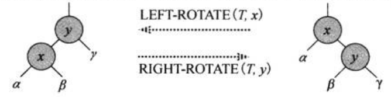
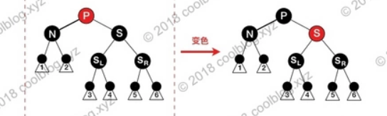

<!--将该代码放入博客模板的head中即可-->

<!--latex数学显示公式-->

## 红黑树介绍

红黑树是一颗二叉搜索树,他在每个节点上增加了一个存储位来表示节点的**颜色**,可以是RED或BLACK,通过对任何一条从根到叶子的简单路径上各个节点的颜色进行约束,红黑树确保没有一条路径会比其他路径长出2倍,因而使**近似于平衡的**

树中包含五个属性:`color`、`key`、`left`、`right`和`p`

##  红黑树的性质

1. 每个节点或是红色的或是黑色的
2. 根节点是黑色的
3. 每个叶子节点是黑色的（注：这里的叶子节点并不是真正意义上的叶子节点，而是一种只有颜色属性但不存放数据的节点，而且其没有儿子节点）[^bignote]
4. 如果一个节点是红色的，则它的两个字节点都是黑色的
5. 对于每个节点，从该节点到其所有后代叶子节点的简单路径上，均包含相同数目的黑色节点

从某个节点$x$出发（不含该节点）到达一个叶子节点的任意一条简单路径上的黑色节点的个数为该节点的**黑高**，即为$bh（x）$

**定理(引理): 一棵有$n$个内部节点的红黑树的高度至多为$2lg(n+1)$**

# 红黑树的左旋

对`a`节点进行左旋，指将`a`节点的右子节点设为`a`节点的父节点，即将`a`节点变成一个左节点。因此左旋意味着被旋转的节点将变成一个左节点。

# 红黑树的右旋

对`b`节点进行右旋，指将`b`节点的左子节点设为`b`的父节点，即将`b`节点变成一个右节点。因此右旋意味着被旋转的节点将变成一个右节点

>下一部分引用自
>
>### [红黑树插入和删除的情况分析](https://www.cnblogs.com/liyuan989/p/4071942.html)

## 插入

首先约定插入的新节点的颜色都为红色。然后将该节点插入的按二叉查找树的规则插入到树中。这个节点后文称为N

1.  根节点为空。这种情况，将N的颜色改为黑色即可。

2.  N的父节点为黑色。这种情况不需要做修改。

3.  N的父节点为红色（根据性质3，N的祖父节点必为黑色）。

- N的叔叔节点为红色。这种情况，将N的父节点和叔叔节点的颜色都改为黑色，若祖父节点是跟节点就将其改为黑色，否则将其颜色改为红色，并以祖父节点为插入的目标节点从情况1开始递归检测。

- N的叔叔节点为黑色， 且N和N的父节点在同一边（即父节点为祖父的左儿子时，N也是父节点的左儿子。父节点为祖父节点的右儿子时。N也是父节点的右儿子）。以父节点为祖父节的左儿子为例，将父节点改为黑色，祖父节点改为红色，然后以祖父节点为基准右旋。（N为父节点右儿子时做相应的左旋。）

- N的叔叔节点为黑色，且N和N的父节点不在同一边（即父节点为祖父的左儿子时，N是父节点的右儿子。父节点为祖父节点的右儿子时。N也是父节点左右儿子）。以父节点为祖父节点的左儿子为例。以父节点为基准，进行左旋，然后以父节点为目标插入节点进入情况3的b情况进行操作。

## 删除

删除的节点有两个儿子时，可以转化为删除的节点只有一个儿子时的问题。对于二叉查找树，在删除带有两个非叶子儿子的节点的时候，我们找到要么在它的左子树中的最大元素、要么在它的右子树中的最小元素，并把它的值转移到要删除的节点中。我们接着删除我们从中复制出值的那个节点，它必定有少于两个非叶子的儿子。因为只是复制了一个值，不违反任何性质，这就把问题简化为如何删除最多有一个儿子的节点的问题。它不关心这个节点是最初要删除的节点还是我们从中复制出值的那个节点。

那么所有情况都可以转化为删除只有一个儿子的节点的情况，我们约定这个要删除的节点为N（若N“没有”儿子节点，并用他的任意一个为叶子节点的儿子节点顶替即可）

1. N为红色节点时。直接删除N，用它的黑色儿子代替它的位置。

2. N为黑色节点，且父节点为红色。直接删除N，用它的儿子节点代替它的位置，并将该儿子节点改为黑色。

3. N为黑色节点，且父节点为黑色。我们之间删除N，用它的儿子节点代替它，该儿子节点成为N'，将N’的颜色改为黑色。

- N’的兄弟节点和兄弟节点的2个儿子都为黑色。交换兄弟节点和父节点的颜色即可。

- N‘的兄弟节点为黑色、且兄弟节点的红色儿子和兄弟节点在一边（即兄弟节点为左儿子时，红色儿子也为左儿子。兄弟节点为右儿子时，红色儿子也为右儿子）。我们以兄弟节点为右儿子为例。将祖父节点和兄弟节点的颜色互换，并将红色右儿子的颜色改为黑色，然后以祖父节点为基准左旋。（若兄弟节点为左儿子，则相应的右旋）

- N‘的兄弟节点为黑色、且兄弟节点的红儿子和兄弟节点不在一边（即兄弟节点为左儿子时，红色儿子也为右儿子。兄弟节点为右儿子时，红色儿子也为左儿子）。我们以兄弟结点为右儿子为例。将兄弟节点和它的红色儿子的颜色互换，然后以兄弟节点为基准右旋。此时对于N’来说就进入了上文b情况。（若兄弟节点为右儿子，则相应的左旋）

 - N‘的兄弟节点为红色。以兄弟节点为右儿子为例，将父节点和兄弟节点的颜色互换，然后以父节点为基准左旋（若兄弟节点为左儿子则相应的右旋），此N’有一个黑色的兄弟节点，接下来N就可以进入a、b、c三种情况分别操作了。

- N‘的兄弟节为黑色，父节点也为黑色。此时将兄弟节点的颜色改为红色。然后以父节点为目标插入节点从头开始依次判断。

> ### 以下引用原文:[红黑树详细分析，看了都说好](https://segmentfault.com/a/1190000012728513)

## 红黑树的插入

**红黑树插入时,插入节点的颜色是红色**.(如果插入的节点是黑色,那么这个节点所在的路径会比其他路径多出一个黑色节点,难以调整). 如果插入节点的颜色是红色,此时所有路径上的黑色节点的数量不变,仅可能会出现两个连续的红色节点的情况,通过变色和旋转调整即可.

这里假设要插入的节点为 N，N 的父节点为 P，祖父节点为 G，叔叔节点为 U。插入红色节点后，会出现5种情况，分别如下：

#### 情况一：节点N是红黑树的根节点

插入的新节点 N 是红黑树的根节点，这种情况下，我们把节点 N 的颜色由红色变为黑色，性质2（根是黑色）被满足。同时 N 被染成黑色后，红黑树所有路径上的黑色节点数量增加一个，性质5（从任一节点到其每个叶子的所有简单路径都包含相同数目的黑色节点）仍然被满足。

]

#### 情况二：节点N的父节点是黑色

N 的父节点是黑色，这种情况下，性质4（每个红色节点必须有两个黑色的子节点）和性质5没有受到影响，不需要调整。

]

#### 情况三：节点N的父节点P是红色，叔叔节点U也是红色。

N 的父节点是红色（节点 P 为红色，其父节点必然为黑色），叔叔节点 U 也是红色。由于 P 和 N 均为红色，所有性质4被打破，此时需要进行调整。这种情况下，先将 P 和 U 的颜色染成黑色，再将 G 的颜色染成红色。此时经过 G 的路径上的黑色节点数量不变，性质5仍然满足。但需要注意的是 G 被染成红色后，可能会和它的父节点形成连续的红色节点，此时需要递归向上调整。

#### 情况四: 节点N的父节点为红色,叔叔节点为黑色.节点N是P的右孩子,且节点P是G的左孩子.

N 的父节点为红色，叔叔节点为黑色。节点 N 是 P 的右孩子，且节点 P 是 G 的左孩子。此时先对节点 P 进行左旋，调整 N 与 P 的位置。接下来按照情况五进行处理，以恢复性质4。

这里需要特别说明一下，上图中的节点 N 并非是新插入的节点。当 P 为红色时，P 有两个孩子节点，且孩子节点均为黑色，这样从 G 出发到各叶子节点路径上的黑色节点数量才能保持一致。既然 P 已经有两个孩子了，所以 N 不是新插入的节点。情况四是由以 N 为根节点的子树中插入了新节点，经过调整后，导致 N 被变为红色，进而导致了情况四的出现。考虑下面这种情况（PR 节点就是上图的 N 节点）：

如上图，插入节点 N 并按情况三处理。此时 PR 被染成了红色，与 P 节点形成了连续的红色节点，这个时候就需按情况四再次进行调整。

#### 情况五:节点N的父节点为红色,叔叔节点为黑色.N是P的左孩子,且节点P是G的左孩子.

N 的父节点为红色，叔叔节点为黑色。N 是 P 的左孩子，且节点 P 是 G 的左孩子。此时对 G 进行右旋，调整 P 和 G 的位置，并互换颜色。经过这样的调整后，性质4被恢复，同时也未破坏性质5。

#### 插入总结

上面五种情况中，情况一和情况二比较简单，情况三、四、五稍复杂。但如果细心观察，会发现这三种情况的区别在于叔叔节点的颜色，如果叔叔节点为红色，直接变色即可。如果叔叔节点为黑色，则需要旋转，再交换颜色。当把这三种情况的图画在一起就区别就比较容易观察了，如下图：

## 红黑树的删除

相较于插入操作，红黑树的删除操作则要更为复杂一些。删除操作首先要确定待删除节点有几个孩子，如果有两个孩子，不能直接删除该节点。而是要先找到该节点的前驱（该节点左子树中最大的节点）或者后继（该节点右子树中最小的节点），然后将前驱或者后继的值复制到要删除的节点中，最后再将前驱或后继删除。由于前驱和后继至多只有一个孩子节点，这样我们就把原来要删除的节点有两个孩子的问题转化为只有一个孩子节点的问题，问题被简化了一些。我们并不关心最终被删除的节点是否是我们开始想要删除的那个节点，只要节点里的值最终被删除就行了，至于树结构如何变化，这个并不重要。

红黑树删除操作的复杂度在于删除节点的颜色，当删除的节点是红色时，直接拿其孩子节点补空位即可。因为删除红色节点，性质5（从任一节点到其每个叶子的所有简单路径都包含相同数目的黑色节点）仍能够被满足。当删除的节点是黑色时，那么所有经过该节点的路径上的黑节点数量少了一个，破坏了性质5。如果该节点的孩子为红色，直接拿孩子节点替换被删除的节点，并将孩子节点染成黑色，即可恢复性质5。但如果孩子节点为黑色，处理起来就要复杂的多。分为6种情况，下面会展开说明。

在展开说明之前，我们先做一些假设，方便说明。这里假设最终被删除的节点为`X`（至多只有一个孩子节点），其孩子节点为`N`，`X`的兄弟节点为`S`，`S`的左节点为 SL，右节点为 SR。接下来讨论是建立在节点 `X` 被删除，节点 `N` 替换`X`的基础上进行的。这里说明把被删除的节点`X`特地拎出来说一下的原因是防止大家误以为节点`N`会被删除，不然后面就会看不明白。

在上面的基础上，接下来就可以展开讨论了。红黑树删除有6种情况，分别是：

#### 情况一：

> N 是新的根。在这种情形下，我们就做完了。我们从所有路径去除了一个黑色节点，而新根是黑色的，所以性质都保持着。

上面是维基百科中关于红黑树删除的情况一说明，由于没有配图，看的有点晕。经过思考，我觉得可能会是下面这种情形：

要删除的节点 X 是根节点，且左右孩子节点均为空节点，此时将节点 X 用空节点替换完成删除操作。

可能还有其他情形，大家如果知道，烦请告知。

#### 情况二：

S 为红色，其他节点为黑色。这种情况下可以对 N 的父节点进行左旋操作，然后互换 P 与 S 颜色。但这并未结束，经过节点 P 和 N 的路径删除前有3个黑色节点（`P -> X -> N`），现在只剩两个了（`P -> N`）。比未经过 N 的路径少一个黑色节点，性质5仍不满足，还需要继续调整。不过此时可以按照情况四、五、六进行调整。

#### 情况三：

N 的父节点，兄弟节点 S 和 S 的孩子节点均为黑色。这种情况下可以简单的把 S 染成红色，所有经过 S 的路径比之前少了一个黑色节点，这样经过 N 的路径和经过 S 的路径黑色节点数量一致了。但经过 P 的路径比不经过 P 的路径少一个黑色节点，此时需要从情况一开始对 P 进行平衡处理。

#### 情况四：

N 的父节点是红色，S 和 S 孩子为黑色。这种情况比较简单，我们只需交换 P 和 S 颜色即可。这样所有通过 N 的路径上增加了一个黑色节点，所有通过 S 的节点的路径必然也通过 P 节点，由于 P 与 S 只是互换颜色，并不影响这些路径。

#### 情况五：

S 为黑色，S 的左孩子为红色，右孩子为黑色。N 的父节点颜色可红可黑，且 N 是 P 左孩子。这种情况下对 S 进行右旋操作，并互换 S 和 SL 的颜色。此时，所有路径上的黑色数量仍然相等，N 兄弟节点的由 S 变为了 SL，而 SL 的右孩子变为红色。接下来我们到情况六继续分析。

#### 情况六：

S 为黑色，S 的右孩子为红色。N 的父节点颜色可红可黑，且 N 是其父节点左孩子。这种情况下，我们对 P 进行左旋操作，并互换 P 和 S 的颜色，并将 SR 变为黑色。因为 P 变为黑色，所以经过 N 的路径多了一个黑色节点，经过 N 的路径上的黑色节点与删除前的数量一致。对于不经过 N 的路径，则有以下两种情况：

1. 该路径经过 N 新的兄弟节点 SL ，那它之前必然经过 S 和 P。而 S 和 P 现在只是交换颜色，对于经过 SL 的路径不影响。
2. 该路径经过 N 新的叔叔节点 SR，那它之前必然经过 P、 S 和 SR，而现在它只经过 S 和 SR。在对 P 进行左旋，并与 S 换色后，经过 SR 的路径少了一个黑色节点，性质5被打破。另外，由于 S 的颜色可红可黑，如果 S 是红色的话，会与 SR 形成连续的红色节点，打破性质4（每个红色节点必须有两个黑色的子节点）。此时仅需将 SR 由红色变为黑色即可同时恢复性质4和性质5（从任一节点到其每个叶子的所有简单路径都包含相同数目的黑色节点。）。

#### 删除总结

红黑树删除的情况比较多，大家刚开始看的时候可能会比较晕。可能会产生这样的疑问，为啥红黑树会有这种删除情况，为啥又会有另一种情况，它们之间有什么联系和区别？和大家一样，我刚开始看的时候也有这样的困惑，直到我把所有情况对应的图形画在一起时，拨云见日，一切都明了了。此时天空中出现了4个字，原来如此、原来如此、原来如此。所以，请看图吧：

## 总结

红黑树是一种重要的二叉树，应用广泛，但在很多数据结构相关的书本中出现的次数并不多。很多书中要么不说，要么就一笔带过，并不会进行详细的分析，这可能是因为红黑树比较复杂的缘故。我在学习红黑树的时候也找了很多资料，但总体感觉讲的都不太好。尤其是在我学习删除操作的时候，很多资料是实在人看不下去，看的我很痛苦。直到我看到维基百科上关于[红黑树](https://en.wikipedia.org/wiki/Red–black_tree)的分析时，很是欣喜。这篇文章分析的很有条理，言简意赅，比很多资料好了太多。本文对红黑树的分析也主要参考了维基百科中的红黑树分析，并对维基百科中容易让人产生疑问和误解的地方进行了说明。同时维基百科中文版红黑树文中的图片较为模糊，这里我重新进行了绘制。需要说明的是，维基百科中文版无法打开了，文中关于维基百科的链接都是英文版的。另外在给大家推荐一个数据结构可视化的网站，里面包含常见数据结构可视化过程，地址为：[t.cn/RZFgryr](https://www.cs.usfca.edu/~galles/visualization/Algorithms.html)。

[^bignote]: https://en.wikipedia.org/wiki/Red%E2%80%93black_tree

[^wiki]: 

